# IA Context - NasrallahRAFI

Generated for AI/project handoff. It documents the project architecture and copies all text/code files needed to understand the site. `.env` files and `.log` files are intentionally excluded and their contents are not copied.

## Project Snapshot

- Project root: `C:\Users\Nasrallah\Documents\Antigravity\Projects\Websites project\Websites\NasrallahRAFI`
- Project type: static portfolio website
- Runtime/build tooling: Node.js scripts for Tailwind CSS, clean-css minification, and IndexNow submission
- Main entry page: `index.html`
- Supporting pages: `apprenticeship-rafi.html`, `internship-onee.html`, `internship-smcv.html`, `pfe-gantt.html`, `project-rendezvous.html`, `project-thermal.html`, `project-waveguide.html`
- Styles: `css/style.css`, `css/style.min.css`, `css/tailwind-input.css`, `css/tailwind.min.css`
- Scripts: `js/theme.js`, `js/indexnow.mjs`, `js/remove_lang.py`
- Assets: images in `assets/img/`, PDFs in `assets/pdf/`
- Deployment/SEO metadata: `_headers`, `CNAME`, `robots.txt`, `sitemap.xml`, `llms.txt`

## Useful Commands

````powershell
npm install
npm run build:css
npm run build:style
npm run watch:css
npm run indexnow
````

## Content Rules For AI

- Do not read, copy, summarize, or expose `.env` contents.
- Do not read, copy, summarize, or expose `.log` contents.
- Treat `node_modules/` and `.git/` as generated/vendor metadata, not project source.
- Binary images and PDFs are listed by path and size; inspect them directly only when a visual/document task requires it.

## Folder Architecture

````text
.
.claude\
.codex\
assets\
assets\img\
assets\pdf\
css\
js\
_headers
.claude\settings.local.json
.codex\hooks.json
.env  [excluded: not copied]
.gitignore
a3c66107815495964ea7a8fede11f3fc.txt
apple-touch-icon.png  [binary asset, 2.3 KB]
apprenticeship-rafi.html
assets\img\3D_model_of_heating_color_and_adapting_cylinder.jpg  [binary asset, 17.9 KB]
assets\img\5_Axis_Industrial_Welding_Robot_assembly_cad.jfif  [binary asset, 72.2 KB]
assets\img\5_Axis_Industrial_Welding_Robot_Testing_Phase_1.jfif  [binary asset, 64.3 KB]
assets\img\5_Axis_Industrial_Welding_Robot_Testing_Phase_2.jfif  [binary asset, 96.8 KB]
assets\img\5_Axis_Industrial_Welding_Robot_Testing_Phase.jfif  [binary asset, 72.4 KB]
assets\img\Air_E_Mag_Animation.gif  [binary asset, 1.41 MB]
assets\img\Air_E_Mag_Animation.webp  [binary asset, 961.2 KB]
assets\img\Air_E_Vector_Animation.gif  [binary asset, 1.84 MB]
assets\img\Air_E_Vector_Animation.webp  [binary asset, 1.74 MB]
assets\img\Air_H_Mag_Animation_SideView.gif  [binary asset, 1.42 MB]
assets\img\Air_H_Mag_Animation_SideView.webp  [binary asset, 1.10 MB]
assets\img\Air_H_Mag_Animation_TopView.gif  [binary asset, 1.12 MB]
assets\img\Air_H_Mag_Animation_TopView.webp  [binary asset, 1.59 MB]
assets\img\Air_H_Vector_Animation.gif  [binary asset, 1.47 MB]
assets\img\Air_H_Vector_Animation.webp  [binary asset, 1.63 MB]
assets\img\Air_Jsurf_Mag_Animation.gif  [binary asset, 1.54 MB]
assets\img\Air_Jsurf_Mag_Animation.webp  [binary asset, 1.18 MB]
assets\img\Alumina_E_Mag_Animation.gif  [binary asset, 4.20 MB]
assets\img\Alumina_E_Mag_Animation.webp  [binary asset, 2.46 MB]
assets\img\Alumina_E_Vector_Animation.gif  [binary asset, 3.70 MB]
assets\img\Alumina_E_Vector_Animation.webp  [binary asset, 3.44 MB]
assets\img\Alumina_H_Mag_Animation.gif  [binary asset, 3.54 MB]
assets\img\Alumina_H_Mag_Animation.webp  [binary asset, 2.20 MB]
assets\img\Alumina_H_Vector_Animation.gif  [binary asset, 3.02 MB]
assets\img\Alumina_H_Vector_Animation.webp  [binary asset, 3.62 MB]
assets\img\Alumina_J_Surface_Mag_Animation.gif  [binary asset, 2.75 MB]
assets\img\Alumina_J_Surface_Mag_Animation.webp  [binary asset, 2.28 MB]
assets\img\Alumina_J_vol_Mag_Animation.gif  [binary asset, 3.56 MB]
assets\img\Alumina_J_vol_Mag_Animation.webp  [binary asset, 2.85 MB]
assets\img\Alumina_J_vol_top_view_Mag_Animation.gif  [binary asset, 3.24 MB]
assets\img\Alumina_J_vol_top_view_Mag_Animation.webp  [binary asset, 3.09 MB]
assets\img\Comparative_Heating_Curves.jpg  [binary asset, 70.3 KB]
assets\img\Confuguration_page_part_1_HMI_-_Mold_Injection_Machine.png  [binary asset, 78.0 KB]
assets\img\Confuguration_page_part_2_HMI_-_Mold_Injection_Machine.png  [binary asset, 91.8 KB]
assets\img\Control_Effort_vs_time.jpg  [binary asset, 65.3 KB]
assets\img\Estimation_Error_vs_time.jpg  [binary asset, 66.2 KB]
assets\img\Evaluation de stage d'initiation ONEE.jpg  [binary asset, 129.9 KB]
assets\img\Evolution_of_nut_temperature_based_on_the_heating_source.png  [binary asset, 43.2 KB]
assets\img\Evolution_of_nut_temperature_in_cool_down_phase_based_on_Initial_temperature.png  [binary asset, 57.6 KB]
assets\img\Final_Temperature_Distribution_Nut_Stack.jpg  [binary asset, 366.1 KB]
assets\img\Heating_Cycle_Sensitivity_Analysis.jpg  [binary asset, 134.5 KB]
assets\img\HMI_nut_insertion_press.png  [binary asset, 97.4 KB]
assets\img\Insert_nut_design.jpg  [binary asset, 75.4 KB]
assets\img\Lathe.jfif  [binary asset, 92.7 KB]
assets\img\Main_page_HMI_-_Mold_Injection_Machine.png  [binary asset, 343.5 KB]
assets\img\Manual_control_page_HMI_-_Mold_Injection_Machine.png  [binary asset, 109.8 KB]
assets\img\mechanical_arm_design.png  [binary asset, 433.8 KB]
assets\img\Mesh_Refinement_Comparison_a.jpg  [binary asset, 292.5 KB]
assets\img\Multiple_insert_nut_stacked_in_assembly.jpg  [binary asset, 28.2 KB]
assets\img\Nut_Stack_Heat_Flux.jpg  [binary asset, 361.8 KB]
assets\img\Profile_picture.jpg  [binary asset, 79.1 KB]
assets\img\Real_Satellite_state_vs_time.jpg  [binary asset, 74.8 KB]
assets\img\Real_vs_Estimated_(x).jpg  [binary asset, 113.9 KB]
assets\img\Rendezvous_Trajectory_(Phase_Plot).jpg  [binary asset, 81.5 KB]
assets\img\Repair_of_boring_machine.jfif  [binary asset, 80.1 KB]
assets\img\S_Parameter_Plot_2_Alumina.jpg  [binary asset, 135.3 KB]
assets\img\S_parameter_plot_Air.jpg  [binary asset, 134.7 KB]
assets\img\S_Parameter_Plot_Alumina.jpg  [binary asset, 127.1 KB]
assets\img\siprotec_testing_view1.jpg  [binary asset, 110.4 KB]
assets\img\siprotec_testing_view2.jpg  [binary asset, 174.0 KB]
assets\img\SMCV_Supervisor_Evaluation.jpg  [binary asset, 126.6 KB]
assets\img\Spring_assembly_machine.jfif  [binary asset, 58.1 KB]
assets\img\Technical_drawing_of_autofeed_mechanism.jpg  [binary asset, 46.1 KB]
assets\img\Temperature_Probe_Graph.jpg  [binary asset, 43.1 KB]
assets\img\Temperature_Probe_View_1.jpg  [binary asset, 477.1 KB]
assets\img\Temperature_result_view_1.jpg  [binary asset, 358.8 KB]
assets\img\Total_Heat_Flux_View_1.jpg  [binary asset, 381.9 KB]
assets\img\Transient_Cooling_of_Insert_Nut_in_Ambient_Air.jpg  [binary asset, 136.2 KB]
assets\img\Vector_Pointing_Air.jpg  [binary asset, 313.0 KB]
assets\img\Vector_Pointing_Alumina.jpg  [binary asset, 265.1 KB]
assets\pdf\ANALYSIS_OF_TE10_MODE_PROPAGATION.pdf  [binary asset, 2.81 MB]
assets\pdf\Attestation_de_stage_ONEE.pdf  [binary asset, 406.4 KB]
assets\pdf\EF_SET_Certificate_RAFI_Nasrallah.pdf  [binary asset, 78.0 KB]
assets\pdf\Luenberger_Based_Rendezvous_Control_with_Angle_Only_Data.pdf  [binary asset, 1,010.8 KB]
assets\pdf\Plan_2D_Ecrou_Insert.pdf  [binary asset, 96.9 KB]
assets\pdf\Proposition_SMCV_1_Bra_mecanique.pdf  [binary asset, 266.5 KB]
assets\pdf\Proposition_SMCV_2_Presse_d_insert_des_ecrous.pdf  [binary asset, 804.4 KB]
assets\pdf\RAFI_Nasrallah_CV_ENG.pdf  [binary asset, 45.8 KB]
assets\pdf\RAFI_Nasrallah_CV_FR.pdf  [binary asset, 47.5 KB]
assets\pdf\Thermal_Analysis_Full_Report.pdf  [binary asset, 3.09 MB]
CNAME
css\style.css
css\style.min.css
css\tailwind-input.css
css\tailwind.min.css
favicon.ico  [binary asset, 484 B]
index.html
internship-onee.html
internship-smcv.html
js\indexnow.mjs
js\remove_lang.py
js\theme.js
llms.txt
package-lock.json
package.json
pfe-gantt.html
project-rendezvous.html
project-thermal.html
project-waveguide.html
robots.txt
server.err.log  [excluded: not copied]
server.log  [excluded: not copied]
sitemap.xml
tailwind.config.js
````

## Excluded Files

- `.env` (environment/secrets file, 92 B)
- `server.err.log` (log file, 17.4 KB)
- `server.log` (log file, 0 B)

## Binary Asset Inventory

- `apple-touch-icon.png` - 2.3 KB
- `assets\img\3D_model_of_heating_color_and_adapting_cylinder.jpg` - 17.9 KB
- `assets\img\5_Axis_Industrial_Welding_Robot_assembly_cad.jfif` - 72.2 KB
- `assets\img\5_Axis_Industrial_Welding_Robot_Testing_Phase_1.jfif` - 64.3 KB
- `assets\img\5_Axis_Industrial_Welding_Robot_Testing_Phase_2.jfif` - 96.8 KB
- `assets\img\5_Axis_Industrial_Welding_Robot_Testing_Phase.jfif` - 72.4 KB
- `assets\img\Air_E_Mag_Animation.gif` - 1.41 MB
- `assets\img\Air_E_Mag_Animation.webp` - 961.2 KB
- `assets\img\Air_E_Vector_Animation.gif` - 1.84 MB
- `assets\img\Air_E_Vector_Animation.webp` - 1.74 MB
- `assets\img\Air_H_Mag_Animation_SideView.gif` - 1.42 MB
- `assets\img\Air_H_Mag_Animation_SideView.webp` - 1.10 MB
- `assets\img\Air_H_Mag_Animation_TopView.gif` - 1.12 MB
- `assets\img\Air_H_Mag_Animation_TopView.webp` - 1.59 MB
- `assets\img\Air_H_Vector_Animation.gif` - 1.47 MB
- `assets\img\Air_H_Vector_Animation.webp` - 1.63 MB
- `assets\img\Air_Jsurf_Mag_Animation.gif` - 1.54 MB
- `assets\img\Air_Jsurf_Mag_Animation.webp` - 1.18 MB
- `assets\img\Alumina_E_Mag_Animation.gif` - 4.20 MB
- `assets\img\Alumina_E_Mag_Animation.webp` - 2.46 MB
- `assets\img\Alumina_E_Vector_Animation.gif` - 3.70 MB
- `assets\img\Alumina_E_Vector_Animation.webp` - 3.44 MB
- `assets\img\Alumina_H_Mag_Animation.gif` - 3.54 MB
- `assets\img\Alumina_H_Mag_Animation.webp` - 2.20 MB
- `assets\img\Alumina_H_Vector_Animation.gif` - 3.02 MB
- `assets\img\Alumina_H_Vector_Animation.webp` - 3.62 MB
- `assets\img\Alumina_J_Surface_Mag_Animation.gif` - 2.75 MB
- `assets\img\Alumina_J_Surface_Mag_Animation.webp` - 2.28 MB
- `assets\img\Alumina_J_vol_Mag_Animation.gif` - 3.56 MB
- `assets\img\Alumina_J_vol_Mag_Animation.webp` - 2.85 MB
- `assets\img\Alumina_J_vol_top_view_Mag_Animation.gif` - 3.24 MB
- `assets\img\Alumina_J_vol_top_view_Mag_Animation.webp` - 3.09 MB
- `assets\img\Comparative_Heating_Curves.jpg` - 70.3 KB
- `assets\img\Confuguration_page_part_1_HMI_-_Mold_Injection_Machine.png` - 78.0 KB
- `assets\img\Confuguration_page_part_2_HMI_-_Mold_Injection_Machine.png` - 91.8 KB
- `assets\img\Control_Effort_vs_time.jpg` - 65.3 KB
- `assets\img\Estimation_Error_vs_time.jpg` - 66.2 KB
- `assets\img\Evaluation de stage d'initiation ONEE.jpg` - 129.9 KB
- `assets\img\Evolution_of_nut_temperature_based_on_the_heating_source.png` - 43.2 KB
- `assets\img\Evolution_of_nut_temperature_in_cool_down_phase_based_on_Initial_temperature.png` - 57.6 KB
- `assets\img\Final_Temperature_Distribution_Nut_Stack.jpg` - 366.1 KB
- `assets\img\Heating_Cycle_Sensitivity_Analysis.jpg` - 134.5 KB
- `assets\img\HMI_nut_insertion_press.png` - 97.4 KB
- `assets\img\Insert_nut_design.jpg` - 75.4 KB
- `assets\img\Lathe.jfif` - 92.7 KB
- `assets\img\Main_page_HMI_-_Mold_Injection_Machine.png` - 343.5 KB
- `assets\img\Manual_control_page_HMI_-_Mold_Injection_Machine.png` - 109.8 KB
- `assets\img\mechanical_arm_design.png` - 433.8 KB
- `assets\img\Mesh_Refinement_Comparison_a.jpg` - 292.5 KB
- `assets\img\Multiple_insert_nut_stacked_in_assembly.jpg` - 28.2 KB
- `assets\img\Nut_Stack_Heat_Flux.jpg` - 361.8 KB
- `assets\img\Profile_picture.jpg` - 79.1 KB
- `assets\img\Real_Satellite_state_vs_time.jpg` - 74.8 KB
- `assets\img\Real_vs_Estimated_(x).jpg` - 113.9 KB
- `assets\img\Rendezvous_Trajectory_(Phase_Plot).jpg` - 81.5 KB
- `assets\img\Repair_of_boring_machine.jfif` - 80.1 KB
- `assets\img\S_Parameter_Plot_2_Alumina.jpg` - 135.3 KB
- `assets\img\S_parameter_plot_Air.jpg` - 134.7 KB
- `assets\img\S_Parameter_Plot_Alumina.jpg` - 127.1 KB
- `assets\img\siprotec_testing_view1.jpg` - 110.4 KB
- `assets\img\siprotec_testing_view2.jpg` - 174.0 KB
- `assets\img\SMCV_Supervisor_Evaluation.jpg` - 126.6 KB
- `assets\img\Spring_assembly_machine.jfif` - 58.1 KB
- `assets\img\Technical_drawing_of_autofeed_mechanism.jpg` - 46.1 KB
- `assets\img\Temperature_Probe_Graph.jpg` - 43.1 KB
- `assets\img\Temperature_Probe_View_1.jpg` - 477.1 KB
- `assets\img\Temperature_result_view_1.jpg` - 358.8 KB
- `assets\img\Total_Heat_Flux_View_1.jpg` - 381.9 KB
- `assets\img\Transient_Cooling_of_Insert_Nut_in_Ambient_Air.jpg` - 136.2 KB
- `assets\img\Vector_Pointing_Air.jpg` - 313.0 KB
- `assets\img\Vector_Pointing_Alumina.jpg` - 265.1 KB
- `assets\pdf\ANALYSIS_OF_TE10_MODE_PROPAGATION.pdf` - 2.81 MB
- `assets\pdf\Attestation_de_stage_ONEE.pdf` - 406.4 KB
- `assets\pdf\EF_SET_Certificate_RAFI_Nasrallah.pdf` - 78.0 KB
- `assets\pdf\Luenberger_Based_Rendezvous_Control_with_Angle_Only_Data.pdf` - 1,010.8 KB
- `assets\pdf\Plan_2D_Ecrou_Insert.pdf` - 96.9 KB
- `assets\pdf\Proposition_SMCV_1_Bra_mecanique.pdf` - 266.5 KB
- `assets\pdf\Proposition_SMCV_2_Presse_d_insert_des_ecrous.pdf` - 804.4 KB
- `assets\pdf\RAFI_Nasrallah_CV_ENG.pdf` - 45.8 KB
- `assets\pdf\RAFI_Nasrallah_CV_FR.pdf` - 47.5 KB
- `assets\pdf\Thermal_Analysis_Full_Report.pdf` - 3.09 MB
- `favicon.ico` - 484 B

## Text And Code Files

### `_headers`

````txt
/assets/img/*
  Cache-Control: public, max-age=31536000, immutable

/assets/pdf/*
  Cache-Control: public, max-age=31536000, immutable

/css/*
  Cache-Control: public, max-age=86400

/js/*
  Cache-Control: public, max-age=86400

/*.html
  Cache-Control: public, max-age=3600
````

### `.claude\settings.local.json`

````json
{
  "description": "Impeccable design detector: runs after Edit/Write/MultiEdit on UI files and surfaces findings as system reminders.",
  "hooks": {
    "PostToolUse": [
      {
        "matcher": "Edit|Write|MultiEdit",
        "hooks": [
          {
            "type": "command",
            "command": "node \"C:\\\\Users\\\\Nasrallah\\\\.claude\\\\skills\\\\impeccable\\\\scripts\\\\hook.mjs\"",
            "timeout": 5,
            "statusMessage": "Checking UI changes"
          }
        ]
      }
    ]
  }
}
````

### `.codex\hooks.json`

````json
{
  "description": "Impeccable design detector: runs after Edit/Write/apply_patch on UI files and surfaces findings as system reminders.",
  "hooks": {
    "PostToolUse": [
      {
        "matcher": "Edit|Write|apply_patch",
        "hooks": [
          {
            "type": "command",
            "command": "node \"C:\\\\Users\\\\Nasrallah\\\\.agents\\\\skills\\\\impeccable\\\\scripts\\\\hook.mjs\"",
            "timeout": 5,
            "statusMessage": "Checking UI changes"
          }
        ]
      }
    ]
  }
}
````

### `.gitignore`

````txt
server.log
server.err.log
.env
*.env
````

### `a3c66107815495964ea7a8fede11f3fc.txt`

````txt
a3c66107815495964ea7a8fede11f3fc
````

### `apprenticeship-rafi.html`

````html
<!DOCTYPE html>

<html lang="en">
<head>
<meta charset="utf-8"/>
<meta content="width=device-width, initial-scale=1.0" name="viewport"/>
<title>Apprenticeship — Rafi Robotiques et Machineries | Rafi Nasrallah</title>
<meta content="Three-year apprenticeship in CNC repair, Siemens Sinumerik 840D, 5-axis welding robot fabrication, PLC reprogramming, and machine restoration." name="description"/>
<meta content="Rafi Nasrallah, apprenticeship, CNC lathe repair, Siemens Sinumerik 840D, 5-axis welding robot, PLC reprogramming, mechanical repair, Rafi Robotiques et Machineries, Morocco" name="keywords"/>
<link href="https://fonts.googleapis.com" rel="preconnect"/><link crossorigin="" href="https://fonts.gstatic.com" rel="preconnect"/><link href="https://unpkg.com" rel="preconnect"/><link href="https://nasrallahrafi.me/apprenticeship-rafi.html" rel="canonical"/>
<meta content="website" property="og:type"/>
<meta content="Rafi Nasrallah Portfolio" property="og:site_name"/>
<meta content="Apprenticeship — Rafi Robotiques et Machineries | Rafi Nasrallah" property="og:title"/>
<meta content="Three-year apprenticeship in CNC repair, Siemens Sinumerik 840D, 5-axis welding robot fabrication, PLC reprogramming, and machine restoration." property="og:description"/>
<meta content="https://nasrallahrafi.me/assets/img/Profile_picture.jpg" property="og:image"/>
<meta property="og:image:width" content="1280"/>
<meta property="og:image:height" content="1280"/>
<meta content="https://nasrallahrafi.me/apprenticeship-rafi.html" property="og:url"/>
<meta content="en_US" property="og:locale"/>
<meta content="summary_large_image" name="twitter:card"/>
<meta content="Apprenticeship — Rafi Robotiques et Machineries | Rafi Nasrallah" name="twitter:title"/>
<meta content="Three-year apprenticeship in CNC repair, Siemens Sinumerik 840D, 5-axis welding robot fabrication, PLC reprogramming, and machine restoration." name="twitter:description"/>
<meta content="https://nasrallahrafi.me/assets/img/Profile_picture.jpg" name="twitter:image"/>
<meta content="@RafiNasrallah" name="twitter:creator"/>
<meta content="@RafiNasrallah" name="twitter:site"/>
<meta content="index, follow" name="robots"/>
<meta content="Rafi Nasrallah" name="author"/>
<link href="/favicon.ico" rel="icon" type="image/x-icon"/>
<link href="/apple-touch-icon.png" rel="apple-touch-icon"/><!-- Load Tailwind CSS --><link href="css/tailwind.min.css" rel="stylesheet"/><!-- Load Lucide Icons --><script crossorigin="anonymous" integrity="sha384-vEpkK5oidsrH6UhRc6tAPlgJZ/qXFwumFY+Kx8vBSeZ7NBag809YZCSmxFYGe/pt" src="https://unpkg.com/lucide@1.20.0/dist/umd/lucide.min.js"></script><link href="https://fonts.googleapis.com/css2?family=Outfit:wght@400;500;600;700;800;900&amp;family=JetBrains+Mono:wght@500;600&amp;display=swap" rel="stylesheet"/><!-- Link to external minified style.css --><link href="css/style.min.css" rel="stylesheet"/>
<!-- Load Tailwind CSS -->

<!-- Load Lucide Icons -->
<script type="application/ld+json">
{
  "@context": "https://schema.org",
  "@type": "BreadcrumbList",
  "itemListElement": [
    { "@type": "ListItem", "position": 1, "name": "Home", "item": "https://nasrallahrafi.me/" },
    { "@type": "ListItem", "position": 2, "name": "Experience", "item": "https://nasrallahrafi.me/#experience" },
    { "@type": "ListItem", "position": 3, "name": "Apprenticeship — Rafi Robotiques et Machineries", "item": "https://nasrallahrafi.me/apprenticeship-rafi.html" }
  ]
}
</script>
</head>
<body class="antialiased selection:bg-cyan-500 selection:text-white">
<!-- Header -->
<header class="sticky top-0 z-50 glass transition-colors duration-300">
<div class="container mx-auto px-4 sm:px-6 lg:px-8 py-4 flex justify-between items-center gap-4">
<a class="text-2xl font-bold bg-clip-text text-transparent bg-gradient-to-r from-cyan-400 to-cyan-200 hover:text-cyan-300 transition-colors truncate" href="index.html#hero">
                Rafi Nasrallah
            </a>
<nav class="hidden lg:flex space-x-6">
<a class="text-slate-300 hover:text-cyan-400 font-medium transition-colors" href="index.html#about">About</a>
<a class="text-slate-300 hover:text-cyan-400 font-medium transition-colors" href="index.html#experience">Experience</a>
<a class="text-slate-300 hover:text-cyan-400 font-medium transition-colors" href="index.html#projects">Projects</a>
<a class="text-slate-300 hover:text-cyan-400 font-medium transition-colors" href="index.html#skills">Skills</a>
<a class="text-slate-300 hover:text-cyan-400 font-medium transition-colors" href="index.html#patents">Patents</a>
<a class="text-slate-300 hover:text-cyan-400 font-medium transition-colors" href="index.html#dev-focus">Development</a>
</nav>
<div class="flex items-center space-x-2 sm:space-x-4">
<button aria-label="Change theme" class="theme-toggle-button text-slate-200 transition-colors flex items-center justify-center" id="theme-toggle-button" onclick="toggleTheme()" type="button">
<i class="w-4 h-4" data-lucide="palette" id="theme-toggle-icon"></i>
<span class="theme-toggle-copy">Theme</span>
<span class="theme-toggle-name" id="theme-toggle-name">Glass</span>
</button>
<a class="inline-flex items-center text-slate-300 hover:text-cyan-400 font-medium transition-colors text-sm" href="index.html#experience">
<i class="w-4 h-4 mr-2" data-lucide="arrow-left"></i><span class="hidden sm:inline">Back</span>
                </a>
</div>
</div>
</header>
<main class="container mx-auto px-4 sm:px-6 lg:px-8 py-12">
<!-- Main Content Card -->
<article class="max-w-4xl mx-auto glass p-8 md:p-12 rounded-2xl relative overflow-hidden">
<!-- Background Blob -->
<div class="absolute top-0 right-0 w-96 h-96 bg-cyan-500/10 rounded-full blur-3xl -translate-y-1/2 translate-x-1/2 pointer-events-none">
</div>
<!-- Title & Metadata -->
<section aria-labelledby="rafi-robotiques-et-machineries" class="content-section text-center relative z-10">
<span class="text-xs font-bold text-white bg-cyan-600/80 px-4 py-1.5 rounded-full uppercase tracking-wider mb-6 inline-block shadow-lg shadow-cyan-500/20">Apprenticeship</span>
<h1 class="text-3xl md:text-5xl font-extrabold text-white mb-4 leading-tight" id="rafi-robotiques-et-machineries">
                    Rafi Robotiques et Machineries
                </h1>
<p class="text-lg text-slate-300 leading-relaxed max-w-3xl mx-auto mb-6">
                    Three-year workshop apprenticeship across CNC repair, industrial machinery restoration, 5-axis robotic welding systems, and PLC-based production troubleshooting.
                </p>
<p class="text-base font-medium text-cyan-200 mb-8">
                    2020 - 2023 | Mechanical repair, CNC machining, robotics, automation
                </p>
<div class="grid grid-cols-1 md:grid-cols-4 gap-4 text-left">
<div class="bg-slate-800/50 p-4 rounded-xl border border-slate-700/50">
<p class="text-xs font-bold text-cyan-400 uppercase tracking-wider mb-2">Duration</p>
<p class="text-xl font-extrabold text-white">3 years</p>
<p class="text-sm text-slate-400 mt-2">Long-form industrial exposure.</p>
</div>
<div class="bg-slate-800/50 p-4 rounded-xl border border-slate-700/50">
<p class="text-xs font-bold text-cyan-400 uppercase tracking-wider mb-2">CNC stack</p>
<p class="text-xl font-extrabold text-white">840D / 611</p>
<p class="text-sm text-slate-400 mt-2">Siemens Sinumerik and Simodrive.</p>
</div>
<div class="bg-slate-800/50 p-4 rounded-xl border border-slate-700/50">
<p class="text-xs font-bold text-cyan-400 uppercase tracking-wider mb-2">Robotics</p>
<p class="text-xl font-extrabold text-white">5-axis</p>
<p class="text-sm text-slate-400 mt-2">Welding robot fabrication work.</p>
</div>
<div class="bg-slate-800/50 p-4 rounded-xl border border-slate-700/50">
<p class="text-xs font-bold text-cyan-400 uppercase tracking-wider mb-2">Automation</p>
<p class="text-xl font-extrabold text-white">PLC</p>
<p class="text-sm text-slate-400 mt-2">Machine recovery and logic repair.</p>
</div>
</div>
</section>
<!-- Workshop scope -->
<section aria-labelledby="workshop-scope" class="content-section relative z-10">
<h2 class="text-2xl font-bold text-white mb-6 flex items-center space-x-3" id="workshop-scope">
<div class="p-2 bg-cyan-500/10 rounded-lg">
<i class="w-6 h-6 text-cyan-400" data-lucide="target"></i>
</div>
<span>Workshop scope</span>
</h2>
<div class="grid grid-cols-1 md:grid-cols-2 gap-6">
<div class="bg-slate-800/50 p-6 rounded-xl border border-slate-700/50">
<h3 class="font-bold text-white mb-3">Industrial context</h3>
<p class="text-slate-300 leading-relaxed">
                            The work took place in a practical machine-repair environment where downtime, missing programs, worn mechanical parts, and urgent client constraints had to be handled directly on industrial equipment.
                        </p>
</div>
<div class="bg-slate-800/50 p-6 rounded-xl border border-slate-700/50">
<h3 class="font-bold text-white mb-3">Engineering value</h3>
<p class="text-slate-300 leading-relaxed">
                            This apprenticeship built hands-on judgment across mechanics, CNC controls, robotics assembly, sensor integration, PLC debugging, and machine restoration before the academic engineering cycle.
                        </p>
</div>
</div>
</section>
<!-- Industrial interventions -->
<section aria-labelledby="industrial-interventions" class="content-section relative z-10">
<h2 class="text-2xl font-bold text-white mb-6 flex items-center space-x-3" id="industrial-interventions">
<div class="p-2 bg-cyan-500/10 rounded-lg">
<i class="w-6 h-6 text-cyan-400" data-lucide="list-checks"></i>
</div>
<span>Industrial interventions</span>
</h2>
<div class="space-y-6">
<div class="bg-slate-800/50 p-6 rounded-xl border border-slate-700/50 hover:border-cyan-500/30 transition-colors">
<div class="flex flex-col md:flex-row md:items-start md:justify-between gap-4 mb-4">
<div>
<p class="text-xs font-bold text-cyan-400 uppercase tracking-wider mb-2">Machine restoration</p>
<h3 class="text-xl font-bold text-white">Sharmaann horizontal boring machine repair</h3>
</div>
<span class="text-sm font-semibold text-slate-300 bg-cyan-500/10 border border-cyan-500/30 rounded-full px-3 py-1">Bronze pinion rebuild</span>
</div>
<p class="text-slate-300 leading-relaxed mb-4">
                            Diagnosed worn worm gear pinions, supported disassembly, helped manufacture custom bronze replacement parts, and participated in precision reassembly to restore machine reliability.
                        </p>
<p class="text-sm font-semibold text-cyan-400">Mechanical diagnostics, custom component manufacturing, tolerance control, precision assembly.</p>
</div>
<div class="bg-slate-800/50 p-6 rounded-xl border border-slate-700/50 hover:border-cyan-500/30 transition-colors">
<div class="flex flex-col md:flex-row md:items-start md:justify-between gap-4 mb-4">
<div>
<p class="text-xs font-bold text-cyan-400 uppercase tracking-wider mb-2">Robotics fabrication</p>
<h3 class="text-xl font-bold text-white">5-axis welding robots for Armasteel</h3>
</div>
<span class="text-sm font-semibold text-slate-300 bg-cyan-500/10 border border-cyan-500/30 rounded-full px-3 py-1">16 m linear travel</span>
</div>
<p class="text-slate-300 leading-relaxed mb-4">
                            Contributed to two 5-axis welding robot builds with extended displacement, infrared path tracking, and motion-speed adjustment according to welding angle.
                        </p>
<p class="text-sm font-semibold text-cyan-400">CAD support, mechanical assembly, sensor integration, robotic motion concepts, fabrication methods.</p>
</div>
<div class="bg-slate-800/50 p-6 rounded-xl border border-slate-700/50 hover:border-cyan-500/30 transition-colors">
<div class="flex flex-col md:flex-row md:items-start md:justify-between gap-4 mb-4">
<div>
<p class="text-xs font-bold text-cyan-400 uppercase tracking-wider mb-2">CNC recovery</p>
<h3 class="text-xl font-bold text-white">Geminis CNC lathe repair for Longofer</h3>
</div>
<span class="text-sm font-semibold text-slate-300 bg-cyan-500/10 border border-cyan-500/30 rounded-full px-3 py-1">Sinumerik 840D</span>
</div>
<p class="text-slate-300 leading-relaxed mb-4">
                            Supported diagnosis of Z-axis immobilization and alarm faults, then helped recover the operating system, restore machine parameters, and reintegrate Siemens Sinumerik 840D with Simodrive 611.
                        </p>
<p class="text-sm font-semibold text-cyan-400">CNC diagnostics, OS recovery, parameter configuration, system integration, machine commissioning.</p>
</div>
<div class="bg-slate-800/50 p-6 rounded-xl border border-slate-700/50 hover:border-cyan-500/30 transition-colors">
<div class="flex flex-col md:flex-row md:items-start md:justify-between gap-4 mb-4">
<div>
<p class="text-xs font-bold text-cyan-400 uppercase tracking-wider mb-2">Automation recovery</p>
<h3 class="text-xl font-bold text-white">Matissar spring assembly machine reprogramming</h3>
</div>
<span class="text-sm font-semibold text-slate-300 bg-cyan-500/10 border border-cyan-500/30 rounded-full px-3 py-1">PLC logic restore</span>
</div>
<p class="text-slate-300 leading-relaxed mb-4">
                            Helped diagnose production stoppage caused by a deleted PLC program, then supported logic recovery and machine reprogramming so the line could resume operation.
                        </p>
<p class="text-sm font-semibold text-cyan-400">PLC debugging, industrial troubleshooting, logic recovery, client-facing repair work.</p>
</div>
</div>
</section>
<!-- Evidence gallery -->
<section aria-labelledby="evidence-gallery" class="content-section relative z-10">
<h2 class="text-2xl font-bold text-white mb-6 flex items-center space-x-3" id="evidence-gallery">
<div class="p-2 bg-cyan-500/10 rounded-lg">
<i class="w-6 h-6 text-cyan-400" data-lucide="image"></i>
</div>
<span>Evidence gallery</span>
</h2>
<div class="grid grid-cols-1 md:grid-cols-2 gap-6">
<figure>

<figcaption class="text-xs text-center text-slate-400 mt-2">Horizontal boring machine repair after mechanical intervention.</figcaption>
</figure>
<figure>

<figcaption class="text-xs text-center text-slate-400 mt-2">5-axis welding robot testing phase.</figcaption>
</figure>
<figure>

<figcaption class="text-xs text-center text-slate-400 mt-2">CNC lathe repair and control-system recovery context.</figcaption>
</figure>
<figure>

<figcaption class="text-xs text-center text-slate-400 mt-2">Spring assembly machine restored through PLC logic recovery.</figcaption>
</figure>
</div>
</section>
<!-- Navigation -->
<section aria-labelledby="return-to-portfolio" class="text-center pt-8 relative z-10"><h2 class="sr-only" id="return-to-portfolio">Return to portfolio</h2>
<a class="inline-flex items-center font-bold text-white bg-gradient-to-r from-cyan-600 to-blue-600 py-3 px-8 rounded-full shadow-lg hover:shadow-cyan-500/30 hover:-translate-y-1 transition-all" href="index.html#experience">
<i class="w-5 h-5 mr-2" data-lucide="arrow-left"></i> Return to Main Portfolio
                </a>
</section>
</article>
</main>
<!-- Script to initialize Lucide icons -->
<script>
        lucide.createIcons();
    </script>
</body>
</html>
````

### `CNAME`

````txt
nasrallahrafi.me
````

### `css\style.css`

````css
/* Global Styles */
:root {
    --primary-rgb: 6, 182, 212;
    --secondary-rgb: 59, 130, 246;
    --primary-color: rgb(var(--primary-rgb));
    --accent-color: #22d3ee;
    --accent-rgb: var(--primary-rgb);
    --bg-color: #0f172a;
    --text-color: #f8fafc;
    --text-muted: #94a3b8;

    --glass-bg: rgba(15, 23, 42, 0.65);
    --glass-border: rgba(255, 255, 255, 0.08);
    --glass-shadow: 0 8px 32px 0 rgba(0, 0, 0, 0.37);
    --card-bg: rgba(30, 41, 59, 0.6);
    --border-accent: rgba(255, 255, 255, 0.08);
    --ease-out: cubic-bezier(0.23, 1, 0.32, 1);
    --ease-in-out: cubic-bezier(0.77, 0, 0.175, 1);
    --focus-ring: 0 0 0 3px rgba(var(--primary-rgb), 0.22), 0 0 0 1px rgba(var(--primary-rgb), 0.72);
}

.text-accent {
    color: var(--accent-color);
}

.text-cyan-200,
.text-cyan-300,
.text-cyan-400,
.text-cyan-500,
.hover\:text-cyan-300:hover,
.hover\:text-cyan-400:hover {
    color: var(--accent-color) !important;
}

.border-cyan-500\/30,
.border-cyan-500\/50,
.border-cyan-700\/50 {
    border-color: rgba(var(--primary-rgb), 0.34) !important;
}

.bg-cyan-500\/15,
.bg-cyan-900\/40 {
    background-color: rgba(var(--primary-rgb), 0.14) !important;
}

.shadow-cyan-500\/20,
.shadow-cyan-500\/25,
.shadow-cyan-500\/40 {
    --tw-shadow-color: rgba(var(--primary-rgb), 0.26) !important;
}

.skip-link {
    position: fixed;
    top: 1rem;
    left: 1rem;
    z-index: 100;
    transform: translateY(-160%);
    border-radius: 0.625rem;
    background: rgba(2, 6, 23, 0.94);
    color: #fff;
    padding: 0.75rem 1rem;
    font-weight: 700;
    box-shadow: var(--focus-ring);
    transition: transform 180ms var(--ease-out);
}

.skip-link:focus {
    transform: translateY(0);
}

/* --- THEME SYSTEM --- */

/* 1. Volt Theme (Amber/Gold) */
body.theme-volt {
    --primary-rgb: 251, 146, 60;
    --secondary-rgb: 234, 179, 8;
    --accent-color: #fbbf24;
    --accent-rgb: var(--primary-rgb);
    --bg-color: #0f0a06;
    --card-bg: rgba(26, 18, 11, 0.85);
    --border-accent: rgba(251, 146, 60, 0.15);
}

/* 2. Deep Sea Theme (Teal/Emerald) */
body.theme-deepsea {
    --primary-rgb: 20, 184, 166;
    --secondary-rgb: 16, 185, 129;
    --accent-color: #2dd4bf;
    --accent-rgb: var(--primary-rgb);
    --bg-color: #040d0d;
    --card-bg: rgba(6, 18, 18, 0.85);
    --border-accent: rgba(20, 184, 166, 0.15);
}

/* 3. Obsidian Theme (Ultra-Dark/Charcoal) */
body.theme-obsidian {
    --primary-rgb: 148, 163, 184;
    --secondary-rgb: 99, 102, 241;
    --accent-color: #f8fafc;
    --accent-rgb: var(--primary-rgb);
    --bg-color: #020617;
    --card-bg: rgba(15, 23, 42, 0.9);
    --border-accent: rgba(255, 255, 255, 0.05);
}

/* 4. Glass Theme (Default Cyan) */
body.theme-glass {
    --primary-rgb: 6, 182, 212;
    --secondary-rgb: 59, 130, 246;
    --accent-color: #06b6d4;
    --accent-rgb: var(--primary-rgb);
    --bg-color: #0a0c10;
    --card-bg: rgba(17, 25, 40, 0.75);
    --border-accent: rgba(255, 255, 255, 0.125);
}

body {
    font-family: 'Outfit', system-ui, -apple-system, BlinkMacSystemFont, 'Segoe UI', sans-serif;
    background:
        radial-gradient(circle at 16% 8%, rgba(var(--primary-rgb), 0.20), transparent 34rem),
        radial-gradient(circle at 86% 16%, rgba(var(--secondary-rgb), 0.16), transparent 30rem),
        radial-gradient(circle at 50% 105%, rgba(var(--primary-rgb), 0.10), transparent 36rem),
        var(--bg-color);
    background-attachment: fixed;
    color: var(--text-color);
    line-height: 1.6;
    overflow-x: hidden;
    font-feature-settings: "ss01" 1, "cv01" 1;
    transition: background 420ms var(--ease-out), color 220ms ease;
}

h1,
h2,
h3,
h4 {
    text-wrap: balance;
}

p,
li {
    text-wrap: pretty;
}

a,
button {
    -webkit-tap-highlight-color: transparent;
}

a:focus-visible,
button:focus-visible {
    outline: none;
    box-shadow: var(--focus-ring);
}

button:active,
a.inline-flex:active,
a[class*="rounded"]:active {
    transform: scale(0.97);
    transition-duration: 120ms;
}

/* --- DYNAMIC BACKGROUND SYSTEM --- */
.animated-background {
    position: fixed;
    top: 0;
    left: 0;
    width: 100%;
    height: 100%;
    z-index: -1;
    overflow: hidden;
    pointer-events: none;
    transition: opacity 0.5s ease;
}

.animated-background::after {
    content: "";
    position: absolute;
    inset: 0;
    opacity: 0.08;
    background-image:
        linear-gradient(rgba(255, 255, 255, 0.045) 1px, transparent 1px),
        linear-gradient(90deg, rgba(255, 255, 255, 0.035) 1px, transparent 1px);
    background-size: 44px 44px;
    -webkit-mask-image: radial-gradient(circle at 50% 18%, #000 0%, transparent 72%);
    mask-image: radial-gradient(circle at 50% 18%, #000 0%, transparent 72%);
}

.blob {
    position: absolute;
    filter: blur(90px);
    opacity: 0.5;
    border-radius: 50%;
    animation: blob-float infinite ease-in-out alternate;
    mix-blend-mode: screen;
}

.blob-1 {
    top: -10%;
    left: -10%;
    width: 55vw;
    height: 55vw;
    background: radial-gradient(circle, rgba(var(--primary-rgb), 0.4) 0%, rgba(var(--primary-rgb), 0.05) 70%, transparent 100%);
    animation-duration: 25s;
}

.blob-2 {
    bottom: -15%;
    right: -10%;
    width: 50vw;
    height: 50vw;
    background: radial-gradient(circle, rgba(var(--secondary-rgb), 0.32) 0%, rgba(var(--secondary-rgb), 0.08) 70%, transparent 100%);
    animation-duration: 32s;
    animation-direction: reverse;
}

.blob-3 {
    top: 30%;
    left: 50%;
    width: 40vw;
    height: 40vw;
    background: radial-gradient(circle, rgba(var(--secondary-rgb), 0.20) 0%, rgba(var(--primary-rgb), 0.10) 70%, transparent 100%);
    animation-duration: 28s;
}

.hero-blob-primary {
    background: radial-gradient(circle, rgba(var(--primary-rgb), 0.35) 0%, rgba(var(--primary-rgb), 0.08) 68%, transparent 100%) !important;
}

.hero-blob-secondary {
    background: radial-gradient(circle, rgba(var(--secondary-rgb), 0.32) 0%, rgba(var(--secondary-rgb), 0.08) 68%, transparent 100%) !important;
}

@keyframes blob-float {
    0% { transform: translate(0, 0) scale(1) rotate(0deg); }
    33% { transform: translate(4vw, -6vh) scale(1.05) rotate(10deg); }
    66% { transform: translate(-3vw, 4vh) scale(0.95) rotate(-5deg); }
    100% { transform: translate(2vw, 2vh) scale(1.1) rotate(5deg); }
}

/* Components Styling */
.glass {
    background: var(--card-bg);
    backdrop-filter: blur(16px);
    -webkit-backdrop-filter: blur(16px);
    border: 1px solid var(--border-accent);
    border-radius: 12px;
    box-shadow:
        inset 0 1px 0 rgba(255, 255, 255, 0.08),
        inset 0 -1px 0 rgba(var(--primary-rgb), 0.06),
        var(--glass-shadow);
    transition:
        background-color 260ms ease,
        border-color 220ms ease,
        box-shadow 260ms ease,
        transform 220ms var(--ease-out),
        backdrop-filter 260ms ease;
}

.glass:hover {
    border-color: rgba(255, 255, 255, 0.15);
    box-shadow:
        inset 0 1px 0 rgba(255, 255, 255, 0.12),
        inset 0 -1px 0 rgba(var(--primary-rgb), 0.08),
        0 12px 40px rgba(0, 0, 0, 0.4);
}

.nav-link {
    transition: color 160ms ease;
}

.nav-link:hover {
    color: var(--accent-color);
}

header nav a {
    position: relative;
    border-radius: 0.5rem;
}

header nav a[aria-current="true"] {
    color: var(--accent-color);
}

header nav a[aria-current="true"]::after {
    content: "";
    position: absolute;
    left: 0.125rem;
    right: 0.125rem;
    bottom: -0.42rem;
    height: 2px;
    border-radius: 999px;
    background: linear-gradient(90deg, transparent, var(--accent-color), transparent);
    opacity: 0.9;
}

.theme-toggle-button {
    min-height: 2.5rem;
    gap: 0.45rem;
    padding: 0.48rem 0.7rem;
    border: 1px solid rgba(var(--primary-rgb), 0.36);
    border-radius: 999px;
    background:
        linear-gradient(180deg, rgba(255, 255, 255, 0.08), rgba(255, 255, 255, 0.025)),
        rgba(var(--primary-rgb), 0.10);
    box-shadow: inset 0 1px 0 rgba(255, 255, 255, 0.10);
}

.theme-toggle-button:hover {
    color: #fff;
    border-color: rgba(var(--primary-rgb), 0.58);
    background:
        linear-gradient(180deg, rgba(255, 255, 255, 0.11), rgba(255, 255, 255, 0.04)),
        rgba(var(--primary-rgb), 0.18);
}

.theme-toggle-copy {
    font-size: 0.78rem;
    font-weight: 800;
    line-height: 1;
}

.theme-toggle-name {
    max-width: 5.4rem;
    overflow: hidden;
    text-overflow: ellipsis;
    white-space: nowrap;
    border-radius: 999px;
    background: rgba(255, 255, 255, 0.10);
    color: var(--accent-color);
    padding: 0.24rem 0.46rem;
    font-size: 0.72rem;
    font-weight: 800;
    line-height: 1;
}

@media (max-width: 420px) {
    .theme-toggle-button {
        padding-inline: 0.58rem;
    }

    .theme-toggle-name {
        max-width: 4.4rem;
    }
}

/* Universal Hover State for Content Cards */
.focus-card,
.project-card,
.skill-group,
.timeline-item-content,
.experience-column,
.patent-card {
    background: var(--card-bg);
    backdrop-filter: blur(12px);
    -webkit-backdrop-filter: blur(12px);
    border: 1px solid var(--border-accent);
    transition:
        transform 220ms var(--ease-out),
        border-color 180ms ease,
        box-shadow 220ms ease,
        background-color 220ms ease;
    position: relative;
    overflow: hidden;
    border-radius: 12px;
}

.selected-focus {
    position: relative;
}

.focus-heading {
    max-width: 58rem;
    margin-bottom: clamp(1.5rem, 3vw, 2.25rem);
}

.focus-kicker {
    margin-bottom: 0.8rem;
    color: var(--accent-color);
    font-size: 0.78rem;
    font-weight: 800;
    letter-spacing: 0.2em;
    line-height: 1;
    text-transform: uppercase;
}

.focus-heading h2 {
    max-width: 48rem;
    color: #fff;
    font-size: clamp(2rem, 4vw, 3.35rem);
    font-weight: 900;
    letter-spacing: -0.03em;
    line-height: 0.98;
}

.focus-summary {
    max-width: 55ch;
    margin-top: 1rem;
    color: rgba(226, 232, 240, 0.78);
    font-size: clamp(1rem, 1.4vw, 1.12rem);
    line-height: 1.7;
}

.focus-grid {
    display: grid;
    grid-template-columns: repeat(auto-fit, minmax(min(100%, 18rem), 1fr));
    gap: clamp(1rem, 2vw, 1.35rem);
}

.focus-card {
    display: flex;
    min-height: 17rem;
    flex-direction: column;
    padding: clamp(1.35rem, 2vw, 1.8rem);
    background:
        linear-gradient(145deg, rgba(255, 255, 255, 0.08), rgba(255, 255, 255, 0.018) 48%),
        radial-gradient(circle at 0% 0%, rgba(var(--primary-rgb), 0.14), transparent 20rem),
        var(--card-bg);
}

.focus-card-primary {
    border-color: rgba(var(--primary-rgb), 0.34);
    background:
        linear-gradient(145deg, rgba(var(--primary-rgb), 0.16), rgba(var(--secondary-rgb), 0.07) 48%, rgba(255, 255, 255, 0.025)),
        var(--card-bg);
}

.focus-card-header {
    display: flex;
    justify-content: space-between;
    align-items: flex-start;
    margin-bottom: 1.2rem;
}

.focus-card h3 {
    max-width: 18ch;
    color: #fff;
    font-size: clamp(1.45rem, 2.1vw, 1.9rem);
    font-weight: 850;
    letter-spacing: -0.025em;
    line-height: 1.08;
}

.focus-copy {
    max-width: 34rem;
    margin-top: 1rem;
    color: rgba(226, 232, 240, 0.76);
    font-size: 1rem;
    line-height: 1.65;
}

.focus-chip-list {
    display: flex;
    flex-wrap: wrap;
    gap: 0.5rem;
    margin-top: auto;
    padding-top: 1.45rem;
}

.focus-chip {
    display: inline-flex;
    align-items: center;
    min-height: 1.85rem;
    border: 1px solid rgba(var(--primary-rgb), 0.26);
    border-radius: 999px;
    background: rgba(var(--primary-rgb), 0.08);
    color: rgba(226, 232, 240, 0.9);
    padding: 0.35rem 0.62rem;
    font-size: 0.76rem;
    font-weight: 700;
    line-height: 1;
}

.focus-icon {
    display: inline-flex;
    width: 3.1rem;
    height: 3.1rem;
    flex: 0 0 3.1rem;
    align-items: center;
    justify-content: center;
    border: 1px solid rgba(var(--primary-rgb), 0.38);
    border-radius: 0.8rem;
    background:
        linear-gradient(145deg, rgba(var(--primary-rgb), 0.22), rgba(var(--primary-rgb), 0.07)),
        rgba(2, 6, 23, 0.16);
    color: var(--accent-color);
    box-shadow: inset 0 1px 0 rgba(255, 255, 255, 0.1);
}

.focus-card::before {
    content: "";
    position: absolute;
    inset: 0;
    border-top: 1px solid rgba(255, 255, 255, 0.16);
    background: linear-gradient(180deg, rgba(255, 255, 255, 0.035), transparent 38%);
    pointer-events: none;
}

.focus-card::after,
.project-card::after,
.skill-group::after,
.timeline-item-content::after,
.experience-column::after,
.patent-card::after {
    content: "";
    position: absolute;
    inset: 0;
    pointer-events: none;
    opacity: 0;
    background: radial-gradient(26rem circle at var(--spot-x, 50%) var(--spot-y, 0%), rgba(var(--primary-rgb), 0.16), transparent 42%);
    transition: opacity 180ms ease;
}

@media (hover: hover) and (pointer: fine) {
    .focus-card:hover,
    .project-card:hover,
    .skill-group:hover,
    .timeline-item-content:hover,
    .experience-column:hover,
    .patent-card:hover {
        transform: translateY(-6px) scale(1.008);
        border-color: rgba(var(--primary-rgb), 0.58);
        box-shadow:
            0 18px 38px -14px rgba(var(--primary-rgb), 0.34),
            0 0 20px rgba(var(--primary-rgb), 0.08) inset;
        background: rgba(var(--primary-rgb), 0.055) !important;
    }

    .focus-card:hover::after,
    .project-card:hover::after,
    .skill-group:hover::after,
    .timeline-item-content:hover::after,
    .experience-column:hover::after,
    .patent-card:hover::after {
        opacity: 1;
    }

    .experience-column:hover {
        border-color: rgba(var(--primary-rgb), 0.2);
    }

    .focus-card:hover h3,
    .project-card:hover h4,
    .skill-group:hover h3,
    .experience-column:hover h3 {
        color: var(--accent-color);
        text-shadow: 0 0 12px rgba(var(--primary-rgb), 0.28);
    }

    .project-card:hover .preview-bg {
        transform: scale(1.06);
    }
}

/* Scrollbar Styles */
::-webkit-scrollbar {
    width: 10px;
}

::-webkit-scrollbar-track {
    background: var(--bg-color);
}

::-webkit-scrollbar-thumb {
    background: linear-gradient(to bottom, var(--primary-color), #3b82f6);
    border-radius: 5px;
    border: 2px solid var(--bg-color);
}

::-webkit-scrollbar-thumb:hover {
    background: linear-gradient(to bottom, var(--accent-color), #60a5fa);
}

html {
    scroll-behavior: smooth;
}

/* Timeline Items */
.timeline-item {
    position: relative;
    padding-bottom: 3.5rem;
}

.timeline-item::before {
    content: '';
    position: absolute;
    left: -20px;
    top: 5px;
    bottom: 0;
    width: 2px;
    background: linear-gradient(to bottom, var(--primary-color), rgba(var(--primary-rgb), 0.1));
    z-index: 5;
}

.timeline-dot {
    position: absolute;
    left: -24px;
    top: 5px;
    width: 12px;
    height: 12px;
    border-radius: 50%;
    background-color: var(--accent-color);
    z-index: 10;
    border: 2px solid var(--bg-color);
    box-shadow: 0 0 12px var(--primary-color), 0 0 0 4px rgba(var(--primary-rgb), 0.2);
    transition: transform 180ms var(--ease-out), box-shadow 180ms ease, background-color 180ms ease;
}

.timeline-item:hover .timeline-dot {
    transform: scale(1.3);
    box-shadow: 0 0 20px var(--primary-color), 0 0 0 6px rgba(var(--primary-rgb), 0.3);
    background-color: #fff;
}

@media (min-width: 640px) {
    .timeline-item::before { left: -28px; }
    .timeline-dot { left: -33px; }
}

/* Animations */
@keyframes float {
    0%, 100% { transform: translateY(0px); }
    50% { transform: translateY(-15px); }
}

.floating { animation: float 6s ease-in-out infinite; }

@keyframes pulse-glow {
    0%, 100% { opacity: 1; transform: scale(1); box-shadow: 0 0 15px rgba(var(--primary-rgb), 0.5); }
    50% { opacity: 0.8; transform: scale(1.05); box-shadow: 0 0 25px rgba(var(--primary-rgb), 0.8); }
}

.pulse-glow { animation: pulse-glow 3s infinite; }

/* Reveal Animations (Scroll) */
.reveal {
    opacity: 0;
    transform: translateY(22px);
    transition: opacity 420ms var(--ease-out), transform 420ms var(--ease-out);
}

.reveal.active {
    opacity: 1;
    transform: translateY(0);
}

.project-card.reveal,
.skill-group.reveal,
.timeline-item-content.reveal,
.experience-column.reveal,
.patent-card.reveal {
    transition:
        opacity 420ms var(--ease-out),
        transform 220ms var(--ease-out),
        border-color 180ms ease,
        box-shadow 220ms ease,
        background-color 220ms ease;
}

/* Text Gradient Animation */
.text-gradient-animate {
    background-size: 200% auto;
    animation: gradientText 4s linear infinite;
}

@keyframes gradientText {
    0% { background-position: 0% 50%; }
    50% { background-position: 100% 50%; }
    100% { background-position: 0% 50%; }
}

.content-section {
    padding-top: 2.5rem;
    padding-bottom: 2.5rem;
    border-bottom: 1px solid rgba(255, 255, 255, 0.1);
}

.gallery-image {
    border-radius: 0.75rem;
    box-shadow: 0 8px 16px rgba(0, 0, 0, 0.4);
    border: 1px solid rgba(255, 255, 255, 0.1);
    object-fit: cover;
    transition: transform 220ms var(--ease-out), box-shadow 220ms ease, border-color 220ms ease;
}

@media (hover: hover) and (pointer: fine) {
    .gallery-image:hover {
        transform: scale(1.018);
        border-color: rgba(var(--primary-rgb), 0.42);
        box-shadow: 0 14px 28px rgba(0, 0, 0, 0.34);
    }
}

@media (prefers-reduced-motion: reduce) {
    *,
    *::before,
    *::after {
        animation-duration: 1ms !important;
        animation-iteration-count: 1 !important;
        scroll-behavior: auto !important;
        transition-duration: 1ms !important;
    }

    .reveal {
        opacity: 1;
        transform: none;
    }
}
````

### `css\style.min.css`

````css
:root{--primary-rgb:6,182,212;--secondary-rgb:59,130,246;--primary-color:rgb(var(--primary-rgb));--accent-color:#22d3ee;--accent-rgb:var(--primary-rgb);--bg-color:#0f172a;--text-color:#f8fafc;--text-muted:#94a3b8;--glass-bg:rgba(15, 23, 42, 0.65);--glass-border:rgba(255, 255, 255, 0.08);--glass-shadow:0 8px 32px 0 rgba(0, 0, 0, 0.37);--card-bg:rgba(30, 41, 59, 0.6);--border-accent:rgba(255, 255, 255, 0.08);--ease-out:cubic-bezier(0.23, 1, 0.32, 1);--ease-in-out:cubic-bezier(0.77, 0, 0.175, 1);--focus-ring:0 0 0 3px rgba(var(--primary-rgb), 0.22),0 0 0 1px rgba(var(--primary-rgb), 0.72)}.text-accent{color:var(--accent-color)}.hover\:text-cyan-300:hover,.hover\:text-cyan-400:hover,.text-cyan-200,.text-cyan-300,.text-cyan-400,.text-cyan-500{color:var(--accent-color)!important}.border-cyan-500\/30,.border-cyan-500\/50,.border-cyan-700\/50{border-color:rgba(var(--primary-rgb),.34)!important}.bg-cyan-500\/15,.bg-cyan-900\/40{background-color:rgba(var(--primary-rgb),.14)!important}.shadow-cyan-500\/20,.shadow-cyan-500\/25,.shadow-cyan-500\/40{--tw-shadow-color:rgba(var(--primary-rgb), 0.26)!important}.skip-link{position:fixed;top:1rem;left:1rem;z-index:100;transform:translateY(-160%);border-radius:.625rem;background:rgba(2,6,23,.94);color:#fff;padding:.75rem 1rem;font-weight:700;box-shadow:var(--focus-ring);transition:transform 180ms var(--ease-out)}.skip-link:focus{transform:translateY(0)}body.theme-volt{--primary-rgb:251,146,60;--secondary-rgb:234,179,8;--accent-color:#fbbf24;--accent-rgb:var(--primary-rgb);--bg-color:#0f0a06;--card-bg:rgba(26, 18, 11, 0.85);--border-accent:rgba(251, 146, 60, 0.15)}body.theme-deepsea{--primary-rgb:20,184,166;--secondary-rgb:16,185,129;--accent-color:#2dd4bf;--accent-rgb:var(--primary-rgb);--bg-color:#040d0d;--card-bg:rgba(6, 18, 18, 0.85);--border-accent:rgba(20, 184, 166, 0.15)}body.theme-obsidian{--primary-rgb:148,163,184;--secondary-rgb:99,102,241;--accent-color:#f8fafc;--accent-rgb:var(--primary-rgb);--bg-color:#020617;--card-bg:rgba(15, 23, 42, 0.9);--border-accent:rgba(255, 255, 255, 0.05)}body.theme-glass{--primary-rgb:6,182,212;--secondary-rgb:59,130,246;--accent-color:#06b6d4;--accent-rgb:var(--primary-rgb);--bg-color:#0a0c10;--card-bg:rgba(17, 25, 40, 0.75);--border-accent:rgba(255, 255, 255, 0.125)}body{font-family:Outfit,system-ui,-apple-system,BlinkMacSystemFont,'Segoe UI',sans-serif;background:radial-gradient(circle at 16% 8%,rgba(var(--primary-rgb),.2),transparent 34rem),radial-gradient(circle at 86% 16%,rgba(var(--secondary-rgb),.16),transparent 30rem),radial-gradient(circle at 50% 105%,rgba(var(--primary-rgb),.1),transparent 36rem),var(--bg-color);background-attachment:fixed;color:var(--text-color);line-height:1.6;overflow-x:hidden;font-feature-settings:"ss01" 1,"cv01" 1;transition:background 420ms var(--ease-out),color 220ms ease}h1,h2,h3,h4{text-wrap:balance}li,p{text-wrap:pretty}a,button{-webkit-tap-highlight-color:transparent}a:focus-visible,button:focus-visible{outline:0;box-shadow:var(--focus-ring)}a.inline-flex:active,a[class*=rounded]:active,button:active{transform:scale(.97);transition-duration:120ms}.animated-background{position:fixed;top:0;left:0;width:100%;height:100%;z-index:-1;overflow:hidden;pointer-events:none;transition:opacity .5s ease}.animated-background::after{content:"";position:absolute;inset:0;opacity:.08;background-image:linear-gradient(rgba(255,255,255,.045) 1px,transparent 1px),linear-gradient(90deg,rgba(255,255,255,.035) 1px,transparent 1px);background-size:44px 44px;-webkit-mask-image:radial-gradient(circle at 50% 18%,#000 0%,transparent 72%);mask-image:radial-gradient(circle at 50% 18%,#000 0%,transparent 72%)}.blob{position:absolute;filter:blur(90px);opacity:.5;border-radius:50%;animation:blob-float infinite ease-in-out alternate;mix-blend-mode:screen}.blob-1{top:-10%;left:-10%;width:55vw;height:55vw;background:radial-gradient(circle,rgba(var(--primary-rgb),.4) 0,rgba(var(--primary-rgb),.05) 70%,transparent 100%);animation-duration:25s}.blob-2{bottom:-15%;right:-10%;width:50vw;height:50vw;background:radial-gradient(circle,rgba(var(--secondary-rgb),.32) 0,rgba(var(--secondary-rgb),.08) 70%,transparent 100%);animation-duration:32s;animation-direction:reverse}.blob-3{top:30%;left:50%;width:40vw;height:40vw;background:radial-gradient(circle,rgba(var(--secondary-rgb),.2) 0,rgba(var(--primary-rgb),.1) 70%,transparent 100%);animation-duration:28s}.hero-blob-primary{background:radial-gradient(circle,rgba(var(--primary-rgb),.35) 0,rgba(var(--primary-rgb),.08) 68%,transparent 100%)!important}.hero-blob-secondary{background:radial-gradient(circle,rgba(var(--secondary-rgb),.32) 0,rgba(var(--secondary-rgb),.08) 68%,transparent 100%)!important}@keyframes blob-float{0%{transform:translate(0,0) scale(1) rotate(0)}33%{transform:translate(4vw,-6vh) scale(1.05) rotate(10deg)}66%{transform:translate(-3vw,4vh) scale(.95) rotate(-5deg)}100%{transform:translate(2vw,2vh) scale(1.1) rotate(5deg)}}.glass{background:var(--card-bg);backdrop-filter:blur(16px);-webkit-backdrop-filter:blur(16px);border:1px solid var(--border-accent);border-radius:12px;box-shadow:inset 0 1px 0 rgba(255,255,255,.08),inset 0 -1px 0 rgba(var(--primary-rgb),.06),var(--glass-shadow);transition:background-color 260ms ease,border-color 220ms ease,box-shadow 260ms ease,transform 220ms var(--ease-out),backdrop-filter 260ms ease}.glass:hover{border-color:rgba(255,255,255,.15);box-shadow:inset 0 1px 0 rgba(255,255,255,.12),inset 0 -1px 0 rgba(var(--primary-rgb),.08),0 12px 40px rgba(0,0,0,.4)}.nav-link{transition:color 160ms ease}.nav-link:hover{color:var(--accent-color)}header nav a{position:relative;border-radius:.5rem}header nav a[aria-current=true]{color:var(--accent-color)}header nav a[aria-current=true]::after{content:"";position:absolute;left:.125rem;right:.125rem;bottom:-.42rem;height:2px;border-radius:999px;background:linear-gradient(90deg,transparent,var(--accent-color),transparent);opacity:.9}.theme-toggle-button{min-height:2.5rem;gap:.45rem;padding:.48rem .7rem;border:1px solid rgba(var(--primary-rgb),.36);border-radius:999px;background:linear-gradient(180deg,rgba(255,255,255,.08),rgba(255,255,255,.025)),rgba(var(--primary-rgb),.1);box-shadow:inset 0 1px 0 rgba(255,255,255,.1)}.theme-toggle-button:hover{color:#fff;border-color:rgba(var(--primary-rgb),.58);background:linear-gradient(180deg,rgba(255,255,255,.11),rgba(255,255,255,.04)),rgba(var(--primary-rgb),.18)}.theme-toggle-copy{font-size:.78rem;font-weight:800;line-height:1}.theme-toggle-name{max-width:5.4rem;overflow:hidden;text-overflow:ellipsis;white-space:nowrap;border-radius:999px;background:rgba(255,255,255,.1);color:var(--accent-color);padding:.24rem .46rem;font-size:.72rem;font-weight:800;line-height:1}@media (max-width:420px){.theme-toggle-button{padding-inline:0.58rem}.theme-toggle-name{max-width:4.4rem}}.experience-column,.focus-card,.patent-card,.project-card,.skill-group,.timeline-item-content{background:var(--card-bg);backdrop-filter:blur(12px);-webkit-backdrop-filter:blur(12px);border:1px solid var(--border-accent);transition:transform 220ms var(--ease-out),border-color 180ms ease,box-shadow 220ms ease,background-color 220ms ease;position:relative;overflow:hidden;border-radius:12px}.selected-focus{position:relative}.focus-heading{max-width:58rem;margin-bottom:clamp(1.5rem,3vw,2.25rem)}.focus-kicker{margin-bottom:.8rem;color:var(--accent-color);font-size:.78rem;font-weight:800;letter-spacing:.2em;line-height:1;text-transform:uppercase}.focus-heading h2{max-width:48rem;color:#fff;font-size:clamp(2rem, 4vw, 3.35rem);font-weight:900;letter-spacing:-.03em;line-height:.98}.focus-summary{max-width:55ch;margin-top:1rem;color:rgba(226,232,240,.78);font-size:clamp(1rem, 1.4vw, 1.12rem);line-height:1.7}.focus-grid{display:grid;grid-template-columns:repeat(auto-fit,minmax(min(100%,18rem),1fr));gap:clamp(1rem,2vw,1.35rem)}.focus-card{display:flex;min-height:17rem;flex-direction:column;padding:clamp(1.35rem,2vw,1.8rem);background:linear-gradient(145deg,rgba(255,255,255,.08),rgba(255,255,255,.018) 48%),radial-gradient(circle at 0 0,rgba(var(--primary-rgb),.14),transparent 20rem),var(--card-bg)}.focus-card-primary{border-color:rgba(var(--primary-rgb),.34);background:linear-gradient(145deg,rgba(var(--primary-rgb),.16),rgba(var(--secondary-rgb),.07) 48%,rgba(255,255,255,.025)),var(--card-bg)}.focus-card-header{display:flex;justify-content:space-between;align-items:flex-start;margin-bottom:1.2rem}.focus-card h3{max-width:18ch;color:#fff;font-size:clamp(1.45rem, 2.1vw, 1.9rem);font-weight:850;letter-spacing:-.025em;line-height:1.08}.focus-copy{max-width:34rem;margin-top:1rem;color:rgba(226,232,240,.76);font-size:1rem;line-height:1.65}.focus-chip-list{display:flex;flex-wrap:wrap;gap:.5rem;margin-top:auto;padding-top:1.45rem}.focus-chip{display:inline-flex;align-items:center;min-height:1.85rem;border:1px solid rgba(var(--primary-rgb),.26);border-radius:999px;background:rgba(var(--primary-rgb),.08);color:rgba(226,232,240,.9);padding:.35rem .62rem;font-size:.76rem;font-weight:700;line-height:1}.focus-icon{display:inline-flex;width:3.1rem;height:3.1rem;flex:0 0 3.1rem;align-items:center;justify-content:center;border:1px solid rgba(var(--primary-rgb),.38);border-radius:.8rem;background:linear-gradient(145deg,rgba(var(--primary-rgb),.22),rgba(var(--primary-rgb),.07)),rgba(2,6,23,.16);color:var(--accent-color);box-shadow:inset 0 1px 0 rgba(255,255,255,.1)}.focus-card::before{content:"";position:absolute;inset:0;border-top:1px solid rgba(255,255,255,.16);background:linear-gradient(180deg,rgba(255,255,255,.035),transparent 38%);pointer-events:none}.experience-column::after,.focus-card::after,.patent-card::after,.project-card::after,.skill-group::after,.timeline-item-content::after{content:"";position:absolute;inset:0;pointer-events:none;opacity:0;background:radial-gradient(26rem circle at var(--spot-x,50%) var(--spot-y,0),rgba(var(--primary-rgb),.16),transparent 42%);transition:opacity 180ms ease}@media (hover:hover) and (pointer:fine){.experience-column:hover,.focus-card:hover,.patent-card:hover,.project-card:hover,.skill-group:hover,.timeline-item-content:hover{transform:translateY(-6px) scale(1.008);border-color:rgba(var(--primary-rgb),.58);box-shadow:0 18px 38px -14px rgba(var(--primary-rgb),.34),0 0 20px rgba(var(--primary-rgb),.08) inset;background:rgba(var(--primary-rgb),.055)!important}.experience-column:hover::after,.focus-card:hover::after,.patent-card:hover::after,.project-card:hover::after,.skill-group:hover::after,.timeline-item-content:hover::after{opacity:1}.experience-column:hover{border-color:rgba(var(--primary-rgb),.2)}.experience-column:hover h3,.focus-card:hover h3,.project-card:hover h4,.skill-group:hover h3{color:var(--accent-color);text-shadow:0 0 12px rgba(var(--primary-rgb),.28)}.project-card:hover .preview-bg{transform:scale(1.06)}}::-webkit-scrollbar{width:10px}::-webkit-scrollbar-track{background:var(--bg-color)}::-webkit-scrollbar-thumb{background:linear-gradient(to bottom,var(--primary-color),#3b82f6);border-radius:5px;border:2px solid var(--bg-color)}::-webkit-scrollbar-thumb:hover{background:linear-gradient(to bottom,var(--accent-color),#60a5fa)}html{scroll-behavior:smooth}.timeline-item{position:relative;padding-bottom:3.5rem}.timeline-item::before{content:'';position:absolute;left:-20px;top:5px;bottom:0;width:2px;background:linear-gradient(to bottom,var(--primary-color),rgba(var(--primary-rgb),.1));z-index:5}.timeline-dot{position:absolute;left:-24px;top:5px;width:12px;height:12px;border-radius:50%;background-color:var(--accent-color);z-index:10;border:2px solid var(--bg-color);box-shadow:0 0 12px var(--primary-color),0 0 0 4px rgba(var(--primary-rgb),.2);transition:transform 180ms var(--ease-out),box-shadow 180ms ease,background-color 180ms ease}.timeline-item:hover .timeline-dot{transform:scale(1.3);box-shadow:0 0 20px var(--primary-color),0 0 0 6px rgba(var(--primary-rgb),.3);background-color:#fff}@media (min-width:640px){.timeline-item::before{left:-28px}.timeline-dot{left:-33px}}@keyframes float{0%,100%{transform:translateY(0)}50%{transform:translateY(-15px)}}.floating{animation:float 6s ease-in-out infinite}@keyframes pulse-glow{0%,100%{opacity:1;transform:scale(1);box-shadow:0 0 15px rgba(var(--primary-rgb),.5)}50%{opacity:.8;transform:scale(1.05);box-shadow:0 0 25px rgba(var(--primary-rgb),.8)}}.pulse-glow{animation:pulse-glow 3s infinite}.reveal{opacity:0;transform:translateY(22px);transition:opacity 420ms var(--ease-out),transform 420ms var(--ease-out)}.reveal.active{opacity:1;transform:translateY(0)}.experience-column.reveal,.patent-card.reveal,.project-card.reveal,.skill-group.reveal,.timeline-item-content.reveal{transition:opacity 420ms var(--ease-out),transform 220ms var(--ease-out),border-color 180ms ease,box-shadow 220ms ease,background-color 220ms ease}.text-gradient-animate{background-size:200% auto;animation:gradientText 4s linear infinite}@keyframes gradientText{0%{background-position:0 50%}50%{background-position:100% 50%}100%{background-position:0 50%}}.content-section{padding-top:2.5rem;padding-bottom:2.5rem;border-bottom:1px solid rgba(255,255,255,.1)}.gallery-image{border-radius:.75rem;box-shadow:0 8px 16px rgba(0,0,0,.4);border:1px solid rgba(255,255,255,.1);object-fit:cover;transition:transform 220ms var(--ease-out),box-shadow 220ms ease,border-color 220ms ease}@media (hover:hover) and (pointer:fine){.gallery-image:hover{transform:scale(1.018);border-color:rgba(var(--primary-rgb),.42);box-shadow:0 14px 28px rgba(0,0,0,.34)}}@media (prefers-reduced-motion:reduce){*,::after,::before{animation-duration:1ms!important;animation-iteration-count:1!important;scroll-behavior:auto!important;transition-duration:1ms!important}.reveal{opacity:1;transform:none}}
````

### `css\tailwind-input.css`

````css
@tailwind base;
@tailwind components;
@tailwind utilities;
````

### `css\tailwind.min.css`

````css
*,:after,:before{--tw-border-spacing-x:0;--tw-border-spacing-y:0;--tw-translate-x:0;--tw-translate-y:0;--tw-rotate:0;--tw-skew-x:0;--tw-skew-y:0;--tw-scale-x:1;--tw-scale-y:1;--tw-pan-x: ;--tw-pan-y: ;--tw-pinch-zoom: ;--tw-scroll-snap-strictness:proximity;--tw-gradient-from-position: ;--tw-gradient-via-position: ;--tw-gradient-to-position: ;--tw-ordinal: ;--tw-slashed-zero: ;--tw-numeric-figure: ;--tw-numeric-spacing: ;--tw-numeric-fraction: ;--tw-ring-inset: ;--tw-ring-offset-width:0px;--tw-ring-offset-color:#fff;--tw-ring-color:rgba(59,130,246,.5);--tw-ring-offset-shadow:0 0 #0000;--tw-ring-shadow:0 0 #0000;--tw-shadow:0 0 #0000;--tw-shadow-colored:0 0 #0000;--tw-blur: ;--tw-brightness: ;--tw-contrast: ;--tw-grayscale: ;--tw-hue-rotate: ;--tw-invert: ;--tw-saturate: ;--tw-sepia: ;--tw-drop-shadow: ;--tw-backdrop-blur: ;--tw-backdrop-brightness: ;--tw-backdrop-contrast: ;--tw-backdrop-grayscale: ;--tw-backdrop-hue-rotate: ;--tw-backdrop-invert: ;--tw-backdrop-opacity: ;--tw-backdrop-saturate: ;--tw-backdrop-sepia: ;--tw-contain-size: ;--tw-contain-layout: ;--tw-contain-paint: ;--tw-contain-style: }::backdrop{--tw-border-spacing-x:0;--tw-border-spacing-y:0;--tw-translate-x:0;--tw-translate-y:0;--tw-rotate:0;--tw-skew-x:0;--tw-skew-y:0;--tw-scale-x:1;--tw-scale-y:1;--tw-pan-x: ;--tw-pan-y: ;--tw-pinch-zoom: ;--tw-scroll-snap-strictness:proximity;--tw-gradient-from-position: ;--tw-gradient-via-position: ;--tw-gradient-to-position: ;--tw-ordinal: ;--tw-slashed-zero: ;--tw-numeric-figure: ;--tw-numeric-spacing: ;--tw-numeric-fraction: ;--tw-ring-inset: ;--tw-ring-offset-width:0px;--tw-ring-offset-color:#fff;--tw-ring-color:rgba(59,130,246,.5);--tw-ring-offset-shadow:0 0 #0000;--tw-ring-shadow:0 0 #0000;--tw-shadow:0 0 #0000;--tw-shadow-colored:0 0 #0000;--tw-blur: ;--tw-brightness: ;--tw-contrast: ;--tw-grayscale: ;--tw-hue-rotate: ;--tw-invert: ;--tw-saturate: ;--tw-sepia: ;--tw-drop-shadow: ;--tw-backdrop-blur: ;--tw-backdrop-brightness: ;--tw-backdrop-contrast: ;--tw-backdrop-grayscale: ;--tw-backdrop-hue-rotate: ;--tw-backdrop-invert: ;--tw-backdrop-opacity: ;--tw-backdrop-saturate: ;--tw-backdrop-sepia: ;--tw-contain-size: ;--tw-contain-layout: ;--tw-contain-paint: ;--tw-contain-style: }/*! tailwindcss v3.4.19 | MIT License | https://tailwindcss.com*/*,:after,:before{box-sizing:border-box;border:0 solid #e5e7eb}:after,:before{--tw-content:""}:host,html{line-height:1.5;-webkit-text-size-adjust:100%;-moz-tab-size:4;-o-tab-size:4;tab-size:4;font-family:ui-sans-serif,system-ui,sans-serif,Apple Color Emoji,Segoe UI Emoji,Segoe UI Symbol,Noto Color Emoji;font-feature-settings:normal;font-variation-settings:normal;-webkit-tap-highlight-color:transparent}body{margin:0;line-height:inherit}hr{height:0;color:inherit;border-top-width:1px}abbr:where([title]){-webkit-text-decoration:underline dotted;text-decoration:underline dotted}h1,h2,h3,h4,h5,h6{font-size:inherit;font-weight:inherit}a{color:inherit;text-decoration:inherit}b,strong{font-weight:bolder}code,kbd,pre,samp{font-family:ui-monospace,SFMono-Regular,Menlo,Monaco,Consolas,Liberation Mono,Courier New,monospace;font-feature-settings:normal;font-variation-settings:normal;font-size:1em}small{font-size:80%}sub,sup{font-size:75%;line-height:0;position:relative;vertical-align:baseline}sub{bottom:-.25em}sup{top:-.5em}table{text-indent:0;border-color:inherit;border-collapse:collapse}button,input,optgroup,select,textarea{font-family:inherit;font-feature-settings:inherit;font-variation-settings:inherit;font-size:100%;font-weight:inherit;line-height:inherit;letter-spacing:inherit;color:inherit;margin:0;padding:0}button,select{text-transform:none}button,input:where([type=button]),input:where([type=reset]),input:where([type=submit]){-webkit-appearance:button;background-color:transparent;background-image:none}:-moz-focusring{outline:auto}:-moz-ui-invalid{box-shadow:none}progress{vertical-align:baseline}::-webkit-inner-spin-button,::-webkit-outer-spin-button{height:auto}[type=search]{-webkit-appearance:textfield;outline-offset:-2px}::-webkit-search-decoration{-webkit-appearance:none}::-webkit-file-upload-button{-webkit-appearance:button;font:inherit}summary{display:list-item}blockquote,dd,dl,figure,h1,h2,h3,h4,h5,h6,hr,p,pre{margin:0}fieldset{margin:0}fieldset,legend{padding:0}menu,ol,ul{list-style:none;margin:0;padding:0}dialog{padding:0}textarea{resize:vertical}input::-moz-placeholder,textarea::-moz-placeholder{opacity:1;color:#9ca3af}input::placeholder,textarea::placeholder{opacity:1;color:#9ca3af}[role=button],button{cursor:pointer}:disabled{cursor:default}audio,canvas,embed,iframe,img,object,svg,video{display:block;vertical-align:middle}img,video{max-width:100%;height:auto}[hidden]:where(:not([hidden=until-found])){display:none}.theme-glass{--tw-theme-safelist:glass}.theme-volt{--tw-theme-safelist:volt}.theme-deepsea{--tw-theme-safelist:deepsea}.theme-obsidian{--tw-theme-safelist:obsidian}.container{width:100%}@media (min-width:640px){.container{max-width:640px}}@media (min-width:768px){.container{max-width:768px}}@media (min-width:1024px){.container{max-width:1024px}}@media (min-width:1280px){.container{max-width:1280px}}@media (min-width:1536px){.container{max-width:1536px}}.sr-only{position:absolute;width:1px;height:1px;padding:0;margin:-1px;overflow:hidden;clip:rect(0,0,0,0);white-space:nowrap;border-width:0}.pointer-events-none{pointer-events:none}.visible{visibility:visible}.static{position:static}.absolute{position:absolute}.relative{position:relative}.sticky{position:sticky}.inset-0{inset:0}.bottom-0{bottom:0}.left-0{left:0}.right-0{right:0}.top-0{top:0}.z-0{z-index:0}.z-10{z-index:10}.z-50{z-index:50}.float-right{float:right}.mx-auto{margin-left:auto;margin-right:auto}.mb-1{margin-bottom:.25rem}.mb-10{margin-bottom:2.5rem}.mb-16{margin-bottom:4rem}.mb-2{margin-bottom:.5rem}.mb-3{margin-bottom:.75rem}.mb-4{margin-bottom:1rem}.mb-6{margin-bottom:1.5rem}.mb-8{margin-bottom:2rem}.ml-1{margin-left:.25rem}.ml-2{margin-left:.5rem}.ml-5{margin-left:1.25rem}.mr-1{margin-right:.25rem}.mr-1\.5{margin-right:.375rem}.mr-2{margin-right:.5rem}.mr-3{margin-right:.75rem}.mt-1{margin-top:.25rem}.mt-16{margin-top:4rem}.mt-2{margin-top:.5rem}.mt-3{margin-top:.75rem}.mt-4{margin-top:1rem}.mt-8{margin-top:2rem}.block{display:block}.inline-block{display:inline-block}.inline{display:inline}.flex{display:flex}.inline-flex{display:inline-flex}.table{display:table}.grid{display:grid}.hidden{display:none}.aspect-\[16\/9\]{aspect-ratio:16/9}.h-10{height:2.5rem}.h-16{height:4rem}.h-3{height:.75rem}.h-4{height:1rem}.h-5{height:1.25rem}.h-6{height:1.5rem}.h-64{height:16rem}.h-7{height:1.75rem}.h-8{height:2rem}.h-80{height:20rem}.h-96{height:24rem}.h-auto{height:auto}.h-full{height:100%}.w-10{width:2.5rem}.w-16{width:4rem}.w-3{width:.75rem}.w-4{width:1rem}.w-5{width:1.25rem}.w-6{width:1.5rem}.w-64{width:16rem}.w-7{width:1.75rem}.w-8{width:2rem}.w-80{width:20rem}.w-96{width:24rem}.w-full{width:100%}.max-w-2xl{max-width:42rem}.max-w-3xl{max-width:48rem}.max-w-4xl{max-width:56rem}.max-w-5xl{max-width:64rem}.max-w-lg{max-width:32rem}.flex-shrink{flex-shrink:1}.flex-shrink-0{flex-shrink:0}.flex-grow{flex-grow:1}.-translate-x-1\/2{--tw-translate-x:-50%}.-translate-x-1\/2,.-translate-y-1\/2{transform:translate(var(--tw-translate-x),var(--tw-translate-y)) rotate(var(--tw-rotate)) skewX(var(--tw-skew-x)) skewY(var(--tw-skew-y)) scaleX(var(--tw-scale-x)) scaleY(var(--tw-scale-y))}.-translate-y-1\/2{--tw-translate-y:-50%}.translate-x-1\/2{--tw-translate-x:50%}.translate-x-1\/2,.translate-y-1\/2{transform:translate(var(--tw-translate-x),var(--tw-translate-y)) rotate(var(--tw-rotate)) skewX(var(--tw-skew-x)) skewY(var(--tw-skew-y)) scaleX(var(--tw-scale-x)) scaleY(var(--tw-scale-y))}.translate-y-1\/2{--tw-translate-y:50%}.transform{transform:translate(var(--tw-translate-x),var(--tw-translate-y)) rotate(var(--tw-rotate)) skewX(var(--tw-skew-x)) skewY(var(--tw-skew-y)) scaleX(var(--tw-scale-x)) scaleY(var(--tw-scale-y))}.cursor-default{cursor:default}.cursor-pointer{cursor:pointer}.resize{resize:both}.list-decimal{list-style-type:decimal}.list-disc{list-style-type:disc}.list-none{list-style-type:none}.grid-cols-1{grid-template-columns:repeat(1,minmax(0,1fr))}.grid-cols-2{grid-template-columns:repeat(2,minmax(0,1fr))}.flex-col{flex-direction:column}.flex-wrap{flex-wrap:wrap}.items-start{align-items:flex-start}.items-center{align-items:center}.justify-center{justify-content:center}.justify-between{justify-content:space-between}.gap-1\.5{gap:.375rem}.gap-10{gap:2.5rem}.gap-2{gap:.5rem}.gap-3{gap:.75rem}.gap-4{gap:1rem}.gap-6{gap:1.5rem}.gap-8{gap:2rem}.gap-x-6{-moz-column-gap:1.5rem;column-gap:1.5rem}.gap-x-8{-moz-column-gap:2rem;column-gap:2rem}.gap-y-2{row-gap:.5rem}.gap-y-3{row-gap:.75rem}.gap-y-4{row-gap:1rem}.space-x-1>:not([hidden])~:not([hidden]){--tw-space-x-reverse:0;margin-right:calc(.25rem*var(--tw-space-x-reverse));margin-left:calc(.25rem*(1 - var(--tw-space-x-reverse)))}.space-x-2>:not([hidden])~:not([hidden]){--tw-space-x-reverse:0;margin-right:calc(.5rem*var(--tw-space-x-reverse));margin-left:calc(.5rem*(1 - var(--tw-space-x-reverse)))}.space-x-3>:not([hidden])~:not([hidden]){--tw-space-x-reverse:0;margin-right:calc(.75rem*var(--tw-space-x-reverse));margin-left:calc(.75rem*(1 - var(--tw-space-x-reverse)))}.space-x-6>:not([hidden])~:not([hidden]){--tw-space-x-reverse:0;margin-right:calc(1.5rem*var(--tw-space-x-reverse));margin-left:calc(1.5rem*(1 - var(--tw-space-x-reverse)))}.space-x-8>:not([hidden])~:not([hidden]){--tw-space-x-reverse:0;margin-right:calc(2rem*var(--tw-space-x-reverse));margin-left:calc(2rem*(1 - var(--tw-space-x-reverse)))}.space-y-1>:not([hidden])~:not([hidden]){--tw-space-y-reverse:0;margin-top:calc(.25rem*(1 - var(--tw-space-y-reverse)));margin-bottom:calc(.25rem*var(--tw-space-y-reverse))}.space-y-12>:not([hidden])~:not([hidden]){--tw-space-y-reverse:0;margin-top:calc(3rem*(1 - var(--tw-space-y-reverse)));margin-bottom:calc(3rem*var(--tw-space-y-reverse))}.space-y-2>:not([hidden])~:not([hidden]){--tw-space-y-reverse:0;margin-top:calc(.5rem*(1 - var(--tw-space-y-reverse)));margin-bottom:calc(.5rem*var(--tw-space-y-reverse))}.space-y-24>:not([hidden])~:not([hidden]){--tw-space-y-reverse:0;margin-top:calc(6rem*(1 - var(--tw-space-y-reverse)));margin-bottom:calc(6rem*var(--tw-space-y-reverse))}.space-y-3>:not([hidden])~:not([hidden]){--tw-space-y-reverse:0;margin-top:calc(.75rem*(1 - var(--tw-space-y-reverse)));margin-bottom:calc(.75rem*var(--tw-space-y-reverse))}.space-y-4>:not([hidden])~:not([hidden]){--tw-space-y-reverse:0;margin-top:calc(1rem*(1 - var(--tw-space-y-reverse)));margin-bottom:calc(1rem*var(--tw-space-y-reverse))}.space-y-6>:not([hidden])~:not([hidden]){--tw-space-y-reverse:0;margin-top:calc(1.5rem*(1 - var(--tw-space-y-reverse)));margin-bottom:calc(1.5rem*var(--tw-space-y-reverse))}.space-y-8>:not([hidden])~:not([hidden]){--tw-space-y-reverse:0;margin-top:calc(2rem*(1 - var(--tw-space-y-reverse)));margin-bottom:calc(2rem*var(--tw-space-y-reverse))}.overflow-hidden{overflow:hidden}.overflow-x-hidden{overflow-x:hidden}.truncate{overflow:hidden;text-overflow:ellipsis;white-space:nowrap}.rounded-2xl{border-radius:1rem}.rounded-3xl{border-radius:1.5rem}.rounded-full{border-radius:9999px}.rounded-lg{border-radius:.5rem}.rounded-xl{border-radius:.75rem}.border{border-width:1px}.border-4{border-width:4px}.border-b-2{border-bottom-width:2px}.border-l-4{border-left-width:4px}.border-t{border-top-width:1px}.border-blue-500{--tw-border-opacity:1;border-color:rgb(59 130 246/var(--tw-border-opacity,1))}.border-blue-700\/50{border-color:rgba(29,78,216,.5)}.border-cyan-500{--tw-border-opacity:1;border-color:rgb(6 182 212/var(--tw-border-opacity,1))}.border-cyan-500\/30{border-color:rgba(6,182,212,.3)}.border-cyan-500\/50{border-color:rgba(6,182,212,.5)}.border-cyan-700\/50{border-color:rgba(14,116,144,.5)}.border-green-500{--tw-border-opacity:1;border-color:rgb(34 197 94/var(--tw-border-opacity,1))}.border-purple-700\/50{border-color:rgba(126,34,206,.5)}.border-red-500{--tw-border-opacity:1;border-color:rgb(239 68 68/var(--tw-border-opacity,1))}.border-red-500\/50{border-color:rgba(239,68,68,.5)}.border-slate-600{--tw-border-opacity:1;border-color:rgb(71 85 105/var(--tw-border-opacity,1))}.border-slate-700{--tw-border-opacity:1;border-color:rgb(51 65 85/var(--tw-border-opacity,1))}.border-slate-700\/50{border-color:rgba(51,65,85,.5)}.border-slate-800{--tw-border-opacity:1;border-color:rgb(30 41 59/var(--tw-border-opacity,1))}.border-yellow-500{--tw-border-opacity:1;border-color:rgb(234 179 8/var(--tw-border-opacity,1))}.bg-blue-900\/20{background-color:rgba(30,58,138,.2)}.bg-blue-900\/40{background-color:rgba(30,58,138,.4)}.bg-cyan-500\/10{background-color:rgba(6,182,212,.1)}.bg-cyan-500\/15{background-color:rgba(6,182,212,.15)}.bg-cyan-600\/80{background-color:rgba(8,145,178,.8)}.bg-cyan-900\/20{background-color:rgba(22,78,99,.2)}.bg-cyan-900\/40{background-color:rgba(22,78,99,.4)}.bg-green-900\/20{background-color:rgba(20,83,45,.2)}.bg-purple-900\/40{background-color:rgba(88,28,135,.4)}.bg-red-600{--tw-bg-opacity:1;background-color:rgb(220 38 38/var(--tw-bg-opacity,1))}.bg-red-900\/30{background-color:rgba(127,29,29,.3)}.bg-slate-800{--tw-bg-opacity:1;background-color:rgb(30 41 59/var(--tw-bg-opacity,1))}.bg-slate-800\/50{background-color:rgba(30,41,59,.5)}.bg-slate-800\/80{background-color:rgba(30,41,59,.8)}.bg-slate-900{--tw-bg-opacity:1;background-color:rgb(15 23 42/var(--tw-bg-opacity,1))}.bg-slate-900\/60{background-color:rgba(15,23,42,.6)}.bg-yellow-500\/10{background-color:rgba(234,179,8,.1)}.bg-yellow-900\/20{background-color:rgba(113,63,18,.2)}.bg-gradient-to-br{background-image:linear-gradient(to bottom right,var(--tw-gradient-stops))}.bg-gradient-to-r{background-image:linear-gradient(to right,var(--tw-gradient-stops))}.from-cyan-400{--tw-gradient-from:#22d3ee var(--tw-gradient-from-position);--tw-gradient-to:rgba(34,211,238,0) var(--tw-gradient-to-position);--tw-gradient-stops:var(--tw-gradient-from),var(--tw-gradient-to)}.from-cyan-600{--tw-gradient-from:#0891b2 var(--tw-gradient-from-position);--tw-gradient-to:rgba(8,145,178,0) var(--tw-gradient-to-position);--tw-gradient-stops:var(--tw-gradient-from),var(--tw-gradient-to)}.to-blue-600{--tw-gradient-to:#2563eb var(--tw-gradient-to-position)}.to-cyan-200{--tw-gradient-to:#a5f3fc var(--tw-gradient-to-position)}.to-transparent{--tw-gradient-to:transparent var(--tw-gradient-to-position)}.bg-cover{background-size:cover}.bg-clip-text{-webkit-background-clip:text;background-clip:text}.bg-center{background-position:50%}.object-cover{-o-object-fit:cover;object-fit:cover}.p-10{padding:2.5rem}.p-2{padding:.5rem}.p-3{padding:.75rem}.p-4{padding:1rem}.p-6{padding:1.5rem}.p-8{padding:2rem}.px-10{padding-left:2.5rem;padding-right:2.5rem}.px-2{padding-left:.5rem;padding-right:.5rem}.px-3{padding-left:.75rem;padding-right:.75rem}.px-4{padding-left:1rem;padding-right:1rem}.px-6{padding-left:1.5rem;padding-right:1.5rem}.px-8{padding-left:2rem;padding-right:2rem}.py-1{padding-top:.25rem;padding-bottom:.25rem}.py-1\.5{padding-top:.375rem;padding-bottom:.375rem}.py-12{padding-top:3rem;padding-bottom:3rem}.py-2{padding-top:.5rem;padding-bottom:.5rem}.py-20{padding-top:5rem;padding-bottom:5rem}.py-3{padding-top:.75rem;padding-bottom:.75rem}.py-4{padding-top:1rem;padding-bottom:1rem}.py-8{padding-top:2rem;padding-bottom:2rem}.pb-2{padding-bottom:.5rem}.pl-8{padding-left:2rem}.pt-8{padding-top:2rem}.text-left{text-align:left}.text-center{text-align:center}.text-justify{text-align:justify}.text-2xl{font-size:1.5rem;line-height:2rem}.text-3xl{font-size:1.875rem;line-height:2.25rem}.text-4xl{font-size:2.25rem;line-height:2.5rem}.text-base{font-size:1rem;line-height:1.5rem}.text-lg{font-size:1.125rem;line-height:1.75rem}.text-sm{font-size:.875rem;line-height:1.25rem}.text-xl{font-size:1.25rem;line-height:1.75rem}.text-xs{font-size:.75rem;line-height:1rem}.font-bold{font-weight:700}.font-extrabold{font-weight:800}.font-medium{font-weight:500}.font-normal{font-weight:400}.font-semibold{font-weight:600}.uppercase{text-transform:uppercase}.italic{font-style:italic}.leading-relaxed{line-height:1.625}.leading-tight{line-height:1.25}.tracking-tight{letter-spacing:-.025em}.tracking-wide{letter-spacing:.025em}.tracking-wider{letter-spacing:.05em}.text-blue-200{--tw-text-opacity:1;color:rgb(191 219 254/var(--tw-text-opacity,1))}.text-blue-300{--tw-text-opacity:1;color:rgb(147 197 253/var(--tw-text-opacity,1))}.text-blue-400{--tw-text-opacity:1;color:rgb(96 165 250/var(--tw-text-opacity,1))}.text-cyan-200{--tw-text-opacity:1;color:rgb(165 243 252/var(--tw-text-opacity,1))}.text-cyan-300{--tw-text-opacity:1;color:rgb(103 232 249/var(--tw-text-opacity,1))}.text-cyan-400{--tw-text-opacity:1;color:rgb(34 211 238/var(--tw-text-opacity,1))}.text-cyan-500{--tw-text-opacity:1;color:rgb(6 182 212/var(--tw-text-opacity,1))}.text-green-300{--tw-text-opacity:1;color:rgb(134 239 172/var(--tw-text-opacity,1))}.text-green-400{--tw-text-opacity:1;color:rgb(74 222 128/var(--tw-text-opacity,1))}.text-green-500{--tw-text-opacity:1;color:rgb(34 197 94/var(--tw-text-opacity,1))}.text-orange-400{--tw-text-opacity:1;color:rgb(251 146 60/var(--tw-text-opacity,1))}.text-purple-200{--tw-text-opacity:1;color:rgb(233 213 255/var(--tw-text-opacity,1))}.text-purple-400{--tw-text-opacity:1;color:rgb(192 132 252/var(--tw-text-opacity,1))}.text-red-300{--tw-text-opacity:1;color:rgb(252 165 165/var(--tw-text-opacity,1))}.text-red-400{--tw-text-opacity:1;color:rgb(248 113 113/var(--tw-text-opacity,1))}.text-red-500{--tw-text-opacity:1;color:rgb(239 68 68/var(--tw-text-opacity,1))}.text-slate-100{--tw-text-opacity:1;color:rgb(241 245 249/var(--tw-text-opacity,1))}.text-slate-200{--tw-text-opacity:1;color:rgb(226 232 240/var(--tw-text-opacity,1))}.text-slate-300{--tw-text-opacity:1;color:rgb(203 213 225/var(--tw-text-opacity,1))}.text-slate-400{--tw-text-opacity:1;color:rgb(148 163 184/var(--tw-text-opacity,1))}.text-slate-500{--tw-text-opacity:1;color:rgb(100 116 139/var(--tw-text-opacity,1))}.text-transparent{color:transparent}.text-white{--tw-text-opacity:1;color:rgb(255 255 255/var(--tw-text-opacity,1))}.text-yellow-100{--tw-text-opacity:1;color:rgb(254 249 195/var(--tw-text-opacity,1))}.text-yellow-200{--tw-text-opacity:1;color:rgb(254 240 138/var(--tw-text-opacity,1))}.text-yellow-400{--tw-text-opacity:1;color:rgb(250 204 21/var(--tw-text-opacity,1))}.text-yellow-500{--tw-text-opacity:1;color:rgb(234 179 8/var(--tw-text-opacity,1))}.antialiased{-webkit-font-smoothing:antialiased;-moz-osx-font-smoothing:grayscale}.opacity-0{opacity:0}.opacity-20{opacity:.2}.shadow-\[0_0_10px_rgba\(var\(--primary-rgb\)\2c 0\.5\)\]{--tw-shadow:0 0 10px rgba(var(--primary-rgb),0.5);--tw-shadow-colored:0 0 10px var(--tw-shadow-color);box-shadow:var(--tw-ring-offset-shadow,0 0 #0000),var(--tw-ring-shadow,0 0 #0000),var(--tw-shadow)}.shadow-\[0_0_30px_rgba\(6\2c 182\2c 212\2c 0\.4\)\]{--tw-shadow:0 0 30px rgba(6,182,212,.4);--tw-shadow-colored:0 0 30px var(--tw-shadow-color)}.shadow-\[0_0_30px_rgba\(6\2c 182\2c 212\2c 0\.4\)\],.shadow-lg{box-shadow:var(--tw-ring-offset-shadow,0 0 #0000),var(--tw-ring-shadow,0 0 #0000),var(--tw-shadow)}.shadow-lg{--tw-shadow:0 10px 15px -3px rgba(0,0,0,.1),0 4px 6px -4px rgba(0,0,0,.1);--tw-shadow-colored:0 10px 15px -3px var(--tw-shadow-color),0 4px 6px -4px var(--tw-shadow-color)}.shadow-md{--tw-shadow:0 4px 6px -1px rgba(0,0,0,.1),0 2px 4px -2px rgba(0,0,0,.1);--tw-shadow-colored:0 4px 6px -1px var(--tw-shadow-color),0 2px 4px -2px var(--tw-shadow-color)}.shadow-md,.shadow-xl{box-shadow:var(--tw-ring-offset-shadow,0 0 #0000),var(--tw-ring-shadow,0 0 #0000),var(--tw-shadow)}.shadow-xl{--tw-shadow:0 20px 25px -5px rgba(0,0,0,.1),0 8px 10px -6px rgba(0,0,0,.1);--tw-shadow-colored:0 20px 25px -5px var(--tw-shadow-color),0 8px 10px -6px var(--tw-shadow-color)}.shadow-cyan-500\/20{--tw-shadow-color:rgba(6,182,212,.2);--tw-shadow:var(--tw-shadow-colored)}.blur{--tw-blur:blur(8px)}.blur,.blur-3xl{filter:var(--tw-blur) var(--tw-brightness) var(--tw-contrast) var(--tw-grayscale) var(--tw-hue-rotate) var(--tw-invert) var(--tw-saturate) var(--tw-sepia) var(--tw-drop-shadow)}.blur-3xl{--tw-blur:blur(64px)}.drop-shadow-md{--tw-drop-shadow:drop-shadow(0 4px 3px rgba(0,0,0,.07)) drop-shadow(0 2px 2px rgba(0,0,0,.06))}.drop-shadow-md,.drop-shadow-sm{filter:var(--tw-blur) var(--tw-brightness) var(--tw-contrast) var(--tw-grayscale) var(--tw-hue-rotate) var(--tw-invert) var(--tw-saturate) var(--tw-sepia) var(--tw-drop-shadow)}.drop-shadow-sm{--tw-drop-shadow:drop-shadow(0 1px 1px rgba(0,0,0,.05))}.grayscale{--tw-grayscale:grayscale(100%)}.grayscale,.invert{filter:var(--tw-blur) var(--tw-brightness) var(--tw-contrast) var(--tw-grayscale) var(--tw-hue-rotate) var(--tw-invert) var(--tw-saturate) var(--tw-sepia) var(--tw-drop-shadow)}.invert{--tw-invert:invert(100%)}.sepia{--tw-sepia:sepia(100%)}.filter,.sepia{filter:var(--tw-blur) var(--tw-brightness) var(--tw-contrast) var(--tw-grayscale) var(--tw-hue-rotate) var(--tw-invert) var(--tw-saturate) var(--tw-sepia) var(--tw-drop-shadow)}.backdrop-blur-sm{--tw-backdrop-blur:blur(4px)}.backdrop-blur-sm,.backdrop-filter{-webkit-backdrop-filter:var(--tw-backdrop-blur) var(--tw-backdrop-brightness) var(--tw-backdrop-contrast) var(--tw-backdrop-grayscale) var(--tw-backdrop-hue-rotate) var(--tw-backdrop-invert) var(--tw-backdrop-opacity) var(--tw-backdrop-saturate) var(--tw-backdrop-sepia);backdrop-filter:var(--tw-backdrop-blur) var(--tw-backdrop-brightness) var(--tw-backdrop-contrast) var(--tw-backdrop-grayscale) var(--tw-backdrop-hue-rotate) var(--tw-backdrop-invert) var(--tw-backdrop-opacity) var(--tw-backdrop-saturate) var(--tw-backdrop-sepia)}.transition{transition-property:color,background-color,border-color,text-decoration-color,fill,stroke,opacity,box-shadow,transform,filter,-webkit-backdrop-filter;transition-property:color,background-color,border-color,text-decoration-color,fill,stroke,opacity,box-shadow,transform,filter,backdrop-filter;transition-property:color,background-color,border-color,text-decoration-color,fill,stroke,opacity,box-shadow,transform,filter,backdrop-filter,-webkit-backdrop-filter;transition-timing-function:cubic-bezier(.4,0,.2,1);transition-duration:.15s}.transition-all{transition-property:all;transition-timing-function:cubic-bezier(.4,0,.2,1);transition-duration:.15s}.transition-colors{transition-property:color,background-color,border-color,text-decoration-color,fill,stroke;transition-timing-function:cubic-bezier(.4,0,.2,1);transition-duration:.15s}.transition-opacity{transition-property:opacity;transition-timing-function:cubic-bezier(.4,0,.2,1);transition-duration:.15s}.transition-transform{transition-property:transform;transition-timing-function:cubic-bezier(.4,0,.2,1);transition-duration:.15s}.delay-100{transition-delay:.1s}.delay-200{transition-delay:.2s}.duration-1000{transition-duration:1s}.duration-300{transition-duration:.3s}.duration-500{transition-duration:.5s}.ease-in-out{transition-timing-function:cubic-bezier(.4,0,.2,1)}.selection\:bg-cyan-500 ::-moz-selection{--tw-bg-opacity:1;background-color:rgb(6 182 212/var(--tw-bg-opacity,1))}.selection\:bg-cyan-500 ::selection{--tw-bg-opacity:1;background-color:rgb(6 182 212/var(--tw-bg-opacity,1))}.selection\:text-white ::-moz-selection{--tw-text-opacity:1;color:rgb(255 255 255/var(--tw-text-opacity,1))}.selection\:text-white ::selection{--tw-text-opacity:1;color:rgb(255 255 255/var(--tw-text-opacity,1))}.selection\:bg-cyan-500::-moz-selection{--tw-bg-opacity:1;background-color:rgb(6 182 212/var(--tw-bg-opacity,1))}.selection\:bg-cyan-500::selection{--tw-bg-opacity:1;background-color:rgb(6 182 212/var(--tw-bg-opacity,1))}.selection\:text-white::-moz-selection{--tw-text-opacity:1;color:rgb(255 255 255/var(--tw-text-opacity,1))}.selection\:text-white::selection{--tw-text-opacity:1;color:rgb(255 255 255/var(--tw-text-opacity,1))}.hover\:-translate-y-0\.5:hover{--tw-translate-y:-0.125rem}.hover\:-translate-y-0\.5:hover,.hover\:-translate-y-1:hover{transform:translate(var(--tw-translate-x),var(--tw-translate-y)) rotate(var(--tw-rotate)) skewX(var(--tw-skew-x)) skewY(var(--tw-skew-y)) scaleX(var(--tw-scale-x)) scaleY(var(--tw-scale-y))}.hover\:-translate-y-1:hover{--tw-translate-y:-0.25rem}.hover\:border-cyan-500\/30:hover{border-color:rgba(6,182,212,.3)}.hover\:bg-red-700:hover{--tw-bg-opacity:1;background-color:rgb(185 28 28/var(--tw-bg-opacity,1))}.hover\:bg-slate-700:hover{--tw-bg-opacity:1;background-color:rgb(51 65 85/var(--tw-bg-opacity,1))}.hover\:bg-slate-800:hover{--tw-bg-opacity:1;background-color:rgb(30 41 59/var(--tw-bg-opacity,1))}.hover\:text-cyan-300:hover{--tw-text-opacity:1;color:rgb(103 232 249/var(--tw-text-opacity,1))}.hover\:text-cyan-400:hover{--tw-text-opacity:1;color:rgb(34 211 238/var(--tw-text-opacity,1))}.hover\:underline:hover{text-decoration-line:underline}.hover\:shadow-cyan-500\/20:hover{--tw-shadow-color:rgba(6,182,212,.2);--tw-shadow:var(--tw-shadow-colored)}.hover\:shadow-cyan-500\/30:hover{--tw-shadow-color:rgba(6,182,212,.3);--tw-shadow:var(--tw-shadow-colored)}.hover\:shadow-red-500\/30:hover{--tw-shadow-color:rgba(239,68,68,.3);--tw-shadow:var(--tw-shadow-colored)}.group:hover .group-hover\:scale-105{--tw-scale-x:1.05;--tw-scale-y:1.05}.group:hover .group-hover\:scale-105,.group:hover .group-hover\:scale-110{transform:translate(var(--tw-translate-x),var(--tw-translate-y)) rotate(var(--tw-rotate)) skewX(var(--tw-skew-x)) skewY(var(--tw-skew-y)) scaleX(var(--tw-scale-x)) scaleY(var(--tw-scale-y))}.group:hover .group-hover\:scale-110{--tw-scale-x:1.1;--tw-scale-y:1.1}.group:hover .group-hover\:scale-\[1\.02\]{--tw-scale-x:1.02;--tw-scale-y:1.02;transform:translate(var(--tw-translate-x),var(--tw-translate-y)) rotate(var(--tw-rotate)) skewX(var(--tw-skew-x)) skewY(var(--tw-skew-y)) scaleX(var(--tw-scale-x)) scaleY(var(--tw-scale-y))}.group:hover .group-hover\:bg-red-500\/20{background-color:rgba(239,68,68,.2)}.group:hover .group-hover\:text-cyan-300{--tw-text-opacity:1;color:rgb(103 232 249/var(--tw-text-opacity,1))}.group:hover .group-hover\:opacity-100{opacity:1}.group:hover .group-hover\:opacity-40{opacity:.4}.group:hover .group-hover\:opacity-50{opacity:.5}@media (min-width:640px){.sm\:inline{display:inline}.sm\:flex{display:flex}.sm\:flex-row{flex-direction:row}.sm\:justify-around{justify-content:space-around}.sm\:space-x-4>:not([hidden])~:not([hidden]){--tw-space-x-reverse:0;margin-right:calc(1rem*var(--tw-space-x-reverse));margin-left:calc(1rem*(1 - var(--tw-space-x-reverse)))}.sm\:space-y-0>:not([hidden])~:not([hidden]){--tw-space-y-reverse:0;margin-top:calc(0px*(1 - var(--tw-space-y-reverse)));margin-bottom:calc(0px*var(--tw-space-y-reverse))}.sm\:px-6{padding-left:1.5rem;padding-right:1.5rem}.sm\:pl-10{padding-left:2.5rem}.sm\:text-2xl{font-size:1.5rem;line-height:2rem}.sm\:text-3xl{font-size:1.875rem;line-height:2.25rem}}@media (min-width:768px){.md\:col-span-2{grid-column:span 2/span 2}.md\:flex{display:flex}.md\:hidden{display:none}.md\:h-96{height:24rem}.md\:w-96{width:24rem}.md\:grid-cols-2{grid-template-columns:repeat(2,minmax(0,1fr))}.md\:grid-cols-3{grid-template-columns:repeat(3,minmax(0,1fr))}.md\:grid-cols-4{grid-template-columns:repeat(4,minmax(0,1fr))}.md\:flex-row{flex-direction:row}.md\:items-start{align-items:flex-start}.md\:items-center{align-items:center}.md\:justify-start{justify-content:flex-start}.md\:justify-between{justify-content:space-between}.md\:p-12{padding:3rem}.md\:py-32{padding-top:8rem;padding-bottom:8rem}.md\:text-2xl{font-size:1.5rem;line-height:2rem}.md\:text-4xl{font-size:2.25rem;line-height:2.5rem}.md\:text-5xl{font-size:3rem;line-height:1}}@media (min-width:1024px){.lg\:flex{display:flex}.lg\:grid-cols-3{grid-template-columns:repeat(3,minmax(0,1fr))}.lg\:px-8{padding-left:2rem;padding-right:2rem}.lg\:text-6xl{font-size:3.75rem;line-height:1}}
````

### `index.html`

````html
<!DOCTYPE html>

<html lang="en">
<head>
<meta charset="utf-8"/>
<meta name="theme-color" content="#06b6d4"/>
<meta content="width=device-width, initial-scale=1.0" name="viewport"/><link as="image" fetchpriority="high" href="assets/img/Profile_picture.jpg" rel="preload"/><link href="https://unpkg.com" rel="preconnect"/>
<title>Rafi Nasrallah | Electrical Engineer — BMS, Embedded Systems &amp; IoT | Morocco</title>
<meta content="Portfolio of Rafi Nasrallah, State Engineer in Electrical Engineering from ENSET Mohammedia. Expert in Smart BMS, SOC/SOH estimation (UKF + LSTM), STM32 embedded systems, Altium Designer, and industrial IoT. Patent holder (OMPIC #65133)." name="description"/>
<meta content="Rafi Nasrallah, electrical engineer, BMS engineer, battery management system, SOC estimation, UKF, LSTM, STM32, Altium Designer, MQTT, embedded systems engineer Morocco, ENSET Mohammedia, LiFePO4 battery, IoT engineer" name="keywords"/>
<link href="https://nasrallahrafi.me/" rel="canonical"/>
<meta content="website" property="og:type"/>
<meta content="Rafi Nasrallah Portfolio" property="og:site_name"/>
<meta content="Rafi Nasrallah | Electrical Engineer — BMS, Embedded Systems &amp; IoT | Morocco" property="og:title"/>
<meta content="Portfolio of Rafi Nasrallah, State Engineer in Electrical Engineering from ENSET Mohammedia. Expert in Smart BMS, SOC/SOH estimation (UKF + LSTM), STM32 embedded systems, Altium Designer, and industrial IoT. Patent holder (OMPIC #65133)." property="og:description"/>
<meta content="https://nasrallahrafi.me/assets/img/Profile_picture.jpg" property="og:image"/>
<meta property="og:image:width" content="1280"/>
<meta property="og:image:height" content="1280"/>
<meta content="https://nasrallahrafi.me/" property="og:url"/>
<meta content="en_US" property="og:locale"/>
<meta content="summary_large_image" name="twitter:card"/>
<meta content="Rafi Nasrallah | Electrical Engineer — BMS, Embedded Systems &amp; IoT | Morocco" name="twitter:title"/>
<meta content="Portfolio of Rafi Nasrallah, State Engineer in Electrical Engineering from ENSET Mohammedia. Expert in Smart BMS, SOC/SOH estimation (UKF + LSTM), STM32 embedded systems, Altium Designer, and industrial IoT. Patent holder (OMPIC #65133)." name="twitter:description"/>
<meta content="https://nasrallahrafi.me/assets/img/Profile_picture.jpg" name="twitter:image"/>
<meta content="@RafiNasrallah" name="twitter:creator"/>
<meta content="@RafiNasrallah" name="twitter:site"/>
<meta content="index, follow" name="robots"/>
<meta content="Rafi Nasrallah" name="author"/>
<link href="/favicon.ico" rel="icon" type="image/x-icon"/>
<link href="/apple-touch-icon.png" rel="apple-touch-icon"/>
<link rel="me" href="https://github.com/NasrallahRAFI"/>
<link rel="me" href="https://twitter.com/RafiNasrallah"/><!-- Load Tailwind CSS --><link href="css/tailwind.min.css" rel="stylesheet"/><!-- Load Lucide Icons --><script crossorigin="anonymous" integrity="sha384-vEpkK5oidsrH6UhRc6tAPlgJZ/qXFwumFY+Kx8vBSeZ7NBag809YZCSmxFYGe/pt" src="https://unpkg.com/lucide@1.20.0/dist/umd/lucide.min.js"></script><link href="https://fonts.googleapis.com/css2?family=Outfit:wght@400;500;600;700;800;900&amp;family=JetBrains+Mono:wght@500;600&amp;display=swap" rel="stylesheet"/><!-- Link to external minified style.css --><link href="css/style.min.css" rel="stylesheet"/><script src="js/theme.js" defer></script>
<link href="https://fonts.googleapis.com" rel="preconnect"/>
<link crossorigin="" href="https://fonts.gstatic.com" rel="preconnect"/>

<!-- Load Tailwind CSS -->

<!-- Load Lucide Icons -->
<script type="application/ld+json">
{
  "@context": "https://schema.org",
  "@graph": [
    {
      "@type": "Person",
      "@id": "https://nasrallahrafi.me/#rafi-nasrallah",
      "name": "Rafi Nasrallah",
      "givenName": "Rafi",
      "familyName": "Nasrallah",
      "jobTitle": "Electrical Engineer — BMS, Embedded Systems & IoT",
      "description": "State Engineer in Electrical Engineering from ENSET Mohammedia. Specialises in Smart Battery Management Systems, SOC/SOH estimation using ECM 3RC, Unscented Kalman Filter and LSTM residual correction, STM32 embedded hardware, Altium Designer PCB layout, and industrial IoT. Patent holder OMPIC #65133.",
      "url": "https://nasrallahrafi.me/",
      "email": "nasrollahrafi@gmail.com",
      "telephone": "+212671114377",
      "image": "https://nasrallahrafi.me/assets/img/Profile_picture.jpg",
      "address": {
        "@type": "PostalAddress",
        "addressLocality": "Dar Bouazza",
        "addressRegion": "Casablanca-Settat",
        "addressCountry": "MA"
      },
      "nationality": {
        "@type": "Country",
        "name": "Morocco"
      },
      "alumniOf": [
        {
          "@type": "CollegeOrUniversity",
          "name": "ENSET Mohammedia",
          "url": "https://www.enset-media.ac.ma"
        },
        {
          "@type": "CollegeOrUniversity",
          "name": "Faculté des Sciences Ben M'sik, Casablanca"
        }
      ],
      "hasCredential": {
        "@type": "EducationalOccupationalCredential",
        "name": "Engineering Degree in Electrical Engineering and Industrial Systems Control",
        "credentialCategory": "degree",
        "educationalLevel": "State Engineer",
        "recognizedBy": {
          "@type": "CollegeOrUniversity",
          "name": "ENSET Mohammedia"
        }
      },
      "knowsAbout": [
        "Battery Management Systems",
        "State of Charge Estimation",
        "State of Health Estimation",
        "Equivalent Circuit Model ECM 3RC",
        "Unscented Kalman Filter",
        "LSTM Neural Networks",
        "Digital Twin",
        "LiFePO4 Battery",
        "STM32 Embedded Systems",
        "Altium Designer",
        "MATLAB Simulink",
        "ANSYS HFSS",
        "Industrial IoT",
        "MQTT",
        "CAN Bus",
        "PLC Programming",
        "Siemens Sinumerik"
      ],
      "hasOccupation": {
        "@type": "Occupation",
        "name": "Electrical Engineer",
        "occupationLocation": {
          "@type": "Country",
          "name": "Morocco"
        },
        "skills": "BMS design, embedded systems, battery analytics, industrial automation, IoT"
      },
      "sameAs": [
        "https://github.com/NasrallahRAFI",
        "https://twitter.com/RafiNasrallah"
      ]
    },
    {
      "@type": "WebSite",
      "@id": "https://nasrallahrafi.me/#website",
      "url": "https://nasrallahrafi.me/",
      "name": "Rafi Nasrallah Portfolio",
      "description": "Portfolio of Rafi Nasrallah, Electrical Engineer specialising in BMS, embedded systems, and industrial IoT.",
      "inLanguage": "en",
      "author": { "@id": "https://nasrallahrafi.me/#rafi-nasrallah" }
    }
  ]
}
</script>
</head>
<body class="tracking-wide antialiased selection:bg-cyan-500 selection:text-white overflow-x-hidden">
<a class="skip-link" href="#main-content">Skip to content</a>
<!-- Global Animated Background -->
<div class="animated-background">
<div class="blob blob-1"></div>
<div class="blob blob-2"></div>
<div class="blob blob-3"></div>
</div>
<!-- Header & Navigation -->
<header class="sticky top-0 z-50 glass transition-colors duration-300">
<div class="container mx-auto px-4 sm:px-6 lg:px-8 py-4 flex justify-between items-center">
<!-- Logo/Name -->
<a class="text-2xl font-bold bg-clip-text text-transparent bg-gradient-to-r from-cyan-400 to-cyan-200 hover:text-cyan-300 transition-colors" href="#hero">
                Rafi Nasrallah
            </a>
<!-- Desktop Navigation -->
<nav class="hidden md:flex space-x-8">
<a class="text-slate-300 hover:text-cyan-400 font-medium transition-colors" href="#about">About</a>
<a class="text-slate-300 hover:text-cyan-400 font-medium transition-colors" href="#experience">Experience</a>
<a class="text-slate-300 hover:text-cyan-400 font-medium transition-colors" href="#projects">Projects</a>
<a class="text-slate-300 hover:text-cyan-400 font-medium transition-colors" href="#skills">Skills</a>
<a class="text-slate-300 hover:text-cyan-400 font-medium transition-colors" href="#patents">Patents</a>
<a class="text-slate-300 hover:text-cyan-400 font-medium transition-colors" href="#dev-focus">Development</a>
<a class="text-slate-300 hover:text-cyan-400 font-medium transition-colors" href="#interest">Interest</a>
</nav>
<!-- Action Buttons -->
<div class="flex items-center space-x-2 sm:space-x-4">
<!-- Theme Toggle Button --><button aria-label="Change theme" class="theme-toggle-button text-slate-200 transition-colors flex items-center justify-center" id="theme-toggle-button" onclick="toggleTheme()" type="button">
<i class="w-4 h-4" data-lucide="palette" id="theme-toggle-icon"></i>
<span class="theme-toggle-copy">Theme</span>
<span class="theme-toggle-name" id="theme-toggle-name">Glass</span>
</button>
<!-- Mobile Menu Button -->
<button aria-label="Open Menu" class="md:hidden p-2 rounded-lg text-slate-300 hover:bg-slate-800 transition-colors" id="mobile-menu-button">
<i class="w-6 h-6" data-lucide="menu"></i>
</button>
</div>
</div>
<!-- Mobile Menu (Hidden by default) -->
<div class="hidden md:hidden absolute w-full glass border-t border-slate-700" id="mobile-menu">
<nav class="flex flex-col p-4 space-y-2">
<a class="block py-2 px-3 text-slate-300 hover:bg-slate-800 hover:text-cyan-400 rounded-lg transition-colors" href="#about">About</a>
<a class="block py-2 px-3 text-slate-300 hover:bg-slate-800 hover:text-cyan-400 rounded-lg transition-colors" href="#experience">Experience</a>
<a class="block py-2 px-3 text-slate-300 hover:bg-slate-800 hover:text-cyan-400 rounded-lg transition-colors" href="#projects">Projects</a>
<a class="block py-2 px-3 text-slate-300 hover:bg-slate-800 hover:text-cyan-400 rounded-lg transition-colors" href="#skills">Skills</a>
<a class="block py-2 px-3 text-slate-300 hover:bg-slate-800 hover:text-cyan-400 rounded-lg transition-colors" href="#patents">Patents</a>
<a class="block py-2 px-3 text-slate-300 hover:bg-slate-800 hover:text-cyan-400 rounded-lg transition-colors" href="#dev-focus">Development</a>
<a class="block py-2 px-3 text-slate-300 hover:bg-slate-800 hover:text-cyan-400 rounded-lg transition-colors" href="#interest">Interest</a>
</nav>
</div>
</header>
<main class="container mx-auto px-4 sm:px-6 lg:px-8 py-12" id="main-content">
<!-- Hero Section -->
<section aria-labelledby="rafi-nasrallah" class="hero-section py-20 md:py-32 text-center rounded-3xl mb-16 relative" id="hero">
<!-- Animated Blobs -->
<div class="hero-blob hero-blob-primary w-64 h-64 md:w-96 md:h-96 top-0 left-0 -translate-x-1/2 -translate-y-1/2 blur-3xl rounded-full absolute">
</div>
<div class="hero-blob hero-blob-secondary w-64 h-64 md:w-96 md:h-96 bottom-0 right-0 translate-x-1/2 translate-y-1/2 blur-3xl rounded-full absolute" style="animation-delay: -5s;"></div>
<div class="max-w-4xl mx-auto hero-content px-4 sm:px-6 lg:px-8 fade-in-up">
<!-- Profile Image -->
<div class="mx-auto w-80 h-80 rounded-full mb-8 overflow-hidden border-4 border-cyan-500/50 shadow-[0_0_30px_rgba(6,182,212,0.4)] relative group floating">

<div class="absolute inset-0 bg-accent/10 opacity-0 group-hover:opacity-100 transition-opacity duration-300">
</div>
</div>
<h1 class="text-4xl md:text-5xl lg:text-6xl font-bold text-white mb-2 leading-tight" id="rafi-nasrallah">
                    Rafi <span class="text-transparent bg-clip-text bg-gradient-to-r" style="background-image: linear-gradient(to right, var(--accent-color), #3b82f6);">Nasrallah</span>
</h1>
<div class="mb-10 fade-in-up" style="animation-delay: 0.2s;">
<p class="text-2xl sm:text-3xl md:text-4xl font-extrabold text-slate-100 tracking-tight italic">
                        Three values guide my work:<br/>
<span class="hover:text-accent transition-colors duration-300 cursor-default">Integrity,</span>
<span class="hover:text-accent transition-colors duration-300 cursor-default">Quality,</span>
<span class="hover:text-accent transition-colors duration-300 cursor-default">and Curiosity</span>
</p>
</div>
<h2 class="text-xl sm:text-2xl text-cyan-200 font-medium mb-8 max-w-2xl mx-auto">
                    Electrical Engineer — Embedded Systems, IoT &amp; Smart BMS
                </h2>
<div class="flex flex-wrap justify-center gap-x-8 gap-y-3 text-slate-300 mb-10 font-medium">
<span class="flex items-center space-x-2 bg-slate-800/50 px-4 py-2 rounded-full border border-slate-700/50">
<i class="w-4 h-4 text-accent" data-lucide="map-pin"></i><span>Dar Bouazza, Morocco</span>
</span>
<span class="flex items-center space-x-2 bg-slate-800/50 px-4 py-2 rounded-full border border-slate-700/50">
<i class="w-4 h-4 text-accent" data-lucide="phone"></i><span>+212 671114377</span>
</span>
<a class="flex items-center space-x-2 bg-slate-800/50 px-4 py-2 rounded-full border border-slate-700/50 hover:border-accent/50 hover:text-accent transition-colors" href="mailto:nasrollahrafi@gmail.com">
<i class="w-4 h-4 text-accent" data-lucide="mail"></i><span>nasrollahrafi@gmail.com</span>
</a>
</div>
<div class="flex flex-wrap justify-center gap-4 mb-8">
<a class="inline-flex items-center bg-slate-800 hover:bg-slate-700 text-white font-semibold py-3 px-6 rounded-full border border-slate-600 transition-all hover:-translate-y-1 hover:border-accent group" download="" href="assets/pdf/RAFI_Nasrallah_CV_ENG.pdf" rel="noopener noreferrer" target="_blank">
<i class="w-5 h-5 mr-2 text-accent group-hover:text-cyan-300" data-lucide="download"></i>
                        Download CV (English)
                    </a>
<a class="inline-flex items-center bg-slate-800 hover:bg-slate-700 text-white font-semibold py-3 px-6 rounded-full border border-slate-600 transition-all hover:-translate-y-1 hover:border-accent group" download="" href="assets/pdf/RAFI_Nasrallah_CV_FR.pdf" rel="noopener noreferrer" target="_blank">
<i class="w-5 h-5 mr-2 text-accent group-hover:text-cyan-300" data-lucide="download"></i>
                        Download CV (French)
                    </a>
</div>
<a class="inline-flex items-center bg-gradient-to-r from-accent to-blue-600 text-white font-bold py-4 px-10 rounded-full text-lg shadow-lg shadow-accent/25 hover:shadow-accent/40 hover:-translate-y-1 transition-all duration-300" href="#projects">
                    View Key Projects <i class="w-5 h-5 ml-2" data-lucide="arrow-right"></i>
</a>
</div>
</section>
<div class="space-y-24 mt-8">
<!-- Selected Engineering Focus -->
<section aria-labelledby="selected-focus-title" class="selected-focus" id="selected-focus">
<div class="focus-heading">
<h2 id="selected-focus-title">Selected engineering focus</h2>
<p class="focus-summary">
                        My work connects BMS design, embedded systems, battery analytics, and production supervision into practical engineering solutions.
                    </p>
</div>
<div class="focus-grid">
<article class="focus-card focus-card-primary">
<div class="focus-card-header">
<div class="focus-icon">
<i class="w-6 h-6" data-lucide="battery-charging"></i>
</div>
</div>
<h3>Smart BMS &amp; Battery Analytics</h3>
<p class="focus-copy">
                            ECM 3RC, UKF, LSTM residual correction, SOC/SOH estimation.
                        </p>
<div aria-label="Smart BMS keywords" class="focus-chip-list">
<span class="focus-chip">ECM 3RC</span>
<span class="focus-chip">UKF</span>
<span class="focus-chip">LSTM residuals</span>
<span class="focus-chip">SOC/SOH</span>
</div>
</article>
<article class="focus-card">
<div class="focus-card-header">
<div class="focus-icon">
<i class="w-6 h-6" data-lucide="cpu"></i>
</div>
</div>
<h3>Embedded Hardware &amp; Industrialization</h3>
<p class="focus-copy">
                            STM32, Altium Designer, 16S BMS, EMC, protections, CAN/I2C/SPI.
                        </p>
<div aria-label="Embedded hardware keywords" class="focus-chip-list">
<span class="focus-chip">STM32</span>
<span class="focus-chip">Altium</span>
<span class="focus-chip">16S BMS</span>
<span class="focus-chip">CAN/I2C/SPI</span>
</div>
</article>
<article class="focus-card">
<div class="focus-card-header">
<div class="focus-icon">
<i class="w-6 h-6" data-lucide="activity"></i>
</div>
</div>
<h3>Industrial Supervision &amp; Traceability</h3>
<p class="focus-copy">
                            MQTT, REST API, dashboards, KPI monitoring, production traceability.
                        </p>
<div aria-label="Industrial supervision keywords" class="focus-chip-list">
<span class="focus-chip">MQTT</span>
<span class="focus-chip">REST API</span>
<span class="focus-chip">Dashboards</span>
<span class="focus-chip">Traceability</span>
</div>
</article>
</div>
</section>
<!-- About Section -->
<section aria-labelledby="about-me" class="glass p-10 rounded-2xl relative overflow-hidden group reveal" id="about">
<div class="absolute top-0 right-0 w-64 h-64 bg-accent/5 rounded-full blur-3xl -translate-y-1/2 translate-x-1/2 group-hover:bg-accent/10 transition-colors duration-500">
</div>
<h2 class="text-3xl font-bold text-white mb-6 flex items-center space-x-3 relative z-10" id="about-me">
<div class="p-2 bg-accent/10 rounded-lg">
<i class="w-8 h-8 text-accent" data-lucide="user-check"></i>
</div>
<span>About Me</span>
</h2>
<p class="text-lg text-slate-300 leading-relaxed w-full relative z-10 text-justify">
                    State Engineer in Electrical Engineering and Industrial Systems Control, with a research focus on smart Battery Management Systems, battery analytics, and AI-assisted SOC estimation for LiFePO4 batteries.
                    Experienced in physical battery modeling, ECM-based simulation, Unscented Kalman Filtering, LSTM residual correction, and digital-twin-based validation for electric mobility applications.
                    Skilled in MATLAB/Simulink, Python, embedded systems, and industrial data acquisition, with strong interest in predictive modeling, SOH estimation, anomaly detection, and real-time battery health monitoring.
                </p>
</section>
<!-- Experience / Internships & Education Section (Grid Layout) -->
<section aria-labelledby="internships-education" id="experience">
<h2 class="text-3xl font-bold text-white mb-8 border-b-2 border-accent/30 pb-2 flex items-center space-x-2" id="internships-education">
<i class="w-7 h-7 text-accent" data-lucide="briefcase"></i><span>Internships &amp; Education</span>
</h2>
<div class="grid md:grid-cols-2 gap-10 glass p-8 rounded-xl shadow-lg relative overflow-hidden reveal">
<!-- Column 1: Internships Timeline (REORDERED: Oldest to Youngest) -->
<div class="experience-column space-y-8 relative group">
<h3 class="text-2xl font-bold text-white mb-6 relative z-10 group-hover:text-accent transition-colors">Professional Experience</h3>
<div class="space-y-8 pl-8 sm:pl-10 relative">
<!-- Engineering Internship - Emove Vehicules -->
<div class="timeline-item timeline-item-content">
<div class="timeline-dot" style="background: linear-gradient(135deg, var(--accent-color), #a855f7); box-shadow: 0 0 12px rgba(var(--accent-rgb),0.6);"></div>
<div class="flex items-center gap-3 flex-wrap mb-1">
<h4 class="font-bold text-xl text-accent">Engineering Intern (Internship – R&amp;D and Industrialization) — Emove Vehicules</h4>
<span class="text-xs text-white px-2 py-1 rounded-full shadow-[0_0_10px_rgba(var(--primary-rgb),0.5)]" style="background-color: var(--accent-color);">
                                        Completed
                                    </span>
</div>
<p class="text-sm font-medium text-slate-400 mb-2">Feb 2026 – May 2026</p>
<p class="text-slate-200 font-semibold mb-1">Project: Systemic resolution of a critical premature shutdown defect (at 20% SoC) and energy gauge instability during abrupt accelerations on electric scooters through a coupled Hardware / Software / Process approach.</p>
<ul class="list-disc ml-5 mt-2 space-y-1 text-slate-300 text-sm">
<li><strong>Digital Twin:</strong> Development of a high-fidelity virtual battery (15S2P configuration, LFP chemistry) integrating dynamic hysteresis models and a digital guard/safety architecture (IEC 62133 / ISO 26262 standards).</li>
<li><strong>Estimation Algorithms &amp; AI:</strong> Design and implementation of a hybrid State of Charge (SoC) estimation architecture combining a physical model (ECM 3RC), an Unscented Kalman Filter (UKF), and an LSTM neural network. Development of a residual observer (AI) to compensate for unmodeled phenomena.</li>
<li><strong>Advanced Energy Management:</strong> Integration of a bidirectional active balancing system (LTC3300-1) and development of a safety supervisor (Finite State Machine - FSM) for degraded mode management and system protection.</li>
<li><strong>Hardware &amp; Embedded Design:</strong> Designed and routed in Altium Designer a 16S Battery Management System (BMS) board based on an STM32 architecture, integrating EMC considerations, power protections, and I2C, SPI, and CAN communication interfaces.</li>
<li><strong>Validation &amp; Robustness:</strong> Validation of algorithms via MIL simulation on a digital twin (RMSE &lt; 2 %) and experimental validation on an instrumented HiL prototype (Arduino, High-side MOSFET).</li>
<li><strong>Quality Management (QMS):</strong> Development and implementation of a strict industrial cell qualification procedure (PR-BAT-01) inspired by the ISO 9001 standard.</li>
<li><strong>Supervision and Digitalization:</strong> Creation of a real-time industrial dashboard (MQTT, REST API) for production monitoring, complete traceability of battery packs, and KPI analysis.</li>
</ul>
<div class="flex flex-wrap gap-2 mt-3">
<a class="inline-flex items-center text-xs font-semibold px-3 py-1 rounded-full transition-all hover:-translate-y-0.5" href="pfe-gantt.html" rel="noopener noreferrer" style="background: linear-gradient(135deg, rgba(96,165,250,0.2), rgba(167,139,250,0.2)); color: #93c5fd; border: 1px solid rgba(96,165,250,0.35); box-shadow: 0 2px 8px rgba(96,165,250,0.15);" target="_blank">
<svg class="w-3 h-3 mr-1.5" fill="none" stroke="currentColor" stroke-linecap="round" stroke-linejoin="round" stroke-width="2.5" viewbox="0 0 24 24" xmlns="http://www.w3.org/2000/svg"><rect height="18" rx="2" ry="2" width="18" x="3" y="4"></rect><line x1="16" x2="16" y1="2" y2="6"></line><line x1="8" x2="8" y1="2" y2="6"></line><line x1="3" x2="21" y1="10" y2="10"></line></svg>
                                        View Progress (Gantt)
                                    </a>
</div>
</div>
<!-- Engineering Internship (SMCV) — Jul–Sep 2025 -->
<div class="timeline-item timeline-item-content">
<div class="timeline-dot"></div>
<h4 class="font-bold text-xl text-accent">Engineering Internship - SMCV</h4>
<p class="text-sm font-medium text-slate-400 mb-2">July 2025 – September 2025</p>
<p class="text-slate-200 font-semibold mb-3">Industrial Automation (PLC/HMI), Mechanical Design</p>
<p class="text-sm italic text-slate-400 mb-2">Software Used: TIA Portal, Autodesk Inventor</p>
<ul class="list-disc ml-5 mt-2 space-y-1 text-slate-300 text-sm">
<li><strong>Injection Molding Machine:</strong> Programmed Siemens PLC (TIA Portal) and implemented HMI interfaces.</li>
<li><strong>Mechanical Arm:</strong> Designed and modeled the assembly in 3D CAD.</li>
<li><strong>Automatic Hot-Press:</strong> Designed/analysed mechanical and thermal components, sized actuators, and programmed PLC/HMI.</li>
</ul>
<a class="mt-3 inline-flex items-center text-xs font-semibold px-3 py-1 bg-accent/80 text-white rounded-full hover:bg-accent transition-colors shadow-md" href="internship-smcv.html">
                                    View Details
                                    <i class="w-3 h-3 ml-1" data-lucide="arrow-up-right"></i>
</a>
</div>
<!-- Internship (ONEE) — Jul–Aug 2024 -->
<div class="timeline-item timeline-item-content">
<div class="timeline-dot"></div>
<h4 class="font-bold text-xl text-accent">Internship - ONEE</h4>
<p class="text-sm font-medium text-slate-400 mb-2">July 2024 – August 2024</p>
<p class="text-slate-200 font-semibold">National Office of Electricity and Water</p>
<p class="text-sm italic text-slate-400 mb-2">Software Used: OMICRON Test Universe, SIPROTEC Tools</p>
<ul class="list-disc ml-5 mt-2 space-y-1 text-slate-300 text-sm">
<li><strong>Conducted operational analysis</strong> of installed Siemens protection relays.</li>
<li><strong>Developed a comprehensive testing protocol</strong> for system verification.</li>
<li><strong>Executed verification and validation procedures</strong> for the testing protocol.</li>
<li><strong>Developed and finalized comprehensive technical documentation</strong> for compliance records.</li>
</ul>
<a class="mt-3 inline-flex items-center text-xs font-semibold px-3 py-1 bg-accent/80 text-white rounded-full hover:bg-accent transition-colors shadow-md" href="internship-onee.html">
                                    View Details
                                    <i class="w-3 h-3 ml-1" data-lucide="arrow-up-right"></i>
</a>
</div>
<!-- Apprenticeship (RAFI) — 2020–2023 -->
<div class="timeline-item timeline-item-content">
<div class="timeline-dot"></div>
<h4 class="font-bold text-xl text-accent">Apprenticeship - Rafi Robotiques et Machineries</h4>
<p class="text-sm font-medium text-slate-400 mb-2">2020 – 2023 (3 Years)</p>
<p class="text-slate-200 font-semibold mb-3">Mechanical Repair, CNC &amp; Robotics</p>
<ul class="list-disc ml-5 mt-2 space-y-1 text-slate-300 text-sm">
<li>Mechanical repair of Sharmaann horizontal boring machine.</li>
<li>Design and fabrication of 5-axis welding robots.</li>
<li>Repair and reprogramming of CNC Lathe Machine (Siemens Sinumerik 840D).</li>
<li>Reprogramming of Spring Assembly Machine (Matissar).</li>
</ul>
<a class="mt-3 inline-flex items-center text-xs font-semibold px-3 py-1 bg-accent/80 text-white rounded-full hover:bg-accent transition-colors shadow-md" href="apprenticeship-rafi.html">
                                    View Details
                                    <i class="w-3 h-3 ml-1" data-lucide="arrow-up-right"></i>
</a>
</div>
</div>
</div>
<!-- Column 2: Education -->
<div class="experience-column space-y-8 relative group">
<h3 class="text-2xl font-bold text-white mb-6 relative z-10 transition-colors duration-300 group-hover:text-accent">Academic Background</h3>
<div class="space-y-6">
<!-- Education 1: Engineering Degree -->
<div class="timeline-item-content p-6 rounded-lg border border-slate-700/50">
<p class="text-sm font-medium text-accent float-right">2023 - 2026</p>
<h3 class="text-2xl font-bold text-white group-hover:text-accent transition-colors duration-300">Engineering Degree Program</h3>
<p class="text-accent font-medium">ENSET Mohammedia</p>
<p class="text-sm text-slate-400">Electrical Engineering and Industrial Systems Control
                                </p>
</div>
<!-- Education 2: Licence -->
<div class="timeline-item-content p-6 rounded-lg border border-slate-700/50">
<p class="text-sm font-medium text-accent float-right">2022 - 2023</p>
<h4 class="font-bold text-lg text-white">Licence in Physical Sciences</h4>
<p class="text-slate-300">Faculty of Sciences Ben M'sik, Casablanca</p>
<p class="text-sm text-slate-400">Electronics Specialization</p>
</div>
<!-- Education 3: DEUG -->
<div class="timeline-item-content p-6 rounded-lg border border-slate-700/50">
<p class="text-sm font-medium text-accent float-right">2020 - 2022</p>
<h4 class="font-bold text-lg text-white">DEUG in Physical Sciences</h4>
<p class="text-slate-300">Faculty of Sciences Ben M'sik, Casablanca</p>
<p class="text-sm text-slate-400">General Physics and Chemistry</p>
</div>
<!-- Education 4: Baccalaureate -->
<div class="timeline-item-content p-6 rounded-lg border border-slate-700/50">
<p class="text-sm font-medium text-accent float-right">2019 - 2020</p>
<h4 class="font-bold text-lg text-white">Baccalaureate in Science and Technology</h4>
<p class="text-slate-300">Technical High School, Mohammedia</p>
<p class="text-sm text-slate-400">Electrical Specialization</p>
</div>
</div>
</div>
</div>
</section>
<!-- Projects Section -->
<section aria-labelledby="key-projects" id="projects">
<h2 class="text-3xl font-bold text-white mb-8 border-b-2 border-accent/30 pb-2 flex items-center space-x-2" id="key-projects">
<i class="w-7 h-7 text-accent" data-lucide="rocket"></i><span>Key Projects</span>
</h2>
<div class="grid grid-cols-1 md:grid-cols-2 lg:grid-cols-3 gap-8">
<!-- 1. Waveguide Project -->
<div class="project-card reveal p-6 rounded-xl flex flex-col justify-between group relative overflow-hidden" data-previews="assets/img/Air_E_Mag_Animation.webp,assets/img/Alumina_E_Mag_Animation.webp,assets/img/Air_H_Mag_Animation_SideView.webp,assets/img/Alumina_H_Mag_Animation.webp,assets/img/S_parameter_plot_Air.jpg,assets/img/S_Parameter_Plot_Alumina.jpg,assets/img/Vector_Pointing_Air.jpg,assets/img/Vector_Pointing_Alumina.jpg">
<div class="preview-bg absolute inset-0 z-0 transition-all duration-1000 bg-cover bg-center opacity-20 group-hover:opacity-40" style="mix-blend-mode: screen; pointer-events: none;"></div>
<div class="absolute inset-0 bg-slate-900/60 z-0 pointer-events-none transition-opacity group-hover:opacity-50"></div>
<div class="relative z-10">
<div class="flex items-center space-x-3 mb-4">
<div class="p-2 bg-slate-800/80 backdrop-blur-sm rounded-lg group-hover:bg-accent/20 transition-colors">
<i class="w-8 h-8 text-accent" data-lucide="radio-tower"></i>
</div>
<h4 class="text-xl font-bold text-white group-hover:text-accent transition-colors drop-shadow-md">
                                    Rectangular Waveguide (TE10) Analysis</h4>
</div>
<p class="text-sm text-slate-200 mb-3 drop-shadow-sm font-medium">
                                Designed and simulated advanced 3D microwave channels using ANSYS HFSS. By precisely visualizing the complex electric and magnetic fields, I proved how integrating a ceramic dielectric (Alumina) drastically shrinks the system's physical footprint
                            </p>
</div>
<a class="text-sm font-bold text-accent hover:text-cyan-300 transition-colors mt-4 flex items-center relative z-10 drop-shadow-md" href="project-waveguide.html">View
                            Details <i class="w-4 h-4 ml-1" data-lucide="arrow-right"></i></a>
</div>
<!-- 2. Thermal Analysis Project -->
<div class="project-card reveal delay-100 p-6 rounded-xl flex flex-col justify-between group relative overflow-hidden" data-previews="assets/img/Final_Temperature_Distribution_Nut_Stack.jpg,assets/img/Temperature_result_view_1.jpg,assets/img/Nut_Stack_Heat_Flux.jpg,assets/img/Comparative_Heating_Curves.jpg,assets/img/Heating_Cycle_Sensitivity_Analysis.jpg,assets/img/3D_model_of_heating_color_and_adapting_cylinder.jpg,assets/img/Insert_nut_design.jpg,assets/img/Mesh_Refinement_Comparison_a.jpg,assets/img/Multiple_insert_nut_stacked_in_assembly.jpg,assets/img/Technical_drawing_of_autofeed_mechanism.jpg,assets/img/Temperature_Probe_Graph.jpg,assets/img/Temperature_Probe_View_1.jpg,assets/img/Total_Heat_Flux_View_1.jpg,assets/img/Transient_Cooling_of_Insert_Nut_in_Ambient_Air.jpg">
<div class="preview-bg absolute inset-0 z-0 transition-all duration-1000 bg-cover bg-center opacity-20 group-hover:opacity-40" style="mix-blend-mode: screen; filter: grayscale(100%) sepia(100%) hue-rotate(300deg) saturate(200%); pointer-events: none;"></div>
<div class="absolute inset-0 bg-slate-900/60 z-0 pointer-events-none transition-opacity group-hover:opacity-50"></div>
<div class="relative z-10">
<div class="flex items-center space-x-3 mb-4">
<div class="p-2 bg-slate-800/80 backdrop-blur-sm rounded-lg group-hover:bg-red-500/20 transition-colors">
<i class="w-8 h-8 text-red-400" data-lucide="thermometer-sun"></i>
</div>
<h4 class="text-xl font-bold text-white group-hover:text-accent transition-colors drop-shadow-md">
                                    Transient Thermal Analysis (FEA vs. LCM)</h4>
</div>
<p class="text-sm text-slate-200 mb-3 drop-shadow-sm font-medium">
                                Conducted a comparative study of Lumped Capacitance Modeling vs. FEA (ANSYS, Fusion 360)
                                to validate the cycle time for automated hot nut insertion in polycarbonate.
                            </p>
</div>
<a class="text-sm font-bold text-accent hover:text-cyan-300 transition-colors mt-4 flex items-center relative z-10 drop-shadow-md" href="project-thermal.html">View
                            Details <i class="w-4 h-4 ml-1" data-lucide="arrow-right"></i></a>
</div>
<!-- 3. Luenberger Project -->
<div class="project-card reveal delay-200 p-6 rounded-xl flex flex-col justify-between group relative overflow-hidden" data-previews="assets/img/Rendezvous_Trajectory_(Phase_Plot).jpg,assets/img/Real_Satellite_state_vs_time.jpg,assets/img/Estimation_Error_vs_time.jpg,assets/img/Real_vs_Estimated_(x).jpg,assets/img/Control_Effort_vs_time.jpg">
<div class="preview-bg absolute inset-0 z-0 transition-all duration-1000 bg-cover bg-center opacity-20 group-hover:opacity-40" style="mix-blend-mode: color-dodge; filter: invert(1); pointer-events: none;"></div>
<div class="absolute inset-0 bg-slate-900/60 z-0 pointer-events-none transition-opacity group-hover:opacity-50"></div>
<div class="relative z-10">
<div class="flex items-center space-x-3 mb-4">
<div class="p-2 bg-slate-800/80 backdrop-blur-sm rounded-lg group-hover:bg-accent/20 transition-colors">
<i class="w-8 h-8 text-purple-400" data-lucide="orbit"></i>
</div>
<h4 class="text-xl font-bold text-white group-hover:text-accent transition-colors drop-shadow-md">
                                    Luenberger-Based Rendezvous Control</h4>
</div>
<p class="text-sm text-slate-200 mb-3 drop-shadow-sm font-medium">
                                Designed a full autopilot system (Luenberger Observer + State-Feedback Controller) to
                                achieve orbital rendezvous using only angle-data ($y=\theta$), overcoming numerical
                                instability via system normalization.
                            </p>
</div>
<a class="text-sm font-bold text-accent hover:text-cyan-300 transition-colors mt-4 flex items-center relative z-10 drop-shadow-md" href="project-rendezvous.html">View
                            Details <i class="w-4 h-4 ml-1" data-lucide="arrow-right"></i></a>
</div>
<!-- 4. LV Electrical System Design -->
<div class="project-card reveal p-6 rounded-xl flex flex-col justify-between group relative overflow-hidden">
<div class="absolute inset-0 bg-gradient-to-br from-accent/5 to-transparent opacity-0 group-hover:opacity-100 transition-opacity duration-300 pointer-events-none">
</div>
<div>
<div class="flex items-center space-x-3 mb-4">
<div class="p-2 bg-slate-800/50 rounded-lg group-hover:bg-accent/20 transition-colors">
<i class="w-8 h-8 text-yellow-400" data-lucide="plug-zap"></i>
</div>
<h4 class="text-xl font-bold text-white group-hover:text-accent transition-colors">LV
                                    Electrical System Design</h4>
</div>
<p class="text-sm text-slate-300 mb-3">
                                LV Electrical System Design, Sizing &amp; Code Compliance for a Pumping Station. (Software:
                                <strong>Caneco BT</strong>, <strong>ETAP</strong>)
                            </p>
</div>
</div>
<!-- 5. Speed Profile Conveyor -->
<div class="project-card reveal delay-100 p-6 rounded-xl flex flex-col justify-between group relative overflow-hidden">
<div class="absolute inset-0 bg-gradient-to-br from-accent/5 to-transparent opacity-0 group-hover:opacity-100 transition-opacity duration-300 pointer-events-none">
</div>
<div>
<div class="flex items-center space-x-3 mb-4">
<div class="p-2 bg-slate-800/50 rounded-lg group-hover:bg-accent/20 transition-colors">
<i class="w-8 h-8 text-orange-400" data-lucide="factory"></i>
</div>
<h4 class="text-xl font-bold text-white group-hover:text-accent transition-colors">
                                    Speed Profile Conveyor</h4>
</div>
<ul class="list-disc ml-5 text-sm space-y-1 mt-1 text-slate-300">
<li><strong>Automation:</strong> Developed automation code on <strong>PLCnext
                                        Engineer</strong> (Phoenix Contact).</li>
<li><strong>Communication:</strong> Implemented <strong>Modbus RTU</strong>
                                    communication between PLC and VFD.</li>
<li><strong>HMI:</strong> Designed the HMI for system supervision and control.</li>
</ul>
</div>
</div>
<!-- 6. Plastic Shredder -->
<div class="project-card reveal delay-200 p-6 rounded-xl flex flex-col justify-between group relative overflow-hidden">
<div class="absolute inset-0 bg-gradient-to-br from-accent/5 to-transparent opacity-0 group-hover:opacity-100 transition-opacity duration-300 pointer-events-none">
</div>
<div>
<div class="flex items-center space-x-3 mb-4">
<div class="p-2 bg-slate-800/50 rounded-lg group-hover:bg-accent/20 transition-colors">
<i class="w-8 h-8 text-yellow-500" data-lucide="hard-hat"></i>
</div>
<h4 class="text-xl font-bold text-white group-hover:text-accent transition-colors">
                                    Plastic Shredder</h4>
</div>
<ul class="list-disc ml-5 text-sm space-y-1 mt-1 text-slate-300">
<li><strong>3D Design:</strong> Completed full CAD modeling using <strong>Autodesk
                                        Inventor</strong>.</li>
<li><strong>Dimensioning:</strong> Performed dimensioning of motorization and
                                    transmission systems (power calculations, component selection).</li>
</ul>
</div>
</div>
<!-- 7. Remote Solar Pump (IoT) -->
<div class="project-card reveal p-6 rounded-xl flex flex-col justify-between group relative overflow-hidden">
<div class="absolute inset-0 bg-gradient-to-br from-accent/5 to-transparent opacity-0 group-hover:opacity-100 transition-opacity duration-300 pointer-events-none">
</div>
<div>
<div class="flex items-center space-x-3 mb-4">
<div class="p-2 bg-slate-800/50 rounded-lg group-hover:bg-accent/20 transition-colors">
<i class="w-8 h-8 text-green-400" data-lucide="wifi"></i>
</div>
<h4 class="text-xl font-bold text-white group-hover:text-accent transition-colors">
                                    Remote Solar Pump Control (IoT)</h4>
</div>
<ul class="list-disc ml-5 text-sm space-y-1 mt-1 text-slate-300">
<li><strong>IoT Dev:</strong> Programmed <strong>ESP32</strong> control unit for data
                                    acquisition and pump actuation.</li>
<li><strong>Cloud:</strong> Established <strong>MQTT</strong> communication via HiveMQ
                                    broker.</li>
<li><strong>Supervision:</strong> Designed a web HMI for remote monitoring and control.
                                </li>
</ul>
</div>
</div>
<!-- 8. Micro Wind Turbine -->
<div class="project-card reveal delay-100 p-6 rounded-xl flex flex-col justify-between group relative overflow-hidden">
<div class="absolute inset-0 bg-gradient-to-br from-accent/5 to-transparent opacity-0 group-hover:opacity-100 transition-opacity duration-300 pointer-events-none">
</div>
<div>
<div class="flex items-center space-x-3 mb-4">
<div class="p-2 bg-slate-800/50 rounded-lg group-hover:bg-accent/20 transition-colors">
<i class="w-8 h-8 text-blue-300" data-lucide="wind"></i>
</div>
<h4 class="text-xl font-bold text-white group-hover:text-accent transition-colors">
                                    Micro Wind Turbine Control</h4>
</div>
<ul class="list-disc ml-5 text-sm space-y-1 mt-1 text-slate-300">
<li><strong>Modeling:</strong> Performed full dynamic system modeling.</li>
<li><strong>Control:</strong> Designed a <strong>Nonlinear Control
                                        (Backstepping)</strong> law.</li>
<li><strong>Simulation:</strong> Validated performance for an isolated PMSM system using
                                    <strong>MATLAB/Simulink</strong>.
                                </li>
</ul>
</div>
</div>
<!-- 9. Power Electronics -->
<div class="project-card reveal delay-200 p-6 rounded-xl flex flex-col justify-between group relative overflow-hidden">
<div class="absolute inset-0 bg-gradient-to-br from-accent/5 to-transparent opacity-0 group-hover:opacity-100 transition-opacity duration-300 pointer-events-none">
</div>
<div>
<div class="flex items-center space-x-3 mb-4">
<div class="p-2 bg-slate-800/50 rounded-lg group-hover:bg-accent/20 transition-colors">
<i class="w-8 h-8 text-green-500" data-lucide="battery-charging"></i>
</div>
<h4 class="text-xl font-bold text-white group-hover:text-accent transition-colors">
                                    Power Electronics (Sim &amp; Hardware)</h4>
</div>
<ul class="list-disc ml-5 text-sm space-y-1 mt-1 text-slate-300">
<li><strong>SPWM Inverter:</strong> Modeled H-Bridge (MOSFETs, IR2110 driver) and analog
                                    SPWM generation circuit in <strong>Proteus</strong>.</li>
<li><strong>Regulated Boost Converter:</strong> Designed, simulated (Proteus), and built
                                    hardware with voltage regulation loop.</li>
<li><strong>Full-Wave Rectifier:</strong> Hardware build and <strong>Proteus</strong>
                                    simulation with capacitive filtering.</li>
</ul>
</div>
</div>
<!-- 10. Arduino L-C Meter -->
<div class="project-card reveal p-6 rounded-xl flex flex-col justify-between group relative overflow-hidden">
<div class="absolute inset-0 bg-gradient-to-br from-accent/5 to-transparent opacity-0 group-hover:opacity-100 transition-opacity duration-300 pointer-events-none">
</div>
<div>
<div class="flex items-center space-x-3 mb-4">
<div class="p-2 bg-slate-800/50 rounded-lg group-hover:bg-accent/20 transition-colors">
<i class="w-8 h-8 text-slate-400" data-lucide="cpu"></i>
</div>
<h4 class="text-xl font-bold text-white group-hover:text-accent transition-colors">
                                    Arduino L-C Meter</h4>
</div>
<ul class="list-disc ml-5 text-sm space-y-1 mt-1 text-slate-300">
<li>Simulation (Proteus) and hardware construction.</li>
</ul>
</div>
</div>
</div>
</section>
<!-- Skills Section -->
<section aria-labelledby="skills-and-tools" id="skills">
<h2 class="text-3xl font-bold text-white mb-8 border-b-2 border-accent/30 pb-2 flex items-center space-x-2" id="skills-and-tools">
<i class="w-7 h-7 text-accent" data-lucide="wrench"></i><span>Skills and Tools</span>
</h2>
<div class="grid grid-cols-1 gap-8">
<!-- 1. Technical Skills Group -->
<div class="skill-group reveal p-6 rounded-xl border border-slate-700/50">
<h3 class="text-2xl font-bold text-accent mb-4 flex items-center space-x-2"><i class="w-6 h-6" data-lucide="hammer"></i><span>Technical Expertise</span></h3>
<div class="grid grid-cols-1 md:grid-cols-2 gap-x-8 gap-y-2 text-slate-300 text-sm">
<div class="flex items-center">
<i class="w-4 h-4 text-accent mr-2 flex-shrink-0" data-lucide="check"></i>
<span class="font-medium">Smart BMS &amp; Battery Analytics</span>
</div>
<div class="flex items-center">
<i class="w-4 h-4 text-accent mr-2 flex-shrink-0" data-lucide="check"></i>
<span class="font-medium">Battery Modeling &amp; SOC/SOH Estimation</span>
</div>
<div class="flex items-center">
<i class="w-4 h-4 text-accent mr-2 flex-shrink-0" data-lucide="check"></i>
<span class="font-medium">Embedded Systems &amp; IoT</span>
</div>
<div class="flex items-center">
<i class="w-4 h-4 text-accent mr-2 flex-shrink-0" data-lucide="check"></i>
<span class="font-medium">Industrial Automation &amp; Supervision</span>
</div>
<div class="flex items-center">
<i class="w-4 h-4 text-accent mr-2 flex-shrink-0" data-lucide="check"></i>
<span class="font-medium">Electrical Design &amp; Power Electronics</span>
</div>
<div class="flex items-center">
<i class="w-4 h-4 text-accent mr-2 flex-shrink-0" data-lucide="check"></i>
<span class="font-medium">Digital Twin &amp; MIL/HiL Validation</span>
</div>
<div class="flex items-center">
<i class="w-4 h-4 text-accent mr-2 flex-shrink-0" data-lucide="check"></i>
<span class="font-medium">Modeling, Estimation &amp; Advanced Control</span>
</div>
<div class="flex items-center">
<i class="w-4 h-4 text-accent mr-2 flex-shrink-0" data-lucide="check"></i>
<span class="font-medium">Machine Learning &amp; Deep Learning</span>
</div>
<div class="flex items-center">
<i class="w-4 h-4 text-accent mr-2 flex-shrink-0" data-lucide="check"></i>
<span class="font-medium">HFSS / Electromagnetic Simulation</span>
</div>
<div class="flex items-center">
<i class="w-4 h-4 text-accent mr-2 flex-shrink-0" data-lucide="check"></i>
<span class="font-medium">Mechanical Design &amp; 3D Modeling</span>
</div>
</div>
</div>
<!-- 2. Software Group -->
<div class="skill-group reveal delay-100 p-6 rounded-xl border border-slate-700/50">
<h3 class="text-2xl font-bold text-accent mb-4 flex items-center space-x-2"><i class="w-6 h-6" data-lucide="monitor"></i><span>Software Proficiencies</span></h3>
<div class="grid grid-cols-1 md:grid-cols-2 gap-x-6 gap-y-4">
<!-- Inner Column 1 -->
<div>
<h4 class="font-semibold text-sm text-accent w-full mb-2">Automation &amp; Control</h4>
<div class="flex flex-wrap gap-2 mb-4">
<span class="bg-accent/20 text-accent text-sm font-medium px-3 py-1.5 rounded-full border border-accent/50">TIA
                                        Portal</span>
<span class="bg-accent/20 text-accent text-sm font-medium px-3 py-1.5 rounded-full border border-accent/50">PLCnext
                                        Eng.</span>
<span class="bg-accent/20 text-accent text-sm font-medium px-3 py-1.5 rounded-full border border-accent/50">Mach3
                                        CNC</span>
<span class="bg-accent/20 text-accent text-sm font-medium px-3 py-1.5 rounded-full border border-accent/50">MATLAB/Simulink</span>
</div>
<h4 class="font-semibold text-sm text-blue-400 w-full mb-2">Mechanical &amp; Simulation</h4>
<div class="flex flex-wrap gap-2 mb-4">
<span class="bg-blue-900/40 text-blue-200 text-sm font-medium px-3 py-1.5 rounded-full border border-blue-700/50">ANSYS
                                        Mech.</span>
<span class="bg-blue-900/40 text-blue-200 text-sm font-medium px-3 py-1.5 rounded-full border border-blue-700/50">Inventor</span>
<span class="bg-blue-900/40 text-blue-200 text-sm font-medium px-3 py-1.5 rounded-full border border-blue-700/50">Fusion
                                        360</span>
<span class="bg-blue-900/40 text-blue-200 text-sm font-medium px-3 py-1.5 rounded-full border border-blue-700/50">AutoCAD</span>
<span class="bg-blue-900/40 text-blue-200 text-sm font-medium px-3 py-1.5 rounded-full border border-blue-700/50">ProNest</span>
</div>
</div>
<!-- Inner Column 2 -->
<div>
<h4 class="font-semibold text-sm text-accent w-full mb-2">Electrical, Power &amp; RF</h4>
<div class="flex flex-wrap gap-2 mb-4">
<span class="bg-accent/20 text-accent text-sm font-medium px-3 py-1.5 rounded-full border border-accent/50">Caneco
                                        BT</span>
<span class="bg-accent/20 text-accent text-sm font-medium px-3 py-1.5 rounded-full border border-accent/50">ETAP</span>
<span class="bg-accent/20 text-accent text-sm font-medium px-3 py-1.5 rounded-full border border-accent/50">ANSYS
                                        HFSS</span>
<span class="bg-accent/20 text-accent text-sm font-medium px-3 py-1.5 rounded-full border border-accent/50">Proteus</span>
</div>
<h4 class="font-semibold text-sm text-purple-400 w-full mb-2">Data Science &amp; Cloud</h4>
<div class="flex flex-wrap gap-2">
<span class="bg-purple-900/40 text-purple-200 text-sm font-medium px-3 py-1.5 rounded-full border border-purple-700/50">PyTorch</span>
<span class="bg-purple-900/40 text-purple-200 text-sm font-medium px-3 py-1.5 rounded-full border border-purple-700/50">Google
                                        Colab</span>
</div>
</div>
</div>
</div>
<!-- 3. Languages Group -->
<div class="skill-group reveal delay-200 p-6 rounded-xl border border-slate-700/50">
<h3 class="text-2xl font-bold text-cyan-400 mb-4 flex items-center space-x-2"><i class="w-6 h-6" data-lucide="globe"></i><span>Languages</span></h3>
<div class="space-y-2 sm:space-y-0 sm:flex sm:flex-row sm:justify-around text-slate-300 text-sm">
<div class="flex items-center">
<i class="w-4 h-4 text-cyan-500 mr-2 flex-shrink-0" data-lucide="check"></i>
<a class="text-cyan-400 hover:text-cyan-300 hover:underline cursor-pointer flex items-center space-x-1" href="assets/pdf/EF_SET_Certificate_RAFI_Nasrallah.pdf" rel="noopener noreferrer" target="_blank">
<span class="font-medium"><strong>English:</strong> C2 - EF Standard English Test</span>
<i class="w-4 h-4" data-lucide="file-text"></i>
</a>
</div>
<div class="flex items-center">
<i class="w-4 h-4 text-cyan-500 mr-2 flex-shrink-0" data-lucide="check"></i>
<span class="font-medium"><strong>French:</strong> B2 - Upper-Intermediate</span>
</div>
<div class="flex items-center">
<i class="w-4 h-4 text-cyan-500 mr-2 flex-shrink-0" data-lucide="check"></i>
<span class="font-medium"><strong>Arabic:</strong> Native</span>
</div>
</div>
</div>
</div>
</section>
<!-- Patents Section -->
<section aria-labelledby="patents-2" class="reveal" id="patents">
<h2 class="text-3xl font-bold text-white mb-8 border-b-2 border-accent/30 pb-2 flex items-center space-x-2" id="patents-2">
<i class="w-7 h-7 text-accent" data-lucide="award"></i><span>Patents</span>
</h2>
<div class="patent-card glass p-8 rounded-xl relative overflow-hidden group" itemscope="" itemtype="https://schema.org/Patent">
<div class="flex flex-col md:flex-row md:items-center gap-6">
<div class="icon-container w-16 h-16 flex-shrink-0 group-hover:scale-110 transition-transform">
<i class="w-10 h-10 text-accent" data-lucide="file-check"></i>
</div>
<div class="flex-grow">
<div class="flex flex-wrap items-center gap-3 mb-2">
<h3 class="text-xl md:text-2xl font-bold text-white group-hover:text-accent transition-colors" itemprop="name">
                                    Automated system and process for welding and assembling corrugated web beam profiles
                                </h3>
<span class="bg-accent/20 text-accent text-xs font-bold px-3 py-1 rounded-full border border-accent/30">
<i class="w-3 h-3 inline mr-1" data-lucide="shield-check"></i> Granted
                                </span>
</div>
<span class="font-medium text-slate-300">Filing Authority:</span>
                                <span itemprop="copyrightHolder" itemscope itemtype="https://schema.org/Organization"><span itemprop="name">OMPIC (Moroccan Industrial and Commercial Property Office)</span></span>

<div class="flex flex-wrap gap-6 mt-3 text-sm">
<div class="flex items-center gap-2">
<i class="w-4 h-4 text-cyan-500" data-lucide="hash"></i>
<span class="text-slate-300">Patent No. <span class="font-semibold text-white" itemprop="identifier">65133</span></span>
</div>
<meta itemprop="datePublished" content="2025-11-28"/>
<meta itemprop="countryOfOrigin" content="MA"/>
<meta itemprop="description" content="Automated system and process for welding and assembling corrugated web beam profiles. Granted by OMPIC, Morocco."/>
<div class="flex items-center gap-2">
<i class="w-4 h-4 text-cyan-500" data-lucide="calendar-check"></i>
<span class="text-slate-300">Granted: <span class="font-semibold text-white">28 November 2025</span></span>
</div>
</div>
</div>
</div>
</div>
</section>
<!-- Recent Development Focus Section -->
<section aria-labelledby="recent-projects-development-focus" id="dev-focus">
<h2 class="text-3xl font-bold text-white mb-8 border-b-2 border-cyan-500/30 pb-2 flex items-center space-x-2" id="recent-projects-development-focus">
<i class="w-7 h-7 text-cyan-400" data-lucide="zap"></i><span>Recent Projects &amp; Development
                        Focus</span>
</h2>
<div class="grid grid-cols-1 glass p-8 rounded-xl shadow-lg relative overflow-hidden text-left reveal">
<!-- Recent Project: Emove Vehicules -->
<div class="border-l-4 border-cyan-500 p-6 bg-slate-800/50 rounded-lg">
<div class="flex flex-wrap items-center justify-between gap-4 mb-4">
<h3 class="text-2xl font-bold text-white">Engineering Intern (Internship – R&amp;D and Industrialization) — Emove Vehicules</h3>
<span class="inline-flex items-center gap-1.5 text-xs font-bold px-3 py-1 rounded-full bg-cyan-500/15 text-cyan-300 border border-cyan-500/30">
<span style="display:inline-block;width:7px;height:7px;border-radius:50%;background:#22d3ee;box-shadow:0 0 6px #22d3ee;"></span>
                                Completed
                            </span>
</div>
<p class="text-cyan-400 mb-4 italic font-medium">
                            Systemic resolution of premature shutdown and energy gauge instability on electric scooters
                        </p>
<hr class="border-slate-700 mb-4"/>
<div class="grid md:grid-cols-2 gap-8">
<div class="space-y-4 text-justify">
<div>
<h4 class="text-white font-semibold mb-2 flex items-center gap-2">
<i class="w-4 h-4 text-cyan-500" data-lucide="target"></i> Project Scope
                                    </h4>
<p class="text-sm text-slate-300 leading-relaxed">
                                        Built a coupled Hardware / Software / Process approach around a high-fidelity <strong>Digital Twin</strong>, hybrid <strong>SoC estimation</strong>, active balancing, embedded BMS hardware, HiL validation, and production traceability.
                                    </p>
</div>
</div>
<div class="space-y-4">
<div>
<h4 class="text-white font-semibold mb-2 flex items-center gap-2">
<i class="w-4 h-4 text-cyan-400" data-lucide="zap"></i> Key Technical Focus
                                    </h4>
<ul class="text-xs text-slate-300 space-y-2">
<li class="flex items-center gap-2"><i class="w-3 h-3 text-cyan-500" data-lucide="check-circle"></i> LFP Battery Digital Twin (15S2P)</li>
<li class="flex items-center gap-2"><i class="w-3 h-3 text-cyan-500" data-lucide="check-circle"></i> ECM 3RC, UKF &amp; LSTM SoC Estimation</li>
<li class="flex items-center gap-2"><i class="w-3 h-3 text-cyan-500" data-lucide="check-circle"></i> STM32-Based 16S BMS Hardware</li>
<li class="flex items-center gap-2"><i class="w-3 h-3 text-cyan-500" data-lucide="check-circle"></i> MQTT / REST Production Dashboard</li>
</ul>
</div>
<a class="inline-flex items-center justify-center w-full bg-gradient-to-r from-cyan-600 to-blue-600 text-white font-bold py-2 px-4 rounded-lg shadow-md hover:shadow-cyan-500/20 hover:-translate-y-0.5 transition-all text-sm" href="pfe-gantt.html" rel="noopener noreferrer" target="_blank">
<i class="w-4 h-4 mr-2" data-lucide="calendar"></i> View Project Gantt
                                </a>
</div>
</div>
</div>
</div>
</section>
<!-- Center of Interest Section -->
<section aria-labelledby="center-of-interest" class="glass p-8 rounded-xl shadow-lg reveal" id="interest">
<h2 class="text-3xl font-bold text-white mb-6 border-b-2 border-cyan-500/30 pb-2 flex items-center space-x-2" id="center-of-interest">
<i class="w-7 h-7 text-red-500" data-lucide="heart"></i><span>Center of Interest</span>
</h2>
<div class="flex flex-wrap gap-4 justify-center md:justify-start">
<div class="p-3 bg-cyan-900/40 rounded-lg shadow-md flex items-center space-x-2 border border-cyan-700/50">
<i class="w-6 h-6 text-cyan-400" data-lucide="battery-charging"></i>
<span class="font-semibold text-cyan-200">Smart BMS</span>
</div>
<div class="p-3 bg-cyan-900/40 rounded-lg shadow-md flex items-center space-x-2 border border-cyan-700/50">
<i class="w-6 h-6 text-cyan-400" data-lucide="brain-circuit"></i>
<span class="font-semibold text-cyan-200">AI-Assisted SOC/SOH Estimation</span>
</div>
<div class="p-3 bg-cyan-900/40 rounded-lg shadow-md flex items-center space-x-2 border border-cyan-700/50">
<i class="w-6 h-6 text-cyan-400" data-lucide="activity"></i>
<span class="font-semibold text-cyan-200">Battery Analytics</span>
</div>
<div class="p-3 bg-cyan-900/40 rounded-lg shadow-md flex items-center space-x-2 border border-cyan-700/50">
<i class="w-6 h-6 text-cyan-400" data-lucide="settings-2"></i>
<span class="font-semibold text-cyan-200">Modeling &amp; Advanced Control</span>
</div>
<div class="p-3 bg-cyan-900/40 rounded-lg shadow-md flex items-center space-x-2 border border-cyan-700/50">
<i class="w-6 h-6 text-cyan-400" data-lucide="radio-tower"></i>
<span class="font-semibold text-cyan-200">Embedded Systems &amp; IoT</span>
</div>
</div>
<p class="text-lg text-slate-300 leading-relaxed mt-4">
                    State Engineer in Electrical Engineering and Industrial Systems Control, with a research focus on smart Battery Management Systems, battery analytics, and AI-assisted SOC estimation for LiFePO4 batteries. Experienced in physical battery modeling, ECM-based simulation, Unscented Kalman Filtering, LSTM residual correction, and digital-twin-based validation for electric mobility applications. Skilled in MATLAB/Simulink, Python, embedded systems, and industrial data acquisition, with strong interest in predictive modeling, SOH estimation, anomaly detection, and real-time battery health monitoring.
                </p>
</section>
</div>
</main>
<!-- Footer -->
<footer class="bg-slate-900 text-white py-8 mt-16 border-t border-slate-800">
<div class="container mx-auto px-4 sm:px-6 lg:px-8 text-center">
<p class="text-sm text-slate-400">© 2025 <span itemprop="name">Rafi Nasrallah</span> | Electrical Engineer - Embedded Systems, IoT &amp; Smart BMS</p>
<div class="mt-4 flex justify-center space-x-6">
<a aria-label="Email" class="text-slate-400 hover:text-cyan-400 transition-colors" href="mailto:nasrollahrafi@gmail.com">
<i class="w-6 h-6" data-lucide="mail"></i>
</a>
<a aria-label="LinkedIn" class="text-slate-400 hover:text-cyan-400 transition-colors" href="https://www.linkedin.com/in/nasrollah-rafi-4834862a2" rel="noopener noreferrer" target="_blank">
<i class="w-6 h-6" data-lucide="linkedin"></i>
</a>
</div>
</div>
</footer>
<!-- JavaScript for Interactivity (Embedded) -->
<script>
        // Initialize Lucide Icons
        lucide.createIcons();

        // 1. Mobile Menu Toggle
        const mobileMenuButton = document.getElementById('mobile-menu-button');
        const mobileMenu = document.getElementById('mobile-menu');

        mobileMenuButton.addEventListener('click', () => {
            mobileMenu.classList.toggle('hidden');
        });

        // 2. Close mobile menu on link click (for smooth scrolling)
        document.querySelectorAll('#mobile-menu a').forEach(link => {
            link.addEventListener('click', () => {
                mobileMenu.classList.add('hidden');
            });
        });

        // 3. Active navigation state
        document.addEventListener("DOMContentLoaded", () => {
            const navLinks = [...document.querySelectorAll('header nav a[href^="#"]')];
            const sections = navLinks
                .map(link => document.querySelector(link.getAttribute('href')))
                .filter(Boolean);

            const setCurrentSection = (id) => {
                navLinks.forEach(link => {
                    const isCurrent = link.getAttribute('href') === `#${id}`;
                    if (isCurrent) {
                        link.setAttribute('aria-current', 'true');
                    } else {
                        link.removeAttribute('aria-current');
                    }
                });
            };

            let navFrame = null;
            const updateCurrentSection = () => {
                navFrame = null;
                const marker = window.scrollY + window.innerHeight * 0.35;
                const current = sections.reduce((active, section) => {
                    return section.offsetTop <= marker ? section : active;
                }, sections[0]);

                if (current) setCurrentSection(current.id);
            };

            const requestNavUpdate = () => {
                if (navFrame) return;
                navFrame = requestAnimationFrame(updateCurrentSection);
            };

            updateCurrentSection();
            window.addEventListener('scroll', requestNavUpdate, { passive: true });
            window.addEventListener('resize', requestNavUpdate);
        });

        // 4. Pointer-aware surface spotlight
        document.addEventListener("pointermove", (event) => {
            if (event.pointerType === 'touch') return;

            const target = event.target.closest('.focus-card, .project-card, .skill-group, .timeline-item-content, .experience-column, .patent-card');
            if (!target) return;

            const rect = target.getBoundingClientRect();
            target.style.setProperty('--spot-x', `${event.clientX - rect.left}px`);
            target.style.setProperty('--spot-y', `${event.clientY - rect.top}px`);
        });

        // 5. Project Preview Slider Script
        document.addEventListener("DOMContentLoaded", () => {
            const cards = document.querySelectorAll(".project-card[data-previews]");

            cards.forEach(card => {
                const previews = card.getAttribute("data-previews").split(",");
                if (previews.length === 0 || previews[0] === "") return;

                const previewBg = card.querySelector(".preview-bg");
                if (!previewBg) return;

                let currentIndex = 0;

                // Set initial background immediately
                previewBg.style.backgroundImage = `url('${previews[currentIndex]}')`;

                // If only 1 image, no need to cycle
                if (previews.length > 1) {
                    setInterval(() => {
                        currentIndex = (currentIndex + 1) % previews.length;
                        previewBg.style.backgroundImage = `url('${previews[currentIndex]}')`;
                    }, 5000); // 5 seconds accurately cycles
                }
            });
        });

        // 6. Scroll Reveal Animations (Intersection Observer)
        document.addEventListener("DOMContentLoaded", () => {
            const observerOptions = {
                root: null,
                rootMargin: '0px',
                threshold: 0.15
            };

            const observer = new IntersectionObserver((entries, observer) => {
                entries.forEach(entry => {
                    if (entry.isIntersecting) {
                        entry.target.classList.add('active');
                        // Optional: stop observing once revealed
                        // observer.unobserve(entry.target);
                    }
                });
            }, observerOptions);

            document.querySelectorAll('.reveal').forEach((el) => {
                observer.observe(el);
            });
        });
    </script>

<!-- ADDED: MathJax for LaTeX Rendering -->
<script>
        MathJax = {
            tex: {
                inlineMath: [['$', '$'], ['\\(', '\\)']],
                displayMath: [['$$', '$$'], ['\\[', '\\]']],
                processEscapes: true
            },
            svg: {
                fontCache: 'global'
            }
        };
    </script>
<script id="MathJax-script" async src="https://cdn.jsdelivr.net/npm/mathjax@3/es5/tex-svg.js"></script>
</body>
</html>
````

### `internship-onee.html`

````html
<!DOCTYPE html>

<html lang="en">
<head>
<meta charset="utf-8"/>
<meta content="width=device-width, initial-scale=1.0" name="viewport"/>
<title>ONEE Internship — Digital Protection Relay Testing | Rafi Nasrallah</title>
<meta content="Internship at ONEE Mohammedia Thermal Power Plant: elaboration of test procedures for Siemens SIPROTEC relays using OMICRON CMC. Supervisor evaluation: 18.5/20." name="description"/>
<meta content="Rafi Nasrallah, ONEE internship, digital protection relay, SIPROTEC, OMICRON CMC, electrical protection testing, Mohammedia, Morocco" name="keywords"/>
<link href="https://fonts.googleapis.com" rel="preconnect"/><link crossorigin="" href="https://fonts.gstatic.com" rel="preconnect"/><link href="https://unpkg.com" rel="preconnect"/><link href="https://nasrallahrafi.me/internship-onee.html" rel="canonical"/>
<meta content="website" property="og:type"/>
<meta content="Rafi Nasrallah Portfolio" property="og:site_name"/>
<meta content="ONEE Internship — Digital Protection Relay Testing | Rafi Nasrallah" property="og:title"/>
<meta content="Internship at ONEE Mohammedia Thermal Power Plant: elaboration of test procedures for Siemens SIPROTEC relays using OMICRON CMC. Supervisor evaluation: 18.5/20." property="og:description"/>
<meta content="https://nasrallahrafi.me/assets/img/Profile_picture.jpg" property="og:image"/>
<meta property="og:image:width" content="1280"/>
<meta property="og:image:height" content="1280"/>
<meta content="https://nasrallahrafi.me/internship-onee.html" property="og:url"/>
<meta content="en_US" property="og:locale"/>
<meta content="summary_large_image" name="twitter:card"/>
<meta content="ONEE Internship — Digital Protection Relay Testing | Rafi Nasrallah" name="twitter:title"/>
<meta content="Internship at ONEE Mohammedia Thermal Power Plant: elaboration of test procedures for Siemens SIPROTEC relays using OMICRON CMC. Supervisor evaluation: 18.5/20." name="twitter:description"/>
<meta content="https://nasrallahrafi.me/assets/img/Profile_picture.jpg" name="twitter:image"/>
<meta content="@RafiNasrallah" name="twitter:creator"/>
<meta content="@RafiNasrallah" name="twitter:site"/>
<meta content="index, follow" name="robots"/>
<meta content="Rafi Nasrallah" name="author"/>
<link href="/favicon.ico" rel="icon" type="image/x-icon"/>
<link href="/apple-touch-icon.png" rel="apple-touch-icon"/><!-- Load Tailwind CSS --><link href="css/tailwind.min.css" rel="stylesheet"/><!-- Load Lucide Icons --><script crossorigin="anonymous" integrity="sha384-vEpkK5oidsrH6UhRc6tAPlgJZ/qXFwumFY+Kx8vBSeZ7NBag809YZCSmxFYGe/pt" src="https://unpkg.com/lucide@1.20.0/dist/umd/lucide.min.js"></script><link href="https://fonts.googleapis.com/css2?family=Outfit:wght@400;500;600;700;800;900&amp;family=JetBrains+Mono:wght@500;600&amp;display=swap" rel="stylesheet"/><!-- Link to external minified style.css --><link href="css/style.min.css" rel="stylesheet"/>
<!-- Load Tailwind CSS -->

<!-- Load Lucide Icons -->
<script type="application/ld+json">
{
  "@context": "https://schema.org",
  "@type": "BreadcrumbList",
  "itemListElement": [
    { "@type": "ListItem", "position": 1, "name": "Home", "item": "https://nasrallahrafi.me/" },
    { "@type": "ListItem", "position": 2, "name": "Experience", "item": "https://nasrallahrafi.me/#experience" },
    { "@type": "ListItem", "position": 3, "name": "ONEE Internship — Digital Protection Relay Testing", "item": "https://nasrallahrafi.me/internship-onee.html" }
  ]
}
</script>
</head>
<body class="antialiased selection:bg-cyan-500 selection:text-white">
<!-- Header -->
<header class="sticky top-0 z-50 glass transition-colors duration-300">
<div class="container mx-auto px-4 sm:px-6 lg:px-8 py-4 flex justify-between items-center gap-4">
<a class="text-2xl font-bold bg-clip-text text-transparent bg-gradient-to-r from-cyan-400 to-cyan-200 hover:text-cyan-300 transition-colors truncate" href="index.html#hero">
                Rafi Nasrallah
            </a>
<nav class="hidden lg:flex space-x-6">
<a class="text-slate-300 hover:text-cyan-400 font-medium transition-colors" href="index.html#about">About</a>
<a class="text-slate-300 hover:text-cyan-400 font-medium transition-colors" href="index.html#experience">Experience</a>
<a class="text-slate-300 hover:text-cyan-400 font-medium transition-colors" href="index.html#projects">Projects</a>
<a class="text-slate-300 hover:text-cyan-400 font-medium transition-colors" href="index.html#skills">Skills</a>
<a class="text-slate-300 hover:text-cyan-400 font-medium transition-colors" href="index.html#patents">Patents</a>
<a class="text-slate-300 hover:text-cyan-400 font-medium transition-colors" href="index.html#dev-focus">Development</a>
</nav>
<div class="flex items-center space-x-2 sm:space-x-4">
<button aria-label="Change theme" class="theme-toggle-button text-slate-200 transition-colors flex items-center justify-center" id="theme-toggle-button" onclick="toggleTheme()" type="button">
<i class="w-4 h-4" data-lucide="palette" id="theme-toggle-icon"></i>
<span class="theme-toggle-copy">Theme</span>
<span class="theme-toggle-name" id="theme-toggle-name">Glass</span>
</button>
<a class="inline-flex items-center text-slate-300 hover:text-cyan-400 font-medium transition-colors text-sm" href="index.html#experience">
<i class="w-4 h-4 mr-2" data-lucide="arrow-left"></i><span class="hidden sm:inline">Back</span>
                </a>
</div>
</div>
</header>
<main class="container mx-auto px-4 sm:px-6 lg:px-8 py-12">
<article class="max-w-4xl mx-auto glass p-8 md:p-12 rounded-2xl relative overflow-hidden">
<!-- Background Blob -->
<div class="absolute top-0 right-0 w-96 h-96 bg-cyan-500/10 rounded-full blur-3xl -translate-y-1/2 translate-x-1/2 pointer-events-none">
</div>
<!-- Title & Metadata -->
<section aria-labelledby="digital-protection-relay-test-procedure-elaboration" class="content-section text-center relative z-10">
<span class="text-xs font-bold text-white bg-cyan-600/80 px-4 py-1.5 rounded-full uppercase tracking-wider mb-6 inline-block shadow-lg shadow-cyan-500/20">Initiation stage</span>
<h1 class="text-3xl md:text-5xl font-extrabold text-white mb-4 leading-tight" id="digital-protection-relay-test-procedure-elaboration">
                    Digital protection relay test procedure elaboration
                </h1>
<p class="text-lg text-slate-300 leading-relaxed max-w-3xl mx-auto mb-6">
                    ONEE-BE internship focused on formalizing repeatable test procedures for Siemens SIPROTEC digital protection relays using the OMICRON CMC test set and Test Universe software.
                </p>
<p class="text-base text-slate-400 mb-8">
<strong>Company:</strong> ONEE-BE (Mohammedia Thermal Power Plant) | <strong>Duration:</strong> July 2024 - August 2024
                </p>
<div class="grid grid-cols-1 md:grid-cols-4 gap-4 text-left">
<div class="bg-slate-800/50 p-4 rounded-xl border border-slate-700/50">
<p class="text-xs font-bold text-cyan-400 uppercase tracking-wider mb-2">Relay family</p>
<p class="text-xl font-extrabold text-white">SIPROTEC</p>
<p class="text-sm text-slate-400 mt-2">Siemens digital protection relay study.</p>
</div>
<div class="bg-slate-800/50 p-4 rounded-xl border border-slate-700/50">
<p class="text-xs font-bold text-cyan-400 uppercase tracking-wider mb-2">Test platform</p>
<p class="text-xl font-extrabold text-white">OMICRON CMC</p>
<p class="text-sm text-slate-400 mt-2">Fault simulation and response measurement.</p>
</div>
<div class="bg-slate-800/50 p-4 rounded-xl border border-slate-700/50">
<p class="text-xs font-bold text-cyan-400 uppercase tracking-wider mb-2">Protection scope</p>
<p class="text-xl font-extrabold text-white">87G / 51G / 64G</p>
<p class="text-sm text-slate-400 mt-2">Generator and transformer protection functions.</p>
</div>
<div class="bg-red-900/30 p-4 rounded-xl border border-red-500/50">
<p class="text-xs font-bold text-red-300 uppercase tracking-wider mb-2">Evaluation</p>
<p class="text-xl font-extrabold text-white">18.5/20</p>
<p class="text-sm text-slate-300 mt-2">Supervisor grade for the internship work.</p>
</div>
</div>
</section>
<!-- Internship scope -->
<section aria-labelledby="section-internship-scope" class="content-section relative z-10">
<h2 class="text-2xl font-bold text-white mb-6 flex items-center space-x-3" id="section-internship-scope">
<div class="p-2 bg-cyan-500/10 rounded-lg">
<i class="w-6 h-6 text-cyan-400" data-lucide="target"></i>
</div>
<span>Internship scope</span>
</h2>
<div class="grid grid-cols-1 md:grid-cols-2 gap-6">
<div class="bg-slate-800/50 p-6 rounded-xl border border-slate-700/50">
<h3 class="font-bold text-white mb-3">Industrial context</h3>
<p class="text-slate-300 leading-relaxed">
                            The relay tests concerned protection equipment installed on the alternator and transformers of the Mohammedia Thermal Power Plant, where repeatable verification is essential for safe operation.
                        </p>
</div>
<div class="bg-slate-800/50 p-6 rounded-xl border border-slate-700/50">
<h3 class="font-bold text-white mb-3">Mission objective</h3>
<p class="text-slate-300 leading-relaxed">
                            The goal was to write a structured procedure that links protection theory, OMICRON CMC injection tests, SIPROTEC response checks, and documentation usable by maintenance teams.
                        </p>
</div>
</div>
</section>
<!-- Technical work -->
<section aria-labelledby="section-technical-work" class="content-section relative z-10">
<h2 class="text-2xl font-bold text-white mb-6 flex items-center space-x-3" id="section-technical-work">
<div class="p-2 bg-cyan-500/10 rounded-lg">
<i class="w-6 h-6 text-cyan-400" data-lucide="activity"></i>
</div>
<span>Technical work</span>
</h2>
<div class="grid grid-cols-1 md:grid-cols-2 gap-6">
<div class="bg-slate-800/50 p-6 rounded-xl border border-slate-700/50">
<h3 class="font-bold text-white mb-3">Relay configuration analysis</h3>
<p class="text-sm text-slate-300 leading-relaxed">
                            Studied Siemens SIPROTEC 7UT6x family relays and key protective functions such as differential protection 87G, overcurrent 51G, and stator earth fault 64G.
                        </p>
</div>
<div class="bg-slate-800/50 p-6 rounded-xl border border-slate-700/50">
<h3 class="font-bold text-white mb-3">Test protocol development</h3>
<p class="text-sm text-slate-300 leading-relaxed">
                            Created step-by-step procedures to verify trip settings, pickup behavior, response timing, and protective logic using Quick CMC, Ramping, and State Sequencer.
                        </p>
</div>
<div class="bg-slate-800/50 p-6 rounded-xl border border-slate-700/50">
<h3 class="font-bold text-white mb-3">Hands-on testing</h3>
<p class="text-sm text-slate-300 leading-relaxed">
                            Applied the procedures with OMICRON Test Universe to simulate fault conditions and observe relay behavior under controlled secondary injection tests.
                        </p>
</div>
<div class="bg-slate-800/50 p-6 rounded-xl border border-slate-700/50">
<h3 class="font-bold text-white mb-3">Critical equipment verification</h3>
<p class="text-sm text-slate-300 leading-relaxed">
                            Focused on generator and step-up transformer protection chains, from CT/VT secondary terminals through relay logic and trip outputs.
                        </p>
</div>
</div>
</section>
<!-- Results and takeaways -->
<section aria-labelledby="results-and-takeaways" class="content-section relative z-10">
<h2 class="text-2xl font-bold text-white mb-6 flex items-center space-x-3" id="results-and-takeaways">
<div class="p-2 bg-cyan-500/10 rounded-lg">
<i class="w-6 h-6 text-cyan-400" data-lucide="zap"></i>
</div>
<span>Results and takeaways</span>
</h2>
<div class="bg-cyan-900/20 p-6 rounded-xl border-l-4 border-cyan-500">
<h3 class="font-bold text-white mb-3">Achieved outcomes</h3>
<p class="text-sm text-slate-300 leading-relaxed mb-4">
                        The project delivered a documented protection relay test procedure and connected classroom protection concepts with high-voltage maintenance practice.
                    </p>
<ul class="list-disc ml-5 text-sm text-slate-300 space-y-2">
<li>Built repeatable verification steps for SIPROTEC relay functions and trip behavior.</li>
<li>Practiced OMICRON Test Universe modules including Quick CMC, Ramping, and State Sequencer.</li>
<li>Understood how protection relays contribute to the safety and reliability of a major thermal power plant.</li>
</ul>
</div>
</section>
<!-- Documentation and gallery -->
<section aria-labelledby="section-documentation-gallery" class="content-section relative z-10">
<h2 class="text-2xl font-bold text-white mb-6 flex items-center space-x-3" id="section-documentation-gallery">
<div class="p-2 bg-cyan-500/10 rounded-lg">
<i class="w-6 h-6 text-cyan-400" data-lucide="camera"></i>
</div>
<span>Documentation &amp; gallery</span>
</h2>
<div class="bg-slate-800/50 p-6 rounded-xl border border-slate-700/50 mb-6">
<h3 class="font-bold text-white mb-3">On-site work and test equipment</h3>
<p class="text-sm text-slate-300 leading-relaxed">
                        The visual record shows hands-on relay panel work and OMICRON CMC setup used for protection relay testing in the electrical workshop.
                    </p>
</div>
<div class="grid grid-cols-1 md:grid-cols-2 gap-6">
<figure>
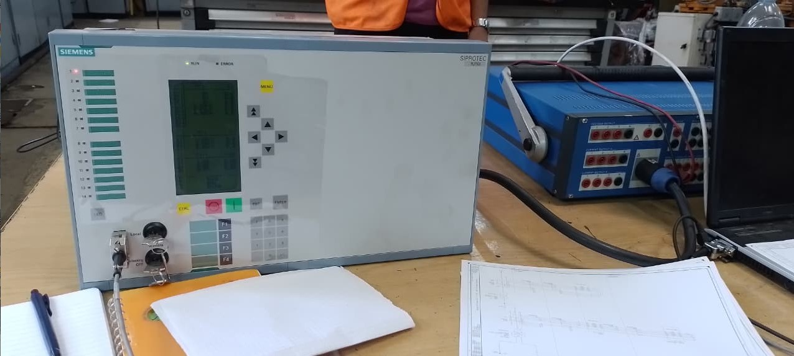
<figcaption class="text-xs text-center text-slate-400 mt-2">SIPROTEC protection relay panel work.</figcaption>
</figure>
<figure>
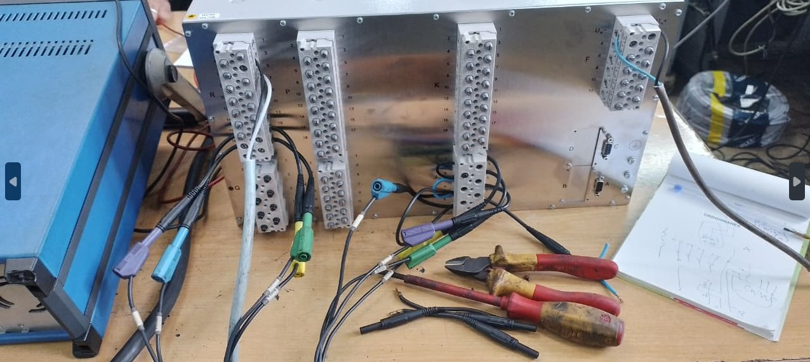
<figcaption class="text-xs text-center text-slate-400 mt-2">OMICRON CMC test kit setup in the electrical workshop.</figcaption>
</figure>
</div>
</section>
<!-- Supervisor evaluation -->
<section aria-labelledby="supervisor-s-evaluation-18-5-20" class="content-section relative z-10" id="evaluation">
<h2 class="text-2xl font-bold text-white mb-6 flex items-center space-x-3" id="supervisor-s-evaluation-18-5-20">
<i class="w-6 h-6 text-red-400" data-lucide="star"></i><span>Supervisor evaluation (18.5/20)</span>
</h2>
<div class="grid grid-cols-1 md:grid-cols-2 gap-6 items-start">
<div class="bg-red-900/30 p-6 rounded-xl border-l-4 border-red-500">
<h3 class="font-bold text-red-300 mb-3">Overall remarks</h3>
<p class="text-base italic text-slate-300 leading-relaxed">
                            "Good asset."
                            <br/><span class="text-sm text-slate-400 font-normal">(Original: "Bon élément")</span>
<br/>The overall grade awarded was <strong>18.5/20</strong>.
                        </p>
</div>
<figure class="rounded-lg overflow-hidden shadow-xl border border-slate-700">

<figcaption class="text-xs text-center text-slate-500 mt-2">
                        Evaluation sheet from Mr. M. Mouzouri, ONEE internship supervisor.
                    </figcaption>
</figure>
</div>
</section>
<!-- Final Return Link -->
<section aria-labelledby="return-to-portfolio" class="text-center pt-8 relative z-10"><h2 class="sr-only" id="return-to-portfolio">Return to portfolio</h2>
<a class="inline-flex items-center font-bold text-white bg-gradient-to-r from-cyan-600 to-blue-600 py-3 px-8 rounded-full shadow-lg hover:shadow-cyan-500/30 hover:-translate-y-1 transition-all" href="index.html#experience">
<i class="w-5 h-5 mr-2" data-lucide="arrow-left"></i> Return to Main Portfolio
                </a>
</section>
</article>
</main>
<!-- Script to initialize Lucide icons -->
<script>
        lucide.createIcons();
    </script>
</body>
</html>
````

### `internship-smcv.html`

````html
<!DOCTYPE html>

<html lang="en">
<head>
<meta charset="utf-8"/>
<meta content="width=device-width, initial-scale=1.0" name="viewport"/>
<title>SMCV Internship — PLC/HMI, Mechanical Design &amp; Thermal Analysis | Rafi Nasrallah</title>
<meta content="SMCV internship covering TIA Portal PLC/HMI programming, Siemens S7-1200 automation, mechanical design, ANSYS thermal analysis, and IT maintenance." name="description"/>
<meta content="Rafi Nasrallah, SMCV internship, PLC programming, TIA Portal, Siemens HMI, injection molding machine, mechanical arm design, Autodesk Inventor, industrial automation, Morocco" name="keywords"/>
<link href="https://fonts.googleapis.com" rel="preconnect"/><link crossorigin="" href="https://fonts.gstatic.com" rel="preconnect"/><link href="https://unpkg.com" rel="preconnect"/><link href="https://nasrallahrafi.me/internship-smcv.html" rel="canonical"/>
<meta content="website" property="og:type"/>
<meta content="Rafi Nasrallah Portfolio" property="og:site_name"/>
<meta content="SMCV Internship — PLC/HMI, Mechanical Design &amp; Thermal Analysis | Rafi Nasrallah" property="og:title"/>
<meta content="SMCV internship covering TIA Portal PLC/HMI programming, Siemens S7-1200 automation, mechanical design, ANSYS thermal analysis, and IT maintenance." property="og:description"/>
<meta content="https://nasrallahrafi.me/assets/img/Profile_picture.jpg" property="og:image"/>
<meta property="og:image:width" content="1280"/>
<meta property="og:image:height" content="1280"/>
<meta content="https://nasrallahrafi.me/internship-smcv.html" property="og:url"/>
<meta content="en_US" property="og:locale"/>
<meta content="summary_large_image" name="twitter:card"/>
<meta content="SMCV Internship — PLC/HMI, Mechanical Design &amp; Thermal Analysis | Rafi Nasrallah" name="twitter:title"/>
<meta content="SMCV internship covering TIA Portal PLC/HMI programming, Siemens S7-1200 automation, mechanical design, ANSYS thermal analysis, and IT maintenance." name="twitter:description"/>
<meta content="https://nasrallahrafi.me/assets/img/Profile_picture.jpg" name="twitter:image"/>
<meta content="@RafiNasrallah" name="twitter:creator"/>
<meta content="@RafiNasrallah" name="twitter:site"/>
<meta content="index, follow" name="robots"/>
<meta content="Rafi Nasrallah" name="author"/>
<link href="/favicon.ico" rel="icon" type="image/x-icon"/>
<link href="/apple-touch-icon.png" rel="apple-touch-icon"/><!-- Load Tailwind CSS --><link href="css/tailwind.min.css" rel="stylesheet"/><!-- Load Lucide Icons --><script crossorigin="anonymous" integrity="sha384-vEpkK5oidsrH6UhRc6tAPlgJZ/qXFwumFY+Kx8vBSeZ7NBag809YZCSmxFYGe/pt" src="https://unpkg.com/lucide@1.20.0/dist/umd/lucide.min.js"></script><link href="https://fonts.googleapis.com/css2?family=Outfit:wght@400;500;600;700;800;900&amp;family=JetBrains+Mono:wght@500;600&amp;display=swap" rel="stylesheet"/><!-- Link to external minified style.css --><link href="css/style.min.css" rel="stylesheet"/>
<!-- Load Tailwind CSS -->

<!-- Load Lucide Icons -->
<script type="application/ld+json">
{
  "@context": "https://schema.org",
  "@type": "BreadcrumbList",
  "itemListElement": [
    { "@type": "ListItem", "position": 1, "name": "Home", "item": "https://nasrallahrafi.me/" },
    { "@type": "ListItem", "position": 2, "name": "Experience", "item": "https://nasrallahrafi.me/#experience" },
    { "@type": "ListItem", "position": 3, "name": "SMCV Internship — Industrial Automation & HMI", "item": "https://nasrallahrafi.me/internship-smcv.html" }
  ]
}
</script>
</head>
<body class="antialiased selection:bg-cyan-500 selection:text-white">
<!-- Header -->
<header class="sticky top-0 z-50 glass transition-colors duration-300">
<div class="container mx-auto px-4 sm:px-6 lg:px-8 py-4 flex justify-between items-center gap-4">
<a class="text-2xl font-bold bg-clip-text text-transparent bg-gradient-to-r from-cyan-400 to-cyan-200 hover:text-cyan-300 transition-colors truncate" href="index.html#hero">
                Rafi Nasrallah
            </a>
<nav class="hidden lg:flex space-x-6">
<a class="text-slate-300 hover:text-cyan-400 font-medium transition-colors" href="index.html#about">About</a>
<a class="text-slate-300 hover:text-cyan-400 font-medium transition-colors" href="index.html#experience">Experience</a>
<a class="text-slate-300 hover:text-cyan-400 font-medium transition-colors" href="index.html#projects">Projects</a>
<a class="text-slate-300 hover:text-cyan-400 font-medium transition-colors" href="index.html#skills">Skills</a>
<a class="text-slate-300 hover:text-cyan-400 font-medium transition-colors" href="index.html#patents">Patents</a>
<a class="text-slate-300 hover:text-cyan-400 font-medium transition-colors" href="index.html#dev-focus">Development</a>
</nav>
<div class="flex items-center space-x-2 sm:space-x-4">
<button aria-label="Change theme" class="theme-toggle-button text-slate-200 transition-colors flex items-center justify-center" id="theme-toggle-button" onclick="toggleTheme()" type="button">
<i class="w-4 h-4" data-lucide="palette" id="theme-toggle-icon"></i>
<span class="theme-toggle-copy">Theme</span>
<span class="theme-toggle-name" id="theme-toggle-name">Glass</span>
</button>
<a class="inline-flex items-center text-slate-300 hover:text-cyan-400 font-medium transition-colors text-sm" href="index.html#experience">
<i class="w-4 h-4 mr-2" data-lucide="arrow-left"></i><span class="hidden sm:inline">Back</span>
                </a>
</div>
</div>
</header>
<main class="container mx-auto px-4 sm:px-6 lg:px-8 py-12">
<article class="max-w-5xl mx-auto glass p-8 md:p-12 rounded-2xl relative overflow-hidden">
<!-- Background Blob -->
<div class="absolute top-0 right-0 w-96 h-96 bg-cyan-500/10 rounded-full blur-3xl -translate-y-1/2 translate-x-1/2 pointer-events-none">
</div>
<!-- Title & Metadata -->
<section aria-labelledby="automation-plc-hmi-mechanical-arm-and-pneumatic-press-design-and-it-maintenance" class="content-section text-center relative z-10">
<span class="text-xs font-bold text-white bg-cyan-600/80 px-4 py-1.5 rounded-full uppercase tracking-wider mb-6 inline-block shadow-lg shadow-cyan-500/20">Final project stage</span>
<h1 class="text-3xl md:text-5xl font-extrabold text-white mb-4 leading-tight" id="automation-plc-hmi-mechanical-arm-and-pneumatic-press-design-and-it-maintenance">
                    Automation (PLC/HMI), mechanical arm, pneumatic press design, and IT maintenance
                </h1>
<p class="text-lg text-slate-300 leading-relaxed max-w-3xl mx-auto mb-6">
                    SMCV internship covering Siemens S7-1200 automation, HMI supervision, mechanical design, thermal analysis, and industrial workstation recovery for electricity meter production.
                </p>
<p class="text-base text-slate-400 mb-8">
<strong>Company:</strong> SMCV (Société Marocaine des Compteurs) | <strong>Duration:</strong> July 2025 - September 2025
                </p>
<div class="grid grid-cols-1 md:grid-cols-4 gap-4 text-left">
<div class="bg-slate-800/50 p-4 rounded-xl border border-slate-700/50">
<p class="text-xs font-bold text-cyan-400 uppercase tracking-wider mb-2">Automation</p>
<p class="text-xl font-extrabold text-white">S7-1200</p>
<p class="text-sm text-slate-400 mt-2">TIA Portal sequence logic and HMI commands.</p>
</div>
<div class="bg-slate-800/50 p-4 rounded-xl border border-slate-700/50">
<p class="text-xs font-bold text-cyan-400 uppercase tracking-wider mb-2">Design</p>
<p class="text-xl font-extrabold text-white">Inventor</p>
<p class="text-sm text-slate-400 mt-2">Mechanical arm and nut insertion press concepts.</p>
</div>
<div class="bg-slate-800/50 p-4 rounded-xl border border-slate-700/50">
<p class="text-xs font-bold text-cyan-400 uppercase tracking-wider mb-2">Thermal</p>
<p class="text-xl font-extrabold text-white">ANSYS</p>
<p class="text-sm text-slate-400 mt-2">Heating and cooling behavior for insert nuts.</p>
</div>
<div class="bg-red-900/30 p-4 rounded-xl border border-red-500/50">
<p class="text-xs font-bold text-red-300 uppercase tracking-wider mb-2">Evaluation</p>
<p class="text-xl font-extrabold text-white">20/20</p>
<p class="text-sm text-slate-300 mt-2">Supervisor rating for the internship work.</p>
</div>
</div>
</section>
<!-- Mission overview -->
<section aria-labelledby="section-mission-overview" class="content-section relative z-10">
<h2 class="text-2xl font-bold text-white mb-6 flex items-center space-x-3" id="section-mission-overview">
<div class="p-2 bg-cyan-500/10 rounded-lg">
<i class="w-6 h-6 text-cyan-400" data-lucide="target"></i>
</div>
<span>Mission overview</span>
</h2>
<div class="grid grid-cols-1 md:grid-cols-2 gap-6">
<div class="bg-slate-800/50 p-6 rounded-xl border border-slate-700/50">
<h3 class="font-bold text-white mb-3">Industrial problem</h3>
<p class="text-slate-300 leading-relaxed">
                            The workshop needed practical improvements for nut insertion quality, operator workflow, HMI operation, and stability of meter configuration workstations.
                        </p>
</div>
<div class="bg-slate-800/50 p-6 rounded-xl border border-slate-700/50">
<h3 class="font-bold text-white mb-3">Engineering response</h3>
<p class="text-slate-300 leading-relaxed">
                            The work combined TIA Portal, Siemens S7-1200 automation, HMI screen design, Autodesk Inventor concepts, ANSYS-based thermal reasoning, and industrial IT troubleshooting.
                        </p>
</div>
</div>
</section>
<!-- SECTION 1: PLC and HMI Programming -->
<section aria-labelledby="section-hmi-screens-designs" class="content-section relative z-10" id="section-1">
<h2 class="text-2xl font-bold text-white mb-6 flex items-center space-x-3" id="section-hmi-screens-designs">
<div class="p-2 bg-cyan-500/10 rounded-lg">
<i class="w-6 h-6 text-cyan-400" data-lucide="monitor"></i>
</div>
<span>HMI screens &amp; designs</span>
</h2>
<div class="bg-slate-800/50 p-6 rounded-xl border border-slate-700/50 mb-6">
<h3 class="font-bold text-white mb-3">Operator interface scope</h3>
<p class="text-sm text-slate-300 leading-relaxed">
                        The HMI work covered the main operation page, manual controls, and configuration screens for the injection molding machine. The objective was to make machine commands, parameter adjustment, and operator supervision clearer on the shop floor.
                    </p>
</div>
<div class="grid grid-cols-2 md:grid-cols-4 gap-4">
<figure class="group">
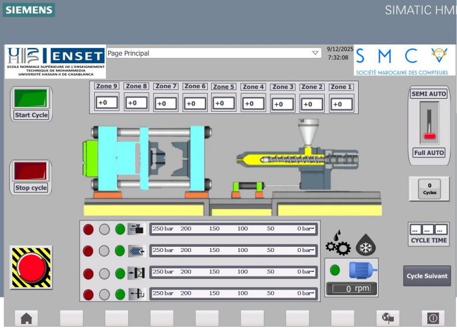
<figcaption class="text-xs text-center text-slate-400 mt-2">Main page</figcaption>
</figure>
<figure class="group">
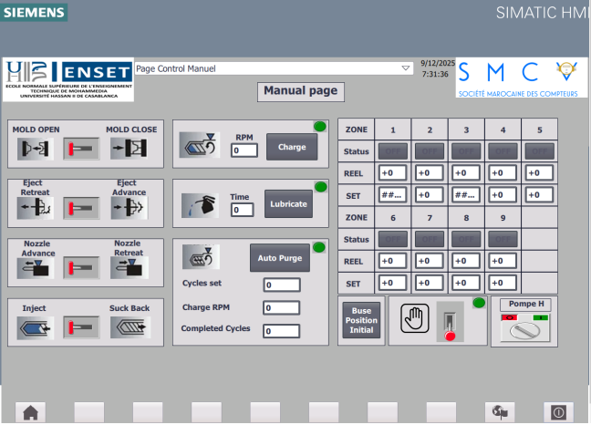
<figcaption class="text-xs text-center text-slate-400 mt-2">Manual control</figcaption>
</figure>
<figure class="group">
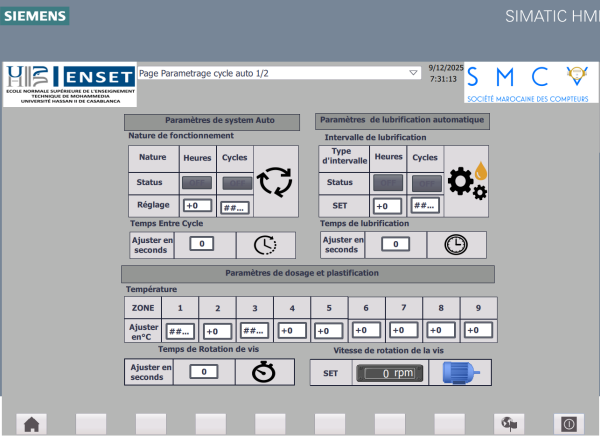
<figcaption class="text-xs text-center text-slate-400 mt-2">Configuration 1</figcaption>
</figure>
<figure class="group">
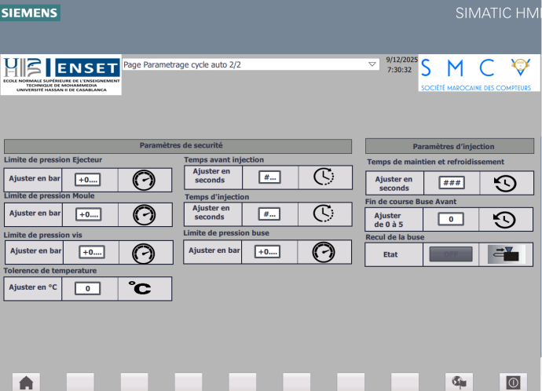
<figcaption class="text-xs text-center text-slate-400 mt-2">Configuration 2</figcaption>
</figure>
</div>
</section>
<!-- SECTION 2: Engineering deliverables -->
<section aria-labelledby="section-engineering-deliverables" class="content-section relative z-10" id="section-2">
<h2 class="text-2xl font-bold text-white mb-6 flex items-center space-x-3" id="section-engineering-deliverables">
<i class="w-8 h-8 text-cyan-400" data-lucide="settings"></i><span>Engineering deliverables</span>
</h2>
<div class="grid grid-cols-1 md:grid-cols-2 gap-6 mb-8">
<div class="bg-yellow-900/20 p-6 rounded-xl border-l-4 border-yellow-500">
<h3 class="font-bold text-white mb-3" id="2-mechanical-insertion-arm-design">Mechanical insertion arm</h3>
<p class="text-sm text-slate-300 leading-relaxed mb-4">
                            The first solution addressed nut perpendicularity defects and operator effort through a manual insertion arm designed in Autodesk Inventor.
                        </p>
<ul class="list-disc ml-5 text-sm text-slate-300 space-y-2">
<li>Reduced quality variability caused by poorly inserted nuts.</li>
<li>Improved the operator working position and repeatability.</li>
<li>Revealed the limitation of sequential nut-by-nut insertion.</li>
</ul>
</div>
<div class="bg-blue-900/20 p-6 rounded-xl border-l-4 border-blue-500">
<h3 class="font-bold text-white mb-3" id="3-nut-insertion-press-design-and-programming">Nut insertion press</h3>
<p class="text-sm text-slate-300 leading-relaxed mb-4">
                            The second solution moved toward simultaneous insertion through a pneumatic press concept, PLC sequence logic, HMI controls, and thermal validation.
                        </p>
<ul class="list-disc ml-5 text-sm text-slate-300 space-y-2">
<li><strong>Mechanical design:</strong> structural and functional press concept.</li>
<li><strong>Automation:</strong> TIA Portal logic for sequence control and safety.</li>
<li><strong>Thermal analysis:</strong> heating behavior checked for safe insertion temperatures.</li>
</ul>
</div>
</div>
<figure class="mb-8">
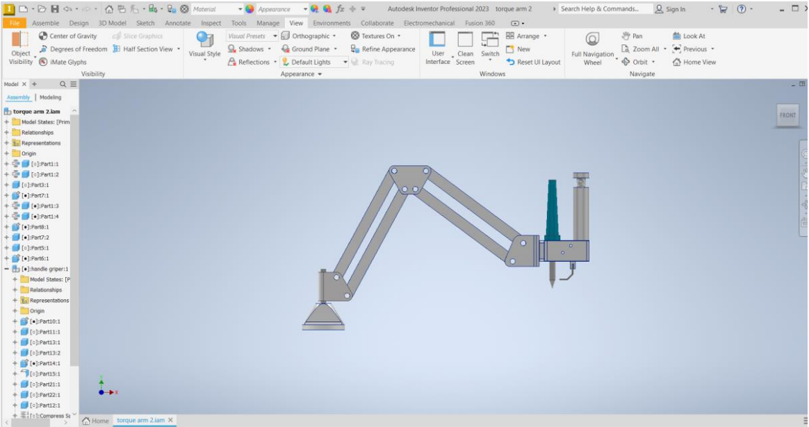
<figcaption class="text-xs text-center text-slate-400 mt-2">3D model of the nut insertion arm in Autodesk Inventor.</figcaption>
</figure>
<h3 class="text-xl font-bold text-white mb-4 flex items-center space-x-2">
<i class="w-5 h-5 text-cyan-400" data-lucide="camera"></i><span>Press HMI and thermal evidence</span>
</h3>
<div class="grid grid-cols-1 md:grid-cols-3 gap-6">
<figure>
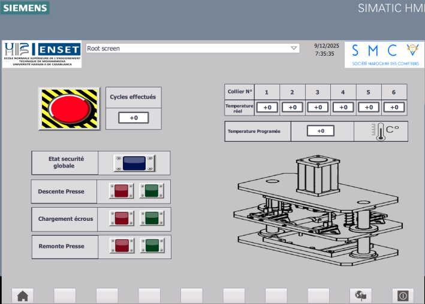
<figcaption class="text-xs text-center text-slate-400 mt-2">Nut insertion press HMI</figcaption>
</figure>
<figure>
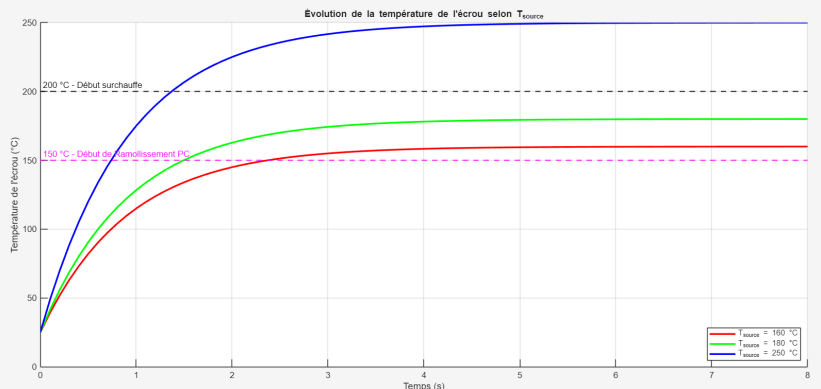
<figcaption class="text-xs text-center text-slate-400 mt-2">Heating source sensitivity</figcaption>
</figure>
<figure>
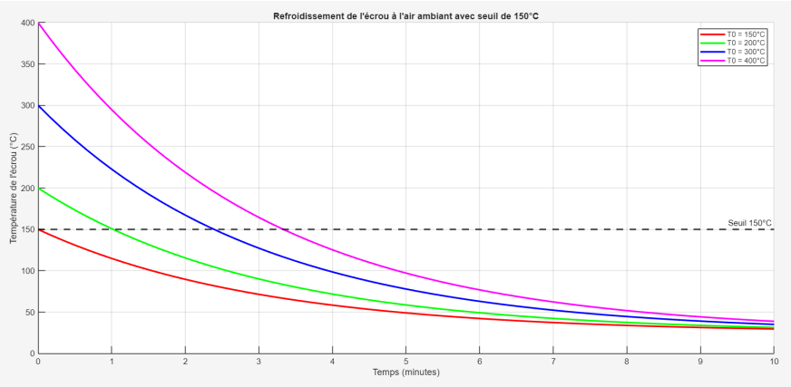
<figcaption class="text-xs text-center text-slate-400 mt-2">Cooldown temperature evolution</figcaption>
</figure>
</div>
</section>
<!-- SECTION 3: Industrial IT Maintenance -->
<section aria-labelledby="4-industrial-it-maintenance" class="content-section relative z-10" id="section-4">
<h2 class="text-2xl font-bold text-white mb-6 flex items-center space-x-3" id="4-industrial-it-maintenance">
<div class="p-2 bg-cyan-500/10 rounded-lg">
<i class="w-6 h-6 text-cyan-400" data-lucide="pc-case"></i>
</div>
<span>Industrial IT maintenance</span>
</h2>
<div class="grid grid-cols-1 md:grid-cols-3 gap-6">
<div class="bg-slate-800/50 p-6 rounded-xl border border-slate-700/50">
<h3 class="font-bold text-white mb-3">Context</h3>
<p class="text-sm text-slate-300 leading-relaxed">Inhemeter workstations are used to configure, parameterize, and test electricity meters. Failures can delay production.</p>
</div>
<div class="bg-slate-800/50 p-6 rounded-xl border border-slate-700/50">
<h3 class="font-bold text-white mb-3">Intervention</h3>
<p class="text-sm text-slate-300 leading-relaxed">The unstable Chinese-language Windows XP virtual machine was replaced with a stable English setup and compatible drivers.</p>
</div>
<div class="bg-blue-900/20 p-6 rounded-xl border-l-4 border-blue-500">
<h3 class="font-bold text-white mb-3">Result</h3>
<p class="text-sm text-slate-300 leading-relaxed">The configuration stations recovered stable operation, reducing crashes and improving the meter programming workflow.</p>
</div>
</div>
</section>
<!-- Conclusion -->
<section aria-labelledby="general-conclusion-and-perspectives" class="content-section relative z-10">
<h2 class="text-2xl font-bold text-white mb-6 flex items-center space-x-3" id="general-conclusion-and-perspectives">
<div class="p-2 bg-cyan-500/10 rounded-lg">
<i class="w-6 h-6 text-cyan-400" data-lucide="check-circle"></i>
</div>
<span>Conclusion and perspectives</span>
</h2>
<div class="grid grid-cols-1 md:grid-cols-2 gap-6">
<div class="bg-slate-800/50 p-6 rounded-xl border border-slate-700/50">
<h3 class="font-bold text-white mb-3">Internship summary</h3>
<ul class="list-disc ml-5 text-sm text-slate-300 space-y-2">
<li>Designed and dimensioned nut insertion tooling concepts.</li>
<li>Developed PLC logic and HMI interfaces for industrial operation.</li>
<li>Used thermal simulation and calculations to support insertion process decisions.</li>
</ul>
</div>
<div class="bg-slate-800/50 p-6 rounded-xl border border-slate-700/50">
<h3 class="font-bold text-white mb-3">Future perspectives</h3>
<ul class="list-disc ml-5 text-sm text-slate-300 space-y-2">
<li><strong>Process improvement:</strong> optimize heating and cooling cycles and evaluate active cooling.</li>
<li><strong>Skill development:</strong> deepen thermal simulation, mechanical modeling, and PLC programming practice.</li>
</ul>
</div>
</div>
</section>
<!-- SUPERVISOR EVALUATION -->
<section aria-labelledby="supervisor-s-evaluation-20-20" class="content-section relative z-10" id="evaluation">
<h2 class="text-2xl font-bold text-white mb-6 flex items-center space-x-3" id="supervisor-s-evaluation-20-20">
<i class="w-6 h-6 text-red-400" data-lucide="star"></i><span>Supervisor evaluation (20/20)</span>
</h2>
<div class="grid grid-cols-1 md:grid-cols-2 gap-6 items-start">
<div class="bg-red-900/30 p-6 rounded-xl border-l-4 border-red-500">
<h3 class="font-bold text-red-300 mb-3">Overall remarks</h3>
<p class="text-base italic text-slate-300 leading-relaxed">
                        "Serious work, punctuality, and respect for instructions are to be highlighted."
                        <br/><span class="text-sm text-slate-400 font-normal">(Original: "Travail sérieux, ponctualité et respect des consignes sont à souligner")</span>
</p>
</div>
<figure class="rounded-lg overflow-hidden shadow-xl border border-slate-700">
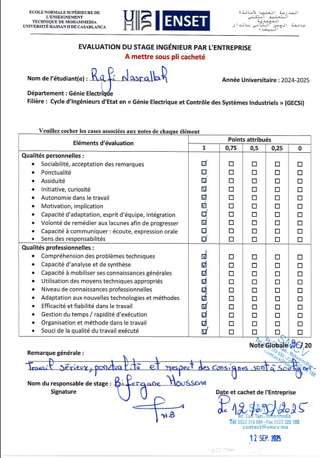
</figure>
</div>
</section>
<!-- Final Return Link -->
<section aria-labelledby="section-9" class="text-center pt-8 relative z-10"><h2 class="sr-only" id="section-9">Section 9</h2>
<a class="inline-flex items-center font-bold text-white bg-gradient-to-r from-cyan-600 to-blue-600 py-3 px-8 rounded-full shadow-lg hover:shadow-cyan-500/30 hover:-translate-y-1 transition-all" href="index.html#experience">
<i class="w-5 h-5 mr-2" data-lucide="arrow-left"></i> Return to Main Portfolio
                </a>
</section>
</article>
</main>
<!-- Script to initialize Lucide icons -->
<script>
        lucide.createIcons();
    </script>
</body>
</html>
````

### `js\indexnow.mjs`

````js
import https from 'https';
import { readFileSync } from 'fs';
import { fileURLToPath } from 'url';
import { dirname, join } from 'path';

// Load .env manually (no dotenv dependency on ESM)
const __dirname = dirname(fileURLToPath(import.meta.url));
const envPath = join(__dirname, '..', '.env');
const env = Object.fromEntries(
  readFileSync(envPath, 'utf8')
    .split('\n')
    .filter(line => line.includes('='))
    .map(line => line.split('=').map(s => s.trim()))
);

const KEY = env.INDEXNOW_KEY;
const BING_API_KEY = env.BING_API_KEY;
const HOST = 'nasrallahrafi.me';

if (!KEY || !BING_API_KEY) {
  console.error('❌ Missing INDEXNOW_KEY or BING_API_KEY in .env');
  process.exit(1);
}

const URLS = [
  `https://${HOST}/`,
  `https://${HOST}/project-rendezvous.html`,
  `https://${HOST}/project-thermal.html`,
  `https://${HOST}/project-waveguide.html`,
  `https://${HOST}/apprenticeship-rafi.html`,
  `https://${HOST}/internship-onee.html`,
  `https://${HOST}/internship-smcv.html`,
];

// ── Step 1: Submit via IndexNow protocol ──────────────────────────
function submitIndexNow() {
  return new Promise((resolve, reject) => {
    const payload = JSON.stringify({
      host: HOST,
      key: KEY,
      keyLocation: `https://${HOST}/${KEY}.txt`,
      urlList: URLS,
    });

    const options = {
      hostname: 'api.indexnow.org',
      path: '/indexnow',
      method: 'POST',
      headers: {
        'Content-Type': 'application/json; charset=utf-8',
        'Content-Length': Buffer.byteLength(payload),
      },
    };

    const req = https.request(options, (res) => {
      if (res.statusCode === 200 || res.statusCode === 202) {
        console.log(`✅ IndexNow: ${res.statusCode} — URLs queued for crawling.`);
        resolve();
      } else if (res.statusCode === 403) {
        console.error('❌ IndexNow 403 — key file not found. Push to GitHub first.');
        reject(new Error('403'));
      } else if (res.statusCode === 429) {
        console.error('⚠️  IndexNow 429 — too many requests. Wait before retrying.');
        reject(new Error('429'));
      } else {
        console.error(`❌ IndexNow ${res.statusCode} — unexpected response.`);
        reject(new Error(String(res.statusCode)));
      }
    });

    req.on('error', reject);
    req.write(payload);
    req.end();
  });
}

// ── Step 2: Submit each URL via Bing URL Submission API ───────────
function submitToBingApi(url) {
  return new Promise((resolve, reject) => {
    const payload = JSON.stringify({ siteUrl: `https://${HOST}/`, url });

    const options = {
      hostname: 'ssl.bing.com',
      path: `/webmaster/api.svc/json/SubmitUrl?apikey=${BING_API_KEY}`,
      method: 'POST',
      headers: {
        'Content-Type': 'application/json; charset=utf-8',
        'Content-Length': Buffer.byteLength(payload),
      },
    };

    const req = https.request(options, (res) => {
      let body = '';
      res.on('data', chunk => body += chunk);
      res.on('end', () => {
        if (res.statusCode === 200) {
          console.log(`  ✅ Bing API: submitted ${url}`);
          resolve();
        } else {
          console.error(`  ❌ Bing API ${res.statusCode} for ${url}: ${body}`);
          resolve(); // continue even on individual failure
        }
      });
    });

    req.on('error', (e) => {
      console.error(`  ❌ Bing API request error for ${url}: ${e.message}`);
      resolve();
    });

    req.write(payload);
    req.end();
  });
}

// ── Main ──────────────────────────────────────────────────────────
(async () => {
  console.log(`\n🔍 Submitting ${URLS.length} URLs to Bing...\n`);

  console.log('── IndexNow protocol ──');
  await submitIndexNow();

  console.log('\n── Bing URL Submission API ──');
  for (const url of URLS) {
    await submitToBingApi(url);
    // small delay to avoid rate limiting
    await new Promise(r => setTimeout(r, 300));
  }

  console.log('\n🎉 Done. Bing will crawl all pages within minutes.');
})();
````

### `js\remove_lang.py`

````python
import os
import glob
import re

html_files = glob.glob('*.html')

for filepath in html_files:
    with open(filepath, 'r', encoding='utf-8') as f:
        content = f.read()

    # 1. Remove lang.js from head
    content = re.sub(r'\s*<!-- Language Switcher Script -->\s*<script src="lang\.js"></script>', '', content)

    # 2. Remove google translate div
    content = re.sub(r'\s*<div id="google_translate_element" style="display:none;"></div>', '', content)

    # 3. Remove Language Toggle Button
    # Match the comment and the button block up to the closing tag
    
    button_pattern = r'\s*<!-- Language Toggle Button -->\s*<button aria-label="Toggle Language"[^>]*>[\s\S]*?</button>\s*'
    content = re.sub(button_pattern, '', content)

    with open(filepath, 'w', encoding='utf-8') as f:
        f.write(content)
        
    print(f"Processed and cleaned {filepath}")
````

### `js\theme.js`

````js
const THEMES = ['theme-glass', 'theme-volt', 'theme-deepsea', 'theme-obsidian'];
const DEFAULT_THEME = 'theme-glass';
const THEME_META = {
    'theme-glass': { icon: 'sun', label: 'Glass' },
    'theme-volt': { icon: 'zap', label: 'Volt' },
    'theme-deepsea': { icon: 'droplets', label: 'Deep Sea' },
    'theme-obsidian': { icon: 'moon', label: 'Obsidian' },
};

function initTheme() {
    const savedTheme = localStorage.getItem('portfolio-theme');
    const theme = THEMES.includes(savedTheme) ? savedTheme : DEFAULT_THEME;

    document.body.classList.remove(...THEMES);
    document.body.classList.add(theme);
    updateThemeIcon(theme);
}

function toggleTheme() {
    const currentTheme = THEMES.find(t => document.body.classList.contains(t)) || DEFAULT_THEME;
    const nextIndex = (THEMES.indexOf(currentTheme) + 1) % THEMES.length;
    const nextTheme = THEMES[nextIndex];
    
    document.body.classList.remove(...THEMES);
    document.body.classList.add(nextTheme);
    
    localStorage.setItem('portfolio-theme', nextTheme);
    updateThemeIcon(nextTheme);
}

function updateThemeIcon(theme) {
    const iconEl = document.getElementById('theme-toggle-icon');
    const labelEl = document.getElementById('theme-toggle-name');
    const buttonEl = document.getElementById('theme-toggle-button');
    const themeMeta = THEME_META[theme] || THEME_META[DEFAULT_THEME];

    if (labelEl) {
        labelEl.textContent = themeMeta.label;
    }

    if (buttonEl) {
        buttonEl.setAttribute('aria-label', `Change theme. Current theme: ${themeMeta.label}`);
        buttonEl.setAttribute('title', `Change theme. Current: ${themeMeta.label}`);
    }

    if (iconEl && window.lucide) {
        iconEl.setAttribute('data-lucide', themeMeta.icon);
        lucide.createIcons();
    }
}


document.addEventListener('DOMContentLoaded', () => {
    initTheme();
});
````

### `llms.txt`

````txt
# Rafi Nasrallah — Electrical Engineer Portfolio

> State Engineer in Electrical Engineering (ENSET Mohammedia, 2026) specialising in Smart
> Battery Management Systems, embedded hardware design, and industrial IoT. Patent holder
> (OMPIC #65133). Based in Dar Bouazza, Morocco.

Rafi Nasrallah is a Moroccan electrical engineer whose work centres on battery intelligence:
physical modelling of LiFePO4 cells, hybrid SOC/SOH estimation pipelines (ECM 3RC + UKF +
LSTM residual correction), STM32-based BMS hardware designed in Altium Designer, and
real-time production dashboards over MQTT/REST. He holds a granted patent for an automated
corrugated-web beam welding and assembly system (OMPIC #65133, November 2025).

## Projects

- [Rectangular Waveguide TE10 Analysis](https://nasrallahrafi.me/project-waveguide.html): ANSYS HFSS simulation of WR-90 waveguide with air and alumina dielectric loading. Key result: alumina loading shifts the cutoff frequency from 6.56 GHz to 2.19 GHz with measured insertion loss of 0.26–0.72 dB.
- [Transient Thermal Analysis — FEA vs LCM](https://nasrallahrafi.me/project-thermal.html): Comparative study of Lumped Capacitance Modelling vs ANSYS FEA (Fusion 360) for hot-nut insertion cycle validation in polycarbonate. Full report available as PDF.
- [Luenberger-Based Orbital Rendezvous Control](https://nasrallahrafi.me/project-rendezvous.html): Full autopilot system (Luenberger Observer + State-Feedback Controller) for satellite rendezvous using angle-only measurements, with system normalisation to overcome numerical instability. Implemented in MATLAB/Simulink.
- BMS Digital Twin — Emove Véhicules (Feb–May 2026): High-fidelity 15S2P LFP battery digital twin integrating dynamic hysteresis, ECM 3RC + UKF + LSTM SOC estimation, active balancing (LTC3300-1), STM32 16S BMS hardware, HiL validation (RMSE < 2 %), and MQTT/REST production dashboard.

## Experience

- [Engineering Intern — Emove Véhicules](https://nasrallahrafi.me/#experience) (Feb–May 2026): R&D and industrialisation internship. Resolved premature shutdown at 20 % SOC and energy gauge instability on electric scooters via coupled hardware/software/process approach.
- [Internship — SMCV](https://nasrallahrafi.me/internship-smcv.html) (2025): HMI design (WinCC), injection moulding machine automation, mechanical arm design (Inventor), thermal analysis of nut insertion press.
- [Internship — ONEE Mohammedia Thermal Power Plant](https://nasrallahrafi.me/internship-onee.html) (Jul–Aug 2024): Formalised test procedures for Siemens SIPROTEC digital protection relays using OMICRON CMC. Supervisor evaluation: 18.5/20.
- [Apprenticeship — Rafi Robotiques et Machineries](https://nasrallahrafi.me/apprenticeship-rafi.html) (2020–2023): Three-year industrial apprenticeship covering CNC lathe repair (Siemens Sinumerik 840D / Simodrive 611), 5-axis welding robot fabrication, PLC reprogramming, and heavy-machine restoration.

## Skills

Battery modelling (ECM 3RC, hysteresis), SOC/SOH estimation (UKF, LSTM), digital twin
development, STM32 firmware, Altium Designer PCB layout, CAN/I2C/SPI, MATLAB/Simulink,
Python, ANSYS HFSS, ANSYS Thermal, Fusion 360, MQTT, REST API, PLC programming, Siemens
Sinumerik 840D, WinCC HMI, Caneco BT, ETAP, IEC 62133, ISO 26262, ISO 9001.

## Education

- Engineering Degree in Electrical Engineering and Industrial Systems Control — ENSET Mohammedia (2023–2026)
- Licence in Physical Sciences (Electronics) — Faculté des Sciences Ben M'sik, Casablanca (2022–2023)
- DEUG in Physical Sciences — Faculté des Sciences Ben M'sik, Casablanca (2020–2022)

## Contact

- Email: nasrollahrafi@gmail.com
- Phone: +212 671 114 377
- GitHub: https://github.com/NasrallahRAFI
- Portfolio: https://nasrallahrafi.me/

## Optional

- [CV (English)](https://nasrallahrafi.me/assets/pdf/RAFI_Nasrallah_CV_ENG.pdf)
- [CV (French)](https://nasrallahrafi.me/assets/pdf/RAFI_Nasrallah_CV_FR.pdf)
- [Waveguide Analysis Report (PDF)](https://nasrallahrafi.me/assets/pdf/ANALYSIS_OF_TE10_MODE_PROPAGATION.pdf)
- [Thermal Analysis Report (PDF)](https://nasrallahrafi.me/assets/pdf/Thermal_Analysis_Full_Report.pdf)
- [Luenberger Rendezvous Paper (PDF)](https://nasrallahrafi.me/assets/pdf/Luenberger_Based_Rendezvous_Control_with_Angle_Only_Data.pdf)
````

### `package-lock.json`

````json
{
  "name": "nasrallahrafi",
  "version": "1.0.0",
  "lockfileVersion": 3,
  "requires": true,
  "packages": {
    "": {
      "name": "nasrallahrafi",
      "version": "1.0.0",
      "license": "ISC",
      "devDependencies": {
        "tailwindcss": "^3.4.19"
      }
    },
    "node_modules/@alloc/quick-lru": {
      "version": "5.2.0",
      "resolved": "https://registry.npmjs.org/@alloc/quick-lru/-/quick-lru-5.2.0.tgz",
      "integrity": "sha512-UrcABB+4bUrFABwbluTIBErXwvbsU/V7TZWfmbgJfbkwiBuziS9gxdODUyuiecfdGQ85jglMW6juS3+z5TsKLw==",
      "dev": true,
      "license": "MIT",
      "engines": {
        "node": ">=10"
      },
      "funding": {
        "url": "https://github.com/sponsors/sindresorhus"
      }
    },
    "node_modules/@jridgewell/gen-mapping": {
      "version": "0.3.13",
      "resolved": "https://registry.npmjs.org/@jridgewell/gen-mapping/-/gen-mapping-0.3.13.tgz",
      "integrity": "sha512-2kkt/7niJ6MgEPxF0bYdQ6etZaA+fQvDcLKckhy1yIQOzaoKjBBjSj63/aLVjYE3qhRt5dvM+uUyfCg6UKCBbA==",
      "dev": true,
      "license": "MIT",
      "dependencies": {
        "@jridgewell/sourcemap-codec": "^1.5.0",
        "@jridgewell/trace-mapping": "^0.3.24"
      }
    },
    "node_modules/@jridgewell/resolve-uri": {
      "version": "3.1.2",
      "resolved": "https://registry.npmjs.org/@jridgewell/resolve-uri/-/resolve-uri-3.1.2.tgz",
      "integrity": "sha512-bRISgCIjP20/tbWSPWMEi54QVPRZExkuD9lJL+UIxUKtwVJA8wW1Trb1jMs1RFXo1CBTNZ/5hpC9QvmKWdopKw==",
      "dev": true,
      "license": "MIT",
      "engines": {
        "node": ">=6.0.0"
      }
    },
    "node_modules/@jridgewell/sourcemap-codec": {
      "version": "1.5.5",
      "resolved": "https://registry.npmjs.org/@jridgewell/sourcemap-codec/-/sourcemap-codec-1.5.5.tgz",
      "integrity": "sha512-cYQ9310grqxueWbl+WuIUIaiUaDcj7WOq5fVhEljNVgRfOUhY9fy2zTvfoqWsnebh8Sl70VScFbICvJnLKB0Og==",
      "dev": true,
      "license": "MIT"
    },
    "node_modules/@jridgewell/trace-mapping": {
      "version": "0.3.31",
      "resolved": "https://registry.npmjs.org/@jridgewell/trace-mapping/-/trace-mapping-0.3.31.tgz",
      "integrity": "sha512-zzNR+SdQSDJzc8joaeP8QQoCQr8NuYx2dIIytl1QeBEZHJ9uW6hebsrYgbz8hJwUQao3TWCMtmfV8Nu1twOLAw==",
      "dev": true,
      "license": "MIT",
      "dependencies": {
        "@jridgewell/resolve-uri": "^3.1.0",
        "@jridgewell/sourcemap-codec": "^1.4.14"
      }
    },
    "node_modules/@nodelib/fs.scandir": {
      "version": "2.1.5",
      "resolved": "https://registry.npmjs.org/@nodelib/fs.scandir/-/fs.scandir-2.1.5.tgz",
      "integrity": "sha512-vq24Bq3ym5HEQm2NKCr3yXDwjc7vTsEThRDnkp2DK9p1uqLR+DHurm/NOTo0KG7HYHU7eppKZj3MyqYuMBf62g==",
      "dev": true,
      "license": "MIT",
      "dependencies": {
        "@nodelib/fs.stat": "2.0.5",
        "run-parallel": "^1.1.9"
      },
      "engines": {
        "node": ">= 8"
      }
    },
    "node_modules/@nodelib/fs.stat": {
      "version": "2.0.5",
      "resolved": "https://registry.npmjs.org/@nodelib/fs.stat/-/fs.stat-2.0.5.tgz",
      "integrity": "sha512-RkhPPp2zrqDAQA/2jNhnztcPAlv64XdhIp7a7454A5ovI7Bukxgt7MX7udwAu3zg1DcpPU0rz3VV1SeaqvY4+A==",
      "dev": true,
      "license": "MIT",
      "engines": {
        "node": ">= 8"
      }
    },
    "node_modules/@nodelib/fs.walk": {
      "version": "1.2.8",
      "resolved": "https://registry.npmjs.org/@nodelib/fs.walk/-/fs.walk-1.2.8.tgz",
      "integrity": "sha512-oGB+UxlgWcgQkgwo8GcEGwemoTFt3FIO9ababBmaGwXIoBKZ+GTy0pP185beGg7Llih/NSHSV2XAs1lnznocSg==",
      "dev": true,
      "license": "MIT",
      "dependencies": {
        "@nodelib/fs.scandir": "2.1.5",
        "fastq": "^1.6.0"
      },
      "engines": {
        "node": ">= 8"
      }
    },
    "node_modules/any-promise": {
      "version": "1.3.0",
      "resolved": "https://registry.npmjs.org/any-promise/-/any-promise-1.3.0.tgz",
      "integrity": "sha512-7UvmKalWRt1wgjL1RrGxoSJW/0QZFIegpeGvZG9kjp8vrRu55XTHbwnqq2GpXm9uLbcuhxm3IqX9OB4MZR1b2A==",
      "dev": true,
      "license": "MIT"
    },
    "node_modules/anymatch": {
      "version": "3.1.3",
      "resolved": "https://registry.npmjs.org/anymatch/-/anymatch-3.1.3.tgz",
      "integrity": "sha512-KMReFUr0B4t+D+OBkjR3KYqvocp2XaSzO55UcB6mgQMd3KbcE+mWTyvVV7D/zsdEbNnV6acZUutkiHQXvTr1Rw==",
      "dev": true,
      "license": "ISC",
      "dependencies": {
        "normalize-path": "^3.0.0",
        "picomatch": "^2.0.4"
      },
      "engines": {
        "node": ">= 8"
      }
    },
    "node_modules/arg": {
      "version": "5.0.2",
      "resolved": "https://registry.npmjs.org/arg/-/arg-5.0.2.tgz",
      "integrity": "sha512-PYjyFOLKQ9y57JvQ6QLo8dAgNqswh8M1RMJYdQduT6xbWSgK36P/Z/v+p888pM69jMMfS8Xd8F6I1kQ/I9HUGg==",
      "dev": true,
      "license": "MIT"
    },
    "node_modules/binary-extensions": {
      "version": "2.3.0",
      "resolved": "https://registry.npmjs.org/binary-extensions/-/binary-extensions-2.3.0.tgz",
      "integrity": "sha512-Ceh+7ox5qe7LJuLHoY0feh3pHuUDHAcRUeyL2VYghZwfpkNIy/+8Ocg0a3UuSoYzavmylwuLWQOf3hl0jjMMIw==",
      "dev": true,
      "license": "MIT",
      "engines": {
        "node": ">=8"
      },
      "funding": {
        "url": "https://github.com/sponsors/sindresorhus"
      }
    },
    "node_modules/braces": {
      "version": "3.0.3",
      "resolved": "https://registry.npmjs.org/braces/-/braces-3.0.3.tgz",
      "integrity": "sha512-yQbXgO/OSZVD2IsiLlro+7Hf6Q18EJrKSEsdoMzKePKXct3gvD8oLcOQdIzGupr5Fj+EDe8gO/lxc1BzfMpxvA==",
      "dev": true,
      "license": "MIT",
      "dependencies": {
        "fill-range": "^7.1.1"
      },
      "engines": {
        "node": ">=8"
      }
    },
    "node_modules/camelcase-css": {
      "version": "2.0.1",
      "resolved": "https://registry.npmjs.org/camelcase-css/-/camelcase-css-2.0.1.tgz",
      "integrity": "sha512-QOSvevhslijgYwRx6Rv7zKdMF8lbRmx+uQGx2+vDc+KI/eBnsy9kit5aj23AgGu3pa4t9AgwbnXWqS+iOY+2aA==",
      "dev": true,
      "license": "MIT",
      "engines": {
        "node": ">= 6"
      }
    },
    "node_modules/chokidar": {
      "version": "3.6.0",
      "resolved": "https://registry.npmjs.org/chokidar/-/chokidar-3.6.0.tgz",
      "integrity": "sha512-7VT13fmjotKpGipCW9JEQAusEPE+Ei8nl6/g4FBAmIm0GOOLMua9NDDo/DWp0ZAxCr3cPq5ZpBqmPAQgDda2Pw==",
      "dev": true,
      "license": "MIT",
      "dependencies": {
        "anymatch": "~3.1.2",
        "braces": "~3.0.2",
        "glob-parent": "~5.1.2",
        "is-binary-path": "~2.1.0",
        "is-glob": "~4.0.1",
        "normalize-path": "~3.0.0",
        "readdirp": "~3.6.0"
      },
      "engines": {
        "node": ">= 8.10.0"
      },
      "funding": {
        "url": "https://paulmillr.com/funding/"
      },
      "optionalDependencies": {
        "fsevents": "~2.3.2"
      }
    },
    "node_modules/chokidar/node_modules/glob-parent": {
      "version": "5.1.2",
      "resolved": "https://registry.npmjs.org/glob-parent/-/glob-parent-5.1.2.tgz",
      "integrity": "sha512-AOIgSQCepiJYwP3ARnGx+5VnTu2HBYdzbGP45eLw1vr3zB3vZLeyed1sC9hnbcOc9/SrMyM5RPQrkGz4aS9Zow==",
      "dev": true,
      "license": "ISC",
      "dependencies": {
        "is-glob": "^4.0.1"
      },
      "engines": {
        "node": ">= 6"
      }
    },
    "node_modules/commander": {
      "version": "4.1.1",
      "resolved": "https://registry.npmjs.org/commander/-/commander-4.1.1.tgz",
      "integrity": "sha512-NOKm8xhkzAjzFx8B2v5OAHT+u5pRQc2UCa2Vq9jYL/31o2wi9mxBA7LIFs3sV5VSC49z6pEhfbMULvShKj26WA==",
      "dev": true,
      "license": "MIT",
      "engines": {
        "node": ">= 6"
      }
    },
    "node_modules/cssesc": {
      "version": "3.0.0",
      "resolved": "https://registry.npmjs.org/cssesc/-/cssesc-3.0.0.tgz",
      "integrity": "sha512-/Tb/JcjK111nNScGob5MNtsntNM1aCNUDipB/TkwZFhyDrrE47SOx/18wF2bbjgc3ZzCSKW1T5nt5EbFoAz/Vg==",
      "dev": true,
      "license": "MIT",
      "bin": {
        "cssesc": "bin/cssesc"
      },
      "engines": {
        "node": ">=4"
      }
    },
    "node_modules/didyoumean": {
      "version": "1.2.2",
      "resolved": "https://registry.npmjs.org/didyoumean/-/didyoumean-1.2.2.tgz",
      "integrity": "sha512-gxtyfqMg7GKyhQmb056K7M3xszy/myH8w+B4RT+QXBQsvAOdc3XymqDDPHx1BgPgsdAA5SIifona89YtRATDzw==",
      "dev": true,
      "license": "Apache-2.0"
    },
    "node_modules/dlv": {
      "version": "1.1.3",
      "resolved": "https://registry.npmjs.org/dlv/-/dlv-1.1.3.tgz",
      "integrity": "sha512-+HlytyjlPKnIG8XuRG8WvmBP8xs8P71y+SKKS6ZXWoEgLuePxtDoUEiH7WkdePWrQ5JBpE6aoVqfZfJUQkjXwA==",
      "dev": true,
      "license": "MIT"
    },
    "node_modules/es-errors": {
      "version": "1.3.0",
      "resolved": "https://registry.npmjs.org/es-errors/-/es-errors-1.3.0.tgz",
      "integrity": "sha512-Zf5H2Kxt2xjTvbJvP2ZWLEICxA6j+hAmMzIlypy4xcBg1vKVnx89Wy0GbS+kf5cwCVFFzdCFh2XSCFNULS6csw==",
      "dev": true,
      "license": "MIT",
      "engines": {
        "node": ">= 0.4"
      }
    },
    "node_modules/fast-glob": {
      "version": "3.3.3",
      "resolved": "https://registry.npmjs.org/fast-glob/-/fast-glob-3.3.3.tgz",
      "integrity": "sha512-7MptL8U0cqcFdzIzwOTHoilX9x5BrNqye7Z/LuC7kCMRio1EMSyqRK3BEAUD7sXRq4iT4AzTVuZdhgQ2TCvYLg==",
      "dev": true,
      "license": "MIT",
      "dependencies": {
        "@nodelib/fs.stat": "^2.0.2",
        "@nodelib/fs.walk": "^1.2.3",
        "glob-parent": "^5.1.2",
        "merge2": "^1.3.0",
        "micromatch": "^4.0.8"
      },
      "engines": {
        "node": ">=8.6.0"
      }
    },
    "node_modules/fast-glob/node_modules/glob-parent": {
      "version": "5.1.2",
      "resolved": "https://registry.npmjs.org/glob-parent/-/glob-parent-5.1.2.tgz",
      "integrity": "sha512-AOIgSQCepiJYwP3ARnGx+5VnTu2HBYdzbGP45eLw1vr3zB3vZLeyed1sC9hnbcOc9/SrMyM5RPQrkGz4aS9Zow==",
      "dev": true,
      "license": "ISC",
      "dependencies": {
        "is-glob": "^4.0.1"
      },
      "engines": {
        "node": ">= 6"
      }
    },
    "node_modules/fastq": {
      "version": "1.20.1",
      "resolved": "https://registry.npmjs.org/fastq/-/fastq-1.20.1.tgz",
      "integrity": "sha512-GGToxJ/w1x32s/D2EKND7kTil4n8OVk/9mycTc4VDza13lOvpUZTGX3mFSCtV9ksdGBVzvsyAVLM6mHFThxXxw==",
      "dev": true,
      "license": "ISC",
      "dependencies": {
        "reusify": "^1.0.4"
      }
    },
    "node_modules/fill-range": {
      "version": "7.1.1",
      "resolved": "https://registry.npmjs.org/fill-range/-/fill-range-7.1.1.tgz",
      "integrity": "sha512-YsGpe3WHLK8ZYi4tWDg2Jy3ebRz2rXowDxnld4bkQB00cc/1Zw9AWnC0i9ztDJitivtQvaI9KaLyKrc+hBW0yg==",
      "dev": true,
      "license": "MIT",
      "dependencies": {
        "to-regex-range": "^5.0.1"
      },
      "engines": {
        "node": ">=8"
      }
    },
    "node_modules/fsevents": {
      "version": "2.3.3",
      "resolved": "https://registry.npmjs.org/fsevents/-/fsevents-2.3.3.tgz",
      "integrity": "sha512-5xoDfX+fL7faATnagmWPpbFtwh/R77WmMMqqHGS65C3vvB0YHrgF+B1YmZ3441tMj5n63k0212XNoJwzlhffQw==",
      "dev": true,
      "hasInstallScript": true,
      "license": "MIT",
      "optional": true,
      "os": [
        "darwin"
      ],
      "engines": {
        "node": "^8.16.0 || ^10.6.0 || >=11.0.0"
      }
    },
    "node_modules/function-bind": {
      "version": "1.1.2",
      "resolved": "https://registry.npmjs.org/function-bind/-/function-bind-1.1.2.tgz",
      "integrity": "sha512-7XHNxH7qX9xG5mIwxkhumTox/MIRNcOgDrxWsMt2pAr23WHp6MrRlN7FBSFpCpr+oVO0F744iUgR82nJMfG2SA==",
      "dev": true,
      "license": "MIT",
      "funding": {
        "url": "https://github.com/sponsors/ljharb"
      }
    },
    "node_modules/glob-parent": {
      "version": "6.0.2",
      "resolved": "https://registry.npmjs.org/glob-parent/-/glob-parent-6.0.2.tgz",
      "integrity": "sha512-XxwI8EOhVQgWp6iDL+3b0r86f4d6AX6zSU55HfB4ydCEuXLXc5FcYeOu+nnGftS4TEju/11rt4KJPTMgbfmv4A==",
      "dev": true,
      "license": "ISC",
      "dependencies": {
        "is-glob": "^4.0.3"
      },
      "engines": {
        "node": ">=10.13.0"
      }
    },
    "node_modules/hasown": {
      "version": "2.0.4",
      "resolved": "https://registry.npmjs.org/hasown/-/hasown-2.0.4.tgz",
      "integrity": "sha512-T2UbfbBEF32wiepXIsMlTW9+dDYC6wMh/t/vYA4tuOMKqWz/n3vr1NFSxQiyP+zk2mXsoMA/i/7qV6LKut1t1A==",
      "dev": true,
      "license": "MIT",
      "dependencies": {
        "function-bind": "^1.1.2"
      },
      "engines": {
        "node": ">= 0.4"
      }
    },
    "node_modules/is-binary-path": {
      "version": "2.1.0",
      "resolved": "https://registry.npmjs.org/is-binary-path/-/is-binary-path-2.1.0.tgz",
      "integrity": "sha512-ZMERYes6pDydyuGidse7OsHxtbI7WVeUEozgR/g7rd0xUimYNlvZRE/K2MgZTjWy725IfelLeVcEM97mmtRGXw==",
      "dev": true,
      "license": "MIT",
      "dependencies": {
        "binary-extensions": "^2.0.0"
      },
      "engines": {
        "node": ">=8"
      }
    },
    "node_modules/is-core-module": {
      "version": "2.16.2",
      "resolved": "https://registry.npmjs.org/is-core-module/-/is-core-module-2.16.2.tgz",
      "integrity": "sha512-evOr8xfXKxE6qSR0hSXL2r3sd7ALj8+7jQEUvPYcm5sgZFdJ+AYzT6yNmJenvIYQBgIGwfwz08sL8zoL7yq2BA==",
      "dev": true,
      "license": "MIT",
      "dependencies": {
        "hasown": "^2.0.3"
      },
      "engines": {
        "node": ">= 0.4"
      },
      "funding": {
        "url": "https://github.com/sponsors/ljharb"
      }
    },
    "node_modules/is-extglob": {
      "version": "2.1.1",
      "resolved": "https://registry.npmjs.org/is-extglob/-/is-extglob-2.1.1.tgz",
      "integrity": "sha512-SbKbANkN603Vi4jEZv49LeVJMn4yGwsbzZworEoyEiutsN3nJYdbO36zfhGJ6QEDpOZIFkDtnq5JRxmvl3jsoQ==",
      "dev": true,
      "license": "MIT",
      "engines": {
        "node": ">=0.10.0"
      }
    },
    "node_modules/is-glob": {
      "version": "4.0.3",
      "resolved": "https://registry.npmjs.org/is-glob/-/is-glob-4.0.3.tgz",
      "integrity": "sha512-xelSayHH36ZgE7ZWhli7pW34hNbNl8Ojv5KVmkJD4hBdD3th8Tfk9vYasLM+mXWOZhFkgZfxhLSnrwRr4elSSg==",
      "dev": true,
      "license": "MIT",
      "dependencies": {
        "is-extglob": "^2.1.1"
      },
      "engines": {
        "node": ">=0.10.0"
      }
    },
    "node_modules/is-number": {
      "version": "7.0.0",
      "resolved": "https://registry.npmjs.org/is-number/-/is-number-7.0.0.tgz",
      "integrity": "sha512-41Cifkg6e8TylSpdtTpeLVMqvSBEVzTttHvERD741+pnZ8ANv0004MRL43QKPDlK9cGvNp6NZWZUBlbGXYxxng==",
      "dev": true,
      "license": "MIT",
      "engines": {
        "node": ">=0.12.0"
      }
    },
    "node_modules/jiti": {
      "version": "1.21.7",
      "resolved": "https://registry.npmjs.org/jiti/-/jiti-1.21.7.tgz",
      "integrity": "sha512-/imKNG4EbWNrVjoNC/1H5/9GFy+tqjGBHCaSsN+P2RnPqjsLmv6UD3Ej+Kj8nBWaRAwyk7kK5ZUc+OEatnTR3A==",
      "dev": true,
      "license": "MIT",
      "bin": {
        "jiti": "bin/jiti.js"
      }
    },
    "node_modules/lilconfig": {
      "version": "3.1.3",
      "resolved": "https://registry.npmjs.org/lilconfig/-/lilconfig-3.1.3.tgz",
      "integrity": "sha512-/vlFKAoH5Cgt3Ie+JLhRbwOsCQePABiU3tJ1egGvyQ+33R/vcwM2Zl2QR/LzjsBeItPt3oSVXapn+m4nQDvpzw==",
      "dev": true,
      "license": "MIT",
      "engines": {
        "node": ">=14"
      },
      "funding": {
        "url": "https://github.com/sponsors/antonk52"
      }
    },
    "node_modules/lines-and-columns": {
      "version": "1.2.4",
      "resolved": "https://registry.npmjs.org/lines-and-columns/-/lines-and-columns-1.2.4.tgz",
      "integrity": "sha512-7ylylesZQ/PV29jhEDl3Ufjo6ZX7gCqJr5F7PKrqc93v7fzSymt1BpwEU8nAUXs8qzzvqhbjhK5QZg6Mt/HkBg==",
      "dev": true,
      "license": "MIT"
    },
    "node_modules/merge2": {
      "version": "1.4.1",
      "resolved": "https://registry.npmjs.org/merge2/-/merge2-1.4.1.tgz",
      "integrity": "sha512-8q7VEgMJW4J8tcfVPy8g09NcQwZdbwFEqhe/WZkoIzjn/3TGDwtOCYtXGxA3O8tPzpczCCDgv+P2P5y00ZJOOg==",
      "dev": true,
      "license": "MIT",
      "engines": {
        "node": ">= 8"
      }
    },
    "node_modules/micromatch": {
      "version": "4.0.8",
      "resolved": "https://registry.npmjs.org/micromatch/-/micromatch-4.0.8.tgz",
      "integrity": "sha512-PXwfBhYu0hBCPw8Dn0E+WDYb7af3dSLVWKi3HGv84IdF4TyFoC0ysxFd0Goxw7nSv4T/PzEJQxsYsEiFCKo2BA==",
      "dev": true,
      "license": "MIT",
      "dependencies": {
        "braces": "^3.0.3",
        "picomatch": "^2.3.1"
      },
      "engines": {
        "node": ">=8.6"
      }
    },
    "node_modules/mz": {
      "version": "2.7.0",
      "resolved": "https://registry.npmjs.org/mz/-/mz-2.7.0.tgz",
      "integrity": "sha512-z81GNO7nnYMEhrGh9LeymoE4+Yr0Wn5McHIZMK5cfQCl+NDX08sCZgUc9/6MHni9IWuFLm1Z3HTCXu2z9fN62Q==",
      "dev": true,
      "license": "MIT",
      "dependencies": {
        "any-promise": "^1.0.0",
        "object-assign": "^4.0.1",
        "thenify-all": "^1.0.0"
      }
    },
    "node_modules/nanoid": {
      "version": "3.3.12",
      "resolved": "https://registry.npmjs.org/nanoid/-/nanoid-3.3.12.tgz",
      "integrity": "sha512-ZB9RH/39qpq5Vu6Y+NmUaFhQR6pp+M2Xt76XBnEwDaGcVAqhlvxrl3B2bKS5D3NH3QR76v3aSrKaF/Kiy7lEtQ==",
      "dev": true,
      "funding": [
        {
          "type": "github",
          "url": "https://github.com/sponsors/ai"
        }
      ],
      "license": "MIT",
      "bin": {
        "nanoid": "bin/nanoid.cjs"
      },
      "engines": {
        "node": "^10 || ^12 || ^13.7 || ^14 || >=15.0.1"
      }
    },
    "node_modules/normalize-path": {
      "version": "3.0.0",
      "resolved": "https://registry.npmjs.org/normalize-path/-/normalize-path-3.0.0.tgz",
      "integrity": "sha512-6eZs5Ls3WtCisHWp9S2GUy8dqkpGi4BVSz3GaqiE6ezub0512ESztXUwUB6C6IKbQkY2Pnb/mD4WYojCRwcwLA==",
      "dev": true,
      "license": "MIT",
      "engines": {
        "node": ">=0.10.0"
      }
    },
    "node_modules/object-assign": {
      "version": "4.1.1",
      "resolved": "https://registry.npmjs.org/object-assign/-/object-assign-4.1.1.tgz",
      "integrity": "sha512-rJgTQnkUnH1sFw8yT6VSU3zD3sWmu6sZhIseY8VX+GRu3P6F7Fu+JNDoXfklElbLJSnc3FUQHVe4cU5hj+BcUg==",
      "dev": true,
      "license": "MIT",
      "engines": {
        "node": ">=0.10.0"
      }
    },
    "node_modules/object-hash": {
      "version": "3.0.0",
      "resolved": "https://registry.npmjs.org/object-hash/-/object-hash-3.0.0.tgz",
      "integrity": "sha512-RSn9F68PjH9HqtltsSnqYC1XXoWe9Bju5+213R98cNGttag9q9yAOTzdbsqvIa7aNm5WffBZFpWYr2aWrklWAw==",
      "dev": true,
      "license": "MIT",
      "engines": {
        "node": ">= 6"
      }
    },
    "node_modules/path-parse": {
      "version": "1.0.7",
      "resolved": "https://registry.npmjs.org/path-parse/-/path-parse-1.0.7.tgz",
      "integrity": "sha512-LDJzPVEEEPR+y48z93A0Ed0yXb8pAByGWo/k5YYdYgpY2/2EsOsksJrq7lOHxryrVOn1ejG6oAp8ahvOIQD8sw==",
      "dev": true,
      "license": "MIT"
    },
    "node_modules/picocolors": {
      "version": "1.1.1",
      "resolved": "https://registry.npmjs.org/picocolors/-/picocolors-1.1.1.tgz",
      "integrity": "sha512-xceH2snhtb5M9liqDsmEw56le376mTZkEX/jEb/RxNFyegNul7eNslCXP9FDj/Lcu0X8KEyMceP2ntpaHrDEVA==",
      "dev": true,
      "license": "ISC"
    },
    "node_modules/picomatch": {
      "version": "2.3.2",
      "resolved": "https://registry.npmjs.org/picomatch/-/picomatch-2.3.2.tgz",
      "integrity": "sha512-V7+vQEJ06Z+c5tSye8S+nHUfI51xoXIXjHQ99cQtKUkQqqO1kO/KCJUfZXuB47h/YBlDhah2H3hdUGXn8ie0oA==",
      "dev": true,
      "license": "MIT",
      "engines": {
        "node": ">=8.6"
      },
      "funding": {
        "url": "https://github.com/sponsors/jonschlinkert"
      }
    },
    "node_modules/pify": {
      "version": "2.3.0",
      "resolved": "https://registry.npmjs.org/pify/-/pify-2.3.0.tgz",
      "integrity": "sha512-udgsAY+fTnvv7kI7aaxbqwWNb0AHiB0qBO89PZKPkoTmGOgdbrHDKD+0B2X4uTfJ/FT1R09r9gTsjUjNJotuog==",
      "dev": true,
      "license": "MIT",
      "engines": {
        "node": ">=0.10.0"
      }
    },
    "node_modules/pirates": {
      "version": "4.0.7",
      "resolved": "https://registry.npmjs.org/pirates/-/pirates-4.0.7.tgz",
      "integrity": "sha512-TfySrs/5nm8fQJDcBDuUng3VOUKsd7S+zqvbOTiGXHfxX4wK31ard+hoNuvkicM/2YFzlpDgABOevKSsB4G/FA==",
      "dev": true,
      "license": "MIT",
      "engines": {
        "node": ">= 6"
      }
    },
    "node_modules/postcss": {
      "version": "8.5.15",
      "resolved": "https://registry.npmjs.org/postcss/-/postcss-8.5.15.tgz",
      "integrity": "sha512-FfR8sjd4em2T6fb3I2MwAJU7HWVMr9zba+enmQeeWFfCbm+UOC/0X4DS8XtpUTMwWMGbjKYP7xjfNekzyGmB3A==",
      "dev": true,
      "funding": [
        {
          "type": "opencollective",
          "url": "https://opencollective.com/postcss/"
        },
        {
          "type": "tidelift",
          "url": "https://tidelift.com/funding/github/npm/postcss"
        },
        {
          "type": "github",
          "url": "https://github.com/sponsors/ai"
        }
      ],
      "license": "MIT",
      "dependencies": {
        "nanoid": "^3.3.12",
        "picocolors": "^1.1.1",
        "source-map-js": "^1.2.1"
      },
      "engines": {
        "node": "^10 || ^12 || >=14"
      }
    },
    "node_modules/postcss-import": {
      "version": "15.1.0",
      "resolved": "https://registry.npmjs.org/postcss-import/-/postcss-import-15.1.0.tgz",
      "integrity": "sha512-hpr+J05B2FVYUAXHeK1YyI267J/dDDhMU6B6civm8hSY1jYJnBXxzKDKDswzJmtLHryrjhnDjqqp/49t8FALew==",
      "dev": true,
      "license": "MIT",
      "dependencies": {
        "postcss-value-parser": "^4.0.0",
        "read-cache": "^1.0.0",
        "resolve": "^1.1.7"
      },
      "engines": {
        "node": ">=14.0.0"
      },
      "peerDependencies": {
        "postcss": "^8.0.0"
      }
    },
    "node_modules/postcss-js": {
      "version": "4.1.0",
      "resolved": "https://registry.npmjs.org/postcss-js/-/postcss-js-4.1.0.tgz",
      "integrity": "sha512-oIAOTqgIo7q2EOwbhb8UalYePMvYoIeRY2YKntdpFQXNosSu3vLrniGgmH9OKs/qAkfoj5oB3le/7mINW1LCfw==",
      "dev": true,
      "funding": [
        {
          "type": "opencollective",
          "url": "https://opencollective.com/postcss/"
        },
        {
          "type": "github",
          "url": "https://github.com/sponsors/ai"
        }
      ],
      "license": "MIT",
      "dependencies": {
        "camelcase-css": "^2.0.1"
      },
      "engines": {
        "node": "^12 || ^14 || >= 16"
      },
      "peerDependencies": {
        "postcss": "^8.4.21"
      }
    },
    "node_modules/postcss-load-config": {
      "version": "6.0.1",
      "resolved": "https://registry.npmjs.org/postcss-load-config/-/postcss-load-config-6.0.1.tgz",
      "integrity": "sha512-oPtTM4oerL+UXmx+93ytZVN82RrlY/wPUV8IeDxFrzIjXOLF1pN+EmKPLbubvKHT2HC20xXsCAH2Z+CKV6Oz/g==",
      "dev": true,
      "funding": [
        {
          "type": "opencollective",
          "url": "https://opencollective.com/postcss/"
        },
        {
          "type": "github",
          "url": "https://github.com/sponsors/ai"
        }
      ],
      "license": "MIT",
      "dependencies": {
        "lilconfig": "^3.1.1"
      },
      "engines": {
        "node": ">= 18"
      },
      "peerDependencies": {
        "jiti": ">=1.21.0",
        "postcss": ">=8.0.9",
        "tsx": "^4.8.1",
        "yaml": "^2.4.2"
      },
      "peerDependenciesMeta": {
        "jiti": {
          "optional": true
        },
        "postcss": {
          "optional": true
        },
        "tsx": {
          "optional": true
        },
        "yaml": {
          "optional": true
        }
      }
    },
    "node_modules/postcss-nested": {
      "version": "6.2.0",
      "resolved": "https://registry.npmjs.org/postcss-nested/-/postcss-nested-6.2.0.tgz",
      "integrity": "sha512-HQbt28KulC5AJzG+cZtj9kvKB93CFCdLvog1WFLf1D+xmMvPGlBstkpTEZfK5+AN9hfJocyBFCNiqyS48bpgzQ==",
      "dev": true,
      "funding": [
        {
          "type": "opencollective",
          "url": "https://opencollective.com/postcss/"
        },
        {
          "type": "github",
          "url": "https://github.com/sponsors/ai"
        }
      ],
      "license": "MIT",
      "dependencies": {
        "postcss-selector-parser": "^6.1.1"
      },
      "engines": {
        "node": ">=12.0"
      },
      "peerDependencies": {
        "postcss": "^8.2.14"
      }
    },
    "node_modules/postcss-selector-parser": {
      "version": "6.1.4",
      "resolved": "https://registry.npmjs.org/postcss-selector-parser/-/postcss-selector-parser-6.1.4.tgz",
      "integrity": "sha512-bIoJLOmjCO1S9XdY/DcnR5hJxvrDir1PbGChrzXG3vw0/FOliy/fA3dmdhQ441kah4gKv+TwckGzex6wNS5cnQ==",
      "dev": true,
      "license": "MIT",
      "dependencies": {
        "cssesc": "^3.0.0",
        "util-deprecate": "^1.0.2"
      },
      "engines": {
        "node": ">=4"
      }
    },
    "node_modules/postcss-value-parser": {
      "version": "4.2.0",
      "resolved": "https://registry.npmjs.org/postcss-value-parser/-/postcss-value-parser-4.2.0.tgz",
      "integrity": "sha512-1NNCs6uurfkVbeXG4S8JFT9t19m45ICnif8zWLd5oPSZ50QnwMfK+H3jv408d4jw/7Bttv5axS5IiHoLaVNHeQ==",
      "dev": true,
      "license": "MIT"
    },
    "node_modules/queue-microtask": {
      "version": "1.2.3",
      "resolved": "https://registry.npmjs.org/queue-microtask/-/queue-microtask-1.2.3.tgz",
      "integrity": "sha512-NuaNSa6flKT5JaSYQzJok04JzTL1CA6aGhv5rfLW3PgqA+M2ChpZQnAC8h8i4ZFkBS8X5RqkDBHA7r4hej3K9A==",
      "dev": true,
      "funding": [
        {
          "type": "github",
          "url": "https://github.com/sponsors/feross"
        },
        {
          "type": "patreon",
          "url": "https://www.patreon.com/feross"
        },
        {
          "type": "consulting",
          "url": "https://feross.org/support"
        }
      ],
      "license": "MIT"
    },
    "node_modules/read-cache": {
      "version": "1.0.0",
      "resolved": "https://registry.npmjs.org/read-cache/-/read-cache-1.0.0.tgz",
      "integrity": "sha512-Owdv/Ft7IjOgm/i0xvNDZ1LrRANRfew4b2prF3OWMQLxLfu3bS8FVhCsrSCMK4lR56Y9ya+AThoTpDCTxCmpRA==",
      "dev": true,
      "license": "MIT",
      "dependencies": {
        "pify": "^2.3.0"
      }
    },
    "node_modules/readdirp": {
      "version": "3.6.0",
      "resolved": "https://registry.npmjs.org/readdirp/-/readdirp-3.6.0.tgz",
      "integrity": "sha512-hOS089on8RduqdbhvQ5Z37A0ESjsqz6qnRcffsMU3495FuTdqSm+7bhJ29JvIOsBDEEnan5DPu9t3To9VRlMzA==",
      "dev": true,
      "license": "MIT",
      "dependencies": {
        "picomatch": "^2.2.1"
      },
      "engines": {
        "node": ">=8.10.0"
      }
    },
    "node_modules/resolve": {
      "version": "1.22.12",
      "resolved": "https://registry.npmjs.org/resolve/-/resolve-1.22.12.tgz",
      "integrity": "sha512-TyeJ1zif53BPfHootBGwPRYT1RUt6oGWsaQr8UyZW/eAm9bKoijtvruSDEmZHm92CwS9nj7/fWttqPCgzep8CA==",
      "dev": true,
      "license": "MIT",
      "dependencies": {
        "es-errors": "^1.3.0",
        "is-core-module": "^2.16.1",
        "path-parse": "^1.0.7",
        "supports-preserve-symlinks-flag": "^1.0.0"
      },
      "bin": {
        "resolve": "bin/resolve"
      },
      "engines": {
        "node": ">= 0.4"
      },
      "funding": {
        "url": "https://github.com/sponsors/ljharb"
      }
    },
    "node_modules/reusify": {
      "version": "1.1.0",
      "resolved": "https://registry.npmjs.org/reusify/-/reusify-1.1.0.tgz",
      "integrity": "sha512-g6QUff04oZpHs0eG5p83rFLhHeV00ug/Yf9nZM6fLeUrPguBTkTQOdpAWWspMh55TZfVQDPaN3NQJfbVRAxdIw==",
      "dev": true,
      "license": "MIT",
      "engines": {
        "iojs": ">=1.0.0",
        "node": ">=0.10.0"
      }
    },
    "node_modules/run-parallel": {
      "version": "1.2.0",
      "resolved": "https://registry.npmjs.org/run-parallel/-/run-parallel-1.2.0.tgz",
      "integrity": "sha512-5l4VyZR86LZ/lDxZTR6jqL8AFE2S0IFLMP26AbjsLVADxHdhB/c0GUsH+y39UfCi3dzz8OlQuPmnaJOMoDHQBA==",
      "dev": true,
      "funding": [
        {
          "type": "github",
          "url": "https://github.com/sponsors/feross"
        },
        {
          "type": "patreon",
          "url": "https://www.patreon.com/feross"
        },
        {
          "type": "consulting",
          "url": "https://feross.org/support"
        }
      ],
      "license": "MIT",
      "dependencies": {
        "queue-microtask": "^1.2.2"
      }
    },
    "node_modules/source-map-js": {
      "version": "1.2.1",
      "resolved": "https://registry.npmjs.org/source-map-js/-/source-map-js-1.2.1.tgz",
      "integrity": "sha512-UXWMKhLOwVKb728IUtQPXxfYU+usdybtUrK/8uGE8CQMvrhOpwvzDBwj0QhSL7MQc7vIsISBG8VQ8+IDQxpfQA==",
      "dev": true,
      "license": "BSD-3-Clause",
      "engines": {
        "node": ">=0.10.0"
      }
    },
    "node_modules/sucrase": {
      "version": "3.35.1",
      "resolved": "https://registry.npmjs.org/sucrase/-/sucrase-3.35.1.tgz",
      "integrity": "sha512-DhuTmvZWux4H1UOnWMB3sk0sbaCVOoQZjv8u1rDoTV0HTdGem9hkAZtl4JZy8P2z4Bg0nT+YMeOFyVr4zcG5Tw==",
      "dev": true,
      "license": "MIT",
      "dependencies": {
        "@jridgewell/gen-mapping": "^0.3.2",
        "commander": "^4.0.0",
        "lines-and-columns": "^1.1.6",
        "mz": "^2.7.0",
        "pirates": "^4.0.1",
        "tinyglobby": "^0.2.11",
        "ts-interface-checker": "^0.1.9"
      },
      "bin": {
        "sucrase": "bin/sucrase",
        "sucrase-node": "bin/sucrase-node"
      },
      "engines": {
        "node": ">=16 || 14 >=14.17"
      }
    },
    "node_modules/supports-preserve-symlinks-flag": {
      "version": "1.0.0",
      "resolved": "https://registry.npmjs.org/supports-preserve-symlinks-flag/-/supports-preserve-symlinks-flag-1.0.0.tgz",
      "integrity": "sha512-ot0WnXS9fgdkgIcePe6RHNk1WA8+muPa6cSjeR3V8K27q9BB1rTE3R1p7Hv0z1ZyAc8s6Vvv8DIyWf681MAt0w==",
      "dev": true,
      "license": "MIT",
      "engines": {
        "node": ">= 0.4"
      },
      "funding": {
        "url": "https://github.com/sponsors/ljharb"
      }
    },
    "node_modules/tailwindcss": {
      "version": "3.4.19",
      "resolved": "https://registry.npmjs.org/tailwindcss/-/tailwindcss-3.4.19.tgz",
      "integrity": "sha512-3ofp+LL8E+pK/JuPLPggVAIaEuhvIz4qNcf3nA1Xn2o/7fb7s/TYpHhwGDv1ZU3PkBluUVaF8PyCHcm48cKLWQ==",
      "dev": true,
      "license": "MIT",
      "dependencies": {
        "@alloc/quick-lru": "^5.2.0",
        "arg": "^5.0.2",
        "chokidar": "^3.6.0",
        "didyoumean": "^1.2.2",
        "dlv": "^1.1.3",
        "fast-glob": "^3.3.2",
        "glob-parent": "^6.0.2",
        "is-glob": "^4.0.3",
        "jiti": "^1.21.7",
        "lilconfig": "^3.1.3",
        "micromatch": "^4.0.8",
        "normalize-path": "^3.0.0",
        "object-hash": "^3.0.0",
        "picocolors": "^1.1.1",
        "postcss": "^8.4.47",
        "postcss-import": "^15.1.0",
        "postcss-js": "^4.0.1",
        "postcss-load-config": "^4.0.2 || ^5.0 || ^6.0",
        "postcss-nested": "^6.2.0",
        "postcss-selector-parser": "^6.1.2",
        "resolve": "^1.22.8",
        "sucrase": "^3.35.0"
      },
      "bin": {
        "tailwind": "lib/cli.js",
        "tailwindcss": "lib/cli.js"
      },
      "engines": {
        "node": ">=14.0.0"
      }
    },
    "node_modules/thenify": {
      "version": "3.3.1",
      "resolved": "https://registry.npmjs.org/thenify/-/thenify-3.3.1.tgz",
      "integrity": "sha512-RVZSIV5IG10Hk3enotrhvz0T9em6cyHBLkH/YAZuKqd8hRkKhSfCGIcP2KUY0EPxndzANBmNllzWPwak+bheSw==",
      "dev": true,
      "license": "MIT",
      "dependencies": {
        "any-promise": "^1.0.0"
      }
    },
    "node_modules/thenify-all": {
      "version": "1.6.0",
      "resolved": "https://registry.npmjs.org/thenify-all/-/thenify-all-1.6.0.tgz",
      "integrity": "sha512-RNxQH/qI8/t3thXJDwcstUO4zeqo64+Uy/+sNVRBx4Xn2OX+OZ9oP+iJnNFqplFra2ZUVeKCSa2oVWi3T4uVmA==",
      "dev": true,
      "license": "MIT",
      "dependencies": {
        "thenify": ">= 3.1.0 < 4"
      },
      "engines": {
        "node": ">=0.8"
      }
    },
    "node_modules/tinyglobby": {
      "version": "0.2.17",
      "resolved": "https://registry.npmjs.org/tinyglobby/-/tinyglobby-0.2.17.tgz",
      "integrity": "sha512-wXR/dYpcqKmfWpEdZjiKJOwCNFndD0DMnrW/cYjVGttEkBfVgcLFHoNrlj47mjOVic9yyNu65alsgF4NQyTa2g==",
      "dev": true,
      "license": "MIT",
      "dependencies": {
        "fdir": "^6.5.0",
        "picomatch": "^4.0.4"
      },
      "engines": {
        "node": ">=12.0.0"
      },
      "funding": {
        "url": "https://github.com/sponsors/SuperchupuDev"
      }
    },
    "node_modules/tinyglobby/node_modules/fdir": {
      "version": "6.5.0",
      "resolved": "https://registry.npmjs.org/fdir/-/fdir-6.5.0.tgz",
      "integrity": "sha512-tIbYtZbucOs0BRGqPJkshJUYdL+SDH7dVM8gjy+ERp3WAUjLEFJE+02kanyHtwjWOnwrKYBiwAmM0p4kLJAnXg==",
      "dev": true,
      "license": "MIT",
      "engines": {
        "node": ">=12.0.0"
      },
      "peerDependencies": {
        "picomatch": "^3 || ^4"
      },
      "peerDependenciesMeta": {
        "picomatch": {
          "optional": true
        }
      }
    },
    "node_modules/tinyglobby/node_modules/picomatch": {
      "version": "4.0.4",
      "resolved": "https://registry.npmjs.org/picomatch/-/picomatch-4.0.4.tgz",
      "integrity": "sha512-QP88BAKvMam/3NxH6vj2o21R6MjxZUAd6nlwAS/pnGvN9IVLocLHxGYIzFhg6fUQ+5th6P4dv4eW9jX3DSIj7A==",
      "dev": true,
      "license": "MIT",
      "engines": {
        "node": ">=12"
      },
      "funding": {
        "url": "https://github.com/sponsors/jonschlinkert"
      }
    },
    "node_modules/to-regex-range": {
      "version": "5.0.1",
      "resolved": "https://registry.npmjs.org/to-regex-range/-/to-regex-range-5.0.1.tgz",
      "integrity": "sha512-65P7iz6X5yEr1cwcgvQxbbIw7Uk3gOy5dIdtZ4rDveLqhrdJP+Li/Hx6tyK0NEb+2GCyneCMJiGqrADCSNk8sQ==",
      "dev": true,
      "license": "MIT",
      "dependencies": {
        "is-number": "^7.0.0"
      },
      "engines": {
        "node": ">=8.0"
      }
    },
    "node_modules/ts-interface-checker": {
      "version": "0.1.13",
      "resolved": "https://registry.npmjs.org/ts-interface-checker/-/ts-interface-checker-0.1.13.tgz",
      "integrity": "sha512-Y/arvbn+rrz3JCKl9C4kVNfTfSm2/mEp5FSz5EsZSANGPSlQrpRI5M4PKF+mJnE52jOO90PnPSc3Ur3bTQw0gA==",
      "dev": true,
      "license": "Apache-2.0"
    },
    "node_modules/util-deprecate": {
      "version": "1.0.2",
      "resolved": "https://registry.npmjs.org/util-deprecate/-/util-deprecate-1.0.2.tgz",
      "integrity": "sha512-EPD5q1uXyFxJpCrLnCc1nHnq3gOa6DZBocAIiI2TaSCA7VCJ1UJDMagCzIkXNsUYfD1daK//LTEQ8xiIbrHtcw==",
      "dev": true,
      "license": "MIT"
    }
  }
}
````

### `package.json`

````json
{
  "name": "nasrallahrafi",
  "version": "1.0.0",
  "description": "",
  "main": "index.js",
  "scripts": {
    "test": "echo \"Error: no test specified\" && exit 1",
    "build:css": "tailwindcss -i ./css/tailwind-input.css -o ./css/tailwind.min.css --minify",
    "watch:css": "tailwindcss -i ./css/tailwind-input.css -o ./css/tailwind.min.css --watch",
    "build:style": "cleancss -o css/style.min.css css/style.css",
    "indexnow": "node js/indexnow.mjs"
  },
  "repository": {
    "type": "git",
    "url": "git+https://github.com/NasrallahRAFI/NasrallahRAFI.git"
  },
  "keywords": [],
  "author": "",
  "license": "ISC",
  "type": "commonjs",
  "bugs": {
    "url": "https://github.com/NasrallahRAFI/NasrallahRAFI/issues"
  },
  "homepage": "https://github.com/NasrallahRAFI/NasrallahRAFI#readme",
  "devDependencies": {
    "clean-css-cli": "^5.6.3",
    "tailwindcss": "^3.4.19"
  }
}
````

### `pfe-gantt.html`

````html
<!DOCTYPE html>
<html lang="en">
<head>
<meta charset="UTF-8">
<meta name="viewport" content="width=device-width, initial-scale=1.0">
<title>PFE Gantt Chart — Emove Véhicules | Rafi Nasrallah</title>
<meta name="description" content="Interactive Gantt chart for Rafi Nasrallah's end-of-studies project at Emove Véhicules: BMS development, battery digital twin, ECM 3RC + UKF + LSTM SOC estimation, STM32 hardware design.">
    <meta name="keywords" content="Rafi Nasrallah, BMS project, final year project, Gantt chart, STM32, battery management system, ENSET Mohammedia">
<link rel="canonical" href="https://nasrallahrafi.me/pfe-gantt.html">
<meta property="og:type" content="website">
<meta property="og:site_name" content="Rafi Nasrallah Portfolio">
<meta property="og:title" content="PFE Gantt Chart — Emove Véhicules | Rafi Nasrallah">
<meta property="og:description" content="Interactive Gantt chart for Rafi Nasrallah's end-of-studies project at Emove Véhicules: BMS development, battery digital twin, ECM 3RC + UKF + LSTM SOC estimation, STM32 hardware design.">
<meta property="og:image" content="https://nasrallahrafi.me/assets/img/Profile_picture.jpg">
<meta property="og:image:width" content="1280"/>
<meta property="og:image:height" content="1280"/>
<meta property="og:url" content="https://nasrallahrafi.me/pfe-gantt.html">
    <meta property="og:locale" content="en_US">
<meta name="twitter:card" content="summary_large_image">
<meta name="twitter:title" content="PFE Gantt Chart — Emove Véhicules | Rafi Nasrallah">
<meta name="twitter:description" content="Interactive Gantt chart for Rafi Nasrallah's end-of-studies project at Emove Véhicules: BMS development, battery digital twin, ECM 3RC + UKF + LSTM SOC estimation, STM32 hardware design.">
<meta name="twitter:image" content="https://nasrallahrafi.me/assets/img/Profile_picture.jpg">
    <meta name="twitter:creator" content="@RafiNasrallah">
    <meta name="twitter:site" content="@RafiNasrallah">
<meta name="robots" content="index, follow">
<meta name="author" content="Rafi Nasrallah">
    <link rel="icon" type="image/x-icon" href="/favicon.ico">
    <link rel="apple-touch-icon" href="/apple-touch-icon.png">
<link href="https://fonts.googleapis.com/css2?family=Outfit:wght@400;500;600;700;800;900&family=JetBrains+Mono:wght@500;600&display=swap" rel="stylesheet">
<script src="https://unpkg.com/lucide@1.20.0/dist/umd/lucide.min.js" integrity="sha384-vEpkK5oidsrH6UhRc6tAPlgJZ/qXFwumFY+Kx8vBSeZ7NBag809YZCSmxFYGe/pt" crossorigin="anonymous"></script>
<style>
  :root {
    --bg-primary: #080a10;
    --bg-secondary: #0f1219;
    --bg-card: #161a26;
    --bg-hover: #1c2133;
    --bg-elevated: #1e2330;
    --text-primary: #eaecf2;
    --text-secondary: #8b93a8;
    --text-muted: #4f5670;
    --border: #1e2335;
    --border-light: rgba(255,255,255,0.03);
    --accent-green: #34d399;
    --accent-green-dim: rgba(52,211,153,0.15);
    --accent-blue: #60a5fa;
    --accent-blue-dim: rgba(96,165,250,0.12);
    --accent-orange: #fb923c;
    --accent-orange-dim: rgba(251,146,60,0.1);
    --accent-red: #f87171;
    --accent-purple: #a78bfa;
    --accent-purple-dim: rgba(167,139,250,0.1);
    --accent-cyan: #22d3ee;
    --today-line: #f87171;
    --weekend-bg: rgba(255,255,255,0.012);
    --phase-1-from: #059669; --phase-1-to: #34d399;
    --phase-2-from: #2563eb; --phase-2-to: #60a5fa;
    --phase-3-from: #ea580c; --phase-3-to: #fb923c;
    --redac-from: #7c3aed; --redac-to: #a78bfa;
    --row-height: 36px;
    --sub-row-height: 32px;
    --label-width: 480px;
    --glass-bg: rgba(22,26,38,0.75);
    --glass-border: rgba(255,255,255,0.06);
  }
  * { margin: 0; padding: 0; box-sizing: border-box; }
  body {
    font-family: 'Outfit', -apple-system, BlinkMacSystemFont, 'Segoe UI', sans-serif;
    background: var(--bg-primary);
    color: var(--text-primary);
    min-height: 100vh;
    overflow-x: hidden;
  }
  ::-webkit-scrollbar { width: 8px; height: 8px; }
  ::-webkit-scrollbar-track { background: var(--bg-primary); border-radius: 4px; }
  ::-webkit-scrollbar-thumb {
    background: linear-gradient(180deg, rgba(96,165,250,0.3), rgba(167,139,250,0.3));
    border-radius: 4px; border: 2px solid var(--bg-primary);
  }
  ::-webkit-scrollbar-thumb:hover { background: linear-gradient(180deg, rgba(96,165,250,0.5), rgba(167,139,250,0.5)); }
  ::-webkit-scrollbar-corner { background: var(--bg-primary); }

  .header {
    padding: 30px 44px 24px;
    background: linear-gradient(180deg, rgba(96,165,250,0.06) 0%, rgba(167,139,250,0.03) 40%, transparent 100%);
    border-bottom: 1px solid var(--border);
    position: relative;
    overflow: hidden;
    display: flex;
    justify-content: space-between;
    align-items: flex-end;
    gap: 20px;
  }
  .header::before {
    content: ''; position: absolute; top: -80px; right: -40px;
    width: 300px; height: 300px; border-radius: 50%;
    background: radial-gradient(circle, rgba(96,165,250,0.06), transparent 70%);
    pointer-events: none;
  }
  .header h1 {
    font-size: 24px; font-weight: 900; letter-spacing: -0.8px;
    background: linear-gradient(135deg, #60a5fa 0%, #a78bfa 40%, #fb923c 80%, #f87171 100%);
    background-size: 200% 200%;
    -webkit-background-clip: text; background-clip: text;
    -webkit-text-fill-color: transparent;
    animation: gradientShift 8s ease-in-out infinite;
    position: relative; z-index: 1;
  }
  @keyframes gradientShift {
    0%, 100% { background-position: 0% 50%; }
    50% { background-position: 100% 50%; }
  }
  .header .subtitle {
    font-size: 13px; color: var(--text-muted); margin-top: 8px;
    font-weight: 500; letter-spacing: 0.3px; position: relative; z-index: 1;
    display: flex; gap: 12px; align-items: center;
  }
  .header-right {
    display: flex; flex-direction: column; align-items: flex-end; position: relative; z-index: 2;
  }
  .user-name-big {
    font-size: 38px; font-weight: 900; letter-spacing: -1.5px;
    background: linear-gradient(135deg, var(--accent-blue), var(--accent-purple), var(--accent-cyan));
    -webkit-background-clip: text; background-clip: text; -webkit-text-fill-color: transparent;
  }
  .btn-back {
    display: flex; align-items: center; gap: 8px;
    background: rgba(255,255,255,0.04); border: 1px solid rgba(255,255,255,0.08);
    padding: 7px 14px; border-radius: 8px; color: var(--text-secondary);
    font-size: 11px; font-weight: 700; text-transform: uppercase; letter-spacing: 0.5px;
    cursor: pointer; transition: transform 160ms cubic-bezier(0.23, 1, 0.32, 1), background-color 180ms ease, border-color 180ms ease, color 180ms ease; text-decoration: none; margin-bottom: 8px;
    backdrop-filter: blur(10px);
  }
  .btn-back:hover {
    background: rgba(96,165,250,0.1); border-color: rgba(96,165,250,0.4);
    color: var(--text-primary); transform: translateY(-1px);
  }
  .btn-export {
    display: flex; align-items: center; gap: 8px;
    background: rgba(255,255,255,0.04); border: 1px solid rgba(255,255,255,0.08);
    padding: 7px 14px; border-radius: 8px; color: var(--text-secondary);
    font-size: 11px; font-weight: 700; text-transform: uppercase; letter-spacing: 0.5px;
    cursor: pointer; transition: transform 160ms cubic-bezier(0.23, 1, 0.32, 1), background-color 180ms ease, border-color 180ms ease, color 180ms ease, box-shadow 180ms ease; margin-top: 4px;
    backdrop-filter: blur(10px);
  }
  .btn-export:hover {
    background: rgba(96,165,250,0.1); border-color: rgba(96,165,250,0.4);
    color: var(--text-primary); transform: translateY(-1px); box-shadow: 0 4px 12px rgba(0,0,0,0.2);
  }
  .btn-back:active, .btn-export:active { transform: scale(0.97); }
  .btn-export svg, .btn-back svg { width: 14px; height: 14px; stroke: var(--accent-blue); stroke-width: 2.5; }
  .user-role { font-size: 11px; font-weight: 700; text-transform: uppercase; letter-spacing: 2px; color: var(--phase-3-from); opacity: 0.8; }

  .stats-bar { display: flex; gap: 1px; padding: 16px 20px; border-bottom: 1px solid var(--border); background: var(--bg-secondary); }
  .stat-item {
    flex:1; display: flex; flex-direction: column; align-items: center; gap: 4px;
    padding: 14px 20px 12px; border-radius: 14px; margin: 0 5px;
    background: var(--glass-bg); border: 1px solid var(--glass-border);
    backdrop-filter: blur(16px); transition: transform 220ms cubic-bezier(0.23, 1, 0.32, 1), background-color 220ms ease, border-color 220ms ease, box-shadow 220ms ease;
    position: relative; overflow: hidden;
  }
  .stat-item::before {
    content:''; position:absolute; top:0; left:0; right:0; height:2px;
    border-radius: 14px 14px 0 0; opacity: 0; transition: opacity 0.3s;
  }
  .stat-item:nth-child(1)::before { background: linear-gradient(90deg, var(--accent-green), transparent); }
  .stat-item:nth-child(2)::before { background: linear-gradient(90deg, var(--accent-blue), transparent); }
  .stat-item:nth-child(3)::before { background: linear-gradient(90deg, var(--accent-orange), transparent); }
  .stat-item:nth-child(4)::before { background: linear-gradient(90deg, var(--accent-purple), transparent); }
  .stat-item:hover { transform: translateY(-3px); border-color: rgba(255,255,255,0.12); box-shadow: 0 8px 24px rgba(0,0,0,0.3); }
  .stat-item:hover::before { opacity: 1; }
  .stat-ring-wrap { position: relative; width: 52px; height: 52px; }
  .stat-ring { transform: rotate(-90deg); }
  .stat-ring-bg { fill: none; stroke: rgba(255,255,255,0.04); stroke-width: 3.5; }
  .stat-ring-fill { fill: none; stroke-width: 3.5; stroke-linecap: round; transition: stroke-dashoffset 1.8s cubic-bezier(0.4,0,0.2,1); }
  .stat-ring-value { position: absolute; inset: 0; display: flex; align-items: center; justify-content: center; font-size: 13px; font-weight: 900; letter-spacing: -0.5px; }
  .stat-label { font-size: 9px; color: var(--text-muted); font-weight: 600; text-transform: uppercase; letter-spacing: 1.2px; margin-top: 2px; }

  .legend-bar { display: flex; gap: 24px; padding: 11px 44px; border-bottom: 1px solid var(--border); background: var(--bg-secondary); flex-wrap: wrap; align-items: center; }
  .legend-item { display: flex; align-items: center; gap: 7px; font-size: 11px; color: var(--text-secondary); font-weight: 500; transition: color 0.2s; }
  .legend-item:hover { color: var(--text-primary); }
  .legend-dot { width: 10px; height: 10px; border-radius: 3px; box-shadow: 0 0 6px rgba(0,0,0,0.3); }
  .legend-item.today-legend .legend-dot { width:3px; height:14px; background:var(--today-line)!important; border-radius:2px; box-shadow: 0 0 6px rgba(248,113,113,0.4); }

  .gantt-scroll { overflow-x: auto; overflow-y: auto; max-height: calc(100vh - 210px); }
  .gantt-container { min-width: 3200px; position: relative; overflow: visible; }

  .timeline-header { display: flex; position: sticky; top: 0; z-index: 20; background: var(--bg-primary); height: 38px; }
  .tl-label-spacer {
    min-width: var(--label-width); flex-shrink:0;
    border-right: 1px solid var(--border); background: var(--bg-secondary);
    display: flex; align-items: center; padding: 0 18px;
    font-size: 9px; font-weight: 700; color: var(--text-muted);
    text-transform: uppercase; letter-spacing: 1.5px;
  }
  .tl-cells { flex:1; display:flex; position:relative; }
  .month-cell { position:absolute; top:0; bottom:0; display:flex; align-items:center; justify-content:center; font-size:11px; font-weight:800; text-transform:uppercase; letter-spacing:2px; color:var(--text-secondary); border-bottom:1px solid var(--border); border-right:1px solid var(--border); background:var(--bg-secondary); }
  .week-cell { position:absolute; top:0; bottom:0; display:flex; align-items:center; justify-content:center; font-size:10px; font-weight:700; color:var(--text-muted); border-bottom:1px solid var(--border); border-right:1px solid rgba(42,47,66,0.35); background:var(--bg-secondary); }
  .day-cell { position:absolute; top:0; bottom:0; display:flex; align-items:center; justify-content:center; font-size:9px; font-weight:500; color:var(--text-muted); border-bottom:2px solid var(--border); border-right:1px solid rgba(30,35,53,0.8); background:var(--bg-primary); transition: background 0.15s; }
  .day-cell.weekend { background: var(--weekend-bg); color:rgba(79,86,112,0.35); }
  .day-cell.today { background: rgba(248,113,113,0.15); color:var(--accent-red); font-weight:800; border-bottom: 2px solid var(--accent-red); text-shadow: 0 0 8px rgba(248,113,113,0.3); }
  .day-cell.month-start { border-left: 1px solid rgba(255,255,255,0.06); }

  .gantt-row { display:flex; align-items:stretch; border-bottom:1px solid var(--border-light); min-height: var(--row-height); transition: background-color 150ms ease, border-color 150ms ease; position: relative; animation: rowFadeIn 0.4s ease both; }
  @keyframes rowFadeIn { from { opacity: 0; transform: translateX(-6px); } to { opacity: 1; transform: translateX(0); } }
  .gantt-row:nth-child(even):not(.phase-header):not(.milestone-row) { background: rgba(255,255,255,0.008); }
  .gantt-row:hover { background: var(--bg-hover); }
  .gantt-row.sub-task { min-height: var(--sub-row-height); }
  .gantt-row.phase-header { background: linear-gradient(90deg, var(--bg-card), var(--bg-secondary)); min-height: 46px; cursor: pointer; user-select: none; border-bottom: 1px solid var(--border); border-top: 1px solid var(--border); }
  .gantt-row.phase-header:hover { background: linear-gradient(90deg, var(--bg-hover), var(--bg-card)); }
  .gantt-row.phase-header.phase-done { border-left: 3px solid var(--accent-green); }
  .gantt-row.phase-header.phase-active { border-left: 3px solid var(--accent-blue); }
  .gantt-row.phase-header.phase-upcoming { border-left: 3px solid var(--accent-orange); }
  .gantt-row.phase-child { overflow: hidden; transition: min-height 0.35s ease, opacity 0.3s; }
  .gantt-row.phase-child.collapsed { min-height: 0 !important; height: 0; opacity: 0; border: none; pointer-events: none; }
  .collapse-arrow { font-size: 10px; color: var(--text-muted); transition: transform 0.3s; flex-shrink: 0; width: 16px; text-align: center; }
  .collapse-arrow.collapsed { transform: rotate(-90deg); }
  .status-dot { width: 6px; height: 6px; border-radius: 50%; flex-shrink: 0; box-shadow: 0 0 6px currentColor; }
  .status-dot.done { background: var(--accent-green); color: var(--accent-green); }
  .status-dot.active { background: var(--accent-blue); color: var(--accent-blue); animation: dotPulse 2s infinite; }
  .status-dot.upcoming { background: var(--accent-orange); color: var(--accent-orange); opacity: 0.5; }
  @keyframes dotPulse { 0%,100%{opacity:1;} 50%{opacity:0.4;} }

  .row-label { width: var(--label-width); min-width: var(--label-width); max-width: var(--label-width); flex-shrink:0; flex-grow:0; display:flex; align-items:center; padding: 0 16px; border-right:1px solid var(--border); font-size:12px; gap:8px; overflow:hidden; transition: border-color 0.2s; box-sizing: border-box; }
  .row-label .task-name { white-space:normal; line-height: 1.35; font-weight:500; color:var(--text-primary); flex:1; padding: 6px 0; }
  .phase-header .row-label .task-name { font-weight:800; font-size:13px; letter-spacing:-0.3px; }
  .row-label .dates { font-size:9px; color:var(--text-muted); flex-shrink:0; white-space:nowrap; font-variant-numeric: tabular-nums; font-weight: 500; }
  .sub-task .row-label { padding-left: 46px; position: relative; }
  .sub-task .row-label::before { content: ''; position: absolute; left: 32px; top: 0; bottom: 50%; width: 1px; background: var(--border); }
  .sub-task .row-label::after { content: ''; position: absolute; left: 32px; top: 50%; width: 8px; height: 1px; background: var(--border); }
  .sub-task .row-label .task-name { font-weight:400; font-size:11px; color:var(--text-secondary); }

  .bar-progress { position: absolute; left: 0; top: 0; bottom: 0; border-radius: 6px; background: rgba(255,255,255,0.12); pointer-events: none; z-index: 1; }
  .row-chart { flex:1; position:relative; overflow:visible; }

  .bar { position:absolute; top:6px; bottom:6px; border-radius:6px; display:flex; align-items:center; justify-content:space-between; padding:0 9px; font-size:9.5px; font-weight:600; color:rgba(255,255,255,0.92); overflow:visible; white-space:nowrap; transition: transform 180ms cubic-bezier(0.23, 1, 0.32, 1), filter 180ms ease, box-shadow 180ms ease; cursor:default; z-index:3; box-shadow: 0 2px 8px rgba(0,0,0,0.3), inset 0 1px 0 rgba(255,255,255,0.1); animation: barSlideIn 0.6s cubic-bezier(0.4,0,0.2,1) both; }
  @keyframes barSlideIn { from { opacity: 0; transform: scaleX(0); transform-origin: left center; } to { opacity: 1; transform: scaleX(1); transform-origin: left center; } }
  .bar:hover { filter:brightness(1.2) saturate(1.1); transform:scaleY(1.25); z-index:8; box-shadow: 0 4px 16px rgba(0,0,0,0.4), inset 0 1px 0 rgba(255,255,255,0.15); }
  .bar.phase-bar { opacity:0.15; border-radius:7px; top:4px; bottom:4px; box-shadow:none; animation: none; }
  .bar.p1 { background: linear-gradient(135deg, var(--phase-1-from), var(--phase-1-to)); }
  .bar.p2 { background: linear-gradient(135deg, var(--phase-2-from), var(--phase-2-to)); }
  .bar.p3 { background: linear-gradient(135deg, var(--phase-3-from), var(--phase-3-to)); }
  .bar.redac { background: linear-gradient(135deg, var(--redac-from), var(--redac-to)); }
  .bar.completed { background: linear-gradient(135deg, var(--phase-1-from), var(--phase-1-to)); opacity: 0.65; }
  .bar.completed::after { content:''; position:absolute; inset:0; border-radius:6px; background: repeating-linear-gradient(-45deg, transparent, transparent 3px, rgba(255,255,255,0.06) 3px, rgba(255,255,255,0.06) 6px); }
  .bar .bar-label { overflow:hidden; text-overflow:ellipsis; min-width:0; flex: 1; }
  .bar .bar-days { flex-shrink:0; opacity:0.85; font-weight:600; font-size:8px; background: rgba(0,0,0,0.25); padding: 2px 6px; border-radius: 4px; margin-left: 5px; letter-spacing: 0.2px; backdrop-filter: blur(4px); }
  .bar.short-bar .bar-label { display:none; }
  .bar.short-bar .bar-days { position:absolute; left:calc(100% + 5px); top:50%; transform:translateY(-50%); background: var(--bg-card); color: var(--text-secondary); border: 1px solid var(--glass-border); font-size:9px; padding: 2px 7px; border-radius: 4px; }
  .bar.medium-bar .bar-label { position:absolute; left:calc(100% + 5px); top:50%; transform:translateY(-50%); color: var(--text-secondary); font-size:9px; overflow:visible; text-shadow: 0 1px 3px rgba(0,0,0,0.6); }

  .today-line-global { position:absolute; top:0; bottom:0; width:2px; background: linear-gradient(180deg, var(--today-line) 0%, rgba(248,113,113,0.6) 50%, rgba(248,113,113,0.15) 100%); z-index:15; pointer-events:none; box-shadow: 0 0 12px rgba(248,113,113,0.25), 0 0 4px rgba(248,113,113,0.4); }
  .today-dot { position: absolute; top: 0; left: 50%; transform: translateX(-50%); width: 8px; height: 8px; border-radius: 50%; background: var(--accent-red); box-shadow: 0 0 10px rgba(248,113,113,0.6); animation: todayDotPulse 2s ease-in-out infinite; }
  @keyframes todayDotPulse { 0%, 100% { transform: translateX(-50%) scale(1); box-shadow: 0 0 10px rgba(248,113,113,0.6); } 50% { transform: translateX(-50%) scale(1.4); box-shadow: 0 0 18px rgba(248,113,113,0.8); } }
  .today-label-tag { position: absolute; top: 12px; left: 50%; transform: translateX(-50%); font-size: 8px; font-weight: 800; color: #fff; background: linear-gradient(135deg, #ef4444, #dc2626); padding: 2px 8px; border-radius: 4px; white-space: nowrap; letter-spacing: 0.5px; box-shadow: 0 2px 8px rgba(248,113,113,0.4); }

  .weekend-col { position:absolute; top:0; bottom:0; background:var(--weekend-bg); z-index:0; pointer-events:none; }
  .month-sep { position:absolute; top:0; bottom:0; width:1px; background: rgba(255,255,255,0.05); z-index:1; pointer-events:none; }

  .tooltip { display:none; position:fixed; background: rgba(16,20,30,0.95); border:1px solid var(--glass-border); border-radius:14px; padding:16px 20px; font-size:12px; color:var(--text-primary); z-index:200; pointer-events:none; box-shadow: 0 20px 60px rgba(0,0,0,0.6), 0 2px 8px rgba(0,0,0,0.3); max-width:340px; backdrop-filter: blur(24px); animation: ttFadeIn 0.15s ease; }
  @keyframes ttFadeIn { from { opacity:0; transform:translateY(4px); } to { opacity:1; transform:translateY(0); } }
  .tooltip .tt-title { font-weight:800; margin-bottom:10px; font-size:14px; }
  .tooltip .tt-status { display:inline-flex; align-items:center; gap:5px; margin-bottom:8px; font-size:10px; font-weight:700; padding:3px 10px; border-radius:8px; }
  .tooltip .tt-status.s-done { background:var(--accent-green-dim); color:var(--accent-green); }
  .tooltip .tt-status.s-active { background:var(--accent-blue-dim); color:var(--accent-blue); }
  .tooltip .tt-status.s-upcoming { background:var(--accent-orange-dim); color:var(--accent-orange); }
  .tooltip .tt-dates { font-size:11px; color:var(--text-secondary); margin-bottom:5px; display:flex; gap:7px; align-items:center; }
  .tooltip .tt-dates::before { content:'📅'; font-size:11px; }
  .tooltip .tt-duration { font-size:11px; color:var(--accent-blue); font-weight:600; display:flex; gap:7px; align-items:center; }
  .tooltip .tt-duration::before { content:'⏱️'; font-size:11px; }
  .tooltip .tt-phase { font-size:10px; color:var(--text-muted); margin-top:8px; font-style:italic; padding-top:8px; border-top: 1px solid var(--glass-border); }

  .progress-badge { display:inline-flex; align-items:center; gap:5px; padding:3px 12px; border-radius:12px; font-size:10px; font-weight:700; flex-shrink:0; letter-spacing: 0.2px; }
  .progress-badge.done { background: var(--accent-green-dim); color:var(--accent-green); border: 1px solid rgba(52,211,153,0.15); }
  .progress-badge.active { background: var(--accent-blue-dim); color:var(--accent-blue); border: 1px solid rgba(96,165,250,0.15); animation: badgePulse 2.5s ease-in-out infinite; }
  .progress-badge.upcoming { background: var(--accent-orange-dim); color:var(--accent-orange); border: 1px solid rgba(251,146,60,0.1); }
  @keyframes badgePulse { 0%,100% { opacity:1; box-shadow: 0 0 0 0 rgba(96,165,250,0); } 50% { opacity:0.8; box-shadow: 0 0 12px 2px rgba(96,165,250,0.15); } }

  .gantt-row.row-done .row-label .task-name { text-decoration: line-through; text-decoration-color: rgba(52,211,153,0.45); text-decoration-thickness: 1.5px; opacity: 0.65; }
  .gantt-row.row-done .row-label .dates { opacity: 0.5; }
  .check-badge { display: inline-flex; align-items: center; justify-content: center; width: 18px; height: 18px; border-radius: 50%; flex-shrink: 0; background: linear-gradient(135deg, rgba(52,211,153,0.2), rgba(16,185,129,0.2)); border: 1px solid rgba(52,211,153,0.3); font-size: 9px; color: var(--accent-green); box-shadow: 0 0 8px rgba(52,211,153,0.15); }
  .sub-task .check-badge { width: 15px; height: 15px; font-size: 7px; }

  @media (max-width: 1200px) {
    :root { --label-width: 270px; }
    .header { padding: 22px 24px 12px; }
    .legend-bar { padding: 9px 24px; }
    .stats-bar { padding: 12px 12px; }
  }
  @media (max-width: 768px) {
    :root { --label-width: 180px; }
    .row-label { padding: 0 8px; font-size: 11px; }
    .row-label .task-name { font-size: 10px; }
    .sub-task .row-label { padding-left: 24px; }
    .sub-task .row-label::before, .sub-task .row-label::after { left: 14px; }
    .header h1 { font-size: 18px; }
    .user-name-big { font-size: 24px; }
    .btn-export { padding: 5px 10px; font-size: 9px; }
  }
  @media print {
    @page { size: A4 landscape; margin: 6mm; }
    * { animation: none !important; transition: none !important; }
    body { background: #080a10 !important; -webkit-print-color-adjust: exact !important; print-color-adjust: exact !important; min-height: auto !important; overflow: visible !important; margin: 0 !important; padding: 0 !important; }
    .btn-export, .btn-back, .collapse-arrow, .tooltip { display: none !important; }
    .header { padding: 6px 14px !important; break-after: avoid; }
    .header h1 { font-size: 14px !important; background: none !important; -webkit-text-fill-color: var(--accent-blue) !important; color: var(--accent-blue) !important; }
    .user-name-big { font-size: 18px !important; }
    .stats-bar { display: none !important; }
    .legend-bar { padding: 3px 12px !important; gap: 12px !important; break-after: avoid; }
    .legend-item { font-size: 9px !important; }
    .gantt-scroll { overflow: visible !important; height: auto !important; max-height: none !important; }
    .gantt-row { break-inside: avoid !important; page-break-inside: avoid !important; }
    .timeline-header { position: static !important; }
    .bar { box-shadow: none !important; }
    ::-webkit-scrollbar { display: none; }
  }
</style>
    <script type="application/ld+json">
{
  "@context": "https://schema.org",
  "@type": "BreadcrumbList",
  "itemListElement": [
    {
      "@type": "ListItem",
      "position": 1,
      "name": "Home",
      "item": "https://nasrallahrafi.me/"
    },
    {
      "@type": "ListItem",
      "position": 2,
      "name": "Projects",
      "item": "https://nasrallahrafi.me/#projects"
    },
    {
      "@type": "ListItem",
      "position": 3,
      "name": "BMS Project — Gantt",
      "item": "https://nasrallahrafi.me/pfe-gantt.html"
    }
  ]
}
</script>
</head>
<body>

<div class="header">
  <div class="header-left">
    <h1>📊 Gantt Chart — End-of-Studies Project (PFE)</h1>
    <div class="subtitle">
      01 February – 31 May 2026 · Emove Vehicules
    </div>
  </div>
  <div class="header-right">
    <a class="btn-back" href="index.html">
      <svg viewBox="0 0 24 24" fill="none" stroke="currentColor" stroke-linecap="round" stroke-linejoin="round"><polyline points="15 18 9 12 15 6"></polyline></svg>
      <span>Back to Portfolio</span>
    </a>
    <div class="user-name-big">Rafi Nasrallah</div>
    <button class="btn-export" onclick="triggerPrint()">
      <svg viewBox="0 0 24 24" fill="none" stroke="currentColor" stroke-linecap="round" stroke-linejoin="round"><path d="M21 15v4a2 2 0 0 1-2 2H5a2 2 0 0 1-2-2v-4"></path><polyline points="7 10 12 15 17 10"></polyline><line x1="12" y1="15" x2="12" y2="3"></line></svg>
      <span>Download PDF</span>
    </button>
  </div>
</div>

<div class="stats-bar" id="statsBar"></div>

<div class="legend-bar">
  <div class="legend-item"><div class="legend-dot" style="background:linear-gradient(135deg,var(--phase-1-from),var(--phase-1-to))"></div>Phase 1 — Completed</div>
  <div class="legend-item"><div class="legend-dot" style="background:linear-gradient(135deg,var(--phase-2-from),var(--phase-2-to))"></div>Phase 2 — Completed</div>
  <div class="legend-item"><div class="legend-dot" style="background:linear-gradient(135deg,var(--phase-3-from),var(--phase-3-to))"></div>Phase 3 — In Progress</div>
  <div class="legend-item today-legend" id="todayLegend"><div class="legend-dot"></div></div>
</div>

<div class="gantt-scroll">
  <div class="gantt-container" id="gantt"></div>
</div>

<div class="tooltip" id="tooltip">
  <div class="tt-title"></div>
  <div class="tt-status"></div>
  <div class="tt-dates"></div>
  <div class="tt-duration"></div>
  <div class="tt-phase"></div>
</div>

<script>
const PROJECT_START = new Date(2026, 1, 1);
const PROJECT_END   = new Date(2026, 5, 1);
const TODAY         = new Date();
TODAY.setHours(0,0,0,0);

const PHASES = [
  {
    name: "⚙️ PHASE 1 · Mechanical Resolution & Quality",
    status: "done", color: "p1",
    start: "2026-02-01", end: "2026-03-06",
    tasks: [
      { name: "Ch 1 · Industrial & Quality Diagnostic", start: "2026-02-01", end: "2026-02-18", type: "tech",
        subs: [
          { name: "1.1 Production line diagnostic",          start: "2026-02-01", end: "2026-02-07" },
          { name: "1.2 Production improvement plan",         start: "2026-02-05", end: "2026-02-11" },
          { name: "1.3 Battery assembly diagnostic",         start: "2026-02-10", end: "2026-02-15" },
          { name: "1.4 SOC management plan",                 start: "2026-02-14", end: "2026-02-18" },
        ]
      },
      { name: "Ch 2 · Mechanical Optimization & Tooling", start: "2026-02-19", end: "2026-03-06", type: "tech",
        subs: [
          { name: "2.1 Bending process analysis",            start: "2026-02-19", end: "2026-02-25" },
          { name: "2.2 Operator training",                   start: "2026-02-24", end: "2026-03-02" },
          { name: "2.3 Press-brake punch design",            start: "2026-03-01", end: "2026-03-06" },
        ]
      },
    ]
  },
  {
    name: "🔋 PHASE 2 · Battery Modeling & BMS",
    status: "done", color: "p2",
    start: "2026-03-07", end: "2026-03-31",
    tasks: [
      { name: "Ch 3 · Battery Modeling", start: "2026-03-07", end: "2026-03-20", type: "tech", status: "done",
        subs: [
          { name: "3.1 Gotion LFP cell characterization",    start: "2026-03-07", end: "2026-03-12", status: "done" },
          { name: "3.2 MATLAB/Simulink modeling",            start: "2026-03-12", end: "2026-03-17", status: "done" },
          { name: "3.3 Model validation",                    start: "2026-03-17", end: "2026-03-20", status: "done" },
        ]
      },
      { name: "Ch 4 · BMS Modeling", start: "2026-03-21", end: "2026-03-31", type: "tech", status: "active",
        subs: [
          { name: "4.1 SOC estimation, balancing & safety modeling", start: "2026-03-21", end: "2026-03-29", status: "active" },
          { name: "4.2 Global BMS model validation",          start: "2026-03-29", end: "2026-03-31" },
        ]
      },
    ]
  },
  {
    name: "🛠️ PHASE 3 · Hardware & Prototyping",
    status: "active", color: "p3",
    start: "2026-04-01", end: "2026-05-31",
    tasks: [
      { name: "5.1 Hardware Design & Simulation", start: "2026-04-01", end: "2026-04-30", type: "tech",
        subs: [
          { name: "5.1.1 Critical component identification & model specification", start: "2026-04-01", end: "2026-04-02" },
          { name: "5.1.2 Hardware sub-system design & simulation",                 start: "2026-04-02", end: "2026-04-27" },
          { name: "5.1.3 Global validation",                                        start: "2026-04-27", end: "2026-04-30" },
        ]
      },
      { name: "5.2 Prototyping", start: "2026-05-01", end: "2026-05-20", type: "tech" },
      { name: "5.3 Final Tests & Validation", start: "2026-05-21", end: "2026-05-31", type: "tech" },
    ]
  }
];

const MILESTONES = [];

const pd = s => { const [y,m,d]=s.split('-').map(Number); return new Date(y,m-1,d); };
const diffD = (a,b) => Math.round((b-a)/864e5);
const totalDays = diffD(PROJECT_START, PROJECT_END);
const toP = d => (diffD(PROJECT_START, typeof d==='string'?pd(d):d)/totalDays)*100;
const isWE = d => d.getDay()===0||d.getDay()===6;
const monthsEN = ['Jan','Feb','Mar','Apr','May','Jun','Jul','Aug','Sep','Oct','Nov','Dec'];
const fmtShort = d => d.getDate()+' '+monthsEN[d.getMonth()];
const fmtFull = d => d.getDate()+' '+monthsEN[d.getMonth()]+' '+d.getFullYear();
const countWD = (s,e) => { let a=pd(s),b=pd(e),c=0; while(a<=b){if(!isWE(a))c++;a.setDate(a.getDate()+1);} return c; };

function buildStats() {
  const boundedElapsed = Math.min(totalDays, Math.max(0, diffD(PROJECT_START, TODAY) + 1));
  const remaining = Math.max(0, diffD(TODAY, PROJECT_END));
  const pct = Math.round(((boundedElapsed - 1) / totalDays) * 100);
  const R = 21, C = 2 * Math.PI * R;
  const p3Start = new Date(2026, 3, 1), p3End = new Date(2026, 5, 1);
  let p3Elapsed = 0;
  if (TODAY >= p3Start) p3Elapsed = Math.min(diffD(p3Start, p3End), diffD(p3Start, TODAY > p3End ? p3End : TODAY) + 1);
  const p3Total = diffD(p3Start, p3End);
  const p3Pct = Math.round((p3Elapsed / p3Total) * 100);
  const items = [
    { value: boundedElapsed.toString(), label: 'Jours terminés', color: '#34d399', stroke: '#059669', pct: Math.min(100, Math.round((boundedElapsed/totalDays)*100)) },
    { value: p3Elapsed.toString(), label: 'Jours Phase 3', color: '#fb923c', stroke: '#ea580c', pct: Math.min(100, p3Pct) },
    { value: remaining.toString(), label: 'Jours restants', color: '#f87171', stroke: '#dc2626', pct: Math.min(100, Math.round((remaining/totalDays)*100)) },
    { value: Math.min(100, pct)+'%', label: 'Progression globale', color: '#a78bfa', stroke: '#7c3aed', pct: Math.min(100, pct) },
  ];
  const bar = document.getElementById('statsBar');
  items.forEach(it => {
    const offset = C - (it.pct / 100) * C;
    const div = document.createElement('div'); div.className='stat-item';
    div.innerHTML=`<div class="stat-ring-wrap"><svg class="stat-ring" width="52" height="52" viewBox="0 0 48 48"><circle class="stat-ring-bg" cx="24" cy="24" r="${R}"/><circle class="stat-ring-fill" cx="24" cy="24" r="${R}" stroke="${it.color}" stroke-dasharray="${C}" stroke-dashoffset="${C}" data-target="${offset}" style="filter:drop-shadow(0 0 4px ${it.color}40)"/></svg><div class="stat-ring-value" style="color:${it.color}">${it.value}</div></div><span class="stat-label">${it.label}</span>`;
    bar.appendChild(div);
  });
  requestAnimationFrame(() => { setTimeout(() => { document.querySelectorAll('.stat-ring-fill').forEach(c => { c.style.strokeDashoffset = c.dataset.target; }); }, 300); });
}

function buildHeader(c) {
  const monthNames=['','February','March','April','May'];
  const months=[{y:2026,m:1},{y:2026,m:2},{y:2026,m:3},{y:2026,m:4}];
  const mR=mkRow('Month'); const mC=mR.querySelector('.tl-cells');
  months.forEach(({y,m})=>{
    const s=new Date(y,m,1), e=new Date(y,m+1,1);
    const cell=document.createElement('div'); cell.className='month-cell';
    cell.style.cssText=`left:${toP(s)}%;width:${toP(e)-toP(s)}%`;
    cell.textContent=monthNames[m]+' 2026'; mC.appendChild(cell);
  });
  c.appendChild(mR);
  const wR=mkRow('Week'); const wC=wR.querySelector('.tl-cells');
  let cur=new Date(PROJECT_START);
  while(cur<PROJECT_END){
    const ne=new Date(cur); ne.setDate(ne.getDate()+7);
    const end=ne>PROJECT_END?PROJECT_END:ne;
    const cell=document.createElement('div'); cell.className='week-cell';
    cell.style.cssText=`left:${toP(cur)}%;width:${toP(end)-toP(cur)}%`;
    const wIdx = Math.floor(diffD(PROJECT_START, cur) / 7) + 1;
    cell.textContent='W'+wIdx; wC.appendChild(cell);
    cur.setDate(cur.getDate()+7);
  }
  c.appendChild(wR);
  const dR=mkRow('Day'); const dC=dR.querySelector('.tl-cells');
  let dc=new Date(PROJECT_START);
  while(dc<PROJECT_END){
    const nd=new Date(dc);nd.setDate(nd.getDate()+1);
    const cell=document.createElement('div');
    let cls='day-cell';
    if(isWE(dc))cls+=' weekend';
    if(dc.toDateString()===TODAY.toDateString())cls+=' today';
    if(dc.getDate()===1)cls+=' month-start';
    cell.className=cls;
    cell.style.cssText=`left:${toP(dc)}%;width:${toP(nd)-toP(dc)}%`;
    cell.textContent=dc.getDate();
    dC.appendChild(cell);
    dc.setDate(dc.getDate()+1);
  }
  c.appendChild(dR);
}

function mkRow(label){
  const r=document.createElement('div');r.className='timeline-header';
  r.innerHTML=`<div class="tl-label-spacer">${label}</div><div class="tl-cells" style="flex:1;display:flex;position:relative;"></div>`;
  return r;
}

function addBG(el){
  let dc=new Date(PROJECT_START);
  while(dc<PROJECT_END){
    const nd=new Date(dc);nd.setDate(nd.getDate()+1);
    if(isWE(dc)){const col=document.createElement('div');col.className='weekend-col';col.style.cssText=`left:${toP(dc)}%;width:${toP(nd)-toP(dc)}%`;el.appendChild(col);}
    if(dc.getDate()===1&&dc>PROJECT_START){const sep=document.createElement('div');sep.className='month-sep';sep.style.left=toP(dc)+'%';el.appendChild(sep);}
    dc.setDate(dc.getDate()+1);
  }
}

function addGlobalTodayLine(ganttEl){
  const l = toP(TODAY);
  const line = document.createElement('div');
  line.className = 'today-line-global';
  line.style.left = `calc(var(--label-width) + (100% - var(--label-width)) * ${l / 100})`;
  const dot = document.createElement('div'); dot.className = 'today-dot'; line.appendChild(dot);
  const tag = document.createElement('div'); tag.className = 'today-label-tag';
  const mo = monthsEN[TODAY.getMonth()].slice(0,3).toUpperCase();
  tag.textContent = TODAY.getDate()+' '+mo; line.appendChild(tag);
  ganttEl.appendChild(line);
}

let barIndex = 0;
function mkBar(startS, endS, cls, label, phaseName, isCompleted, taskStatus){
  const left=toP(startS);
  const nd=new Date(pd(endS));nd.setDate(nd.getDate()+1);
  const w=toP(nd)-left;
  const dur=diffD(pd(startS),pd(endS))+1;
  const wd=countWD(startS,endS);
  const bar=document.createElement('div');
  bar.className=`bar ${cls}${isCompleted?' completed':''}`;
  if(w < 5.5) bar.classList.add('short-bar');
  else if(w < 9.5) bar.classList.add('medium-bar');
  bar.style.cssText=`left:${left}%;width:${w}%;animation-delay:${barIndex * 0.03}s;`;
  barIndex++;
  let progressHTML = '';
  if(taskStatus === 'active' && !cls.includes('phase-bar')){
    const taskStart = pd(startS), taskEnd = pd(endS);
    const elapsed = diffD(taskStart, TODAY); const total = diffD(taskStart, taskEnd);
    const prgPct = Math.min(100, Math.max(0, Math.round((elapsed/total)*100)));
    if(prgPct > 0 && prgPct < 100) progressHTML = `<div class="bar-progress" style="width:${prgPct}%"></div>`;
  }
  bar.innerHTML=`${progressHTML}<span class="bar-label">${label||''}</span><span class="bar-days">${dur}d · ${wd}wd</span>`;
  const statusLabel = isCompleted ? 'done' : taskStatus||'upcoming';
  bar.dataset.title=label||''; bar.dataset.dates=`${fmtFull(pd(startS))} → ${fmtFull(pd(endS))}`;
  bar.dataset.duration=`${dur} calendar days · ${wd} working days`;
  bar.dataset.phase=phaseName||''; bar.dataset.status=statusLabel;
  bar.addEventListener('mouseenter',ttShow); bar.addEventListener('mousemove',ttMove); bar.addEventListener('mouseleave',ttHide);
  return bar;
}

function getTaskStatus(startS, endS) {
  const e=pd(endS);
  if(TODAY > e) return 'done';
  if(TODAY.toDateString() === e.toDateString()) return 'done';
  const s=pd(startS);
  if(TODAY >= s) return 'active';
  return 'upcoming';
}

function buildRows(c){
  let rowIdx = 0;
  PHASES.forEach(phase=>{
    phase.status = getTaskStatus(phase.start, phase.end);
    const isDone = phase.status==='done';
    const phaseId = 'phase-'+phase.color;
    const phR=document.createElement('div');phR.className=`gantt-row phase-header phase-${phase.status}`;
    phR.dataset.phaseId=phaseId;phR.style.animationDelay = (rowIdx * 0.02)+'s'; rowIdx++;
    const phL=document.createElement('div');phL.className='row-label';
    const arrow=document.createElement('span'); arrow.className='collapse-arrow'; arrow.textContent='▾'; phL.appendChild(arrow);
    const badge=document.createElement('span');badge.className=`progress-badge ${phase.status}`;
    badge.textContent=phase.status==='done'?'✅ Completed':phase.status==='active'?'🔄 In Progress':'⏳ Upcoming';
    const nameSpan=document.createElement('span'); nameSpan.className='task-name'; nameSpan.textContent=phase.name;
    phL.appendChild(nameSpan); phL.appendChild(badge); phR.appendChild(phL);
    const phC=document.createElement('div');phC.className='row-chart';addBG(phC);
    phC.appendChild(mkBar(phase.start,phase.end,`${phase.color} phase-bar`,'',phase.name,false,phase.status));
    phR.appendChild(phC); c.appendChild(phR);
    phR.addEventListener('click', ()=>{
      const children=c.querySelectorAll(`.phase-child[data-parent="${phaseId}"]`);
      const isCollapsed=arrow.classList.toggle('collapsed');
      children.forEach(ch=>ch.classList.toggle('collapsed',isCollapsed));
    });
    phase.tasks.forEach(task=>{
      const cc=task.type==='redac'?'redac':phase.color;
      const icon=task.type==='redac'?'📝':'🔧';
      const tStatus = getTaskStatus(task.start, task.end);
      const row=document.createElement('div');row.className=`gantt-row phase-child${tStatus==='done'?' row-done':''}`;
      row.dataset.parent=phaseId;row.style.animationDelay = (rowIdx * 0.02)+'s'; rowIdx++;
      const lbl=document.createElement('div');lbl.className='row-label';
      const dot=document.createElement('span');dot.className=`status-dot ${tStatus}`;lbl.appendChild(dot);
      if(tStatus==='done'){const chk=document.createElement('span');chk.className='check-badge';chk.textContent='✓';lbl.appendChild(chk);}
      lbl.innerHTML+=`<span class="icon">${icon}</span><span class="task-name">${task.name}</span><span class="dates">${fmtShort(pd(task.start))} → ${fmtShort(pd(task.end))}</span>`;
      row.appendChild(lbl);
      const ch=document.createElement('div');ch.className='row-chart';addBG(ch);
      ch.appendChild(mkBar(task.start,task.end,cc,task.name,phase.name,tStatus==='done',tStatus));
      row.appendChild(ch); c.appendChild(row);
      if(task.subs){
        task.subs.forEach(sub=>{
          const sStatus = getTaskStatus(sub.start, sub.end);
          const sR=document.createElement('div');sR.className=`gantt-row sub-task phase-child${sStatus==='done'?' row-done':''}`;
          sR.dataset.parent=phaseId;sR.style.animationDelay = (rowIdx * 0.02)+'s'; rowIdx++;
          const sL=document.createElement('div');sL.className='row-label';
          const sDot=document.createElement('span');sDot.className=`status-dot ${sStatus}`;sL.appendChild(sDot);
          if(sStatus==='done'){const chk=document.createElement('span');chk.className='check-badge';chk.textContent='✓';sL.appendChild(chk);}
          sL.innerHTML+=`<span class="task-name">${sub.name}</span><span class="dates">${fmtShort(pd(sub.start))}</span>`;
          sR.appendChild(sL);
          const sC=document.createElement('div');sC.className='row-chart';addBG(sC);
          sC.appendChild(mkBar(sub.start,sub.end,cc,sub.name,phase.name,sStatus==='done',sStatus));
          sR.appendChild(sC); c.appendChild(sR);
        });
      }
    });
  });
}

const tt=document.getElementById('tooltip');
const statusMap = { done: ['✅ Completed','s-done'], active: ['🔄 In Progress','s-active'], upcoming: ['⏳ Upcoming','s-upcoming'] };
function ttShow(e){
  const t=e.currentTarget;
  tt.querySelector('.tt-title').textContent=t.dataset.title;
  const st = t.dataset.status || 'upcoming';
  const stEl = tt.querySelector('.tt-status');
  stEl.className = 'tt-status ' + (statusMap[st]?.[1]||'');
  stEl.textContent = statusMap[st]?.[0] || st;
  tt.querySelector('.tt-dates').textContent=t.dataset.dates;
  tt.querySelector('.tt-duration').textContent=t.dataset.duration;
  tt.querySelector('.tt-phase').textContent=t.dataset.phase?'Phase: '+t.dataset.phase:'';
  tt.style.display='block';
}
function ttMove(e){
  let x=e.clientX+16, y=e.clientY-16;
  if(x+340>window.innerWidth) x=e.clientX-340-16;
  if(y<0) y=e.clientY+16;
  tt.style.left=x+'px'; tt.style.top=y+'px';
}
function ttHide(){ tt.style.display='none'; }

buildStats();
const gantt=document.getElementById('gantt');
buildHeader(gantt);
buildRows(gantt);
addGlobalTodayLine(gantt);

const options = { day: 'numeric', month: 'long', year: 'numeric' };
document.getElementById('todayLegend').innerHTML += 'Today · ' + TODAY.toLocaleDateString('en-GB', options);

function triggerPrint() {
  document.querySelectorAll('.collapse-arrow').forEach(a => a.style.display = 'none');
  const scrollWrapper = document.querySelector('.gantt-scroll');
  const container = document.getElementById('gantt');
  const origWrapper = { overflow: scrollWrapper.style.overflow, maxHeight: scrollWrapper.style.maxHeight, height: scrollWrapper.style.height, width: scrollWrapper.style.width };
  const origContainer = { zoom: container.style.zoom, minWidth: container.style.minWidth, width: container.style.width };
  const origBody = { overflow: document.body.style.overflow };
  const PAGE_W = 1020;
  const naturalW = container.scrollWidth;
  const zoomLevel = PAGE_W / naturalW;
  container.style.zoom = zoomLevel;
  container.style.minWidth = naturalW + 'px';
  container.style.width = naturalW + 'px';
  const zoomedH = Math.ceil(container.scrollHeight * zoomLevel);
  scrollWrapper.style.overflow = 'visible';
  scrollWrapper.style.maxHeight = 'none';
  scrollWrapper.style.height = zoomedH + 'px';
  scrollWrapper.style.width = PAGE_W + 'px';
  document.body.style.overflow = 'visible';
  setTimeout(() => {
    window.print();
    setTimeout(() => {
      document.querySelectorAll('.collapse-arrow').forEach(a => a.style.display = '');
      container.style.zoom = origContainer.zoom;
      container.style.minWidth = origContainer.minWidth;
      container.style.width = origContainer.width;
      scrollWrapper.style.overflow = origWrapper.overflow;
      scrollWrapper.style.maxHeight = origWrapper.maxHeight;
      scrollWrapper.style.height = origWrapper.height;
      scrollWrapper.style.width = origWrapper.width;
      document.body.style.overflow = origBody.overflow;
    }, 600);
  }, 150);
}
</script>
</body>
</html>
````

### `project-rendezvous.html`

````html
<!DOCTYPE html>

<html lang="en">
<head>
<meta charset="utf-8"/>
<meta content="width=device-width, initial-scale=1.0" name="viewport"/>
<title>Luenberger-Based Orbital Rendezvous Control | Rafi Nasrallah</title>
<meta content="Luenberger rendezvous control project using angle-only data, state feedback, observer design, normalization, and MATLAB/Simulink simulation." name="description"/>
<meta content="Rafi Nasrallah, Luenberger observer, satellite rendezvous, orbital mechanics, state feedback control, angle-only measurements, MATLAB, control systems" name="keywords"/>
<link href="https://fonts.googleapis.com" rel="preconnect"/><link crossorigin="" href="https://fonts.gstatic.com" rel="preconnect"/><link href="https://unpkg.com" rel="preconnect"/><link href="https://nasrallahrafi.me/project-rendezvous.html" rel="canonical"/>
<meta content="website" property="og:type"/>
<meta content="Rafi Nasrallah Portfolio" property="og:site_name"/>
<meta content="Luenberger-Based Orbital Rendezvous Control | Rafi Nasrallah" property="og:title"/>
<meta content="Luenberger rendezvous control project using angle-only data, state feedback, observer design, normalization, and MATLAB/Simulink simulation." property="og:description"/>
<meta content="https://nasrallahrafi.me/assets/img/Profile_picture.jpg" property="og:image"/>
<meta property="og:image:width" content="1280"/>
<meta property="og:image:height" content="1280"/>
<meta content="https://nasrallahrafi.me/project-rendezvous.html" property="og:url"/>
<meta content="en_US" property="og:locale"/>
<meta content="summary_large_image" name="twitter:card"/>
<meta content="Luenberger-Based Orbital Rendezvous Control | Rafi Nasrallah" name="twitter:title"/>
<meta content="Luenberger rendezvous control project using angle-only data, state feedback, observer design, normalization, and MATLAB/Simulink simulation." name="twitter:description"/>
<meta content="https://nasrallahrafi.me/assets/img/Profile_picture.jpg" name="twitter:image"/>
<meta content="@RafiNasrallah" name="twitter:creator"/>
<meta content="@RafiNasrallah" name="twitter:site"/>
<meta content="index, follow" name="robots"/>
<meta content="Rafi Nasrallah" name="author"/>
<link href="/favicon.ico" rel="icon" type="image/x-icon"/>
<link href="/apple-touch-icon.png" rel="apple-touch-icon"/><!-- Load Tailwind CSS --><link href="css/tailwind.min.css" rel="stylesheet"/><!-- Load Lucide Icons --><script crossorigin="anonymous" integrity="sha384-vEpkK5oidsrH6UhRc6tAPlgJZ/qXFwumFY+Kx8vBSeZ7NBag809YZCSmxFYGe/pt" src="https://unpkg.com/lucide@1.20.0/dist/umd/lucide.min.js"></script><link href="https://fonts.googleapis.com/css2?family=Outfit:wght@400;500;600;700;800;900&amp;family=JetBrains+Mono:wght@500;600&amp;display=swap" rel="stylesheet"/><!-- Link to external minified style.css --><link href="css/style.min.css" rel="stylesheet"/>
<!-- Load Tailwind CSS -->

<!-- Link to the main external style.css -->

<!-- Theme Switcher Script -->
<script defer="" src="js/theme.js"></script>
<style>
        .milestone-card {
            background: rgba(30, 41, 59, 0.5);
            backdrop-filter: blur(8px);
            border: 1px solid rgba(255, 255, 255, 0.1);
            border-radius: 0.5rem;
            padding: 1rem;
            transition: all 0.3s ease;
        }

        .milestone-card:hover {
            transform: translateY(-4px);
            border-color: rgba(6, 182, 212, 0.4);
            box-shadow: 0 10px 20px -5px rgba(0, 0, 0, 0.3);
        }
    </style>
<script type="application/ld+json">
{
  "@context": "https://schema.org",
  "@graph": [
    {
      "@type": "BreadcrumbList",
      "itemListElement": [
        { "@type": "ListItem", "position": 1, "name": "Home", "item": "https://nasrallahrafi.me/" },
        { "@type": "ListItem", "position": 2, "name": "Projects", "item": "https://nasrallahrafi.me/#projects" },
        { "@type": "ListItem", "position": 3, "name": "Luenberger-Based Orbital Rendezvous Control", "item": "https://nasrallahrafi.me/project-rendezvous.html" }
      ]
    },
    {
      "@type": "TechArticle",
      "@id": "https://nasrallahrafi.me/project-rendezvous.html#article",
      "headline": "Luenberger Observer-Based Orbital Rendezvous Control Using Angle-Only Measurements",
      "description": "Design and MATLAB/Simulink simulation of a full autopilot system combining a Luenberger state observer and state-feedback controller to achieve orbital rendezvous using only angular measurements (y=θ). System normalisation is applied to overcome numerical instability in the observability matrix. Convergence validated through phase-plot trajectory and estimation error analysis.",
      "url": "https://nasrallahrafi.me/project-rendezvous.html",
      "author": { "@id": "https://nasrallahrafi.me/#rafi-nasrallah" },
      "datePublished": "2024-01-01",
      "inLanguage": "en",
      "keywords": ["Luenberger observer", "orbital rendezvous", "satellite control", "angle-only measurements", "state feedback", "MATLAB Simulink", "control systems", "orbital mechanics"],
      "about": [
        { "@type": "Thing", "name": "Luenberger State Observer" },
        { "@type": "Thing", "name": "Orbital Rendezvous" },
        { "@type": "Thing", "name": "State Feedback Control" },
        { "@type": "Thing", "name": "Angle-Only Navigation" }
      ],
      "proficiencyLevel": "Expert",
      "image": "https://nasrallahrafi.me/assets/img/Rendezvous_Trajectory_(Phase_Plot).jpg",
      "isPartOf": { "@id": "https://nasrallahrafi.me/#website" }
    }
  ]
}
</script>
</head>
<body class="antialiased selection:bg-cyan-500 selection:text-white">
<!-- Header -->
<header class="sticky top-0 z-50 glass transition-colors duration-300">
<div class="container mx-auto px-4 sm:px-6 lg:px-8 py-4 flex justify-between items-center gap-4">
<a class="text-2xl font-bold bg-clip-text text-transparent bg-gradient-to-r from-cyan-400 to-cyan-200 hover:text-cyan-300 transition-colors truncate" href="index.html#hero">
                Rafi Nasrallah
            </a>
<nav class="hidden lg:flex space-x-6">
<a class="text-slate-300 hover:text-cyan-400 font-medium transition-colors" href="index.html#about">About</a>
<a class="text-slate-300 hover:text-cyan-400 font-medium transition-colors" href="index.html#experience">Experience</a>
<a class="text-slate-300 hover:text-cyan-400 font-medium transition-colors" href="index.html#projects">Projects</a>
<a class="text-slate-300 hover:text-cyan-400 font-medium transition-colors" href="index.html#skills">Skills</a>
<a class="text-slate-300 hover:text-cyan-400 font-medium transition-colors" href="index.html#patents">Patents</a>
<a class="text-slate-300 hover:text-cyan-400 font-medium transition-colors" href="index.html#dev-focus">Development</a>
</nav>
<div class="flex items-center space-x-2 sm:space-x-4">
<button aria-label="Change theme" class="theme-toggle-button text-slate-200 transition-colors flex items-center justify-center" id="theme-toggle-button" onclick="toggleTheme()" type="button">
<i class="w-4 h-4" data-lucide="palette" id="theme-toggle-icon"></i>
<span class="theme-toggle-copy">Theme</span>
<span class="theme-toggle-name" id="theme-toggle-name">Glass</span>
</button>
<a class="inline-flex items-center text-slate-300 hover:text-cyan-400 font-medium transition-colors text-sm" href="index.html#projects">
<i class="w-4 h-4 mr-2" data-lucide="arrow-left"></i><span class="hidden sm:inline">Back</span>
                </a>
</div>
</div>
</header>
<main class="container mx-auto px-4 sm:px-6 lg:px-8 py-12">
<article class="max-w-4xl mx-auto glass p-8 md:p-12 rounded-2xl relative overflow-hidden">
<!-- Background Blob -->
<div class="absolute top-0 right-0 w-96 h-96 bg-cyan-500/10 rounded-full blur-3xl -translate-y-1/2 translate-x-1/2 pointer-events-none">
</div>
<!-- Title & Metadata -->
<section aria-labelledby="luenberger-based-rendezvous-control-with-angle-only-data" class="content-section text-center relative z-10">
<span class="text-xs font-bold text-white bg-cyan-600/80 px-4 py-1.5 rounded-full uppercase tracking-wider mb-6 inline-block shadow-lg shadow-cyan-500/20">
                    Advanced Control &amp; Systems
                </span>
<h1 class="text-3xl md:text-5xl font-extrabold text-white mb-4 leading-tight" id="luenberger-based-rendezvous-control-with-angle-only-data">
                    Luenberger-Based Rendezvous Control with Angle-Only Data
                </h1>
<p class="text-lg text-slate-300 leading-relaxed max-w-3xl mx-auto mb-6">
                    Output-feedback rendezvous controller for a chaser satellite using only line-of-sight angle measurement, with state reconstruction through a Luenberger observer and MATLAB/Simulink validation.
                </p>
<p class="text-base font-medium text-cyan-200 mb-8">
                    Academic project | Observer design, normalized state feedback, orbital simulation
                </p>
<a class="inline-flex items-center font-bold px-6 py-3 bg-red-600 text-white rounded-full hover:bg-red-700 transition-colors shadow-lg hover:shadow-red-500/30 text-sm" href="assets/pdf/Luenberger_Based_Rendezvous_Control_with_Angle_Only_Data.pdf" rel="noopener noreferrer" target="_blank">
<i class="w-5 h-5 mr-2" data-lucide="file-text"></i> Download Full Simulation Report (PDF)
                </a>
<div class="grid grid-cols-1 md:grid-cols-4 gap-4 text-left mt-8">
<div class="bg-slate-800/50 p-4 rounded-xl border border-slate-700/50">
<p class="text-xs font-bold text-cyan-400 uppercase tracking-wider mb-2">Measurement</p>
<p class="text-xl font-extrabold text-white">y = theta</p>
<p class="text-sm text-slate-400 mt-2">Angle-only sensing.</p>
</div>
<div class="bg-slate-800/50 p-4 rounded-xl border border-slate-700/50">
<p class="text-xs font-bold text-cyan-400 uppercase tracking-wider mb-2">State vector</p>
<p class="text-xl font-extrabold text-white">4 states</p>
<p class="text-sm text-slate-400 mt-2">r, r_dot, theta, theta_dot.</p>
</div>
<div class="bg-slate-800/50 p-4 rounded-xl border border-slate-700/50">
<p class="text-xs font-bold text-cyan-400 uppercase tracking-wider mb-2">Estimator</p>
<p class="text-xl font-extrabold text-white">Luenberger</p>
<p class="text-sm text-slate-400 mt-2">Full-state reconstruction.</p>
</div>
<div class="bg-slate-800/50 p-4 rounded-xl border border-slate-700/50">
<p class="text-xs font-bold text-cyan-400 uppercase tracking-wider mb-2">Toolchain</p>
<p class="text-xl font-extrabold text-white">MATLAB</p>
<p class="text-sm text-slate-400 mt-2">Simulation and gain validation.</p>
</div>
</div>
</section>
<!-- Engineering problem -->
<section aria-labelledby="engineering-problem" class="content-section relative z-10">
<h2 class="text-2xl font-bold text-white mb-6 flex items-center space-x-3" id="engineering-problem">
<div class="p-2 bg-cyan-500/10 rounded-lg">
<i class="w-6 h-6 text-cyan-400" data-lucide="target"></i>
</div>
<span>Engineering problem</span>
</h2>
<div class="grid grid-cols-1 md:grid-cols-2 gap-6">
<div class="bg-slate-800/50 p-6 rounded-xl border border-slate-700/50">
<h3 class="font-bold text-white mb-3">Output-feedback rendezvous</h3>
<p class="text-slate-300 leading-relaxed">
                            The controller needs the full relative state x = [r, r_dot, theta, theta_dot]^T, but the available sensor output is only the angle y = theta. The missing radial position and velocity states must be estimated before feedback control can work.
                        </p>
</div>
<div class="bg-yellow-900/20 p-6 rounded-xl border-l-4 border-yellow-500">
<h3 class="font-bold text-yellow-200 mb-3">Numerical conditioning issue</h3>
<p class="text-sm text-yellow-100 leading-relaxed">
                            The physical model in meters and seconds produced unrealistic gains around 10^15. The project therefore used normalization before controller and observer design to obtain usable numerical behavior.
                        </p>
</div>
</div>
</section>
<!-- Control architecture -->
<section aria-labelledby="control-architecture" class="content-section relative z-10">
<h2 class="text-2xl font-bold text-white mb-6 flex items-center space-x-3" id="control-architecture">
<div class="p-2 bg-cyan-500/10 rounded-lg">
<i class="w-6 h-6 text-cyan-400" data-lucide="cpu"></i>
</div>
<span>Control architecture</span>
</h2>
<div class="grid grid-cols-1 md:grid-cols-2 gap-4">
<div class="milestone-card group">
<span class="text-xs font-bold text-cyan-400 tracking-wider">STEP 1</span>
<h3 class="font-bold text-lg text-white mt-2 group-hover:text-cyan-300 transition-colors">Feasibility analysis</h3>
<p class="text-sm text-slate-300 mt-2">Verified controllability and observability from y = theta, proving that the reduced sensing problem is mathematically solvable.</p>
<div class="mt-3 flex items-center text-green-400 text-xs font-bold uppercase tracking-wider">
<i class="w-4 h-4 mr-1" data-lucide="check-circle"></i> Achieved
                    </div>
</div>
<div class="milestone-card group">
<span class="text-xs font-bold text-cyan-400 tracking-wider">STEP 2</span>
<h3 class="font-bold text-lg text-white mt-2 group-hover:text-cyan-300 transition-colors">Normalized gain design</h3>
<p class="text-sm text-slate-300 mt-2">Designed stable K_norm and L_norm gains after non-dimensionalization, with observer dynamics set faster than controller dynamics.</p>
<div class="mt-3 flex items-center text-green-400 text-xs font-bold uppercase tracking-wider">
<i class="w-4 h-4 mr-1" data-lucide="check-circle"></i> Achieved
                    </div>
</div>
<div class="milestone-card group">
<span class="text-xs font-bold text-cyan-400 tracking-wider">STEP 3</span>
<h3 class="font-bold text-lg text-white mt-2 group-hover:text-cyan-300 transition-colors">Observer validation</h3>
<p class="text-sm text-slate-300 mt-2">Confirmed estimation error convergence e_x(t) -> 0, showing that estimated states track real states reliably.</p>
<div class="mt-3 flex items-center text-green-400 text-xs font-bold uppercase tracking-wider">
<i class="w-4 h-4 mr-1" data-lucide="check-circle"></i> Achieved
                    </div>
</div>
<div class="milestone-card group">
<span class="text-xs font-bold text-cyan-400 tracking-wider">STEP 4</span>
<h3 class="font-bold text-lg text-white mt-2 group-hover:text-cyan-300 transition-colors">Closed-loop validation</h3>
<p class="text-sm text-slate-300 mt-2">Validated that the real satellite state x(t) converges to zero and that the control input settles as the rendezvous completes.</p>
<div class="mt-3 flex items-center text-green-400 text-xs font-bold uppercase tracking-wider">
<i class="w-4 h-4 mr-1" data-lucide="check-circle"></i> Achieved
                    </div>
</div>
</div>
</section>
<!-- Simulation evidence -->
<section aria-labelledby="simulation-evidence" class="content-section relative z-10">
<h2 class="text-2xl font-bold text-white mb-6 flex items-center space-x-3" id="simulation-evidence">
<div class="p-2 bg-cyan-500/10 rounded-lg">
<i class="w-6 h-6 text-cyan-400" data-lucide="chart-line"></i>
</div>
<span>Simulation evidence</span>
</h2>
<div class="bg-cyan-900/20 p-6 rounded-xl border-l-4 border-cyan-500 mb-6">
<h3 class="font-bold text-white mb-3">What the plots confirm</h3>
<p class="text-sm text-slate-300 leading-relaxed">
                        The observer estimates converge to the true states, the estimation error goes to zero, the physical satellite states converge to the rendezvous target, and the control effort settles as the maneuver completes.
                    </p>
</div>
<div class="grid grid-cols-1 md:grid-cols-2 gap-6">
<figure class="group">
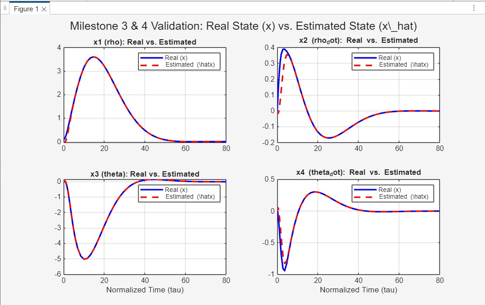
<figcaption class="text-xs text-center text-slate-400 mt-3">Observer validation: estimated states converge toward real states.</figcaption>
</figure>
<figure class="group">
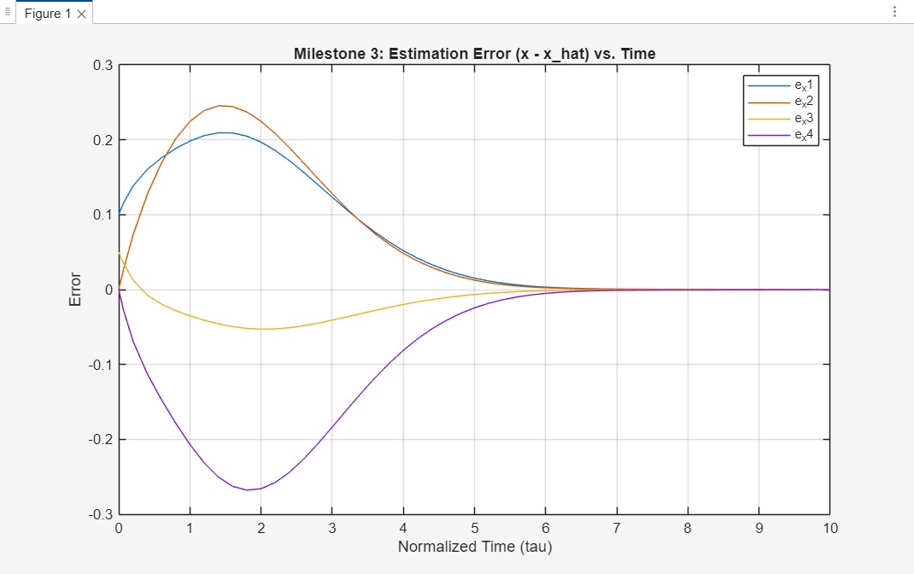
<figcaption class="text-xs text-center text-slate-400 mt-3">Observer performance: all four estimation errors converge to zero.</figcaption>
</figure>
<figure class="group">
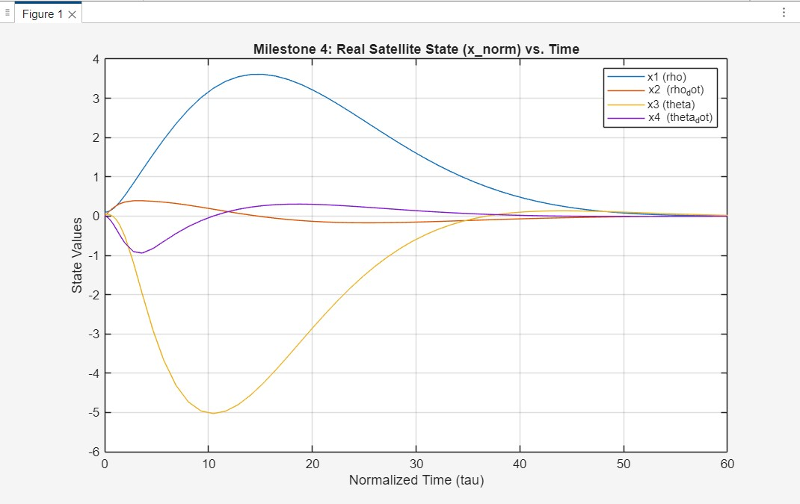
<figcaption class="text-xs text-center text-slate-400 mt-3">Closed-loop validation: real states are driven to the rendezvous target.</figcaption>
</figure>
<figure class="group">
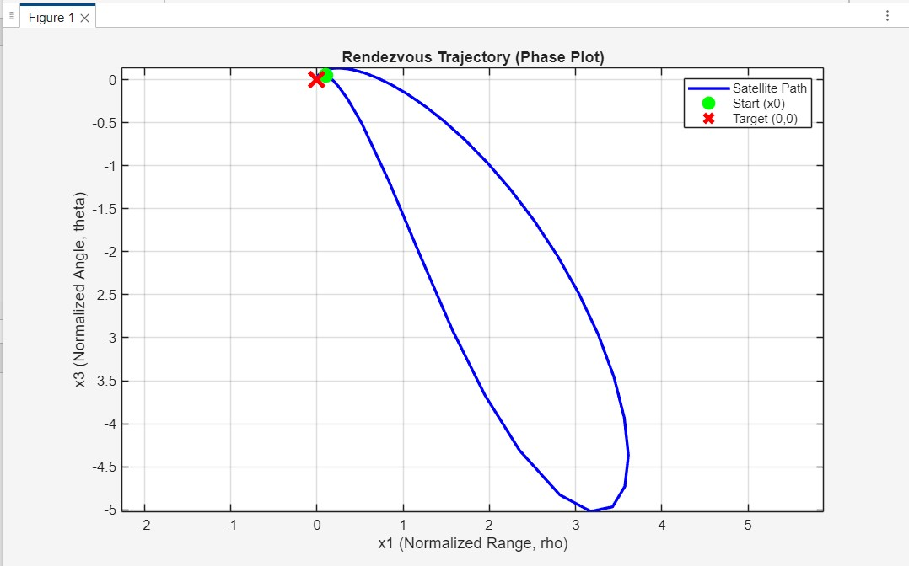
<figcaption class="text-xs text-center text-slate-400 mt-3">Trajectory phase plot: the chaser converges toward the origin.</figcaption>
</figure>
<figure class="group md:col-span-2 max-w-lg mx-auto">
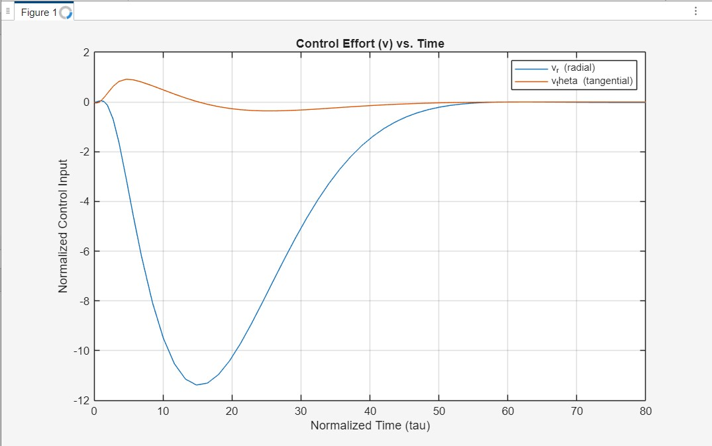
<figcaption class="text-xs text-center text-slate-400 mt-3">Control effort: commanded input converges as rendezvous is reached.</figcaption>
</figure>
</div>
</section>
<!-- Conclusion and next steps -->
<section aria-labelledby="conclusion-and-next-steps" class="content-section relative z-10">
<h2 class="text-2xl font-bold text-white mb-6 flex items-center space-x-3" id="conclusion-and-next-steps">
<div class="p-2 bg-cyan-500/10 rounded-lg">
<i class="w-6 h-6 text-cyan-400" data-lucide="award"></i>
</div>
<span>Conclusion and next steps</span>
</h2>
<div class="grid grid-cols-1 md:grid-cols-2 gap-6">
<div class="bg-blue-900/20 p-6 rounded-xl border-l-4 border-blue-500">
<h3 class="font-bold text-white mb-3">Result</h3>
<p class="text-sm text-slate-300 leading-relaxed">
                            The simulation demonstrates that an observer-controller rendezvous architecture can stabilize a 2D relative-motion model using only angular measurement. Normalization was the key step that made the numerical design physically usable.
                        </p>
</div>
<div class="bg-slate-800/50 p-6 rounded-xl border border-slate-700/50">
<h3 class="font-bold text-white mb-3">Logical extension</h3>
<ul class="list-disc ml-5 text-sm text-slate-300 space-y-2">
<li>Extend the model to a 13-state 6-DOF formulation.</li>
<li>Replace the linear observer with EKF or UKF sensor fusion.</li>
<li>Control translation forces F and attitude torques tau together.</li>
</ul>
</div>
</div>
</section>
<!-- Final Navigation -->
<section aria-labelledby="return-to-portfolio" class="text-center pt-8 relative z-10"><h2 class="sr-only" id="return-to-portfolio">Return to portfolio</h2>
<a class="inline-flex items-center font-bold text-white bg-gradient-to-r from-cyan-600 to-blue-600 py-3 px-8 rounded-full shadow-lg hover:shadow-cyan-500/30 hover:-translate-y-1 transition-all" href="index.html#projects">
<i class="w-5 h-5 mr-2" data-lucide="arrow-left"></i> Return to Main Portfolio
                </a>
</section>
</article>
</main>
<!-- Script to initialize Lucide icons -->
<script>
        lucide.createIcons();
    </script>

<!-- Load Lucide Icons -->

<!-- Load MathJax for LaTeX Rendering -->


<script>
        MathJax = {
            tex: {
                inlineMath: [['$', '$'], ['\\(', '\\)']],
                displayMath: [['$$', '$$'], ['\\[', '\\]']],
                processEscapes: true
            },
            svg: {
                fontCache: 'global'
            }
        };
    </script>
<script async="" id="MathJax-script" src="https://cdn.jsdelivr.net/npm/mathjax@3/es5/tex-svg.js"></script>
</body>
</html>
````

### `project-thermal.html`

````html
<!DOCTYPE html>

<html lang="en">
<head>
<meta charset="utf-8"/>
<meta content="width=device-width, initial-scale=1.0" name="viewport"/>
<title>Transient Thermal Analysis: LCM vs FEA (ANSYS) | Rafi Nasrallah</title>
<meta content="Transient thermal analysis project comparing lumped capacitance modeling and ANSYS FEA for hot nut insertion process optimization." name="description"/>
<meta content="Rafi Nasrallah, thermal analysis, FEA, ANSYS, Fusion 360, lumped capacitance model, transient heat transfer, nut insertion, polycarbonate, engineering simulation" name="keywords"/>
<link href="https://fonts.googleapis.com" rel="preconnect"/><link crossorigin="" href="https://fonts.gstatic.com" rel="preconnect"/><link href="https://unpkg.com" rel="preconnect"/><link href="https://nasrallahrafi.me/project-thermal.html" rel="canonical"/>
<meta content="website" property="og:type"/>
<meta content="Rafi Nasrallah Portfolio" property="og:site_name"/>
<meta content="Transient Thermal Analysis: LCM vs FEA (ANSYS) | Rafi Nasrallah" property="og:title"/>
<meta content="Transient thermal analysis project comparing lumped capacitance modeling and ANSYS FEA for hot nut insertion process optimization." property="og:description"/>
<meta content="https://nasrallahrafi.me/assets/img/Profile_picture.jpg" property="og:image"/>
<meta property="og:image:width" content="1280"/>
<meta property="og:image:height" content="1280"/>
<meta content="https://nasrallahrafi.me/project-thermal.html" property="og:url"/>
<meta content="en_US" property="og:locale"/>
<meta content="summary_large_image" name="twitter:card"/>
<meta content="Transient Thermal Analysis: LCM vs FEA (ANSYS) | Rafi Nasrallah" name="twitter:title"/>
<meta content="Transient thermal analysis project comparing lumped capacitance modeling and ANSYS FEA for hot nut insertion process optimization." name="twitter:description"/>
<meta content="https://nasrallahrafi.me/assets/img/Profile_picture.jpg" name="twitter:image"/>
<meta content="@RafiNasrallah" name="twitter:creator"/>
<meta content="@RafiNasrallah" name="twitter:site"/>
<meta content="index, follow" name="robots"/>
<meta content="Rafi Nasrallah" name="author"/>
<link href="/favicon.ico" rel="icon" type="image/x-icon"/>
<link href="/apple-touch-icon.png" rel="apple-touch-icon"/><!-- Load Tailwind CSS --><link href="css/tailwind.min.css" rel="stylesheet"/><!-- Load Lucide Icons --><script crossorigin="anonymous" integrity="sha384-vEpkK5oidsrH6UhRc6tAPlgJZ/qXFwumFY+Kx8vBSeZ7NBag809YZCSmxFYGe/pt" src="https://unpkg.com/lucide@1.20.0/dist/umd/lucide.min.js"></script><link href="https://fonts.googleapis.com/css2?family=Outfit:wght@400;500;600;700;800;900&amp;family=JetBrains+Mono:wght@500;600&amp;display=swap" rel="stylesheet"/><!-- Link to external minified style.css --><link href="css/style.min.css" rel="stylesheet"/>
<script type="application/ld+json">
{
  "@context": "https://schema.org",
  "@graph": [
    {
      "@type": "BreadcrumbList",
      "itemListElement": [
        { "@type": "ListItem", "position": 1, "name": "Home", "item": "https://nasrallahrafi.me/" },
        { "@type": "ListItem", "position": 2, "name": "Projects", "item": "https://nasrallahrafi.me/#projects" },
        { "@type": "ListItem", "position": 3, "name": "Transient Thermal Analysis — FEA vs LCM", "item": "https://nasrallahrafi.me/project-thermal.html" }
      ]
    },
    {
      "@type": "TechArticle",
      "@id": "https://nasrallahrafi.me/project-thermal.html#article",
      "headline": "Transient Thermal Analysis of Hot-Nut Insertion in Polycarbonate — FEA vs Lumped Capacitance Model",
      "description": "Comparative engineering study using Lumped Capacitance Modelling (LCM) and ANSYS FEA (Fusion 360) to validate the heating cycle time for automated hot brass nut insertion into polycarbonate. Includes mesh refinement analysis, heat flux mapping, sensitivity analysis, and transient cooling curves.",
      "url": "https://nasrallahrafi.me/project-thermal.html",
      "author": { "@id": "https://nasrallahrafi.me/#rafi-nasrallah" },
      "datePublished": "2025-06-01",
      "inLanguage": "en",
      "keywords": ["ANSYS thermal simulation", "FEA", "lumped capacitance model", "transient thermal analysis", "heat flux", "polycarbonate", "brass insert nut", "Fusion 360"],
      "about": [
        { "@type": "Thing", "name": "Finite Element Analysis" },
        { "@type": "Thing", "name": "Lumped Capacitance Model" },
        { "@type": "Thing", "name": "Transient Heat Transfer" },
        { "@type": "Thing", "name": "Industrial Process Validation" }
      ],
      "proficiencyLevel": "Expert",
      "image": "https://nasrallahrafi.me/assets/img/Final_Temperature_Distribution_Nut_Stack.jpg",
      "isPartOf": { "@id": "https://nasrallahrafi.me/#website" }
    }
  ]
}
</script>
</head>
<body class="antialiased selection:bg-cyan-500 selection:text-white">
<!-- Header -->
<header class="sticky top-0 z-50 glass transition-colors duration-300">
<div class="container mx-auto px-4 sm:px-6 lg:px-8 py-4 flex justify-between items-center gap-4">
<a class="text-2xl font-bold bg-clip-text text-transparent bg-gradient-to-r from-cyan-400 to-cyan-200 hover:text-cyan-300 transition-colors truncate" href="index.html#hero">
                Rafi Nasrallah
            </a>
<nav class="hidden lg:flex space-x-6">
<a class="text-slate-300 hover:text-cyan-400 font-medium transition-colors" href="index.html#about">About</a>
<a class="text-slate-300 hover:text-cyan-400 font-medium transition-colors" href="index.html#experience">Experience</a>
<a class="text-slate-300 hover:text-cyan-400 font-medium transition-colors" href="index.html#projects">Projects</a>
<a class="text-slate-300 hover:text-cyan-400 font-medium transition-colors" href="index.html#skills">Skills</a>
<a class="text-slate-300 hover:text-cyan-400 font-medium transition-colors" href="index.html#patents">Patents</a>
<a class="text-slate-300 hover:text-cyan-400 font-medium transition-colors" href="index.html#dev-focus">Development</a>
</nav>
<div class="flex items-center space-x-2 sm:space-x-4">
<button aria-label="Change theme" class="theme-toggle-button text-slate-200 transition-colors flex items-center justify-center" id="theme-toggle-button" onclick="toggleTheme()" type="button">
<i class="w-4 h-4" data-lucide="palette" id="theme-toggle-icon"></i>
<span class="theme-toggle-copy">Theme</span>
<span class="theme-toggle-name" id="theme-toggle-name">Glass</span>
</button>
<a class="inline-flex items-center text-slate-300 hover:text-cyan-400 font-medium transition-colors text-sm" href="index.html#projects">
<i class="w-4 h-4 mr-2" data-lucide="arrow-left"></i><span class="hidden sm:inline">Back</span>
                </a>
</div>
</div>
</header>
<main class="container mx-auto px-4 sm:px-6 lg:px-8 py-12">
<article class="max-w-4xl mx-auto glass p-8 md:p-12 rounded-2xl relative overflow-hidden">
<!-- Background Blob -->
<div class="absolute top-0 right-0 w-96 h-96 bg-cyan-500/10 rounded-full blur-3xl -translate-y-1/2 translate-x-1/2 pointer-events-none">
</div>
<!-- 1. Clear Identification -->
<section aria-labelledby="transient-thermal-analysis-for-process-optimization-a-comparative-study-of-lumped-capacitance-modeling-and-finite-element-simulation" class="content-section text-center relative z-10">
<span class="text-xs font-bold text-white bg-cyan-600/80 px-4 py-1.5 rounded-full uppercase tracking-wider mb-6 inline-block shadow-lg shadow-cyan-500/20">Self-Initiated
                    Study</span>
<h1 class="text-3xl md:text-4xl font-extrabold text-white mb-4 leading-tight" id="transient-thermal-analysis-for-process-optimization-a-comparative-study-of-lumped-capacitance-modeling-and-finite-element-simulation">
                    Transient Thermal Analysis for Process Optimization: A Comparative Study of Lumped Capacitance
                    Modeling and Finite Element Simulation
                </h1>
<p class="text-lg font-medium text-cyan-200 mb-2">
                    Automated Hot Nut Insertion in Polycarbonate Components
                </p>
<p class="text-base font-medium text-slate-400 mb-8">
                    Rafi NASRALAH, ENSET Mohammedia
                    <span class="text-xs block italic mt-1">(Building on SMCV Internship Experience)</span>
</p>
<!-- Report Link -->
<a class="inline-flex items-center font-bold px-6 py-3 bg-red-600 text-white rounded-full hover:bg-red-700 transition-colors shadow-lg hover:shadow-red-500/30 text-sm" href="assets/pdf/Thermal_Analysis_Full_Report.pdf" rel="noopener noreferrer" target="_blank">
<i class="w-5 h-5 mr-2" data-lucide="file-text"></i> Download Full Study Report (PDF)
                </a>
</section>
<!-- 2. The Core Problem -->
<section aria-labelledby="section-problem-statement" class="content-section relative z-10">
<h2 class="text-2xl font-bold text-white mb-6 flex items-center space-x-3" id="section-problem-statement">
<div class="p-2 bg-cyan-500/10 rounded-lg">
<i class="w-6 h-6 text-cyan-400" data-lucide="target"></i>
</div>
<span>Problem Statement</span>
</h2>
<h3 class="text-2xl font-bold text-white mb-6 flex items-center space-x-3">
<div class="p-2 bg-yellow-500/10 rounded-lg">
<i class="w-6 h-6 text-yellow-400" data-lucide="alert-circle"></i>
</div>
<span>The Core Problem</span>
</h3>
<div class="highlight-box border-yellow-500 bg-yellow-900/20">
<p class="text-base text-slate-300 leading-relaxed">
                        The core problem this self-initiated research addresses is the <strong>quantifiable
                            uncertainty</strong> of the hot-insertion process cycle time and the associated risk of
                        <strong>thermal damage</strong> to the polycarbonate component. The fundamental question being
                        answered is: "What is the true, validated time required for the brass insert nut to reach the
                        optimal insertion temperature of $170\degreeC$ while stacked in the automated feeder?" This
                        required replacing the simplistic, unreliable theoretical estimate with a high-fidelity
                        numerical prediction.
                     The study compares a simplified lumped-capacitance calculation against ANSYS transient thermal simulation so the process timing can be judged with more realistic heat-transfer assumptions. The resulting comparison supports a practical heating strategy for the automated nut insertion workflow introduced during the SMCV internship.</p>
</div>
</section>
<!-- 3. Study Objective -->
<section aria-labelledby="study-objective" class="content-section relative z-10">
<h3 class="text-2xl font-bold text-white mb-6 flex items-center space-x-3" id="study-objective">
<div class="p-2 bg-cyan-500/10 rounded-lg">
<i class="w-6 h-6 text-cyan-400" data-lucide="target"></i>
</div>
<span>Study Objective</span>
</h3>
<p class="text-slate-300 leading-relaxed mb-6">
                    The primary objective of this exploration is to determine the <strong>true, validated time</strong>
                    required for the brass insert nut to reach the optimal insertion temperature
                    ($\mathbf{170\degreeC}$) while stacked in the automated feeder.
                </p>
<div class="bg-slate-800/50 p-6 rounded-xl border border-slate-700/50">
<h4 class="font-bold text-lg text-white mb-3">Sub-Objectives:</h4>
<ul class="list-disc ml-5 text-sm text-slate-300 space-y-3">
<li><strong>Quantify Analytical Flaw:</strong> Mathematically derive the heating curve using the
                            Lumped Capacitance Model (LCM) to establish a theoretical $t_{\text{LCM}}$.</li>
<li><strong>Model Real-World Physics:</strong> Develop a high-fidelity Transient Thermal FEA
                            model in ANSYS explicitly accounting for 3D geometry and contact physics.</li>
<li><strong>Validate and Optimize:</strong> Compare numerical and theoretical curves to
                            establish the validated minimum heating time.</li>
</ul>
</div>
</section>
<!-- 4. The Comparative Analysis -->
<section aria-labelledby="section-fea-simulation-approach" class="content-section relative z-10">
<h2 class="text-2xl font-bold text-white mb-6 flex items-center space-x-3" id="section-fea-simulation-approach"><i class="w-8 h-8 text-cyan-400" data-lucide="box"></i><span>FEA Simulation Approach</span></h2>
<h3 class="text-2xl font-bold text-white mb-6 flex items-center space-x-3" id="comparative-analysis-theory-vs-simulation">
<div class="p-2 bg-cyan-500/10 rounded-lg">
<i class="w-6 h-6 text-cyan-400" data-lucide="scale"></i>
</div>
<span>Comparative Analysis: Theory vs. Simulation</span>
</h3>
<div class="grid md:grid-cols-2 gap-8 mb-8">
<div class="bg-slate-800/50 p-6 rounded-xl border border-slate-700/50">
<h4 class="font-bold text-lg text-white mb-3">Method 1: Lumped Capacitance Model (LCM)</h4>
<p class="text-sm text-slate-300 leading-relaxed mb-3">
                            A simplified theoretical approach assuming uniform internal temperature. Relied on an
                            estimated effective heat transfer coefficient.
                        </p>
<p class="text-lg font-bold text-cyan-400">$t_{\text{LCM}} = 4.22\text{ s}$</p>
</div>
<div class="bg-slate-800/50 p-6 rounded-xl border border-slate-700/50">
<h4 class="font-bold text-lg text-white mb-3">Method 2: Finite Element Analysis (FEA)</h4>
<p class="text-sm text-slate-300 leading-relaxed mb-3">
                            A high-fidelity numerical simulation (ANSYS Mechanical) accounting for transient heat
                            transfer, actual 3D geometry, and contact thermal resistance.
                        </p>
<p class="text-lg font-bold text-green-400">$t_{\text{ANSYS}} = \mathbf{3.28\text{ s}}$</p>
</div>
</div>
<div class="highlight-box border-yellow-500 bg-yellow-900/20">
<h4 class="font-bold text-lg mb-2 text-yellow-400">Key Finding: The Discrepancy</h4>
<p class="text-sm text-slate-300 leading-relaxed">
                        The FEA revealed significantly faster heating ($\approx$ <strong>28.7% quicker</strong>) than
                        the LCM predicted. Analysis of heat flux vectors (see gallery) confirmed that <strong>axial heat
                            conduction</strong> between stacked nuts provided a major secondary heat path, a factor
                        ignored by the simplified LCM.
                    </p>
</div>
</section>
<!-- 5. Visual Evidence -->
<section aria-labelledby="section-results-findings" class="content-section relative z-10">
<h2 class="text-2xl font-bold text-white mb-6 flex items-center space-x-3" id="section-results-findings"><i class="w-8 h-8 text-cyan-400" data-lucide="bar-chart-3"></i><span>Results &amp; Findings</span></h2>
<h3 class="text-2xl font-bold text-white mb-6 flex items-center space-x-3" id="visual-evidence-gallery">
<div class="p-2 bg-cyan-500/10 rounded-lg">
<i class="w-6 h-6 text-cyan-400" data-lucide="image"></i>
</div>
<span>Visual Evidence Gallery</span>
</h3>
<div class="grid grid-cols-1 gap-8">
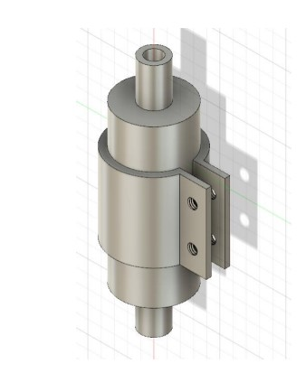
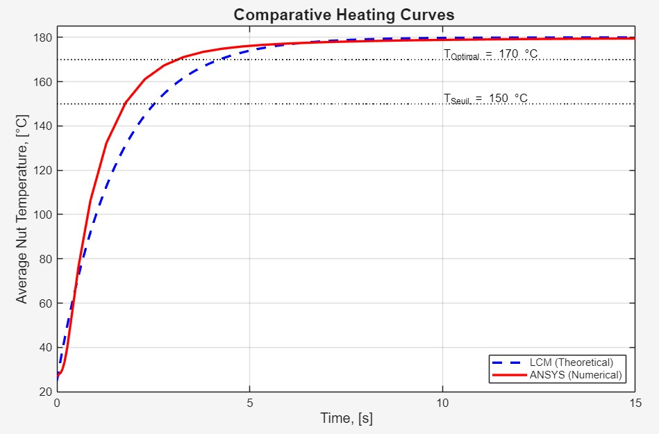
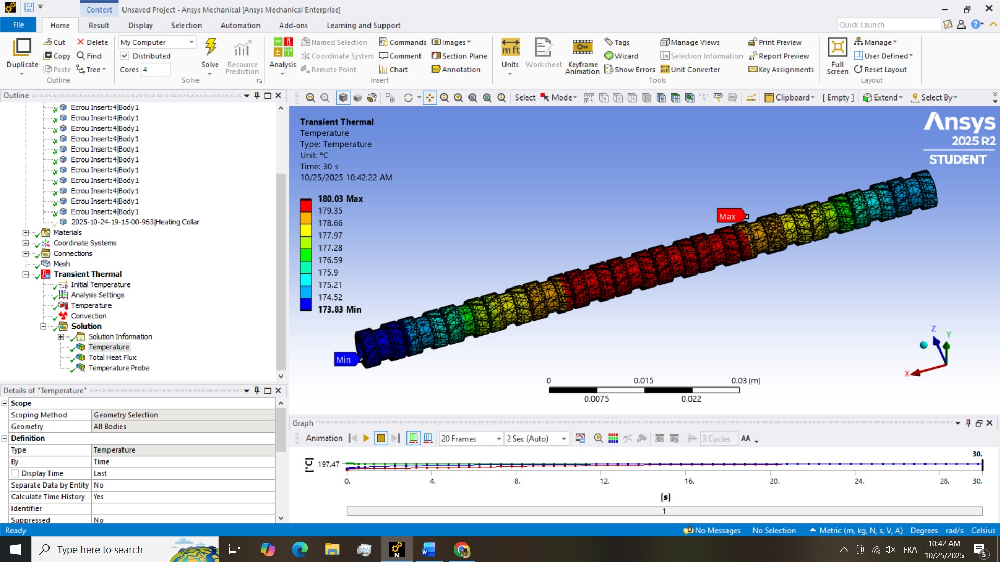
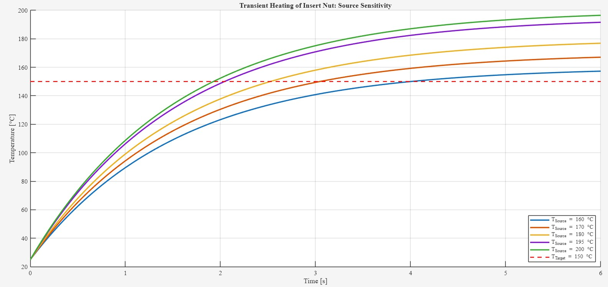
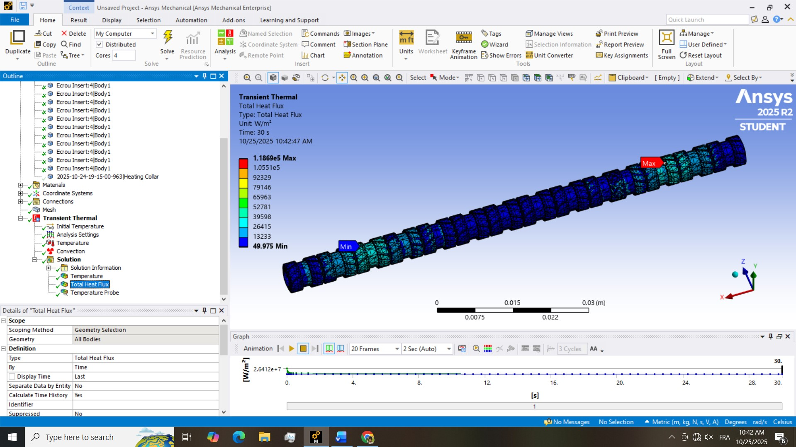
</div>
</section>
<!-- 6. Quantified Results Summary -->
<section aria-labelledby="quantified-results-summary" class="content-section relative z-10">
<h3 class="text-2xl font-bold text-white mb-6 flex items-center space-x-3" id="quantified-results-summary">
<div class="p-2 bg-cyan-500/10 rounded-lg">
<i class="w-6 h-6 text-cyan-400" data-lucide="table"></i>
</div>
<span>Quantified Results Summary</span>
</h3>
<div class="table-responsive">
<table class="w-full text-left">
<thead>
<tr>
<th>Parameter</th>
<th>$t_{\text{LCM}}$ (Theoretical)</th>
<th>$t_{\text{ANSYS}}$ (Validated FEA)</th>
<th class="text-red-400">Error of LCM</th>
</tr>
</thead>
<tbody class="text-slate-300">
<tr>
<td class="font-medium">Time to Reach $170\degreeC$</td>
<td>$4.22\text{ s}$</td>
<td class="font-bold text-lg text-green-400">$\mathbf{3.28\text{ s}}$</td>
<td class="font-medium text-red-400">+28.7% (Overestimated)</td>
</tr>
</tbody>
</table>
</div>
</section>
<!-- 7. Engineering Impact & Final Strategy -->
<section aria-labelledby="engineering-impact-final-strategy" class="content-section relative z-10">
<h3 class="text-2xl font-bold text-white mb-6 flex items-center space-x-3" id="engineering-impact-final-strategy">
<div class="p-2 bg-cyan-500/10 rounded-lg">
<i class="w-6 h-6 text-cyan-400" data-lucide="settings-2"></i>
</div>
<span>Engineering Impact &amp; Final Strategy</span>
</h3>
<p class="text-slate-300 leading-relaxed mb-6">
                    The core engineering contribution of this work is the ability to <strong>simplify the process
                        control</strong> based on the validated data:
                </p>
<div class="bg-green-900/20 p-6 rounded-xl border-l-4 border-green-500">
<ul class="list-none space-y-4">
<li class="flex items-start">
<i class="w-5 h-5 text-green-400 mr-3 mt-1 flex-shrink-0" data-lucide="check-circle"></i>
<div>
<strong class="text-green-300 block mb-1">Process Cadence Validation:</strong>
                                The validated heating time ($\mathbf{3.28}$ s) is far less than the cycle time (15 s),
                                confirming heating is not a bottleneck.
                            </div>
</li>
<li class="flex items-start">
<i class="w-5 h-5 text-green-400 mr-3 mt-1 flex-shrink-0" data-lucide="check-circle"></i>
<div>
<strong class="text-green-300 block mb-1">Simplified &amp; Reliable Control
                                    Strategy:</strong>
                                We implemented a robust strategy where the heating element is constantly ON, and safety
                                is managed by limiting the source temperature ($T_{\infty} = 180\degreeC$) to prevent
                                material degradation.
                            </div>
</li>
</ul>
</div>
</section>
<!-- 8. Recommendations and Future Work -->
<section aria-labelledby="recommendations-and-future-work" class="content-section relative z-10">
<h3 class="text-2xl font-bold text-white mb-6 flex items-center space-x-3" id="recommendations-and-future-work">
<div class="p-2 bg-cyan-500/10 rounded-lg">
<i class="w-6 h-6 text-cyan-400" data-lucide="arrow-right-circle"></i>
</div>
<span>Recommendations and Future Work</span>
</h3>
<div class="space-y-6">
<!-- A. Experimental Validation -->
<div class="bg-slate-800/50 p-6 rounded-xl border border-slate-700/50">
<h4 class="font-bold text-lg text-white mb-2">A. Proposed Experimental Validation Protocol</h4>
<p class="text-sm text-slate-300 leading-relaxed mb-2">
                            Recommended real-world test using high-speed thermal imaging (IR camera) and embedded
                            thermocouples to validate $t_{\text{ANSYS}}$.
                        </p>
</div>
<!-- C. Required Simulation Elements -->
<div class="bg-slate-800/50 p-6 rounded-xl border border-slate-700/50">
<h4 class="font-bold text-lg text-white mb-2">B. Future Investigation: Thermomechanical Analysis
                        </h4>
<p class="text-sm text-slate-300 leading-relaxed mb-3">
                            Next step: Answer "What happens during physical insertion?" using a **Coupled
                            Thermal-Structural Analysis** (Viscoplastic Material Model, Large Deformation).
                        </p>
</div>
</div>
</section>
<!-- 9. Navigation -->
<section aria-labelledby="section-9" class="text-center pt-8 relative z-10"><h2 class="sr-only" id="section-9">Section 9</h2>
<a class="inline-flex items-center font-bold text-white bg-gradient-to-r from-cyan-600 to-blue-600 py-3 px-8 rounded-full shadow-lg hover:shadow-cyan-500/30 hover:-translate-y-1 transition-all" href="index.html#projects">
<i class="w-5 h-5 mr-2" data-lucide="arrow-left"></i> Return to Main Portfolio
                </a>
</section>
</article>
</main>
<!-- Script to initialize Lucide icons -->
<script>
        lucide.createIcons();
    </script>


<!-- MathJax Configuration - Corrected for better rendering -->
<script>
        window.MathJax = {
            tex: {
                inlineMath: [['$', '$'], ['\\(', '\\)']],
                displayMath: [['$$', '$$'], ['\\[', '\\]']],
                processEscapes: true,
                tags: 'ams',
                macros: {
                    degreeC: "{^\\circ\\text{C}}"
                }
            },
            svg: {
                fontCache: 'global'
            },
            options: {
                ignoreHtmlClass: 'tex2jax_ignore',
                processHtmlClass: 'tex2jax_process'
            },
            startup: {
                ready: () => {
                    MathJax.startup.defaultReady();
                }
            }
        };
    </script>
<script id="MathJax-script" async src="https://cdn.jsdelivr.net/npm/mathjax@3/es5/tex-svg.js"></script>
</body>
</html>
````

### `project-waveguide.html`

````html
<!DOCTYPE html>

<html lang="en">
<head>
<meta charset="utf-8"/>
<meta content="width=device-width, initial-scale=1.0" name="viewport"/>
<title>TE10 Waveguide Analysis: Air vs Alumina (HFSS) | Rafi Nasrallah</title>
<meta content="ANSYS HFSS study comparing TE10 propagation in air-filled and alumina-filled WR-90 waveguides with cutoff frequency and S-parameter analysis." name="description"/>
<meta content="Rafi Nasrallah, rectangular waveguide, TE10 mode, ANSYS HFSS, microwave simulation, alumina dielectric, S-parameters, electromagnetic field analysis" name="keywords"/>
<link href="https://fonts.googleapis.com" rel="preconnect"/><link crossorigin="" href="https://fonts.gstatic.com" rel="preconnect"/><link href="https://unpkg.com" rel="preconnect"/><link href="https://nasrallahrafi.me/project-waveguide.html" rel="canonical"/>
<meta content="website" property="og:type"/>
<meta content="Rafi Nasrallah Portfolio" property="og:site_name"/>
<meta content="TE10 Waveguide Analysis: Air vs Alumina (HFSS) | Rafi Nasrallah" property="og:title"/>
<meta content="ANSYS HFSS study comparing TE10 propagation in air-filled and alumina-filled WR-90 waveguides with cutoff frequency and S-parameter analysis." property="og:description"/>
<meta content="https://nasrallahrafi.me/assets/img/Profile_picture.jpg" property="og:image"/>
<meta property="og:image:width" content="1280"/>
<meta property="og:image:height" content="1280"/>
<meta content="https://nasrallahrafi.me/project-waveguide.html" property="og:url"/>
<meta content="en_US" property="og:locale"/>
<meta content="summary_large_image" name="twitter:card"/>
<meta content="TE10 Waveguide Analysis: Air vs Alumina (HFSS) | Rafi Nasrallah" name="twitter:title"/>
<meta content="ANSYS HFSS study comparing TE10 propagation in air-filled and alumina-filled WR-90 waveguides with cutoff frequency and S-parameter analysis." name="twitter:description"/>
<meta content="https://nasrallahrafi.me/assets/img/Profile_picture.jpg" name="twitter:image"/>
<meta content="@RafiNasrallah" name="twitter:creator"/>
<meta content="@RafiNasrallah" name="twitter:site"/>
<meta content="index, follow" name="robots"/>
<meta content="Rafi Nasrallah" name="author"/>
<link href="/favicon.ico" rel="icon" type="image/x-icon"/>
<link href="/apple-touch-icon.png" rel="apple-touch-icon"/><!-- Load Tailwind CSS --><link href="css/tailwind.min.css" rel="stylesheet"/><!-- Load Lucide Icons --><script crossorigin="anonymous" integrity="sha384-vEpkK5oidsrH6UhRc6tAPlgJZ/qXFwumFY+Kx8vBSeZ7NBag809YZCSmxFYGe/pt" src="https://unpkg.com/lucide@1.20.0/dist/umd/lucide.min.js"></script><link href="https://fonts.googleapis.com/css2?family=Outfit:wght@400;500;600;700;800;900&amp;family=JetBrains+Mono:wght@500;600&amp;display=swap" rel="stylesheet"/><!-- Link to external minified style.css --><link href="css/style.min.css" rel="stylesheet"/>
<!-- Load Tailwind CSS -->

<!-- Link to the main external style.css -->

<!-- Theme Switcher Script -->
<script defer="" src="js/theme.js"></script>
<style>
        .milestone-card {
            background: rgba(30, 41, 59, 0.5);
            backdrop-filter: blur(8px);
            border: 1px solid rgba(255, 255, 255, 0.1);
            border-radius: 0.5rem;
            padding: 1rem;
            transition: all 0.3s ease;
        }

        .milestone-card:hover {
            transform: translateY(-4px);
            border-color: rgba(6, 182, 212, 0.4);
            box-shadow: 0 10px 20px -5px rgba(0, 0, 0, 0.3);
        }

        .gallery-image {
            background-color: rgba(255, 255, 255, 0.05);
        }
    </style>
<script type="application/ld+json">
{
  "@context": "https://schema.org",
  "@graph": [
    {
      "@type": "BreadcrumbList",
      "itemListElement": [
        { "@type": "ListItem", "position": 1, "name": "Home", "item": "https://nasrallahrafi.me/" },
        { "@type": "ListItem", "position": 2, "name": "Projects", "item": "https://nasrallahrafi.me/#projects" },
        { "@type": "ListItem", "position": 3, "name": "Rectangular Waveguide TE10 Analysis", "item": "https://nasrallahrafi.me/project-waveguide.html" }
      ]
    },
    {
      "@type": "TechArticle",
      "@id": "https://nasrallahrafi.me/project-waveguide.html#article",
      "headline": "Analysis of TE10 Mode Propagation in WR-90 Rectangular Waveguide — Air vs Alumina Dielectric Loading",
      "description": "ANSYS HFSS simulation study comparing air-filled and alumina-loaded WR-90 rectangular waveguides. Alumina loading shifts the TE10 cutoff frequency from 6.56 GHz to 2.19 GHz, enabling miniaturisation at the cost of 0.26–0.72 dB dielectric insertion loss.",
      "url": "https://nasrallahrafi.me/project-waveguide.html",
      "author": { "@id": "https://nasrallahrafi.me/#rafi-nasrallah" },
      "datePublished": "2025-01-01",
      "inLanguage": "en",
      "keywords": ["ANSYS HFSS", "WR-90 waveguide", "TE10 mode", "alumina dielectric", "cutoff frequency", "S-parameters", "microwave engineering"],
      "about": [
        { "@type": "Thing", "name": "Rectangular Waveguide" },
        { "@type": "Thing", "name": "TE10 Mode Propagation" },
        { "@type": "Thing", "name": "Dielectric Loading" },
        { "@type": "Thing", "name": "ANSYS HFSS Simulation" }
      ],
      "proficiencyLevel": "Expert",
      "image": "https://nasrallahrafi.me/assets/img/S_parameter_plot_Air.jpg",
      "isPartOf": { "@id": "https://nasrallahrafi.me/#website" }
    }
  ]
}
</script>
</head>
<body class="antialiased selection:bg-cyan-500 selection:text-white">
<!-- Header -->
<header class="sticky top-0 z-50 glass transition-colors duration-300">
<div class="container mx-auto px-4 sm:px-6 lg:px-8 py-4 flex justify-between items-center gap-4">
<a class="text-2xl font-bold bg-clip-text text-transparent bg-gradient-to-r from-cyan-400 to-cyan-200 hover:text-cyan-300 transition-colors truncate" href="index.html#hero">
                Rafi Nasrallah
            </a>
<nav class="hidden lg:flex space-x-6">
<a class="text-slate-300 hover:text-cyan-400 font-medium transition-colors" href="index.html#about">About</a>
<a class="text-slate-300 hover:text-cyan-400 font-medium transition-colors" href="index.html#experience">Experience</a>
<a class="text-slate-300 hover:text-cyan-400 font-medium transition-colors" href="index.html#projects">Projects</a>
<a class="text-slate-300 hover:text-cyan-400 font-medium transition-colors" href="index.html#skills">Skills</a>
<a class="text-slate-300 hover:text-cyan-400 font-medium transition-colors" href="index.html#patents">Patents</a>
<a class="text-slate-300 hover:text-cyan-400 font-medium transition-colors" href="index.html#dev-focus">Development</a>
</nav>
<div class="flex items-center space-x-2 sm:space-x-4">
<button aria-label="Change theme" class="theme-toggle-button text-slate-200 transition-colors flex items-center justify-center" id="theme-toggle-button" onclick="toggleTheme()" type="button">
<i class="w-4 h-4" data-lucide="palette" id="theme-toggle-icon"></i>
<span class="theme-toggle-copy">Theme</span>
<span class="theme-toggle-name" id="theme-toggle-name">Glass</span>
</button>
<a class="inline-flex items-center text-slate-300 hover:text-cyan-400 font-medium transition-colors text-sm" href="index.html#projects">
<i class="w-4 h-4 mr-2" data-lucide="arrow-left"></i><span class="hidden sm:inline">Back</span>
                </a>
</div>
</div>
</header>
<main class="container mx-auto px-4 sm:px-6 lg:px-8 py-12">
<article class="max-w-4xl mx-auto glass p-8 md:p-12 rounded-2xl relative overflow-hidden">
<!-- Background Blob -->
<div class="absolute top-0 right-0 w-96 h-96 bg-cyan-500/10 rounded-full blur-3xl -translate-y-1/2 translate-x-1/2 pointer-events-none">
</div>
<!-- 1. Title, Date, Report -->
<section aria-labelledby="analysis-of-te10-mode-propagation-air-filled-vs-dielectrically-filled-alumina-waveguide" class="content-section text-center relative z-10">
<span class="text-xs font-bold text-white bg-cyan-600/80 px-4 py-1.5 rounded-full uppercase tracking-wider mb-6 inline-block shadow-lg shadow-cyan-500/20">
                    High-Frequency (RF) Simulation
                </span>
<h1 class="text-3xl md:text-4xl font-extrabold text-white mb-4 leading-tight" id="analysis-of-te10-mode-propagation-air-filled-vs-dielectrically-filled-alumina-waveguide">
                    Analysis of TE10 mode propagation in air-filled and alumina-loaded WR-90 waveguides
                </h1>
<p class="text-lg text-slate-300 leading-relaxed max-w-2xl mx-auto mb-8">
                    A compact HFSS study comparing cutoff frequency, guided wavelength, field confinement, and insertion loss for a standard air-filled guide versus a 96% alumina-filled configuration.
                </p>
<div class="grid grid-cols-1 md:grid-cols-3 gap-4 mb-8 text-left">
<div class="bg-slate-800/50 p-4 rounded-xl border border-slate-700/50">
<p class="text-xs font-bold text-cyan-400 uppercase tracking-wider mb-2">Air cutoff</p>
<p class="text-3xl font-extrabold text-white">6.56 GHz</p>
<p class="text-sm text-slate-400 mt-2">Baseline WR-90 propagation threshold.</p>
</div>
<div class="bg-slate-800/50 p-4 rounded-xl border border-cyan-500/30">
<p class="text-xs font-bold text-cyan-400 uppercase tracking-wider mb-2">Alumina cutoff</p>
<p class="text-3xl font-extrabold text-white">2.19 GHz</p>
<p class="text-sm text-slate-400 mt-2">Dielectric loading lowers the operating threshold.</p>
</div>
<div class="bg-slate-800/50 p-4 rounded-xl border border-slate-700/50">
<p class="text-xs font-bold text-cyan-400 uppercase tracking-wider mb-2">Measured loss</p>
<p class="text-3xl font-extrabold text-white">0.26-0.72 dB</p>
<p class="text-sm text-slate-400 mt-2">Insertion loss range from alumina loss tangent.</p>
</div>
</div>
<p class="text-base font-medium text-slate-400 mb-6">
                    Project completion date: November 9, 2025
                </p>
<a class="inline-flex items-center font-bold px-6 py-3 bg-red-600 text-white rounded-full hover:bg-red-700 transition-colors shadow-lg hover:shadow-red-500/30 text-sm" href="assets/pdf/ANALYSIS_OF_TE10_MODE_PROPAGATION.pdf" rel="noopener noreferrer" target="_blank">
<i class="w-5 h-5 mr-2" data-lucide="file-text"></i> Download full report (PDF)
                </a>
</section>
<!-- 2. Theory and engineering scope -->
<section aria-labelledby="section-waveguide-theory" class="content-section relative z-10">
<h2 class="text-2xl font-bold text-white mb-6 flex items-center space-x-3" id="section-waveguide-theory"><i class="w-8 h-8 text-cyan-400" data-lucide="radio"></i><span>Waveguide theory</span></h2>
<p class="text-slate-300 leading-relaxed text-lg mb-6">
                    The project focuses on the dominant $TE_{10}$ mode in a WR-90 rectangular waveguide. The comparison isolates one design variable: replacing the air volume with 96% alumina to study how relative permittivity reshapes propagation behavior.
                </p>
<div class="grid grid-cols-1 md:grid-cols-3 gap-6 text-left">
<div class="bg-slate-800/50 p-6 rounded-xl border border-slate-700/50">
<h3 class="font-bold text-cyan-400 mb-3" id="domain">Engineering domain</h3>
<p class="text-sm text-slate-300 leading-relaxed">High-frequency RF engineering, microwave theory, waveguide propagation, and electromagnetic field interpretation.</p>
</div>
<div class="bg-slate-800/50 p-6 rounded-xl border border-slate-700/50">
<h3 class="font-bold text-cyan-400 mb-3">Core analysis</h3>
<p class="text-sm text-slate-300 leading-relaxed">Cutoff frequency, guided wavelength, S-parameter response, field concentration, and dielectric attenuation.</p>
</div>
<div class="bg-slate-800/50 p-6 rounded-xl border border-slate-700/50">
<h3 class="font-bold text-cyan-400 mb-3">Software used</h3>
<p class="text-sm text-slate-300 leading-relaxed">ANSYS Electronics Desktop with HFSS for 3D electromagnetic modeling and post-processing.</p>
</div>
</div>
</section>
<!-- 3. HFSS setup and milestones -->
<section aria-labelledby="section-hfss-simulation-setup" class="content-section relative z-10">
<h2 class="text-2xl font-bold text-white mb-6 flex items-center space-x-3" id="section-hfss-simulation-setup"><i class="w-8 h-8 text-cyan-400" data-lucide="monitor-cog"></i><span>HFSS simulation setup</span></h2>
<div class="grid grid-cols-1 md:grid-cols-2 gap-6 mb-6">
<div class="bg-slate-800/50 p-6 rounded-xl border border-slate-700/50">
<h3 class="text-xl font-bold text-white mb-4 flex items-center space-x-3" id="objective">
<i class="w-6 h-6 text-cyan-400" data-lucide="target"></i><span>Objective</span>
</h3>
<p class="text-slate-300 leading-relaxed">
                            The goal was to conduct a quantitative comparison of $TE_{10}$ propagation in a standard WR-90 waveguide and in the same geometry fully loaded with alumina. The HFSS setup evaluates how dielectric loading changes cutoff frequency, guided wavelength, field concentration, and insertion loss.
                        </p>
</div>
<div class="bg-slate-800/50 p-6 rounded-xl border border-slate-700/50">
<h3 class="text-xl font-bold text-white mb-4 flex items-center space-x-3" id="project-milestones">
<i class="w-6 h-6 text-cyan-400" data-lucide="check-check"></i><span>Project milestones</span>
</h3>
<ul class="list-disc ml-5 text-slate-300 space-y-2 text-sm">
<li>Modeled both air-filled and alumina-filled WR-90 configurations against theoretical formulas.</li>
<li>Compared $TE_{10}$ cutoff frequency using analytical relations and HFSS validation.</li>
<li>Visualized E-field and H-field concentration for both material cases.</li>
<li>Compared guided wavelength at 10 GHz to show dielectric loading impact.</li>
<li>Quantified insertion loss through S-parameter post-processing in HFSS.</li>
</ul>
</div>
</div>
</section>
<!-- 4. Results -->
<section aria-labelledby="section-field-s-parameter-results" class="content-section relative z-10">
<h2 class="text-2xl font-bold text-white mb-6 flex items-center space-x-3" id="section-field-s-parameter-results"><i class="w-8 h-8 text-cyan-400" data-lucide="activity"></i><span>Field &amp; S-parameter results</span></h2>
<div class="grid grid-cols-1 md:grid-cols-3 gap-4 mb-8">
<div class="bg-blue-900/20 p-6 rounded-xl border-l-4 border-blue-500">
<h3 class="font-bold text-white mb-2">Cutoff shift</h3>
<p class="text-sm text-slate-300 leading-relaxed">Alumina loading reduces cutoff from 6.56 GHz to 2.19 GHz, making the same physical guide behave like a lower-frequency structure.</p>
</div>
<div class="bg-blue-900/20 p-6 rounded-xl border-l-4 border-blue-500">
<h3 class="font-bold text-white mb-2">Field confinement</h3>
<p class="text-sm text-slate-300 leading-relaxed">The high-permittivity region concentrates electric and magnetic fields, changing the spatial energy distribution inside the guide.</p>
</div>
<div class="bg-blue-900/20 p-6 rounded-xl border-l-4 border-blue-500">
<h3 class="font-bold text-white mb-2">Loss trade-off</h3>
<p class="text-sm text-slate-300 leading-relaxed">The alumina case introduces measurable insertion loss, quantified between approximately 0.26 dB and 0.72 dB.</p>
</div>
</div>
<h3 class="text-2xl font-bold text-white mb-6 flex items-center space-x-3" id="results-simulation-gallery">
<div class="p-2 bg-cyan-500/10 rounded-lg">
<i class="w-6 h-6 text-cyan-400" data-lucide="image"></i>
</div>
<span>Simulation gallery</span>
</h3>
<div class="space-y-12">
<div class="bg-slate-800/50 p-6 rounded-xl border border-slate-700/50">
<h3 class="text-xl font-bold text-white mb-3">Air-filled waveguide</h3>
<p class="text-sm text-slate-300 leading-relaxed mb-6">Baseline result set used to validate the WR-90 air-filled model before comparing the dielectric-loaded guide.</p>
<div class="flex flex-col items-center gap-8">
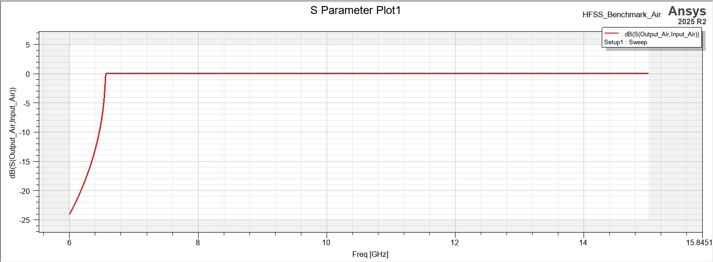
<div class="grid grid-cols-1 md:grid-cols-2 gap-4 w-full">
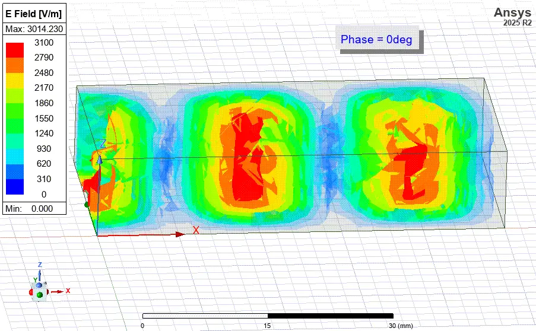
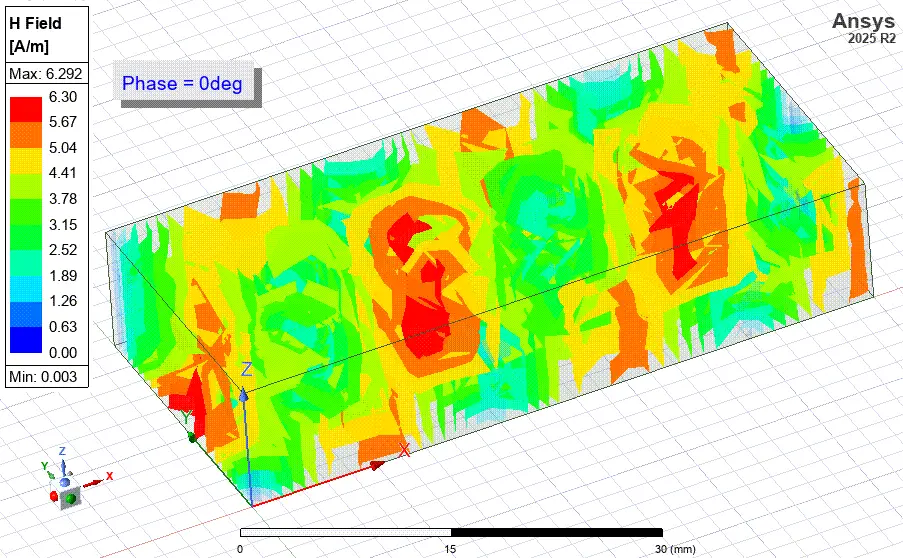
</div>
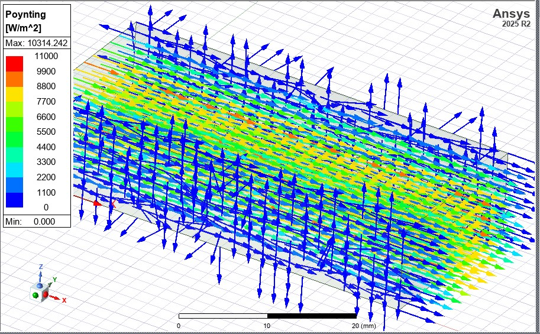
</div>
</div>
<div class="bg-slate-800/50 p-6 rounded-xl border border-cyan-500/30">
<h3 class="text-xl font-bold text-white mb-3">Alumina-filled waveguide</h3>
<p class="text-sm text-slate-300 leading-relaxed mb-6">Dielectric-loaded result set showing the lower cutoff frequency, stronger field concentration, and measurable insertion loss.</p>
<div class="flex flex-col items-center gap-8">
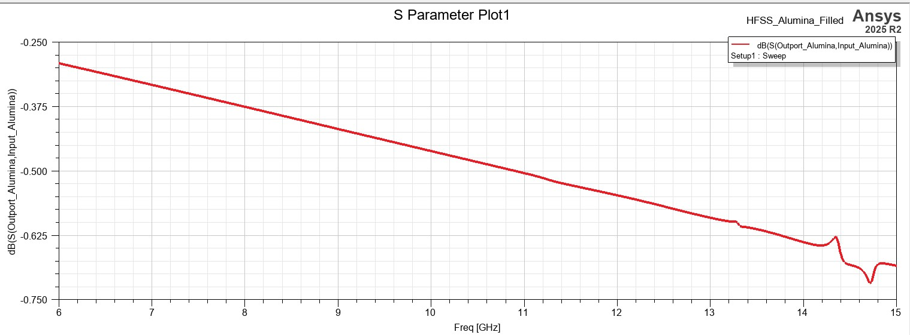
<div class="grid grid-cols-1 md:grid-cols-2 gap-4 w-full">
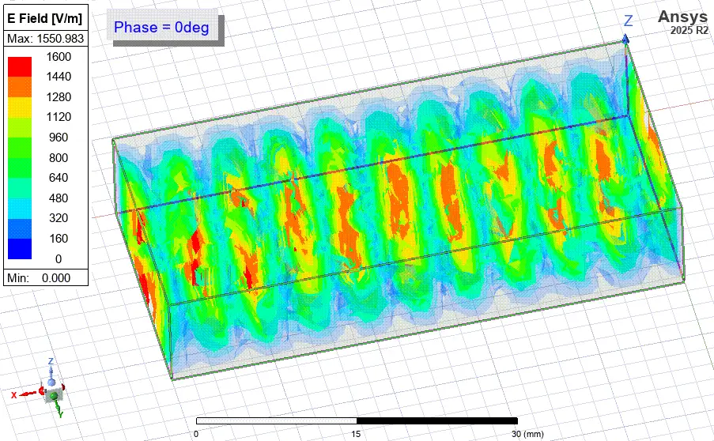
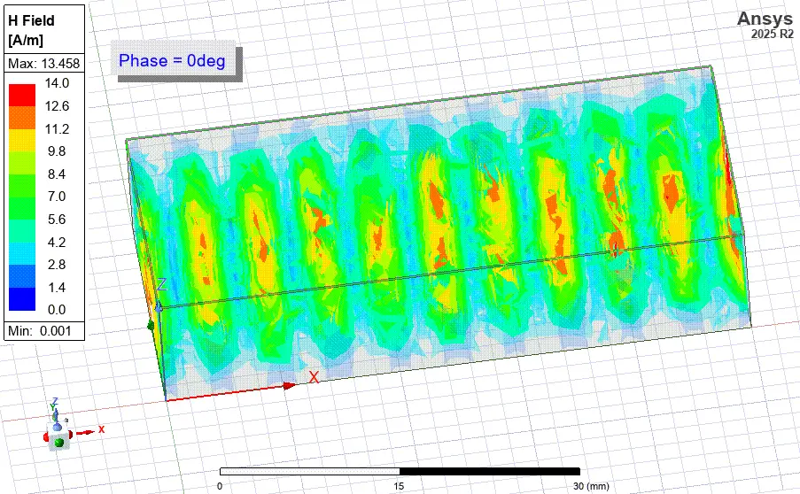
</div>
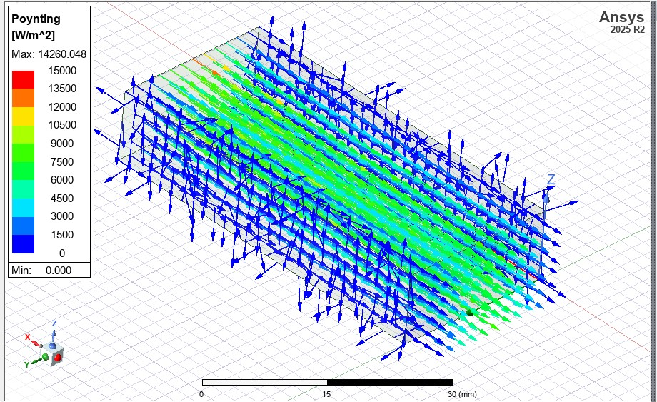
</div>
</div>
</div>
</section>
<!-- 5. Conclusion -->
<section aria-labelledby="conclusion" class="content-section relative z-10">
<h2 class="text-2xl font-bold text-white mb-6 flex items-center space-x-3" id="conclusion">
<div class="p-2 bg-cyan-500/10 rounded-lg">
<i class="w-6 h-6 text-cyan-400" data-lucide="award"></i>
</div>
<span>Conclusion</span>
</h2>
<div class="bg-blue-900/20 p-6 rounded-xl border-l-4 border-blue-500">
<p class="text-slate-300 leading-relaxed mb-4">
                        The simulation confirms the expected electromagnetic trade-off: alumina loading enables a much lower cutoff frequency in the same WR-90 envelope, but it also increases field concentration and introduces dielectric loss.
                    </p>
<ol class="list-decimal ml-5 text-slate-300 space-y-2 text-sm">
<li><strong>Cutoff frequency:</strong> Alumina lowered the cutoff frequency from 6.56 GHz to 2.19 GHz.</li>
<li><strong>Field concentration:</strong> Fields became more concentrated inside the high-permittivity material.</li>
<li><strong>Insertion loss:</strong> Dielectric attenuation was quantified at approximately 0.26 dB to 0.72 dB.</li>
</ol>
</div>
</section>
<!-- 6. Future Work -->
<section aria-labelledby="future-work" class="content-section relative z-10">
<h2 class="text-2xl font-bold text-white mb-6 flex items-center space-x-3" id="future-work">
<div class="p-2 bg-cyan-500/10 rounded-lg">
<i class="w-6 h-6 text-cyan-400" data-lucide="git-branch-plus"></i>
</div>
<span>Future work</span>
</h2>
<p class="text-slate-300 leading-relaxed mb-6">
                    A logical next step would be to investigate a partially filled waveguide. Simulating a dielectric slab with variable thickness would help identify a practical compromise between miniaturization, field confinement, and insertion loss.
                </p>
</section>
<!-- Final Navigation -->
<section aria-labelledby="section-8" class="text-center pt-8 relative z-10"><h2 class="sr-only" id="section-8">Section 8</h2>
<a class="inline-flex items-center font-bold text-white bg-gradient-to-r from-cyan-600 to-blue-600 py-3 px-8 rounded-full shadow-lg hover:shadow-cyan-500/30 hover:-translate-y-1 transition-all" href="index.html#projects">
<i class="w-5 h-5 mr-2" data-lucide="arrow-left"></i> Return to Main Portfolio
                </a>
</section>
</article>
</main>
<!-- Script to initialize Lucide icons -->
<script>
        lucide.createIcons();
    </script>

<!-- Load Lucide Icons -->

<!-- Load MathJax for LaTeX Rendering -->


<script>
        MathJax = {
            tex: {
                inlineMath: [['$', '$'], ['\\(', '\\)']],
                displayMath: [['$$', '$$'], ['\\[', '\\]']],
                processEscapes: true,
                tags: 'ams',
                macros: {
                    epsr: "{\\epsilon_r}",
                    fc: "{f_c}",
                    Zte: "{Z_{\\text{TE}}}"
                }
            },
            svg: {
                fontCache: 'global'
            }
        };
    </script>
<script async="" id="MathJax-script" src="https://cdn.jsdelivr.net/npm/mathjax@3/es5/tex-svg.js"></script>
</body>
</html>
````

### `robots.txt`

````txt
User-agent: *
Allow: /
Disallow: /server.log
Disallow: /server.err.log
Crawl-delay: 1
Sitemap: https://nasrallahrafi.me/sitemap.xml
X-IndexNow-Key: a3c66107815495964ea7a8fede11f3fc

# AI crawlers — explicitly permitted
User-agent: GPTBot
Allow: /

User-agent: ChatGPT-User
Allow: /

User-agent: ClaudeBot
Allow: /

User-agent: anthropic-ai
Allow: /

User-agent: PerplexityBot
Allow: /

User-agent: Applebot-Extended
Allow: /

User-agent: Google-Extended
Allow: /

User-agent: CCBot
Allow: /

User-agent: cohere-ai
Allow: /

User-agent: meta-externalagent
Allow: /
````

### `sitemap.xml`

````xml
<?xml version="1.0" encoding="UTF-8"?>
<urlset xmlns="http://www.sitemaps.org/schemas/sitemap/0.9">
  <url>
    <loc>https://nasrallahrafi.me/</loc>
    <lastmod>2026-06-17</lastmod>
    <changefreq>monthly</changefreq>
    <priority>1.0</priority>
  </url>
  <url>
    <loc>https://nasrallahrafi.me/apprenticeship-rafi.html</loc>
    <lastmod>2026-06-17</lastmod>
    <changefreq>yearly</changefreq>
    <priority>0.7</priority>
  </url>
  <url>
    <loc>https://nasrallahrafi.me/internship-onee.html</loc>
    <lastmod>2026-06-17</lastmod>
    <changefreq>yearly</changefreq>
    <priority>0.7</priority>
  </url>
  <url>
    <loc>https://nasrallahrafi.me/internship-smcv.html</loc>
    <lastmod>2026-06-17</lastmod>
    <changefreq>yearly</changefreq>
    <priority>0.7</priority>
  </url>
  <url>
    <loc>https://nasrallahrafi.me/pfe-gantt.html</loc>
    <lastmod>2026-06-17</lastmod>
    <changefreq>monthly</changefreq>
    <priority>0.3</priority>
  </url>
  <url>
    <loc>https://nasrallahrafi.me/project-rendezvous.html</loc>
    <lastmod>2026-06-17</lastmod>
    <changefreq>yearly</changefreq>
    <priority>0.7</priority>
  </url>
  <url>
    <loc>https://nasrallahrafi.me/project-thermal.html</loc>
    <lastmod>2026-06-17</lastmod>
    <changefreq>yearly</changefreq>
    <priority>0.7</priority>
  </url>
  <url>
    <loc>https://nasrallahrafi.me/project-waveguide.html</loc>
    <lastmod>2026-06-17</lastmod>
    <changefreq>yearly</changefreq>
    <priority>0.7</priority>
  </url>
</urlset>
````

### `tailwind.config.js`

````js
/** @type {import('tailwindcss').Config} */
module.exports = {
  content: [
    "./*.html",
    "./js/**/*.js",
  ],
  safelist: [
    'theme-glass',
    'theme-volt',
    'theme-deepsea',
    'theme-obsidian',
  ],
  theme: {
    extend: {},
  },
  plugins: [
    function ({ addBase }) {
      addBase({
        '.theme-glass': { '--tw-theme-safelist': 'glass' },
        '.theme-volt': { '--tw-theme-safelist': 'volt' },
        '.theme-deepsea': { '--tw-theme-safelist': 'deepsea' },
        '.theme-obsidian': { '--tw-theme-safelist': 'obsidian' },
      })
    },
  ],
}
````

